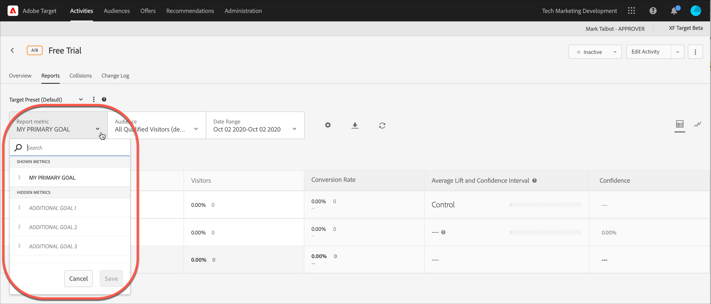

# 보고서에서 여러 지표 보기

[!DNL Adobe Target] 보고서에서 보려는 여러 지표를 선택할 수 있습니다.

보고서에서 여러 지표로 작업할 때는 다음 정보를 유념하십시오.

* 여러 지표를 보는 기능은 [A/B 테스트](/help/main/c-activities/t-test-ab/test-ab.md), [자동 할당](/help/main/c-activities/automated-traffic-allocation/automated-traffic-allocation.md), [자동 타겟](/help/main/c-activities/auto-target/auto-target-to-optimize.md) 및 [경험 타깃팅](/help/main/c-activities/t-experience-target/experience-target.md)(XT) 활동에만 사용할 수 있습니다.
* [Analytics for Target](/help/main/c-integrating-target-with-mac/a4t/a4t.md)(A4T)을 사용하는 활동에 대한 보고서에 20개 이상의 지표를 추가할 수 없습니다. A4T를 *사용하지*&#x200B;않는 활동에 대한 보고서에 활동에서 가지고 있는 수만큼 지표를 추가할 수 있습니다.
* 여러 지표를 선택한 경우 [다운로드 옵션](/help/main/c-reports/c-report-settings/downloading-data-in-csv-file.md)을 사용하여 보고서를 CSV로 다운로드할 수 없습니다. [!UICONTROL Download] 옵션을 활성화하려면 단일 지표만 선택해야 합니다.
* 2015년 7월 [!DNL Target] 릴리스(2015년 7월 30일) 이전에 생성된 활동에 대해 여러 지표를 볼 수 없습니다.

**보고서에 표시할 지표를 여러 개 선택하려면 다음을 수행하십시오.**

1. 보고서를 표시하려면 **[!UICONTROL Activities]**&#x200B;을(를) 클릭하고 목록에서 원하는 활동을 클릭한 다음 **[!UICONTROL Reports]** 탭을 클릭하십시오.
1. **[!UICONTROL Report Metric]** 드롭다운 목록을 클릭하여 [!UICONTROL Shown Metrics] 및 [!UICONTROL Hidden Metrics] 목록을 표시합니다.

   

   [!UICONTROL Search] 상자를 사용하여 [!UICONTROL Shown Metrics] 목록에 추가할 사용 가능한 지표를 빠르게 찾을 수 있습니다.

   보고서의 [!UICONTROL Table View] 및 [!UICONTROL Graph View] 모드 모두에서 여러 지표를 선택할 수 있습니다.

1. [!UICONTROL Hidden Metrics] 목록의 원하는 지표 위에 마우스 포인터를 놓은 다음 **[!UICONTROL Select]**&#x200B;을(를) 클릭하여 [!UICONTROL Shown Metrics] 목록으로 이동합니다.

   또는

   원하는 지표를 [!UICONTROL Hidden Metrics] 목록에서 [!UICONTROL Shown Metrics] 목록으로 끌어서 놓습니다.

   [!UICONTROL Shown Metrics] 목록에 지표가 하나 이상 있어야 합니다.

   지표를 [!UICONTROL Shown Metrics] 목록에서 원하는 순서로 드래그 앤 드롭하여 다시 정렬할 수 있습니다. 선택한 순서는 [!UICONTROL Table View] 및 [!UICONTROL Graph View]에 반영됩니다. [!UICONTROL Shown Metrics] 목록에서 지표를 제거하려면 마우스 포인터를 지표 위로 가져간 다음 **X** 아이콘을 클릭하십시오.

1. 완료되면 **[!UICONTROL Save]**&#x200B;을(를) 클릭합니다.
1. (조건부) [!UICONTROL Table View]에서 보고서를 보는 동안 모든 지표의 열 머리글을 마우스 포인터로 가리켜서 파란색 화살표를 표시합니다. 화살표를 클릭하여 테이블을 확장하면 해당 지표에 대한 [!UICONTROL Lift] 및 [!UICONTROL Confidence]이(가) 표시됩니다.

   

   한 번에 하나의 지표/열만 확장할 수 있습니다. 열을 축소하려면 화살표를 다시 클릭하십시오.

1. (조건부) 그래프 보기에서 보고서를 보는 동안 드롭다운 목록에서 표시할 개별 지표를 선택할 수 있습니다.

   
