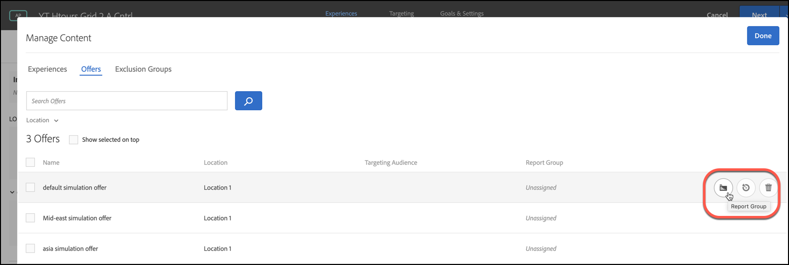

#  자동화된 개인화의 오퍼 보고 그룹

에서 보고 그룹 사용에 대한 정보 [Automated Personalization](/help/main/c-activities/t-automated-personalization/automated-personalization.md) (AP) 활동.

보고 그룹은 다음 두 가지 주요 기능을 수행합니다.

* AP 활동 보고에 그룹화된 오퍼를 볼 수 있도록 합니다.
* 그들은 어떻게 [!DNL Target] 개인화 모델 함수를 참조하십시오.

보고 그룹을 사용하는 경우, [!DNL Target] 는 해당 그룹의 모든 오퍼의 데이터를 사용하여 AP 활동에 있는 각 오퍼 대신 각 보고 그룹에 대해 하나의 개인화 모델만 만듭니다.

사용자의 활동 설정에 개인화 모델을 오퍼마다 빌드할 데이터가 충분하지 않은 경우, 보고 그룹이 자동화된 개인화를 사용하기 위해 데이터 요구 사항을 줄이는 데 도움을 줄 수 있습니다. 또한 보고 그룹은 각 모델이 더 많은 데이터를 얻을 수 있도록 유사한 오퍼를 그룹화하여 새 오퍼에 대한 &quot;cold start&quot; 문제를 해결하는 데 도움을 줄 수 있습니다. 또한 사용자의 AP 활동에 새 오퍼를 정기적으로 소개하는 활동에 모델링 그룹을 사용할 수도 있습니다.

이 방법은 방문자가 그룹의 모든 오퍼에 대해 동일한 방식으로 응답하는 경우 잘 작동합니다. 우수 사례는 비슷한 방문자 그룹이 유사한 방식으로 응답하는 오퍼를 그룹화하는 것입니다. 즉, 전환율이 유사한 오퍼를 그룹화합니다. 모든 오퍼를 단일 보고 그룹에 넣어서는 안 됩니다. 모든 오퍼나 오퍼를 매우 다른 전환율로 그룹화하면 오퍼의 효율성이 줄어들 수 있습니다 [!DNL Target] 개인화 모델.

>[!NOTE]
>
>특정 모델링 그룹에서 오퍼를 제거하거나 대체한 경우 해당 특정 오퍼를 표시한 기록 트래픽도 모델링 그룹에서 삭제됩니다. 즉, 삭제된 오퍼는 [!DNL Target] 학습할 개인화 모델.

**보고 그룹을 설정하려면 다음을 수행하십시오.**

1. 설정 [!UICONTROL 경험] AP 활동의 페이지에서 **[!UICONTROL 콘텐츠 관리]** 아이콘.

   

1. **[!UICONTROL 컨텐츠 관리]** 대화 상자 맨 위에 있는 [!UICONTROL 오퍼] 탭을 클릭합니다.
1. (조건부) 원하는 오퍼 위로 마우스를 이동한 다음 **[!UICONTROL 보고 그룹]** 폴더 아이콘을 클릭하여 보고 그룹에 특정 경험을 추가합니다.

   

1. (조건부) 관련 경험에 대한 확인란을 선택한 다음 대화 상자의 오른쪽 상단 모서리에 있는 **[!UICONTROL 보고 그룹]** 폴더 아이콘을 클릭하여 배치에 보고 그룹의 경험을 포함합니다.

   

1. (조건부) 선택한 오퍼를 기존 보고 그룹에 지정하려면 을 선택합니다 **[!UICONTROL 기존]**&#x200B;드롭다운 목록에서 원하는 보고 그룹을 선택한 다음 를 클릭합니다 **[!UICONTROL 적용]**.

   또는

   선택한 오퍼를 지정할 새 보고 그룹을 생성하려면 **[!UICONTROL 새로 만들기]**&#x200B;를 선택하고 새 보고 그룹의 이름을 지정한 다음 **[!UICONTROL 적용]**&#x200B;을 클릭합니다.

   
