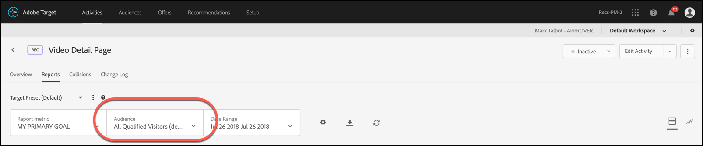

# 성공 지표에 보고 대상자 적용

[!DNL Adobe Target]에서 사용자를 보고 대상이 될 수 있도록 하는 성공 지표를 선택하십시오.

모든 활동에 대해 [!UICONTROL Applied At] 드롭다운 목록을 사용하면 성공 지표에 대상을 적용하여 지표에 도달한 후 및 후속 작업에 대한 보고 번호를 볼 수 있습니다.

예를 들어, 홈 페이지에서 들어가서 전환 페이지에 도달하는 모든 방문자를 위한 활동을 만들었지만, 전환하기 전에 50달러 이상을 장바구니에 추가한 방문자를 더 자세히 드릴다운하고 싶은 경우를 가정할 수 있습니다.

[!UICONTROL Applied At] 드롭다운 목록에는 세 가지 범주가 있을 수 있습니다.

* 활동에 대한 모든 방문자
* 활동의 특정 단계에 도달한 방문자만
* 전환에 도달하는 방문자만

또는 다른 식으로 구문을 지정하기 위해서는 방문자가 활동의 시작 페이지에 있는 mbox나, 활동 중간에 있는 어떤 시점을 정의하는 mbox 또는 활동의 끝에 있는 전환 mbox에 도달했어야 한다고 지정할 수 있습니다.

>[!NOTE]
>
>[성공 지표](/help/main/c-activities/r-success-metrics/success-metrics.md#reference_D011575C85DA48E989A244593D9B9924)는 활동에 대해 구성한 경우에만 사용할 수 있습니다. 성공 지표를 정의하지 않은 경우 드롭다운 목록에 [!UICONTROL Campaign Entry] 및 [!UICONTROL Conversion] 옵션 두 개만 표시됩니다.

## 고려 사항

보고 대상을 성공 지표에 적용할 때에는 다음 정보를 고려하십시오.

* 대상이 적용되는 지표에서 시작하는 성공 지표만 대상에 의해 세그먼트화된 보고 데이터를 표시합니다
* 대상이 적용되는 성공 지표 앞에 있는 성공 지표는 대상자로 분할되지 않고 모든 방문자 데이터를 표시합니다
* 지표는 활동 정의에서 해당 순서를 기반으로 고려되며 [!UICONTROL Primary Goal]이(가) 마지막입니다.

## 보고에서 세그먼테이션 보기

보고에서 세분화를 보려면 활동의 보고서에 있는 [!UICONTROL Audience] 드롭다운 목록에서 원하는 대상을 선택하십시오.

## 예

성공 지표1, 성공 지표2, 성공 지표3 및 기본 목표가 있는 활동을 고려하십시오.

보고 Audience1이 &quot;시작&quot;에 설정되어 있고 보고 Audience2가 성공 지표2에 설정되어 있다고 가정합니다. 대상자는 다음과 같이 보고 데이터를 필터링합니다.

|  | 방문자 수 | 성공 지표1 | 성공 지표2 | 성공 지표3 | 기본 목표 |
| --- | --- | --- | --- | --- | --- |
| Audience1 | 적용됨 | 적용됨 | 적용됨 | 적용됨 | 적용됨 |
| Audience2 | 적용되지 않음 | 적용되지 않음 | 적용됨 | 적용됨 | 적용됨 |
