# 이전 릴리스에 대한 릴리스 정보

Target Standard/Premium, Target 플랫폼, Target Javascript 라이브러리(at.js)에 대한 릴리스 정보를 포함하는 이전 Target 릴리스에 대한 릴리스 정보입니다.

릴리스 정보는 릴리스의 연도/월을 사용하여 내림차순으로 표시됩니다.

>[!NOTE]
>
>현재 월의 Target 릴리스(플랫폼 및 Target Standard/Premium)에 대한 정보는 [Target 릴리스 정보 (현재)](/help/r-release-notes/release-notes.md#reference_8FE40B43A5A34DDF8F26A53D55EE036A)를 참조하십시오.

## 릴리스 정보 - 2021

### at.js 버전 2.7.0(2021년 10월 28일)

이번 릴리스에는 다음과 같은 개선 사항이 포함됩니다.

* [웹 구성 요소](https://developer.mozilla.org/en-US/docs/Web/Web_Components)에 대한 지원이 추가되었습니다. 이 버전의 at.js는 맞춤형 요소 및 맞춤형 요소 내부의 요소에 대한 개인화된 경험과 오퍼를 만들고 테스트하는 데 필요합니다. 이 기능은 [!DNL Target Standard/Premium] 21.10.5 릴리스에 포함되어 있습니다.

### [!DNL Target Standard/Premium] 21.10.5 (2021년 10월 28일)

이 유지 관리 릴리스에는 다음과 같은 개선 사항이 포함됩니다.

| 기능 | 세부 사항 |
| --- | --- |
| [!UICONTROL 시각적 경험 작성기] (VEC) | [웹 구성 요소](https://developer.mozilla.org/en-US/docs/Web/Web_Components)에 대한 지원이 추가되었습니다. 맞춤형 요소 및 맞춤형 요소 내부의 요소에 대해 개인화된 경험과 오퍼를 만들고 테스트할 수 있습니다.<br>자세한 내용은 [시각적 경험 작성기 선택 사항](/help/c-experiences/c-visual-experience-composer/viztarget-options.md#custom)을 참조하십시오. |

## [!DNL Target Standard/Premium] 21.10.4 (2021년 10월 21일)

이 유지 관리 릴리스에는 다음과 같은 개선 사항이 포함됩니다.

| 기능 | 세부 사항 |
| --- | --- |
| 장바구니 기반 추천 | 방문자 장바구니의 콘텐츠를 기반으로 추천을 제공하는 새로운 알고리즘 제품군을 추가했습니다.<br>자세한 내용은 [기준 만들기](/help/c-recommendations/c-algorithms/create-new-algorithm.md)의 “장바구니 기반”, [추천 계획 및 구현](/help/c-recommendations/plan-implement.md)의 “장바구니 추가/장바구니 보기/체크아웃 페이지“와 “방문자의 장바구니에 이미 있는 항목 제외“ 및 [추천 키를 기준으로 추천](/help/c-recommendations/c-algorithms/base-the-recommendation-on-a-recommendation-key.md)의 “장바구니 기반”을 참조하십시오. |

### [!DNL Target Standard/Premium] 21.10.3 (2021년 10월 19일)

이 유지 보수 릴리스에는 다음과 같은 개선 사항, 수정 사항 및 변경 사항이 포함되어 있습니다.

* 고객이[!DNL Target] 활동 보고에서 [!UICONTROL Analytics에서 보기] 버튼을 클릭하여 [!DNL Analysis Workspace]에서 [!UICONTROL A4T] 패널을 열지 못하는 문제가 해결되었습니다. (TGT-42099, TGT-42100)
* [!UICONTROL A/B 테스트] 및 [!UICONTROL 경험 타기팅](XT) 활동을 [!UICONTROL 양식 기반 경험 작성기]를 사용하여 편집하는 동안 [!UICONTROL 디자인 편집] 버튼이 표시되지 않는 문제가 해결되었습니다. (TGT-41980)
* 새로운 [!UICONTROL 추천] 활동을 생성하는 동안 [!UICONTROL 호환 가능] 확인란이 기준 선택에 표시되지 않는 문제가 해결되었습니다. (TGT-42053)
* [!DNL Analytics] 권한이 없어 [!DNL Analytics]를 보고 소스(A4T)로 선택할 수 없을 때 표시되는 잘못된 오류 메시지가 수정되었습니다. (TGT-41954)
* [!DNL Target] UI에서 키보드 탐색을 개선하기 위해 여러 접근성 수정 사항이 구현되었습니다.

### [!DNL Target Standard/Premium] 21.10.2 (2021년 10월 13일)

[!DNL Target] [!DNL Adobe Experience Platform Web SDK]로 [!UICONTROL 대상]을 사용하는 경우 다음과 같은 기능이 추가됩니다.

* [!DNL Target] UI의 다양한 위치에 경고 아이콘, 팝오버 및 메시지를 추가하여 소스에서 대상이 삭제되었고 [!DNL Target] 활동에서 더 이상 사용할 수 없음을 표시할 수 있습니다.

   다음 그림은 아이콘, 팝오버 및 메시지가 표시되는 일부 위치를 보여 줍니다.

   * [!UICONTROL 활동] 목록 페이지

      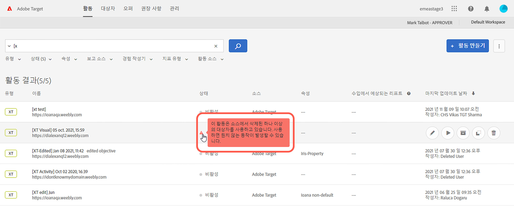

   * 활동 [!UICONTROL 개요] 페이지:

      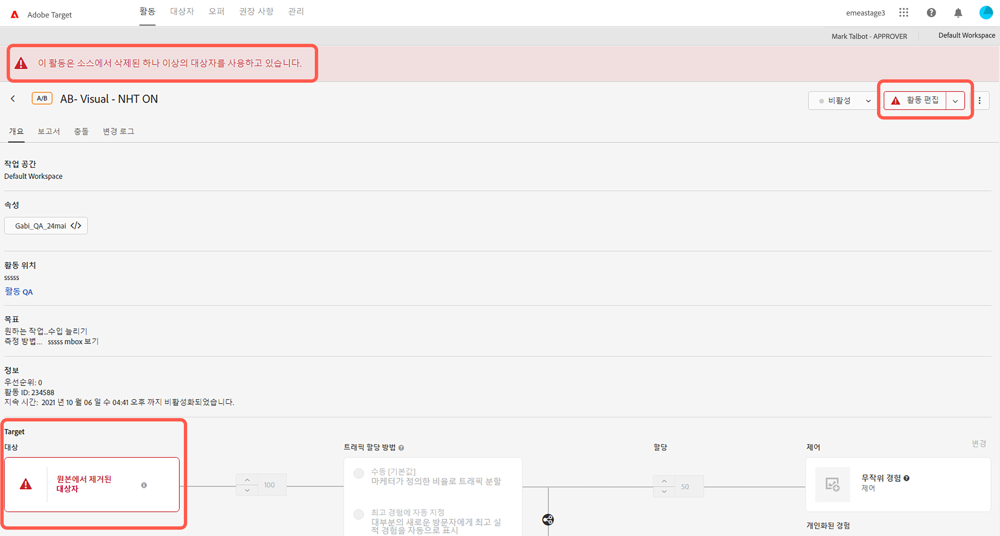

   * 활동 만들기 워크플로의 [!UICONTROL 경험] 단계:

      ![[!UICONTROL 경험] 페이지의 소스 메시지에서 삭제된 대상](assets/deleted-at-source-experiences.png)

   * 활동 만들기 워크플로의 [!UICONTROL 타기팅] 단계:

      ![[!UICONTROL 타기팅] 페이지의 소스 메시지에서 삭제된 대상](assets/deleted-at-source-targeting.png)

   * 활동 만들기 워크플로의 [!UICONTROL 목표 및 설정] 단계:

      ![[!UICONTROL 목표 및 설정] 페이지의 소스 메시지에서 삭제된 대상](assets/deleted-at-source-goals-settings.png)

   * 대상 세분화(활동 만들기 워크플로의 [!UICONTROL 타기팅] 단계에서 [!UICONTROL 대상 대체]):

* Combine Audiences 기능을 사용하려고 하고 소스에서 대상 중 하나가 삭제되면 [!UICONTROL 저장]이 비활성화됩니다.

### [!DNL Target Standard/Premium] 21.10.1 (2021년 10월 6일)

이번 릴리스에는 다음과 같은 새 기능이 포함되어 있습니다.

| 기능 | 세부 사항 |
| --- | --- |
| [!UICONTROL 대상] UI 새로 고침 | [!DNL Target] 사용자의 사용자 경험을 개선하기 위한 [!DNL Adobe Target] 팀의 지속적인 노력의 일부로 이 릴리스는 [!DNL Target] UI의 [!UICONTROL 대상] 및 [!UICONTROL 프로필 스크립트] 페이지를 새로 고칩니다. 이 업데이트는 다음과 같은 새로운 개선 사항을 추가하면서 이전에 일관되지 않고 디자인 패턴을 통합하고 표준화합니다.<ul><li>여러 대상을 동시 선택하고 삭제할 수 있는 기능</li><li>새로 단장된 [대상 빌더 디자인](/help/c-target/c-audiences/create-audience.md)</li><li>[!UICONTROL 대상] 라이브러리 규칙 빌더의 제외 규칙 지원</li><li>신속한 대상 검색을 위한 새로운 “대상 소스” 필터</li><li>세션 영구 검색 및 필터 옵션</li></ul>자세한 내용은 [대상](/help/c-target/target.md)을 참조하십시오. |
| [!UICONTROL 프로필 스크립트] UI 새로 고침 | 또한 [!UICONTROL 프로필 스크립트] 라이브러리가 업데이트되고, 새로운 인터페이스와 몇 가지 생산성 업데이트가 여기에 포함됩니다.<ul><li>여러 프로필 스크립트를 동시 선택하고 삭제할 수 있는 기능</li><li>프로필 스크립트용 새로운 편집기 코드</li><li>코드 편집기 내 구문 강조 표시 및 오류 검사</li><li>키보드 단축키를 통한 자동 완성 토큰(mbox 또는 프로필) 매개 변수</li></ul>자세한 내용은 [방문자 프로필](/help/c-target/c-visitor-profile/visitor-profile.md)을 참조하십시오. |
|  추천 항목 기준 만들기 및 편집 | 목표 달성에 적합한 추천 항목 알고리즘 및 설정 선택을 단순화하기 위해 [!UICONTROL 추천 항목 기준] 만들기 및 편집 워크플로가 간소화되었습니다.<br>자세한 내용은 [기준 만들기](/help/c-recommendations/c-algorithms/create-new-algorithm.md)를 참조하십시오. |
|  추천 전환 확인 기간 및 알고리즘 새로 고침 빈도 개선 사항 | 이제 6시간 전환 확인 기간을 통해 “가장 많이 본 항목”과 ”최상위 판매자” 알고리즘을 실행하여 가장 최근에 트렌딩하는 콘텐츠를 캡처할 수 있습니다. 6시간 전환 확인 기간을 선택하면 하루에 3~6시간마다 추천 결과가 업데이트됩니다.<br>자세한 내용은 *기준 만들기*&#x200B;의 [데이터 소스](/help/c-recommendations/c-algorithms/create-new-algorithm.md#data-source)를 참조하십시오. |

### [!DNL Target Standard/Premium] 21.9.1(2021년 9월 14일)

이 유지 보수 릴리스에는 다음과 같은 개선 사항, 수정 사항 및 변경 사항이 포함되어 있습니다.

* 일부 웹 브라우저의 서드파티 쿠키에 대한 새 보안 정책으로 인해 고객이 [!UICONTROL 시각적 경험 작성기] (VEC)에 로그인할 수 없는 문제가 해결되었습니다. [시각적 경험 작성기 및 고급 경험 작성기 관련 문제 해결](/help/c-experiences/c-visual-experience-composer/r-troubleshoot-composer/issues-related-to-the-visual-experience-composer-vec-and-enhanced-experience-composer-eec.md)의 “Google Chrome 버전 80 이상을 사용할 때 시각적 경험 작성기(VEC) 또는 향상된 경험 작성기(EEC) 페이지가 로드되지 않음”에서 이 문제를 논의합니다.
* VEC의 오퍼 이름에 오퍼의 친숙한 이름 대신 오퍼의 패스가 표시되는 문제가 해결되었습니다. (TGT-41300)
* 경험 이름이 A4T 활동(TGT-38674)에 대한 [!DNL Analysis Workspace] 에 반영됩니다.
* 복제된 활동의 프로모션 엔티티 ID 변경 내용이 원래 활동에 잘못 적용되는 [!DNL Recommendations]의 문제가 해결되었습니다. (TGT-41482)
* VEC의 [!DNL Recommendations] 활동에 대한 [!UICONTROL 경험] 페이지에서 “기준 편집” 버튼을 제대로 표시할 수 없는 문제가 해결되었습니다. (TGT-39512)
* 테스트 작업 영역에 복제 및 복사하는 경우 활동을 동기화할 수 없는 문제가 해결되었습니다. (TGT-40686)
* VEC에서 “[!UICONTROL 다음 항목 뒤에 삽입]”을 사용하는 경우 [경험 조각](/help/c-experiences/c-manage-content/aem-experience-fragments.md) 으로 선택기를 수정할 수 없는 문제가 해결되었습니다. (TGT-41802)
* 오퍼의 빈 JSON 콘텐츠를 백엔드로 전송할 수 없는 문제가 해결되었습니다. 비어있더라도 [!DNL Target] 에서 JSON 오브젝트를 보냅니다. (TGT-41555)
* 보고서를 보면서 고객이 “[!UICONTROL 분석에서 보기]”를 클릭한 경우 [!DNL Analysis Workspace] 대신 레거시 [!DNL Analytics] 보고서가 열리는 문제가 해결되었습니다. (TGT-41867)
* 고객이 [!UICONTROL Automated Personalization] 활동에 대한 보고 소스 (A4T)로 [!DNL Analytics] 선택을 시도하는 경우 표시된 UI 메시지에 추가 설명이 추가되었습니다. 메시지를 살펴보면 “[!DNL Target] 은 [!UICONTROL Automated Personalization] 활동”을 지원하는 유일한 소스입니다. (TGT-41954)
* 고객이 쉼표 대신 “새 줄”로 호스트 구분을 시도하는 경우 오류 메시지에 추가 설명이 추가되었습니다. (TGT-40671)
* 일부 활동의 “[!UICONTROL 마지막 데이트 날짜]”가 스페인어 및 일본어 고객용 영어 UI와 다를 경우 발생하는 문제가 해결되었습니다(스페인어 및 일본어로 UI를 조회하는 경우). (TGT-38980)

### at.js 2.6.1 (2021년 8월 16일)

* 온디바이스 의사 결정 사용 시 “하이브리드 모드에 대해 사용 가능한 아티팩트 없음” 버그가 수정되었습니다.

### [!DNL Target] node.js SDK 2.2.0 (2021년 8월 11일)

* SDK 원격 분석 데이터 수집 추가됨
* 자동화된 게재 API 클라이언트 openapi codegen

이에 대한 추가 정보와 이전 릴리스에 대해서는 Github의 [Target node.js SDK 설명서](https://github.com/adobe/target-nodejs-sdk)에 있는 [변경 로그](https://github.com/adobe/target-nodejs-sdk/blob/main/CHANGELOG.md)를 참조하십시오.

### [!DNL Target Standard/Premium] 21.8.1 (2021년 8월 10일)

이 유지 관리 릴리스에는 다음과 같은 고객용 변경 사항을 포함하여 많은 백엔드 개선 사항이 포함되어 있습니다.

* [!UICONTROL 양식 기반 경험 작성기] 에서 생성된 [!UICONTROL 자동 개인화] 활동에 대한 보고서를 보고서에서 삭제된 오퍼를 참조하도록 문제를 해결했습니다. 이로 인해 “이 보고서에 대한 데이터를 검색하는 데 문제가 있습니다. 문제가 지속되면 Adobe 클라이언트 지원 센터에 문의하십시오.”라는 오류 메시지가 표시됩니다. (TGT-41028)

### Target 게재 API(2021년 8월 3일)

이번 릴리스에는 다음과 같은 개선 사항이 포함됩니다.

* mbox 매개 변수에 대한 제한이 100개 매개 변수로 늘어났습니다. 이전 제한은 50개 매개 변수였습니다. (TNT-41717)
* `categoryId` 에 대한 제한이 256자로 늘어났습니다. 이전 제한은 128자였습니다.
* [!DNL Adobe Audience Manager] (AAM)가 게재 API에 추가되었습니다.

   * AAM UUID: 사용자를 고유하게 식별하는 데 사용되는 내부 AAM ID입니다.
   * dataPartnerId: 데이터 파트너의 ID입니다.
   * dataPartnerUserId: 데이터 파트너가 제공한 사용자 ID입니다.

   이전에는 게재 API가 `dcsLocationHint` 및 `blob` 에만 포함되었습니다. (TNT-41644)

### [!DNL Target Standard/Premium] 21.6.1 (2021년 6월 30일)

이번 릴리스에는 다음과 같은 새로운 기능 및 개선 사항이 포함되었습니다. 괄호로 묶인 문제 번호는 내부 [!DNL Adobe] 용입니다.

| 기능 | 세부 사항 |
| --- | --- |
| [!UICONTROL Analytics for Target] (A4T) | [!DNL Analytics]보고 소스(A4T)로 사용하는 활동에서 [!UICONTROL 보고서] 페이지의 “[!UICONTROL 분석에서 보기]” 링크를 클릭하면 [!DNL Analysis Workspace]가 열립니다. 이전에는 링크로 [!DNL Analytics] 보고서를 열 수 있었습니다. (TGT-36959) |

### Python SDK 1.0.0(2021년 6월 16일)

온 디바이스 결정 기능을 탑재한 새 [!DNL Adobe Target] Python SDK를 이제 이용할 수 있습니다. 이 최신 추가 기능은 서버측 SDK의 [!DNL Target] 제품군을 강화합니다. 이러한 SDK를 이용하면 [!DNL Target]과 통합할 수 있고 원하는 언어로 값까지 시간을 단축할 수 있습니다. 시장이 퍼스트파티 데이터가 귀중해지는 쿠키 없는 세상으로 전환하여 점점 더 많은 이들이 서버측 통합을 선택하고 있습니다. Target SDK는 시장에서 가장 인기 있는 프로그래밍 언어(Python, Java, JavaScript, C# / .Net)로 이용할 수 있습니다.

자세한 내용은 [Adobe Target SDKs 안내서](https://adobetarget-sdks.gitbook.io/docs/)의 [Python SDK 설명서](https://adobetarget-sdks.gitbook.io/docs/sdk-reference-guides/python-sdk)를 참조하십시오.

### Target Standard/Premium 21.5.1(2021년 6월 7일)

이번 릴리스에는 다음과 같은 개선 사항이 포함됩니다.

| 기능 | 세부 사항 |
| --- | --- |
|  [!DNL Recommendations] [!UICONTROL 카탈로그 검색] API | 검색 기준과 일치하는 항목을 식별하고 카탈로그의 관리를 단순화하려면 API를 통해 프로그래밍 방식으로 [!DNL Recommendations] 제품과 콘텐츠 카탈로그를 검색하십시오.<br>**제한과 참고 사항**:<ul><li>API를 통한 카탈로그 검색은 2,000,000개가 넘는 항목을 가진 환경에 대해서는 지원되지 않습니다.</li><li>API를 통한 카탈로그 검색 결과는 [!DNL Target] UI를 통한 카탈로그 검색 결과보다 더 빠르게 업데이트됩니다. [!DNL Target] UI의 카탈로그 검색은 최신 결과를 반영하는 데 시간이 더 걸릴 수 있습니다.</li></ul>자세한 내용은 *[!DNL Adobe Target][!DNL Recommendations] API* 안내서의 [엔티티 검색](https://developers.adobetarget.com/api/recommendations/#tag/Searching-Entities)을 참조하십시오. |

이 릴리스 유지 보수 릴리스가 포함하는 수정 사항은 다음과 같습니다.

* [!UICONTROL Audiences] 페이지를 참조할 때 기본 작업 영역이 다른 작업 영역으로 변경되는 문제를 수정했습니다. (TGT-38871)
* 오류 메시지를 유발하는 [!UICONTROL 관리] > [!UICONTROL 구현]의 문제를 수정했습니다. 해당 오류 메시지 내용: &quot;전역 mbox가 동기화되지 않을 수 있습니다. 재저장을 해 보십시오.&quot;

###  [!DNL Adobe Experience Platform Web SDK] 버전 2.5.0 (2021년 6월 1일)

[!DNL Platform Web SDK]의 이번 릴리스가 지원하는 것은 다음과 같습니다.

| 기능 | 세부 사항 |
| --- | --- |
| [!UICONTROL Analytics for Target] (A4T) 로 리디렉션 지원 | Platform Web SDK 가 이제 [A4T](/help/c-integrating-target-with-mac/a4t/a4t.md)를 사용할 때 [!DNL Target] 리디렉션을 지원합니다.<br>자세한 내용은 [Analytics for [!DNL Target] 구현](/help/c-integrating-target-with-mac/a4t/a4timplementation.md)을 참조하십시오. |

### at.js 버전 2.5.0(2021년 5월 13일)

이 at.js의 릴리스에는 다음과 같은 개선 사항 및 변경 사항이 포함되어 있습니다.

* at.js에 대한 [온디바이스 의사 결정](/help/c-implementing-target/c-implementing-target-for-client-side-web/on-device-decisioning/on-device-decisioning.md) 지원
* Automated Personalization 활동에 대한 [링크 미리보기](/help/c-activities/c-activity-qa/activity-qa.md) 지원

또한 이번 릴리스에서는 Microsoft Internet Explorer 10, Internet Explorer 11, 그리고 그 이하 버전에 대한 지원이 제거되었습니다. Microsoft Edge는 at.js 2.5.0과 이후 버전에서 지속 지원됩니다.

### Target Standard/Premium 21.4.1(2021년 4월 19일)

이번 릴리스에는 다음과 같은 새로운 기능 및 개선 사항이 포함되었습니다. 괄호로 묶인 문제 번호는 내부 [!DNL Adobe] 용입니다.

| 기능 | 세부 사항 |
| --- | --- |
| at.js<br>(발표될 날짜)에 대한 온디바이스 의사 결정 | 마케터와 개발자는 온디바이스 의사 결정을 통해 거의 0에 가까운 지연 시간에 사용자 브라우저에 대한 실험 및 개인화를 제공할 수 있습니다.<br>자세한 내용은 [at.js에 대한 온디바이스 의사 결정](/help/c-implementing-target/c-implementing-target-for-client-side-web/on-device-decisioning/on-device-decisioning.md)을 참조하십시오. |
|  법인 필터링 규칙에 대한 목록 기반 연산자 | [!DNL Target Recommendations]는 법인 필터링 규칙에 대한 새로운 목록 기반 연산자. (TGT-39234)<br>새로 추가된 연산자는 다음과 같습니다.<br><ul><li>Is Contained In List</li><li>Is Not Contained In List</li><li>List Contains An Item In</li><li>List Does Not Contain An Item In</li><li>List Contains All Items In</li><li>List Does Not Contain All Items In</li></ul>자세한 내용은 [동적 및 정적 포함 규칙 사용](/help/c-recommendations/c-algorithms/use-dynamic-and-static-inclusion-rules.md#operators)의 &quot;사용 가능한 연산자&quot;를 참조하십시오. |

이번 릴리스에는 다음과 같은 수정 사항이 포함됩니다.

* 고객을 [!UICONTROL 모든 방문자] 로 변경한 후에 활동을 동기화할 수 없는 문제를 해결했습니다. (TGT-40259)
* [!UICONTROL 복제 허용] 활동이 활성화되기는 했지만, [!UICONTROL Automated Personalization] 활동의 여러 위치에서 사용하는 경우에 제안을 복제할 수 없는 문제를 해결했습니다. (TGT-39567)
* [!UICONTROL 관리] > [!UICONTROL Scene7 구성] 페이지를 제대로 업로드할 수 없는 문제를 해결했습니다. (TGT-39918)
* 속성을 잘못된 작업 영역으로 매핑하는 문제를 해결했습니다. (TGT-39869)
* 권장 사항 제외를 생성하는 동안 환경을 변경한 후에 요청이 실패하는 경우, 무한 로딩을 유발하는 문제를 해결했습니다. (TGT-39948)

### at.js 2.4.1(2021년 3월 23일)

at.js 유지 관리 릴리스이며, 다음과 같은 개선 기능 및 수정 사항이 포함되어 있습니다.

* mbox 요청에 포함되는 `targetPageParams`에 관한 문제가 해결되었습니다. `targetPageParams`은 `pageLoad` 요청에만 포함되어야 합니다. (TNT-40247)
* Platform Launch 글로벌 오브젝트 종속성을 그에 대한 직접 참조로 교체하여 [!DNL Adobe Experience Platform Launch] 확장 프로그램의 문서 및 창 글로벌 오브젝트에 관한 문제를 해결했습니다. (TNT-37124)

### PREMIUM 권장 사항 피드 처리 서버에 대한 IP 주소 변경 사항(2021년 3월 16일)

[!DNL Target Recommendations] 피드 처리 서버 IP 주소는 2021년 3월 16일에 마지막으로 업데이트되었습니다. 자세한 내용은 [권장 사항 피드 처리 서버에서 사용하는 IP 주소](/help/c-recommendations/c-recommendations-faq/ip-addresses-marketing-cloud.md)를 참조하십시오.

### Target Standard/Premium 21.2.1(2021년 3월 9일)

이 유지 보수 릴리스에는 다음과 같은 개선 사항, 수정 사항 및 변경 사항이 포함되어 있습니다.

괄호로 묶인 문제 번호는 내부 [!DNL Adobe] 용입니다.

* 허용 가능한 오퍼 크기 증가(TGT-38304):

   | 유형 | 이전 제한 | 새로운 제한 |
   | --- | --- | --- |
   | HTML | 256KB | 1024KB |
   | Target UI의 시각적 오퍼 | 64KB | 각 경험에 대해 1024KB |
   | API를 통함 | 512KB | 1024KB |

* [!UICONTROL 자동 타겟] [!UICONTROL (AT)] 및 [!UICONTROL Automated Personalization] (AP) 활동에 대한 개인화 통찰력 보고서가 이제 매일 생성됩니다. 지난 15일, 30일 및 60일 동안 [!UICONTROL 자동 세그먼트] 또는 [!UICONTROL 중요 속성]을 제공하는 보고서를 선택할 수 있습니다. 다른 전환 확인 기간 설정을 매일 실행할 수 있도록 45일 및 90일 옵션이 제거되었습니다. (TGT-39472)
* 고객이 활동의 [!UICONTROL 목표 및 설정] 페이지에서 [!UICONTROL 종속성 편집]을 클릭할 때 현재 종속성이 표시되지 않는 문제를 해결했습니다. (TGT-39340)
* 작업 영역의 [!UICONTROL 대상 라이브러리]를 새로 고칠 때 발생하는 문제를 해결했습니다. 새로 고치기 전에 현재 선택한 작업 영역의 대상이 표시되었습니다. 새로 고친 후에는 [!UICONTROL 기본 작업 영역] 및 해당 대상이 표시되었습니다. 이제 새로 고친 후에도 현재 작업 영역과 해당 대상이 유지됩니다. (TGT-38871)
* [!UICONTROL 권장 사항] 활동을 복사하고 나중에 기준 시퀀스를 변경하여 원래 활동을 편집할 때 발생하는 문제를 해결했습니다. 원래 활동의 기준 시퀀스 변경도 복사된 활동에 잘못 적용되었습니다. (TGT-39155)
* [!UICONTROL 권장 사항] 제외에 대해 표시되는 제품 수가 올바르지 않은 문제를 해결했습니다. (TGT-39599)

### Target Standard/Premium 21.1.1(2021년 1월 19일)

이 유지 보수 릴리스에는 다음과 같은 개선 사항, 수정 사항 및 변경 사항이 포함되어 있습니다.

괄호로 묶인 문제 번호는 내부 [!DNL Adobe] 용입니다.

* . [!DNL Adobe Analytics] 지표를 선택할 때 [!UICONTROL Analytics를 조회하고 소스] (A4T)로 사용 시 [!UICONTROL 자동 타켓] 활동에서 경고가 추가되었습니다. [!UICONTROL 자동 타겟] 모델은 이진(전환 기반) 지표로 작동하도록 최적화되었습니다. 매출과 같은 연속적인 지표를 선택하면 최적의 결과가 없을 수 있으며 [!UICONTROL 개인화 통찰력] 보고서가 정확하지 않을 수 있습니다. (TGT-38926)
* A4T를 사용하는 [!UICONTROL 자동 타겟] 활동에 대한 [!UICONTROL 자동 타겟 요약] 보고서에 상태 아이콘이 추가되었습니다. 보고서에서 각 경험 옆에 있는 녹색 확인 아이콘은 해당 경험에 대해 개인화된 머신 러닝 모델이 생성되었음을 나타냅니다. 시계 아이콘은 모델을 만들 수 있는 충분한 트래픽이 제공되지 않았음을 나타냅니다. (TGT-38925)
* A4T 및 [!UICONTROL 전환 지표]를 사용하는 [!UICONTROL 자동 타겟] 활동에 대한 [!UICONTROL 자동 세그먼트] 및 [!DNL Analytics] 중요 속성 보고서가 생성되며 보고 소스로 [!DNL Target]을 사용할 때와 동일하게 표시됩니다. (TGT-38931)
* [!UICONTROL Recommendations] [!UICONTROL 컬렉션] 목록에 환경 필터링 옵션이 추가되었습니다. (TGT-38353)
* [!UICONTROL Recommendations] 컬렉션에 잘못된 제품 수가 표시되도록 하는 문제를 해결했습니다. (TGT-39162)
* Recommendations [!UICONTROL 카탈로그 검색에] [!UICONTROL 마지막 업데이트] [!UICONTROL 날짜가 추가되었습니다]. (TGT-38340)
* [!UICONTROL Recommendations] 에서 수직 산업을 변경한 후 [!UICONTROL 시퀀스 만들기] 페이지가 중단되는 문제를 해결했습니다. (TGT-38160)
* 사용자가 AP ([!UICONTROL Automated Personalization]) 활동에서 대상을 오퍼에서 제거할 수 없도록 하는 문제를 해결했습니다. (TGT-39058)
* 일부 고객의 [!UICONTROL 대상 정보] 카드에 잘못된 시간대(시작 및 종료 날짜)가 표시되는 문제를 해결했습니다. (TGT-39150)
* 일부 고객이 [!UICONTROL 기본 작업 영역]의 작업 목록을 볼 수 없도록 하는 문제를 해결했습니다. (TGT-38526)

### at.js 2.4.0(2021년 1월 14일)

at.js 유지 관리 릴리스이며, 다음과 같은 수정 사항이 포함되어 있습니다.

* API customerIds 제공에 통합 프로필/플랫폼 ID 지원을 추가합니다.
* 잘못된 스타일 태그 삽입을 해결합니다.

## 릴리스 정보 - 2020

### Target Standard/Premium 20.10.1(2020년 10월 27일)

이번 릴리스에는 다음과 같은 새 기능이 포함되어 있습니다.

| 기능 | 세부 사항 |
| --- | --- |
| [디바이스에서 의사 결정](https://adobetarget-sdks.gitbook.io/docs/on-device-decisioning/introduction-to-on-device-decisioning) | 디바이스에서 의사 결정을 통해 마케터와 제품 개발자는 사용자 디바이스 내에서 채널 간에 거의 0에 가까운 지연 시간에 실험 및 머신 러닝 기반 개인화를 제공할 수 있습니다.<br>속도 및 성능 문제 - 고객 인사이트 및 사용자 만족도.<br>디바이스에서 의사 결정을 통해 A/B 테스트 및 Experience Targeting (XT) 활동 유형의 주요 개인화 및 실험 지침을 CDN을 통해 고객 디바이스에 로드되는 &quot;최적화 아티팩트:&quot; JSON 개체로 컴파일할 수 있습니다. 또한 디바이스에서 의사 결정은 기본적으로 [!DNL Adobe Experience Cloud] 제품과 연결되기 때문에 [!DNL Target] 사용자는 빠른 분석과 빠른 경험 반복을 얻을 수 있습니다.<br>자세한 내용은 *[디바이스에서 의사 결정](/help/c-implementing-target/c-api-and-sdk-overview/on-device-decisioning.md)을 참조하십시오. |

이번 릴리스에는 다음과 같은 개선 사항, 수정 사항 및 변경 사항이 포함되어 있습니다.

* 합계 행에 대한 보고에서 [!UICONTROL 평균 상승도 신뢰 구간] 및 [!UICONTROL 신뢰도가] 표시되지 않는 [!DNL Auto-Target] [!UICONTROL 문제를] 해결했습니다. 모든 개별 경험에 대해 측정이 올바르게 표시됩니다. (TGT-37301)
* 9월 15일 오후 2시 30분(PDT)부터 10월 6일 오전 9시 25분(PDT)까지 [!DNL Adobe Target Premium] 사용자의 [!UICONTROL 자동 타겟] 보고에 영향을 미치는 문제를 해결했습니다. 영향을 받는 전환 지표에 대한 보고서(&quot;[!UICONTROL 페이지 보았음]&quot; 또는 &quot;[!UICONTROL mbox를 클릭함]&quot; 옵션을 사용하여 구성됨)를 볼 때 전환 속도가 잘못 보고됩니다. 현재 알려진 전달 문제는 없습니다. 보고를 다시 동기화하고 [수정하는 방법에](/help/r-release-notes/known-issues-resolved-issues.md#at-metrics) 대한 자세한 내용은 *알려진 문제 및 해결된 문제의* 해결된 문제 아래의 *자동 타겟 보고를* 참조하십시오.
* 카탈로그 [!UICONTROL 검색 표에] 선택 가능한 [!UICONTROL 마지막 업데이트 날짜] 열과 [!UICONTROL 마지막 업데이트 날짜] 필터를 추가했습니다. 이렇게 하면 각 개별 항목을 열어 마지막으로 업데이트한 시기를 확인할 필요가 없고 항목이 마지막으로 업데이트된 날짜로 필터링할 수 있기 때문에 시간과 노력이 절약됩니다.

   

* Target UI가 [웹 콘텐츠 액세스 가능성 지침](https://www.w3.org/WAI/standards-guidelines/wcag/) 2.0 레벨 A 및 AA 성공 기준(WCAG 2.0 AA)을 준수하도록 돕기 위해 업데이트되었습니다. (TGT-34384 및 TGT-24679)
* 콘텐츠 보안 정책(CSP)을 개선했습니다. (TGT-37035)
* CNAME을 사용하는 고객을 위한 매개 변수로 클라이언트 코드를 지정하는 방법을 도입했습니다. (TNT-38571)
* [!DNL Adobe Experience Cloud] 설명서가 [!DNL Experience League]로 이동합니다. 10월 중에 모든 릴리스 정보, 문서, 비디오 및 튜토리얼이 현재 위치인 `docs.adobe.com` 에서 [!DNL Experience League]로 이동합니다. 이렇게 하면 모든 학습, 자체 도움말, 지원 및 커뮤니티 콘텐츠를 한 장소에서 제공할 수 있습니다. 이 변경 사항이 발생하면 모든 링크가 [!DNL Experience League]로 리디렉션되므로 수행할 필요가 없습니다. 컷오버가 시작되면 릴리스 정보를 업데이트하겠습니다.

### Target Standard/Premium 20.9.1(2020년 9월 30일)

이 유지 보수 릴리스에는 다음과 같은 개선 사항, 수정 사항 및 변경 사항이 포함되어 있습니다.

* 키보드 전용 사용자를 위한 탐색 및 기능이 향상되었습니다. (TGT-34487, TGT-34516, TGT-34517, TGT-34514)
* 보조 기술을 사용하는 사용자를 돕기 위해 UI에 레이블이 추가되었습니다. (TGT-34500, TGT-34501, TGT-34502, TGT-24504)
* UI에서 이미지 및 텍스트의 텍스트와 색 대비가 개선되었습니다. (TGT-34513)

### Target Standard/Premium 20.8.3(2020년 9월 15일)

| 기능 | 세부 사항 |
| --- | --- |
|  A4T(Analytics for Target)에서 자동 타겟 활동을 지원 | [!UICONTROL 자동 타겟] 활동은 이제 [Analytics for Target](/help/c-integrating-target-with-mac/a4t/a4t.md)을 지원합니다.<br>이 통합을 통해 [!UICONTROL 자동 타겟] 앙상블 머신 러닝 알고리즘을 사용하여 각 방문자의 프로필, 동작 및 컨텍스트를 기반으로 최상의 경험을 선택할 수 있습니다.<br>A/B 테스트 및 체험 타기팅 활동과 함께 사용할 수 있도록 이미 [A4T를 구현](/help/c-integrating-target-with-mac/a4t/a4timplementation.md) 했다면 모두 준비가 된 것입니다!<br>자세한 내용은 [자동 할당 및 자동 타겟 활동에 대한 A4T 지원](/help/c-integrating-target-with-mac/a4t/a4t-at-aa.md)을 참조하십시오. |

### Target Standard/Premium 20.8.2(2020년 9월 10일)

| 기능 | 세부 사항 |
| --- | --- |
|  기준 시퀀스 내 권장 사항 슬롯 제어 | 이제 기준 시퀀스를 사용하여 각 권장 사항 기준에서 차지하는 슬롯 수를 제어할 수 있으므로 서로 다른 유형의 항목 또는 다른 알고리즘 로직을 혼합하고 일치시킬 수 있습니다.<br>자세한 내용은 [기준 시퀀스 만들기](/help/c-recommendations/c-algorithms/create-criteria-sequence.md#sequence)를 참조하십시오. |

### Target Standard/Premium 20.8.1(2020년 9월 2일)

이번 릴리스에는 다음과 같은 개선 사항, 수정 사항 및 변경 사항이 포함되어 있습니다.

* 조직을 전환한 후 새 [!UICONTROL 관리] 페이지를 로드할 때 오류가 발생했던 문제를 해결했습니다. (TGT-37730)
* 코드가 [!UICONTROL 관리 > 구현] 페이지에 잘못된 클라이언트가 표시되는 문제를 해결했습니다. (TGT-37849)
* VEC를 성공적으로 로드한 후 사용자가 [!UICONTROL 시각적 경험 작성기] (VEC)의 편집 기능을 사용할 수 없게 되는 문제를 해결했습니다. (TGT-37162)
* VEC Helper 확장이 설치되었지만 VEC 및 EEC(고급 경험 작성)에서 페이지를 로드할 수 없는 문제를 해결했습니다. 이는 Google Chrome 80+의 변경 때문이었습니다. [업데이트된 VEC Helper 확장](/help/c-experiences/c-visual-experience-composer/r-troubleshoot-composer/issues-related-to-the-visual-experience-composer-vec-and-enhanced-experience-composer-eec.md)을 다운로드하십시오. (TGT-37893)
* 사용자가 조직을 전환한 후 때때로 [!UICONTROL 관리 > 구현] 페이지에서 at.js를 다운로드할 수 없는 문제를 해결했습니다. (TGT-37668)
* 사용자가 다운로드 버튼을 여러 번 클릭할 경우 [!DNL Target] 이 여러 요청을 보내지 못하도록 로드하는 동안 at.js 다운로드 버튼이 비활성화되었습니다. (TGT-37633)
* 경험이 오랜 기간 동안 &quot;결과 가져오기&quot;를 표시하도록 했던 [!UICONTROL 경험 타기팅] (XT) 활동의 문제를 해결했습니다. (TGT-37684)
* 키보드 전용 사용자를 위한 탐색 및 기능이 향상되었습니다. (TGT-34479 및 TGT-34473)
* 보조 기술을 사용하는 사용자를 돕기 위해 UI에 레이블이 추가되었습니다. (TGT-34480)
* 현재 활동에 사용되는 모바일 뷰포트를 삭제할 때 오류 메시지가 개선되었습니다. 오류 메시지에는 이제 &quot;이 뷰포트가 현재 하나 이상의 활동과 연결되어 있습니다. 뷰포트를 삭제하려면 먼저 해당 활동에서 뷰포트를 제거해야 합니다.&quot;라고 표시됩니다. (TGT-37030)
* 페이지에 있는 둘 이상의 요소와 일치하는 css 선택기에서 클릭 추적을 허용하도록 VEC에서 지원이 추가되었습니다. (TGT-37323)
* 특정 사용자가 [!UICONTROL 활동] 목록을 표시할 수 없도록 하는 문제를 해결했습니다. &quot;URL 제안을 가져올 수 없습니다.&quot;라는 오류 메시지가 표시됩니다. Adobe 백엔드 시스템의 이름(FirstName/r/n)에서 캐리지 리턴을 사용하는 사용자에게 오류가 발생했습니다. (TGT-37330)
* 작업 [!UICONTROL 영역] 이름([!UICONTROL Adobe Admin Console for Enterprise]에 지정)에 아포스트로피가 포함된 경우 사용자가 활동 페이지를 표시할 수 없는 문제를 해결했습니다. (TGT-37709)
* 보고서 세트가 이미 지정되었지만 최적화 및 전환 지표를 선택하는 동안 [!UICONTROL 자동 할당] 활동에서 사용자에게 보고서 세트를 선택하도록 잘못 알리는 오류 메시지가 있는 문제를 해결했습니다. (TGT-37689)
* 때때로 [!UICONTROL 타기팅] 페이지로 이동한 다음 뒤로 이동하면 [!UICONTROL 목표 및 설정] 페이지의 지표가 비어 있는 문제를 해결했습니다. (TGT-37691)
* [!DNL Recommendations] 기준에 대해 최종 수정된 값이 잘못되는 문제를 해결했습니다. (TGT-37666)
* mbox 이름 대신 Mboxes 드롭다운 목록에 mbox ID가 표시되는 문제를 해결했습니다. (TGT-37739)

### at.js 2.3.2(2020년 7월 24일)

at.js 유지 관리 릴리스이며, 다음과 같은 수정 사항이 포함되어 있습니다.

* 스크립트 또는 코드가 창 또는 문서에 기본 속성을 추가할 때의 버그를 해결했습니다.

### Target Standard/Premium 20.7.1(2020년 7월 27일)

이번 릴리스에는 다음과 같은 변경 사항이 포함됩니다.

#### [!UICONTROL 관리] 섹션 UI 새로 고침

당사는 향상된 성능을 제공하고, 새로운 기능을 출시할 때 필요한 유지 관리 시간을 줄이고, 제품 전반에 걸쳐 사용자 경험을 개선할 수 있도록 새로운 기술 스택을 사용하여 전체 [!DNL Target] UI를 점차적으로 다시 작성하고 있습니다. 새로 고친 첫 번째 섹션은 [!UICONTROL 관리]로 이름이 변경된 [!UICONTROL 설정] 섹션입니다.

이 새로 고침의 일환으로 [!UICONTROL 관리] 섹션의 페이지를 사용하여 다음과 같은 다양한 작업을 쉽게 수행할 수 있습니다.

* [!UICONTROL 구현] 탭(**[!UICONTROL 관리]** > **[!UICONTROL 구현]**)에서 최신 at.js 파일을 다운로드합니다.
* at.js 설정을 사용자 정의하고 변경 사항을 쉽게 검토할 수 있습니다(**[!UICONTROL 관리]** > **[!UICONTROL 구현]**).
* 기본 통화 및 시간대, 보고에서 제외할 IP 등과 같은 고급 보고 설정을 수정합니다. (**[!UICONTROL 관리]** > **[!UICONTROL 보고]**)
* 개인정보 보호를 위해 방문자 IP 주소 난독화(**[!UICONTROL 관리]** > **[!UICONTROL 구현]**)
* Adobe Admin Console에서 관리하기 전에 작업 영역별 기존 사용자 목록과 해당 역할을 봅니다(**[!UICONTROL 관리]** > **[!UICONTROL 사용자]**).
* [!UICONTROL 관리] 섹션에서 모든 테이블을 검색하고 필터링합니다.

자세한 내용은 [Target 관리 개요](/help/administrating-target/administrating-target.md)를 참조하십시오.

#### 개선 사항, 수정 사항 및 변경 사항

이번 릴리스에는 다음과 같은 개선 사항, 수정 사항 및 변경 사항이 포함되어 있습니다.

* 새로 고침 후 사이트 환경 설정이 유지되지 않는 문제를 해결했습니다. (TGT-37239)
* 확장 가능한 벡터 그래픽(SVG) 이미지를 사용하여 [!UICONTROL 뒤에 삽입] > [!UICONTROL 이미지] 가 제대로 작동하지 않는 문제를 해결했습니다. (TGT-37242)
* 초안 활동의 삭제를 방해하는 [!UICONTROL 게시자] 역할이 있는 사용자의 문제를 해결했습니다. (TGT-37358)
* [!UICONTROL 모든 내 작업 영역]을 선택할 때 사용자가 활동을 편집할 수 없도록 하는 문제를 해결했습니다. (TGT-37276)

### Target Standard/Premium 20.5.1(2020년 6월 17일)

| 기능/향상 | 설명 |
| --- | --- |
| [!UICONTROL 자동 할당] 활동에 대한 Analytics for Target(A4T) 지원 | [!UICONTROL 자동 할당] 활동은 이제 [Analytics for Target](/help/c-integrating-target-with-mac/a4t/a4t.md)을 지원합니다.<br>이 통합을 통해 [!UICONTROL 자동 할당] multi-armed bandit 기능을 사용하여 [!UICONTROL Adobe Analytics] 목표 지표 및/또는 [!UICONTROL Adobe Analytics] 보고 및 분석 기능을 사용하는 동안 트래픽을 승리 경험으로 유도할 수 있습니다.<br>A/B 테스트 및 체험 타기팅 활동과 함께 사용할 수 있도록 이미 [A4T를 구현](/help/c-integrating-target-with-mac/a4t/a4timplementation.md) 했다면 모두 준비가 된 것입니다!<br>자세한 내용은 [자동 할당 및 자동 타겟 활동에 대한 A4T 지원](/help/c-integrating-target-with-mac/a4t/a4t-at-aa.md)을 참조하십시오. |
| 자동 타겟 및 Automated Personalization 활동을 위 방법의 응답 토큰 | [!UICONTROL 자동 타겟] 및 [!UICONTROL Automated Personalization] 활동에 [응답 토큰](/help/administrating-target/response-tokens.md) 두 개가 추가되어 방문자가 &quot;제어&quot; 또는 &quot;대상&quot; 트래픽에 할당된 결과로 특정 경험을 받았는지 여부를 확인할 수 있습니다.<ul><li>`experience.trafficAllocationId` 은 방문자가 &quot;제어&quot; 트래픽에서 경험을 받은 경우 0을 반환하고, 방문자가 &quot;관리&quot; 트래픽 분배에서 경험을 받은 경우 1을 반환합니다.</li><li>`experience.trafficAllocationType` 은 “제어” 또는 “타겟&quot;을 반환합니다.</li></ul>제어와 타겟 트래픽에 대한 자세한 내용은 [Automated Personalization 또는 자동 타겟 활동의 제어 선택](/help/c-activities/t-automated-personalization/experience-as-control.md)을 참조하십시오. |
| [!UICONTROL 게시자] 역할 | 이 새 역할은 현재 [!UICONTROL 관찰자] 역할(활동을 볼 수 있지만 만들거나 편집할 수는 없음)과 유사합니다. 그러나 [!UICONTROL 게시자] 역할에는 활동을 활성화할 수 있는 추가 권한이 있습니다.<br>자세한 내용은 다음 문서를 참조하십시오. <ul><li>**Target Standard 사용자**: *사용자*&#x200B;에서 [역할 및 권한 지정](/help/administrating-target/c-user-management/c-user-management/user-management.md#roles-permissions).</li><li>**Target Premium 사용자**: *기업 권한 구성*&#x200B;에서 [6단계: 역할 및 권한 지정](/help/administrating-target/c-user-management/property-channel/properties-overview.md#section_8C425E43E5DD4111BBFC734A2B7ABC80).</li></ul> |
| A4T는 [!DNL Analysis Workspace]<br>2020년 6월 25일에 지원 | [!UICONTROL Anaytics for Target] (A4T)은 이제 [!DNL Analysis Workspace]에서 지원됩니다. . [!UICONTROL Analytics for Target(A4T) 패널을] 사용하면 [!DNL Adobe Target] 활동 및 경험을 [!DNL Analysis Workspace]에서 분석할 수 있습니다.<br>자세한 내용은 [A4T 보고의](/help/c-integrating-target-with-mac/a4t/reporting.md) *Analytics의 보고서* 및 Analytics 툴 안내서의 [Analytics for Target(A4T)](https://experienceleague.adobe.com/docs/analytics/analyze/analysis-workspace/panels/a4t-panel.html?lang=ko-KR) 패널을 *참조하십시오*. |

**개선 사항, 수정 사항 및 변경 사항**

* 방문자 지표가 &quot;UniqueVisitors&quot; 대신 활동의 정의에 저장되도록 한 문제를 해결했습니다. (TGT-37098)
* [!DNL Target] UI에서 세로 스크롤 막대가 [!UICONTROL 대상] 페이지에서 올바르게 작동하지 않는 문제를 해결했습니다. (TGT-36968)

### at.js 1.8.2 및 at.js 2.3.1 릴리스(2020년 6월 15일)

[!DNL Target] at.js 라이브러리에서 다음과 같은 개선 및 수정이 이루어졌습니다.

| 기능/향상 | 설명 |
| --- | --- |
| at.js 1.8.2 | at.js 유지 관리 릴리스이며, 다음과 같은 수정 사항이 포함되어 있습니다.<ul><li>CNAME 및 에지 재정의 at.js 1을 사용할 때 문제를 해결했습니다.*x* 가 서버 도메인을 잘못 만들어 [!DNL Target] 요청에 실패할 수 있습니다. (TNT-35064)</li></ul>자세한 내용은 [at.js 버전 세부 사항](/help/c-implementing-target/c-implementing-target-for-client-side-web/target-atjs-versions.md)을 참조하십시오. |
| at.js 2.3.1 | at.js 유지 관리 릴리스이며, 다음과 같은 개선 기능 및 수정 사항이 포함되어 있습니다.<ul><li>[targetGlobalSettings](/help/c-implementing-target/c-implementing-target-for-client-side-web/targetgobalsettings.md)를 통해 `deviceIdLifetime` 설정을 재정의할 수 있게 했습니다. (TNT-36349)</li><li>CNAME 및 에지 재정의 at.js 2를 사용할 때 문제를 해결했습니다.*x* 가 서버 도메인을 잘못 만들어 [!DNL Target] 요청에 실패할 수 있습니다. (TNT-35065)</li><li>[!DNL Target] [!DNL Launch] 확장 v2 및 [!DNL Adobe Analytics] [!DNL Launch] 확장을 사용할 때 [!DNL Target] 이 [!DNL Analytics] `sendBeacon` 호출을 지연시키는 문제를 해결했습니다. (TNT-36407, TNT-35990, TNT-36000)</li></ul>자세한 내용은 [at.js 버전 세부 사항](/help/c-implementing-target/c-implementing-target-for-client-side-web/target-atjs-versions.md)을 참조하십시오. |

### Profile Batch Status API v2 변경(2020년 5월 4일)

5월 20일 릴리스에서는 Profile Batch status가 앞으로 행 수준 오류 데이터만 반환합니다(성공 데이터는 반환되지 않음). 실패한 프로필 ID는 앞으로 API에서 반환됩니다.

이전 및 새로운 API 응답은 다음과 같습니다.

`ProfileBatchStatus Api`
`http://<<edge>>/m2/<<client>>/profile/batchStatus?batchId=<batchid>`

**현재 응답 내용은 다음과 같습니다.**

```
<response>
 
    <batchId>samplebatch-1585929692655-59449976</batchId>
 
    <status>complete</status>
 
    <batchSize>164</batchSize>
 
    <profile>
 
        <id>1514187733806-729395</id>
 
        <status>success</status>
 
    </profile>
 
    <profile>
 
        <id>1573612762055-214017</id>
 
        <status>success</status>
 
    </profile>
 
    <profile>
 
        <id>some profile id</id>
 
        <status>failed</status>
 
    </profile>
 
</response>
```

**5월 4일 이후 응답은 다음과 같습니다.**

```
<response>
 
    <batchId>samplebatch-1585929692655-59449976</batchId>
 
    <status>complete</status>
 
    <batchSize>164</batchSize>
 
    <profile>
 
        <id>some profile id</id>
 
        <status>failed</status>
 
    </profile>
 
</response>
```

### Target Standard/Premium 20.4.1(2020년 5월 6일)

이번 릴리스에는 다음과 같은 개선 사항, 수정 사항 및 변경 사항이 포함되어 있습니다.

* 대상에 대해 디바이스 및 브라우저 유형을 잘못 인증한 문제를 해결했습니다. (TGT-36266)
* 963픽셀 미만의 화면에서 보고서 데이터를 볼 수 없는 문제를 해결했습니다. (TGT-36549)
* 자동 타겟 설정 보고서가 올바르게 렌더링되지 않는 문제를 해결했습니다. (TGT-36619)
* Analytics for Target(A4t)을 사용하는 자동 할당 및 자동 타겟 활동에서 호환되지 않는 지표를 선택할 수 있는 문제를 해결했습니다. (TGT-36646)
* VEC(시각적 경험 작성기)의 특정 옵션이 올바르게 표시되지 않는 문제를 해결했습니다. (TGT-36571)
* Target UI에서 사용자가 단일 환경에서 콘텐츠를 교체한 후 다른 Recommendations 오퍼 미리보기를 통해 편집된 콘텐츠를 표시하도록 하는 문제를 해결했습니다. (TGT-36053 및 TGT-36894)
* 일부 사용자가 Recommendations 카탈로그에서 항목을 삭제할 수 없는 문제를 해결했습니다. (TGT-36455)
* 사용자가 다중 페이지 활동에 Recommendations 기준을 저장할 수 없는 문제를 해결했습니다. (TGT-36249)
* 기준을 연속해서 편집할 때 동작 데이터 소스 라디오 버튼이 사라지는 문제를 해결했습니다. (TGT-36796)
* Recommendations알고리즘이 장시간 &quot;결과 가져오는 중&quot;을 표시하도록 만든 디스플레이 문제를 해결했습니다. (TGT-36550 및 TGT-36551)
* 다양한 언어로 지역화된 많은 UI 문자열이 업데이트되었습니다.

### Target at.js(2020년 3월 25일)

Target at.js JavaScript 라이브러리의 다음 새 버전을 사용할 수 있습니다.

* at.js 버전 2.3.0
* at.js 버전 1.8.1

자세한 내용은 [at.js 버전 세부 사항](/help/c-implementing-target/c-implementing-target-for-client-side-web/target-atjs-versions.md)을 참조하십시오.

### Target Standard/Premium 20.2.1(2020년 3월 23일)

이번 릴리스에는 다음과 같은 개선 사항, 수정 사항 및 변경 사항이 포함되어 있습니다.

* 카탈로그 검색을 수행할 때 고객이 컬렉션을 선택할 수 없는 문제를 해결했습니다. (TGT-36230)
* API를 통해 생성되었지만 Target UI에서 생성된 활동에서 참조되지 않은 기준이 UI에서 잘못 삭제될 수 있는 문제를 해결했습니다. (TGT-35917)
* CSP(콘텐츠 보안 정책)에 대한 보안 개선이 구현되었습니다. (TGT-36190)
* 속성 가중치 백분율 막대를 왼쪽 끝으로 밀 때 &quot;NaN%&quot;가 표시되는 문제를 해결했습니다. (TGT-36211)
* 다양한 언어의 UI 텍스트가 올바르게 표시되도록 지역화 문제를 해결했습니다.
* 현재 버전의 Adobe Analytics API에서 지원되지 않는 Adobe Analytics 지표를 더 이상 사용하지 않음으로써 Adobe Analytics for Target(A4T) 활동에서 사용할 수 있는 지표 목록을 표준화했습니다. 이를 통해 향후 Adobe Target 릴리스에서 A4T 지원을 확장할 수 있습니다.

   다음과 같이 변경되었습니다.

   * &quot;페이지에 머문 평균 시간&quot;이 &quot;사이트에서 머문 평균 시간&quot;으로 대체되었습니다. 이 지표를 기본 목표 지표로 사용하는 모든 활동에는 &quot;사이트에서 머문 평균 시간&quot;(참고: 다음 번에 작업을 편집할 때 몇 초가 아닌 몇 분으로 측정됨)이 기본 목표 지표로 선택됩니다.
   * &quot;방문자&quot;는 &quot;고유한 방문자&quot;로 대체되었습니다. 이 지표를 기본 목표 지표로 사용하는 모든 활동에는 다음에 활동을 편집할 때 &quot;고유 방문자&quot;가 기본 목표 지표로 선택됩니다.

* 다음 지표는 더 이상 사용되지 않으므로 새 A4T 활동을 생성할 때 기본 목표 지표로 더 이상 선택할 수 없습니다.

   | 더 이상 사용되지 않는 지표 | 제안하는 교체 지표 |
   |--- |--- |
   | 일일 방문자, 시간당 방문자, 월간 방문자, 분기별 방문자, 주간 방문자, 연간 방문자 | 고유 방문자 수 |
   | 평균 방문 깊이 | 해당 없음. 기본 목표 지표로 제안되지 않음 |
   | 보트 | 해당 없음. 기본 목표 지표로 제안되지 않음 |
   | 모바일 충돌률, 모바일 평균 이전 세션 길이, 모바일 앱 스토어 평균 순위, 모바일 앱 성능 충돌률, 모바일 앱 스토어 평균 등급 | 해당 없음. 기본 목표 지표로 제안되지 않음 |

### Adobe Experience Cloud 탐색(2019년 2월 22일)

* [!DNL Adobe Experience Cloud]에 로그인하면 새 헤더 탐색으로 이동합니다. 검은색 막대가 맨 위에 있는 이전 탐색과 매우 유사하지만 다음과 같은 개선 사항을 제공합니다.

   * [!DNL Identity Management System] (IMS) 조직 간 또는 다른 솔루션으로 더 쉽게 전환할 수 있습니다.
   * 향상된 사용자 도움말: 검색 결과에는 [!DNL Target] 제품 설명서와 커뮤니티 포럼 및 더 많은 비디오 콘텐츠의 결과가 포함되어 있어 더 많은 콘텐츠에 쉽게 액세스하여 [!DNL Target]을 최대한 활용할 수 있습니다. 또한 문제를 보고하거나 아이디어를 공유하기 쉽도록 [!UICONTROL 도움말] 메뉴에 피드백 메커니즘을 추가했습니다.

   * NPS(Net Promoter Score) 피드백 기능이 향상되어 설문 조사 모달이 작업 흐름을 방해하지 않습니다.
   * 로그인 흐름이 개선되었습니다. 이전에는 모든 [!DNL Target] 고객이 머리글에서 [!DNL Target] 아이콘을 클릭한 후 Target 랜딩 페이지에 도달했습니다. 이 페이지를 통해 고객은 아래와 같이 [!DNL Target Standard/Premium], [!DNL Search&Promote] 또는 [!DNL Recommendations Classic]를 진행할 수 있습니다.

      

      당사는 모든 고객을 위해 이 랜딩 페이지를 삭제했습니다. 이제 항상 새 헤더 탐색 모음에서 [!DNL Target] 아이콘을 클릭하여 [!UICONTROL 활동 목록] 페이지로 바로 이동합니다.

      [!DNL Recommendations Classic]을 사용하는 경우 솔루션으로 직접 이동하거나 아래 표시된 [!UICONTROL Recommendations] 탭에 생성된 짧은 링크에서 이동할 수 있습니다.

      

      [!DNL Search&Promote]를 사용하는 경우 바로 [Search&amp;Promote URL](https://center.atomz.com/center/?ims=1) (https://center.atomz.com/center/?ims=1)로 이동해야 합니다. . [!DNL Search&Promote] 내부에서 [!DNL Adobe Target] 에 도달하는 경로가 완전히 제거되었습니다.

   * 헤더의 알림 드롭다운에는 현재 [!DNL Target] 에 대한 [!UICONTROL 알림을] 사용할 수 없습니다.

   >[!NOTE]
   >
   >새 탐색 모음 롤아웃의 일부로 URL이 변경되는 것도 볼 수 있습니다. 이전에 책갈피로 표시된 모든 링크는 계속 작동하지만, 더 빨리 열 수 있도록 새 링크를 책갈피로 지정하는 것이 좋습니다.

### Target Standard/Premium 20.1.1(2020년 2월 4일)

Target Standard/Premium 20.1.1 릴리스는 유지 보수 릴리스이며 백엔드 향상 및 개선 사항이 포함되어 있습니다. 또한 다음과 같은 수정 사항이 포함되어 있습니다.

* 기존 Adobe for Target(A4T) 활동의 목표 및 설정 페이지에서 Adobe Analytics 추적 서버 필드가 비어 있는 문제를 해결했습니다. (TGT-35960)
* 범주 관심도에 대한 대상을 만드는 동안 두 번째 드롭다운 목록에서 선택한 항목이 표시되지 않도록 한 사용자 인터페이스의 문제를 해결했습니다. (TGT-36098)

## 릴리스 정보 - 2019 {#releases-2019}

### Target Java SDK 버전 1.1.0(2019년 12월 16일)

* @hisham-hassan의 오픈 소스 기여로 인해 프록시 구성 지원이 추가되었습니다.

### Target Java SDK 버전 1.0.1(2019년 11월 11일)

다음 문제는 버전 1.0.1에서 해결되었습니다.

* 방문자 API 쿠키가 없는 경우에도 Target 요청에 추가 데이터 ID를 전송합니다.

### Target 플랫폼(2019년 10월 31일)

| 기능/향상 | 설명 |
| --- | --- |
| Java SDK | [!DNL Target] Java SDK를 사용하여 [!DNL Target] 서버측을 배포할 수 있습니다. 이 Java SDK를 사용하면 [!DNL Target]을 [!DNL Adobe Experience Cloud], [!DNL Adobe Experience Cloud Identity Service] 및 [!DNL Adobe Analytics]와 같은 다른 [!DNL Adobe Audience Manager] 솔루션과 쉽게 통합할 수 있습니다.<br>Java SDK는 배달 API를 통해 [!DNL Target] 과 통합할 때 모범 사례를 소개하고 복잡성을 제거하여 엔지니어링 팀이 비즈니스 논리에 집중할 수 있도록 지원합니다. 다음은 최신 버전에서 소개한 주목할 만한 기능입니다.<ul><li>캐싱을 통해 성능을 최적화할 수 있는 프리페치 및 알림 지원.</li><li>웹 페이지와 서버측에서 [!DNL Target]의 하이브리드 통합이 있을 때 성능 최적화 지원. `serverState` 라는 설정은 서버측에서 검색한 경험으로 채워져 더 이상 at.js 2.2에서 경험을 검색하기 위한 추가 서버 호출을 하지 않도록 하는 것입니다. 이 접근 방식은 페이지 로드 성능을 최적화합니다.</li><li>새로운 배달 API를 통해 가능해진 Java SDK를 통해 VEC 생성 활동을 검색할 수 있습니다.</li><li>개발자가 [Target Java SDK](https://github.com/adobe/target-java-sdk)에 기여할 수 있는 오픈 소스.</li></ul>Adobe Tech 블로그 - [새로운 Target Java SDK를 통해 서버측 최적화](https://medium.com/adobetech/server-side-optimization-with-the-new-target-java-sdk-421dc418a3f2)에서 Target Java SDK에 대해 자세히 알아보십시오. |

### Target Standard/Premium 19.10.2(2019년 10월 31일)

| 기능/향상 | 설명 |
| --- | --- |
|  다중 값 특성 | 다중값 필드를 사용하여 작업하는 경우가 있습니다. 다음 예를 생각해 보십시오.<ul><li>사용자에게 영화를 제공하고 있습니다. 해당 영화에는 여러 명의 배우들이 출연합니다.</li><li>콘서트 티켓을 판매합니다. 해당 사용자에는 여러 좋아하는 밴드가 출연합니다.</li><li>의류를 판매합니다. 셔츠는 여러 가지 크기로 구입할 수 있습니다.</li></ul>이러한 시나리오에서 권장 사항을 처리하기 위해 다중값 데이터를 Target Recommendations로 전달하고 특수 다중값 연산자를 사용할 수 있습니다.<br>자세한 내용은 [다중 값 특성 관련 작업](/help/c-recommendations/c-algorithms/work-with-multi-value-attributes.md)을 참조하십시오. |

### Target Standard/Premium 19.10.1(2019년 10월 22일)

| 기능/향상 | 설명 |
| --- | --- |
|  사용자 기반 권장 사항<br>(2019년 10월 24일) | 각 방문자의 검색, 보기 및 구매 내역에 따라 항목을 추천합니다. 이러한 항목을 일반적으로 &quot;사용자를 위한 추천&quot;이라고 합니다.<br>이 기준을 사용하면 새로운 방문자와 돌아오는 방문자 모두에게 개인화된 내용과 경험을 전달할 수 있습니다. 추천 목록은 방문자의 최근 활동에 가중치가 부여되며 세션 중에 업데이트되며 방문자가 사이트를 방문할 때 더욱 개인화됩니다.<br>자세한 내용은 [기준/알고리즘](/help/c-recommendations/c-algorithms/algorithms.md#criteria-algorithms)의 &quot;사용자 기반 권장 사항&quot;을 참조하십시오. |

**Adobe Experience Cloud 탐색**

* [!DNL Adobe Experience Cloud]에 로그인하면 새 헤더 탐색으로 이동합니다. 검은색 막대가 맨 위에 있는 이전 탐색과 매우 유사하지만 다음과 같은 개선 사항을 제공합니다.

   * [!DNL Identity Management System] (IMS) 조직 간 또는 다른 솔루션으로 더 쉽게 전환할 수 있습니다.
   * 향상된 사용자 도움말: 검색 결과에는 [!DNL Target] 제품 설명서와 커뮤니티 포럼 및 더 많은 비디오 콘텐츠의 결과가 포함되어 있어 더 많은 콘텐츠에 쉽게 액세스하여 [!DNL Target]을 최대한 활용할 수 있습니다. 또한 문제를 보고하거나 아이디어를 공유하기 쉽도록 [!UICONTROL 도움말] 메뉴에 피드백 메커니즘을 추가했습니다.

   * NPS(Net Promoter Score) 피드백 기능이 향상되어 설문 조사 모달이 작업 흐름을 방해하지 않습니다.
   * 로그인 흐름이 개선되었습니다. 이전에는 모든 [!DNL Target] 고객이 머리글에서 [!DNL Target] 아이콘을 클릭한 후 Target 랜딩 페이지에 도달했습니다. 이 페이지를 통해 고객은 아래와 같이 [!DNL Target Standard/Premium], [!DNL Search&Promote] 또는 [!DNL Recommendations Classic]를 진행할 수 있습니다.

      

      당사는 모든 고객을 위해 이 랜딩 페이지를 삭제했습니다. 이제 항상 새 헤더 탐색 모음에서 [!DNL Target] 아이콘을 클릭하여 [!UICONTROL 활동 목록] 페이지로 바로 이동합니다.

      [!DNL Recommendations Classic]을 사용하는 경우 솔루션으로 직접 이동하거나 아래 표시된 [!UICONTROL Recommendations] 탭에 생성된 짧은 링크에서 이동할 수 있습니다.

      

      [!DNL Search&Promote]를 사용하는 경우 바로 [Search&amp;Promote URL](https://center.atomz.com/center/?ims=1) (https://center.atomz.com/center/?ims=1)로 이동해야 합니다. . [!DNL Search&Promote] 내부에서 [!DNL Adobe Target] 에 도달하는 경로가 완전히 제거되었습니다.

   * 헤더의 알림 드롭다운에는 현재 [!DNL Target] 에 대한 [!UICONTROL 알림을] 사용할 수 없습니다.

   >[!NOTE]
   >
   >이러한 기능은 한 번에 롤아웃되지 않으며 모든 고객에게 함께 롤아웃되지 않습니다. 다음 몇 주 동안 [!DNL Target Standard/Premium] 19.10.1(2019년 10월 22일) 릴리스를 시작으로 이러한 기능을 롤아웃할 예정입니다.
   >
   >새 탐색 모음 롤아웃의 일부로 URL이 변경되는 것도 볼 수 있습니다. 이전에 책갈피로 표시된 모든 링크는 계속 작동하지만, 더 빨리 열 수 있도록 새 링크를 책갈피로 지정하는 것이 좋습니다.

### at.js 버전 2.2 및 1.8(2019년 10월 10일)

| 기능/향상 | 설명 |
| --- | --- |
| at.js 버전 2.2<br>및<br>at.js 버전 1.8 | at.js의 이러한 버전은 다음을 제공합니다.<ul><li>웹 페이지에서 ECID(Environment Cloud ID Service) v4.4와 at.js 2.2 또는 at.js 1.8을 모두 사용할 때 성능이 향상되었습니다.</li><li>이전에는 at.js가 경험을 가져오기 전에 ECID가 두 번의 차단 호출을 했습니다. 이것이 한 번의 호출로 줄어들어 성능이 크게 향상되었습니다.</li></ul> 이러한 성능 향상을 활용하기 위해 ECID 라이브러리 v4.4.<br>at.js 2.2와 함께 at.js 2.2 또는 at.js 1.8로 업그레이드하면 다음과 같은 이점이 있습니다.<ul><li>**serverState**: Target의 하이브리드 통합이 구현될 때 페이지 성능을 최적화하는 데 사용할 수 있는 at.js v2.2+에서 사용할 수 있는 설정입니다. 하이브리드 통합은 클라이언트측에서 at.js v2.2+를 사용하고 있으며, 서버측에서 배달 API 또는 Target SDK를 모두 사용하고 있음을 의미합니다. `serverState` 는 at.js v2.2+에서 서버측에서 가져온 콘텐츠에서 직접 경험을 적용하고 서비스되는 페이지의 일부로 클라이언트에 반환할 수 있는 기능을 제공합니다.<br>자세한 내용은 [targetGlobalSettings](/help/c-implementing-target/c-implementing-target-for-client-side-web/targetgobalsettings.md#server-state)의 &quot;serverState&quot;를 참조하십시오.</li></ul> |

### Target 플랫폼(2019년 10월 9일)

| 기능/향상 | 설명 |
| --- | --- |
| Node.js SDK 버전 1.0 | Target Node.js SDK를 사용하여 Target 서버측을 배포할 수 있습니다.<br>이 Node.js SDK는 Target을 Adobe Experience Cloud Identity Service, Adobe Analytics 및 Adobe Audience Manager와 같은 다른 Experience Cloud 솔루션과 쉽게 통합할 수 있도록 지원합니다.<br>Node.js SDK는 배달 API를 통해 Adobe Target과 통합할 때 모범 사례를 소개하고 복잡성을 제거하여 엔지니어링 팀이 비즈니스 논리에 집중할 수 있도록 지원합니다. 다음은 최신 버전에서 소개한 주목할 만한 기능입니다.<ul><li>캐싱을 통해 성능을 최적화할 수 있는 프리페치 및 알림 지원.</li><li>웹 페이지와 서버측에서 Target의 하이브리드 통합이 있을 때 성능 최적화 지원. `serverState` 라는 설정은 서버측에서 검색한 경험으로 채워져 더 이상 at.js 2.2에서 경험을 검색하기 위한 추가 서버 호출을 하지 않도록 하는 것입니다. 이 접근 방식은 페이지 로드 성능을 최적화합니다.</li><li> 새로운 배달 API를 통해 가능해진 Node.js SDK를 통해 VEC 생성 활동을 검색할 수 있습니다.</li><li>개발자가 Node.js SDK에 기여할 수 있는 오픈 소스.</li></ul> |
| 배달 API | 프로덕션에서 완전히 새로운 배달 API 끝점(/v1/delivery)을 사용할 수 있습니다. 주목할 만한 기능은 다음과 같습니다.<ul><li>하나 이상의 mbox에 대한 경험을 검색할 끝점 한 개.</li><li>API를 통해 VEC에서 생성한 활동을 검색합니다.</li><li>SPA(Single Page Applications) 및 모바일 애플리케이션에 사용되는 Views라는 완전히 새로운 개체를 지원합니다.</li></ul> |

### Target Standard/Premium 19.9.2(2019년 9월 30일)

이 유지 관리 릴리스에는 다음과 같은 개선 사항이 포함됩니다.

* Visual Experience Composer(VEC)의 리치 텍스트 편집기(RTE)에 대한 보안 업데이트를 포함한 여러 보안 사항이 수정되었습니다. (TGT-35383)
* Recommendations 오퍼는 A/B 테스트 및 경험 타기팅 활동에서 DIV 외에 다른 DIV(예: P, UL, H1) 요소에 추가할 수 있습니다. (TGT-34333)
* 이벤트 알림(Target UI의 종 모양 아이콘)을 더 이상 사용할 수 없습니다. 알림에 대한 새로운 모양이 곧 제공될 예정입니다.

### Target Standard/Premium 19.9.1(2019년 9월 10일)

| 기능/향상 | 설명 |
| --- | --- |
|  엔터프라이즈 권한 | 2019년 9월 Target 릴리스를 통해 엔터프라이즈 권한은 고객에게 다음과 같은 액세스 제어를 제공합니다.<UL><li>통합을 적용할 수 있는 작업 영역을 선택할 수 있습니다.</li><li>Adobe I/O 통합에 승인자, 편집자 또는 관찰자 역할을 적용할 수 있습니다.</li></ul>단계별 지침 및 추가 정보는 [작업 영역에 Adobe I/O 통합 액세스 권한을 부여하고 역할 할당](/help/administrating-target/c-user-management/property-channel/configure-adobe-io-integration.md)을 참조하십시오. |

### Target Standard/Premium 19.7.1(2019년 7월 24일) {#tgt-19-7-1}

이번 릴리스에는 다음과 같은 새로운 기능 및 개선 사항이 포함되었습니다.

(괄호로 묶인 문제 번호는 내부 Adobe용입니다.)

| 기능/향상 | 설명 |
| --- | --- |
| <br>A/B 테스트 및 XT(경험 타기팅) 활동의 권장 사항 | 권장 사항 오퍼(알고리즘) 상태는 권장 사항 오퍼가 포함된 A/B 테스트 및 XT 활동에 대한 개요 페이지에 표시됩니다. 결과 준비됨, 결과가 준비되지 않음 및 피드 장애 상태가 있습니다. (TGT-33649)<br>오퍼로서의 [Recommendations](/help/c-recommendations/recommendations-as-an-offer.md#status)를 참조하십시오. |
| ECID(Experience Cloud ID) 라이브러리를 통해 at.js 2.0+에 대한 도메인 간 추적 지원 | 이전에는 도메인 간 추적이 at.js 2.*x*&#x200B;에는 사용할 수 없습니다. 이번 릴리스를 통해 at.js 2.0 이상을 사용하는 고객은 이제 ECID 라이브러리를 통해 도메인 간 추적을 활용할 수 있습니다. 도메인 간 추적을 수행하려면 at.js 2.0 이상 버전과 함께 ECID 라이브러리를 페이지에 설치해야 합니다. [Experience Cloud ID 라이브러리 4.3.0+](https://experienceleague.adobe.com/docs/id-service/using/release-notes/release-notes.html?lang=ko-KR)를 사용해야 합니다.<br>at.js 2.x에서 [도메인 간 추적 지원](/help/c-implementing-target/c-implementing-target-for-client-side-web/upgrading-from-atjs-1x-to-atjs-20.md#cross-domain)을 참조하십시오. |
| Target에서 ECID(Experience Cloud ID) 라이브러리 4.3을 통해 Apple의 ITP 2.1 및 ITP 2.2 지원 | 현재 Target 고객은 Adobe의 CNAME 인증 프로그램을 활용하여 Apple의 ITP 2.1 및 ITP 2.2를 완화할 수 있습니다.<br>이번 릴리스에서는 Target이 ECID 라이브러리 4.3과의 매끄러운 통합을 소개했습니다. 이 라이브러리는 서버측 쿠키를 활용하여 ITP 2.1과 ITP 2.2를 완화합니다. Target 고객은 향후 ITP 릴리스를 완화할 수 있도록 Target의 JavaScript 라이브러리와 함께 [ECID library 4.3+](https://experienceleague.adobe.com/docs/id-service/using/release-notes/release-notes.html)를 배포하는 것이 좋습니다. ECID 라이브러리는 브라우저에 도입된 변화무쌍한 쿠키 정책에 강력한 솔루션을 제공하는 향상된 기능을 지속적으로 배포합니다.<br>. [Apple ITP(Intelligent Tracking Prevention) 2.x](/help/c-implementing-target/c-considerations-before-you-implement-target/c-privacy/apple-itp-2x.md)를 참조하십시오. |

**개선 사항, 수정 및 변경 사항**

* 중복 값을 추가할 때 추천 활동의 제외 값이 지워지지 않는 문제를 해결했습니다. (TGT-34996)
* 이제 타기팅 페이지(3단계 안내 워크플로의 2단계)의 추천 활동에서 디자인을 제거할 수 있습니다. 디자인을 제거하려면 두 개 이상의 디자인을 선택해야 합니다. (TGT-35118)
* 일부 고객의 사용자 지정 기준 카드가 Target UI에서 제대로 로드되지 않거나 편집할 수 없는 문제가 해결되었습니다. (TGT-35170)

### at.js 버전 2.1.1(2019년 7월 24일)

at.js 유지 관리 릴리스이며, 다음과 같은 개선 기능 및 수정 사항이 포함되어 있습니다.

(괄호로 묶인 문제 번호는 내부 Adobe용입니다.)

* Visual Experience Composer(VEC)의 목표 및 설정 페이지에서 클릭 추적 지표를 사용할 때 여러 개의 비콘이 실행되는 문제를 해결했습니다. (TNT-32812)
* `triggerView()` 이 오퍼를 두 번 이상 렌더링하지 않는 문제를 해결했습니다. (TNT-32780)
* `triggerView()` 이 요청에서 MCID(Marketing Cloud ID) 정보가 포함되어 있는지 확인하는 문제를 해결했습니다. (TNT-32776)
* 저장된 보기가 없는 경우에도 `triggerView()` 알림이 실행되지 않는 문제를 해결했습니다. (TNT-32614)
* URL에 잘못된 형식의 쿼리 문자열 매개 변수가 포함되어 있을 때 decodeURIcomponent를 사용하여 오류가 발생하는 문제를 해결했습니다. (TNT-32710)
* 이제 `Navigator.sendBeacon()` API를 통해 전송된 배달 요청의 컨텍스트에서 비콘 플래그가 &#39;true&#39;로 설정됩니다. (TNT-32683)
* 일부 고객의 웹 사이트에서 추천 오퍼가 표시되지 않는 문제를 해결했습니다. 고객이 배달 API 호출에서 오퍼 콘텐츠를 볼 수 있지만 오퍼가 웹 사이트에 적용되지 않았습니다. (TNT-32680)
* 여러 경험에서 클릭 추적이 예상대로 작동되지 않는 문제를 해결했습니다. (TNT-32644)
* 첫 번째 지표 렌더링이 실패한 후 at.js에서 두 번째 지표를 적용하지 못했던 문제를 해결했습니다. (TNT-32628)
* 요청 페이로드가 쿼리 매개 변수 또는 요청 페이로드에 존재하지 않는 `mboxThirdPartyId` 함수를 사용하여 `targetPageParams`을 전달할 때 발생하는 문제를 해결했습니다. (TNT-32613)
* Chromium 기반 브라우저(Google Chrome 포함)에서 디스플레이 및 클릭 알림 응답이 차단되는 문제를 해결했습니다. (TNT-32290)

이 버전 및 이전 버전의 at.js에 대한 자세한 내용은 [at.js 버전 세부 사항](/help/c-implementing-target/c-implementing-target-for-client-side-web/target-atjs-versions.md)을 참조하십시오.

### Target Standard/Premium 19.6.1(2019년 6월 26일) {#tgt-19-6-1-historical}

이번 릴리스에는 다음과 같은 새로운 기능 및 개선 사항이 포함되었습니다.

(괄호로 묶인 문제 번호는 내부 Adobe용입니다.)

| 기능/향상 | 설명 |
| --- | --- |
| 시각적 경험 작성기(VEC) | **새 VEC 메뉴 옵션**: VEC에서 페이지 요소를 클릭하면 메뉴에 해당 요소 유형에 사용할 수 있는 옵션이 표시됩니다.<ul><li>이제 [!UICONTROL 스타일 > 배경] 옵션을 사용하여 선택한 요소의 배경 이미지와 색상을 변경할 수 있습니다. (TGT-15001)</li></ul>다음 *시각적* 경험 [선택 사항](/help/c-experiences/c-visual-experience-composer/viztarget-options.md#styles)에서 스타일을확인합니다.<br>**클릭 추적 개선 사항**: VEC 및 SPA(단일 페이지 애플리케이션) VEC 내에서 클릭 추적을 구성하는 프로세스를 개선했습니다.<ul><li>클릭 추적에서 사용할 요소를 선택할 때 사용 가능한 모든 요소의 이름이 오른쪽의 수정 패널에 표시되므로 원하는 요소를 빠르고 쉽게 선택할 수 있습니다.</li><li>세 부분으로 구성된 안내 활동 워크플로의 [!UICONTROL 목표 및 설정] 페이지에 클릭 추적에 대해 선택한 요소의 수를 나타내는 숫자가 표시됩니다. 이 숫자를 마우스로 가리키면 선택한 모든 요소의 이름이 표시됩니다. (TGT-33878)</li></ul>다음 [클릭 추적](/help/c-activities/r-success-metrics/click-tracking.md)을 참조하십시오. |
| SPA VEC(Single Page App Visual Experience Composer) | **안내 워크플로**: 새로운 안내 워크플로를 통해 페이지 전달 규칙 설정을 실행하도록 구성하는 방법을 이해하고 단일 페이지 앱에 대한 활동을 성공적으로 실행할 수 있습니다. (TGT-33718)<br> [SPA(단일 페이지 앱) 시각적 경험 작성기](/help/c-experiences/spa-visual-experience-composer.md#page-delivery-settings)를 참조하십시오.<br>**복제 수정 사항**: 이제 SPA VEC를 사용하여 수정 사항을 정의한 다음, 단일 페이지 앱의 다른 보기에서 사용하기 위해 해당 수정 내용을 복제할 수 있습니다. (TGT-33882)<br>. [SPA(단일 페이지 앱) 시각적 경험 작성기](/help/c-experiences/spa-visual-experience-composer.md)를 참조하십시오. |
|  AP (Automated Personalization) 및 자동 타겟 | **특정 환경을 제어로 사용**: AP 또는 자동 타겟 활동을 작성하는 동안 컨트롤로 사용할 환경을 선택할 수 있습니다. 이 기능을 사용하면 활동에 구성된 트래픽 할당 비율에 따라 전체 제어 트래픽을 특정 환경으로 라우팅할 수 있습니다. 그런 다음 해당 경험의 제어 트래픽에 대해 개인화된 트래픽의 성능 보고서를 평가할 수 있습니다. 현재 제어 옵션(임의로 제공된 경험)은 계속 사용할 수 있습니다. (TGT-32801, TGT-26572, TGT-26571)<br>. [Automated Personalization 또는 자동 타겟 활동에 대한 제어 선택](/help/c-activities/t-automated-personalization/experience-as-control.md)을 참조하십시오. 이 기능에 대해 [현재 알려진 문제](/help/r-release-notes/known-issues-resolved-issues.md) 가 있습니다.<br>**개인화 인사이트 보고서**: 방문자가 특정 위치에서 특정 콘텐츠를 볼 때 마케터에게 친숙한 속성 이름 지정은 보다 의미 있는 정보를 제공합니다. (TGT-33421 및 TGT-34957)<br>. [Target의 개인화 알고리즘을 위한 데이터 수집](/help/c-activities/t-automated-personalization/ap-data.md)을 참조하십시오. |
|  권장 사항 | 최근에 본 항목 로직을 생성하는 동안 이전에 구입한 추천 항목 전환을 사용할 수 있습니다. (TGT-34030)<br>자세한 내용은 &quot;기준 만들기&quot;에서 [최근에 본 항목](/help/c-recommendations/c-algorithms/create-new-algorithm.md#previously-purchased)을 참조하십시오. |
| Google Chrome samesite 쿠키 정책 | Google은 최근에 Chrome 76(2019년 7월 30일 출시 예정)부터 웹 사이트에서 작동할 수 있는 쿠키와 사용자를 추적할 수 있는 쿠키를 개발자 명시적으로 지정해야 한다고 발표했습니다.<br>업계에서 소비자를 위해 보다 안전한 웹을 만들기 위해 노력함에 따라 Target은 방문자의 개인정보 보호 기대치를 충족시키는 동시에 개인화된 경험을 제공하기 위해 노력을 아끼지 않고 있습니다.<br>다음 [Google Chrome SameSite 쿠키 정책](/help/c-implementing-target/c-considerations-before-you-implement-target/c-privacy/google-chrome-samesite-cookie-policies.md)을 참조하십시오. |

### at.js 버전 2.1.0(2019년 6월 3일) {#atjs-210}

at.js 2.1.0에서 다음과 같은 흥미로운 기능을 알려드리겠습니다.

| 기능/향상 | 설명 |
| --- | --- |
| Adobe 옵트인 지원 | Adobe 옵트인(Opt-in)은 동의 관리 플랫폼과 Adobe 솔루션과의 통합을 간소화하는 방법입니다.<br>Adobe 옵트인에 대한 자세한 내용은 [개인정보 및 GDPR(일반 데이터 보호 규정)](/help/c-implementing-target/c-considerations-before-you-implement-target/c-privacy/cmp-privacy-and-general-data-protection-regulation.md)을 참조하십시오. |
| 업계 표준의 CSP 규격 | at.js는 더 이상 eval()을 사용하여 JavaScript를 실행하지 않습니다. |
| 클라이언트측 분석 로깅 | 클라이언트측이든 아니면 서버측이든 간에 분석 데이터를 Adobe Analytics에 전송하는 방법을 고객이 완벽하게 제어할 수 있도록 합니다.<br>자세한 내용은 [클라이언트측 분석](/help/c-integrating-target-with-mac/a4t/before-implement.md#client-side) 로깅을 *참조하십시오*. |
| 알림 보내기 | 경험이 `applyOffer()` 또는 `applyOffers()` 대신 코드로 렌더링될 때 개발자가 알림을 전송할 수 있습니다.<br>자세한 내용은 [adobe.target.sendNotifications(options)](/help/c-implementing-target/c-implementing-target-for-client-side-web/adobe.target.sendnotifications-atjs-21.md)를 참조하십시오. |
| 파일 크기 감소 | at.js의 크기가 24%까지 줄어들었습니다. 파일 크기가 작을수록 페이지 로드 성능이 향상되고 페이지의 at.js 다운로드 시간이 줄어듭니다. |
| at.js 설명서 업데이트 | at.js 2.1.0 릴리스로 인해 업데이트된 모든 문서의 전체 목록은 2019년 6월 3일 [문서 변경 사항](/help/r-release-notes/doc-change.md)의 항목을 참조하십시오. |

### [!DNL Target] Standard/Premium 19.5.1(2019년 5월 21일) {#tgt-19-5-1-historical}

(괄호로 묶인 문제 번호는 내부 [!DNL Adobe] 용입니다.)

#### 기능 업데이트

| 기능/향상 | 설명 |
| --- | --- |
| SPA VEC(Single Page App Visual Experience Composer) | SPA VEC에는 작업을 보다 빠르고 효율적으로 수행할 수 있도록 다음과 같은 개선 사항이 포함되어 있습니다.<ul><li>SPA에서 작업을 클릭하면 이 작업이 적용될 사이트의 요소가 강조 표시됩니다. 보기 아래에 만들어진 각 VEC 작업에는 정보, 편집, 이동 및 삭제 아이콘이 있습니다. 이번 릴리스의 새로운 &quot;이동&quot; 기능을 사용하면 작업을 페이지 로드 이벤트나 수정 패널에 이미 있는 다른 보기로 이동할 수 있습니다. (TGT-33746)</li><li>페이지가 VEC에 로드되기 전에 또는 페이지가 완전히 로드되지 않은 경우에도 여러 작업을 수행할 수 있습니다(예: 사용자 지정 코드가 더 이상 작동하지 않음). 사이트가 로드되기 전에 편집할 수 없는 작업은 Target UI에서 비활성화됩니다. (TGT-33851 및 TGT-34149)</li></ul>자세한 내용은 [SPA(단일 페이지 앱) 시각적 경험 작성기](/help/c-experiences/spa-visual-experience-composer.md)를 참조하십시오. |

#### 개선 사항, 수정 및 변경 사항

* VEC 내에서 페이지 로드를 취소하면 도구 모음 아이콘이 적절하게 표시됩니다. 페이지가 완전히 로드될 때까지 특정 작업을 수행할 수 없는 경우 연관된 도구 모음 아이콘이 비활성화됩니다. (TGT-33811)

### [!DNL Target] Standard/Premium 19.4.2(2019년 4월 30일) {#release-19-4-2}

이번 릴리스에는 다음의 기능, 변경 및 개선 사항이 포함되었습니다.

(괄호로 묶인 문제 번호는 내부 [!DNL Adobe] 용입니다.)

#### 기능 업데이트

| 기능/향상 | 설명 |
| --- | --- |
| [!UICONTROL 시각적 경험 작성기] | [!UICONTROL 시각적 경험 작성기] (VEC) 작업을 보다 빠르고 효율적으로 수행할 수 있도록 다음과 같은 개선 사항이 포함되어 있습니다.<ul><li>이제 DOM 경로 기능은 클릭 추적을 설정할 때 사용할 수 있습니다.<br>자세한 내용은 [클릭 추적](/help/c-activities/r-success-metrics/click-tracking.md#considerations)을 참조하십시오.</li><li>스타일 패널을 사용하여 선택한 요소의 기존 스타일 값을 보거나 편집할 수 있습니다. 스타일을 추가할 수도 있습니다.<br>스타일 패널에 액세스하려면 VEC 내에서 페이지 요소를 클릭한 다음 [!UICONTROL 편집] > [!UICONTROL 스타일]을 클릭합니다.<br>스타일 패널이 VEC 오른쪽에 표시됩니다. 이 패널에는 선택한 요소를 편집하거나 선택한 요소에 추가할 수 있는 스타일 목록이 포함되어 있습니다. CSS(Cascading Style Sheet)를 사용하는 데 익숙하거나 개발자로부터 코드를 받은 경우 실시간 CSS 편집기를 사용하면 변경 사항을 보고 스타일을 추가할 수 있습니다.<br>자세한 내용은 [시각적 경험 작성기](/help/c-experiences/c-visual-experience-composer/viztarget-options.md#styles) 선택 사항의 *스타일*&#x200B;을 참조하십시오.</li><li>이제 서식 있는 텍스트 편집기에서 중첩된 HTML5 요소를 지원합니다.<br>HTML5 사양에 따라 중첩할 태그를 새로 조합할 수 있습니다. 이전 버전의 서식 있는 텍스트 편집기에서는 HTML5 사양에 따라 허용되는 태그의 새로운 중첩을 지원하지 않았습니다. 따라서 VEC에서 선택한 중첩된 요소가 제대로 처리되지 않아 HTML이 원치 않게 변경되었습니다. (TGT-33618)<br>자세한 내용은 [시각적 경험 작성기](/help/c-experiences/c-visual-experience-composer/viztarget-options.md#edit-text-html) 선택 사항의 *텍스트/HTML 편집*&#x200B;을 참조하십시오.</li> |

#### 개선 사항, 수정 및 변경 사항

* VEC를 사용하여 에셋을 삭제할 때 워크플로를 개선했습니다. 삭제된 에셋은 이제 [!UICONTROL 오퍼 라이브러리] 및 [!DNL Scene7] (해당하는 경우)에서 제거됩니다. 삭제된 에셋은 더 이상 검색 결과에 표시되지 않습니다. (TGT-31981)
* 이제 에셋 폴더에 이미지가 있더라도(비어 있지 않은 폴더) 에셋 폴더를 삭제할 수 있습니다. (TGT-33265)

   이전에는 Target 이미지 오퍼 라이브러리([!UICONTROL 오퍼] > [!UICONTROL 이미지 오퍼])에서 비어 있지 않은 폴더를 삭제할 수 없었습니다. UI에서 폴더를 삭제하려고 하면 &quot;폴더가 비어 있지 않습니다.&quot; 알림이 표시됩니다.  이 기능을 사용하여 폴더 삭제를 수행하여 내부에 에셋 및 하위 폴더가 포함된 전체 폴더를 제거할 수 있는 기능을 추가합니다. 이 기능은 Adobe Experience Cloud Assets UI뿐만 아니라 Target UI에서 사용할 수 있습니다.

   * 이미지 오퍼 라이브러리에서 비어 있지 않은 폴더를 삭제할 수 있습니다. 폴더 내의 모든 이미지를 활동에서 참조하지 않으면 전체 폴더와 해당 콘텐츠가 삭제됩니다. 폴더 내의 일부 이미지를 활동에서 참조하는 경우 참조되지 않은 모든 이미지가 삭제되지만, 그러한 이미지가 들어 있는 참조된 이미지와 폴더는 그대로 유지됩니다.
   * 이미지 에셋 선택기에서 이미지 오퍼를 렌더링하는 것이 훨씬 빠르며, 보다 효율적입니다.

   자세한 내용은 [라이브러리에서 콘텐츠 작업](/help/c-experiences/c-manage-content/assets-working.md)을 참조하십시오. (TGT-32897)

* 에셋 선택기에서 이미지 제공 렌더링을 개선했습니다. 이제 이미지 표시 및 선택이 더 빠르고 효율적입니다. (TGT-32897)
* VEC 내에서 페이지 로드를 취소할 때 URL에 대한 리디렉션 처리를 개선했습니다. (TGT-33815)
* 이제 컬렉션 선택기에서 [!UICONTROL 권장 사항] 컬렉션을 선택한 후에는 [!UICONTROL 저장] 버튼을 클릭해야 합니다. 이 워크플로는 [!DNL Target] 내의 다른 워크플로와 일치합니다. (TGT-33205)
* 일부 소량의 인사이트 보고서 세트가 실제 전환율 대신 0%의 전환율을 반환하는 문제가 해결되었습니다. (TNT-32125)

### [!DNL Target] Standard/Premium 19.4.1(2019년 4월 15일) {#release-19-4-1}

이번 릴리스는 유지보수 릴리스이며, 다음 변경 사항을 포함합니다.

(괄호로 묶인 문제 번호는 내부 [!DNL Adobe] 용입니다.)

* 브랜드 및 제품 변경 사항을 반영하도록 [!DNL Adobe Experience Cloud] UI가 업데이트되었습니다. (TGT-33546, TGT-33272 및 TGT-33331)

#### [!DNL Target] Standard/Premium 19.3.1(2019년 3월 29일) {#release-19-3-1}

이번 릴리스에는 다음의 기능, 변경 및 개선 사항이 포함되었습니다.

(괄호로 묶인 문제 번호는 내부 [!DNL Adobe] 용입니다.)

| 기능/향상 | 설명 |
| --- | --- |
| 시각적 경험 작성기 | 시각적 경험 작성기(VEC)에는 다음 개선 사항이 포함되어 있어 작업을 보다 빠르고 효율적으로 수행할 수 있습니다.<ul><li>이제 VEC에서 웹 사이트 로드를 취소하여 활동 편집을 차단 해제할 수 있습니다. 이 개선 사항은 활동을 약간 편집하거나, 설정을 검토하거나, 사용자 지정 코드를 추가하고 사이트가 로드될 때까지 기다리지 않으려는 경우에 유용합니다. (TGT-31288)<br>. [VEC 내에서 페이지 로드 취소](/help/c-experiences/c-visual-experience-composer/visual-experience-composer.md#cancel-loading)를 참조하십시오.</li><li>페이지가 VEC에 로드되기 전에 또는 페이지가 완전히 로드되지 않은 경우에도 여러 작업을 수행할 수 있습니다(예: 사용자 지정 코드가 더 이상 작동하지 않음). 사이트가 로드되기 전에 편집할 수 없는 작업은 Target UI에서 비활성화됩니다. (TGT-31288, TGT-31611 및 TGT-32602)<br>. [페이지를 로드하는 동안 또는 페이지 로드가 실패한 후 페이지 편집](/help/c-experiences/c-visual-experience-composer/visual-experience-composer.md#loading)을 참조하십시오.</li><li>VEC에 DOM 경로가 표시되므로 경험을 작성하거나 편집하는 동안 적절한 요소를 쉽게 선택할 수 있습니다. (TGT-13422)<br>. [DOM 경로를 사용하여 요소 탐색](/help/c-experiences/c-visual-experience-composer/viztarget-options.md#dom-path)을 참조하십시오.</li></ul> |

### at.js 버전 2.0.1(2019년 3월 19일) {#atjs201}

유지 관리 릴리스이며, 다음과 같은 개선 기능 및 수정 사항이 포함되어 있습니다.

(괄호로 묶인 문제 번호는 내부 [!DNL Adobe] 용입니다.)

* 특정 고객에 대해 JavaScript 예외가 발생한 DOM 폴링 코드의 경합 조건을 수정했습니다. (TNT-31869)
* 보기가 렌더링되었다는 알림이 클릭 추적 이벤트 핸들러에서 분리되었습니다. 처음에는 렌더링된 보기에 속하는 클릭 이벤트 핸들러를 첨부할 수 없는 경우 Target에서 알림을 보내지 않았습니다. 이제 Target에서 클릭 요소를 찾을 수 없는 경우에도 보기 알림을 보냅니다. (TNT-31969)
* request-succeeded 이벤트 리디렉션 플래그가 항상 true로 설정되는 문제가 해결되었습니다. (TNT-31907)
* 요소가 누락된 경우에도 VEC 재정렬 작업이 성공으로 기록되는 문제가 해결되었습니다. (TNT-31924)
* 특정 고객에 대한 알림에 엔터프라이즈 권한 속성 토큰이 포함되지 않는 문제가 해결되었습니다. (TNT-31999)

>[!NOTE]
>
>GDPR(일반 데이터 보호 규정)에 대한 [!DNL Adobe] 옵트인 지원이 필요한 경우 at.js 1.7.1을 구현해야 합니다. 옵트인 지원은 현재 at.js 2에서 지원되지 않습니다.*x*&#x200B;에는 사용할 수 없습니다.

### at.js 버전 1.7.1(2019년 3월 19일) {#atjs171}

유지보수 릴리스이며, 다음과 같은 수정 사항이 포함되어 있습니다.

(괄호로 묶인 문제 번호는 내부 [!DNL Adobe] 용입니다.)

* 특정 고객에 대해 JavaScript 예외가 발생한 DOM 폴링 코드의 경합 조건을 수정했습니다. (TNT-31869)

### 플랫폼 변경 사항(2019년 2월 19일) {#atjs2}

| 기능/향상 | 설명 |
| --- | --- |
| at.js 버전 2.0.0<br>2019년 2월 19일 | 이제 at.js 2.x를 사용할 수 있습니다.<br>최신 at.js 버전에서는 차세대 클라이언트측 기술에 대한 개인화를 실행하도록 기업을 지원하는 다양한 기능을 제공합니다. 이 새로운 버전은 단일 페이지 애플리케이션(SPA)과 조화로운 상호 작용을 하도록 at.js를 업그레이드하는 데 주력하고 있습니다.<br>at.js 2.x를 사용하면 이전 버전에서 사용할 수 없는 다음과 같은 몇 가지 이점이 있습니다.<ul><li>페이지 로드 시 모든 오퍼를 캐시하여 여러 서버 호출을 하나의 서버 호출로 줄일 수 있습니다.</li><li>오퍼가 기존 서버 호출로 인해 초래되는 지연 없이 캐시를 통해 즉시 표시되므로 사이트에서 최종 사용자의 경험을 크게 향상시킬 수 있습니다.</li><li>간단한 1줄의 코드 및 일회용 개발자 설정으로 마케터가 단일 페이지 애플리케이션에서 시각적 경험 작성기(VEC)를 통해 A/B 및 경험 타기팅 (XT) 활동을 만들고 실행할 수 있도록 할 수 습니다.</li></ul>at.js 2.x에서는 다음과 같은 새로운 기능을 도입했습니다.<ul><li>getOffers()</li><li>applyOffers()</li><li>triggerView()</li></ul>다음 함수는 at.js 2.x의 도입으로 더 이상 사용되지 않습니다.<ul><li>mboxCreate()</li><li>mboxDefine</li><li>registerExtension()</li></ul>자세한 내용은 [at.js 1.x에서 at.js 2.x로 업그레이드](/help/c-implementing-target/c-implementing-target-for-client-side-web/upgrading-from-atjs-1x-to-atjs-20.md) 및 [at.js 함수](/help/c-implementing-target/c-implementing-target-for-client-side-web/cmp-atjs-functions.md)를 참조하십시오.<br>**참고**: [일반 데이터 보호 규정](/help/c-implementing-target/c-considerations-before-you-implement-target/c-privacy/cmp-privacy-and-general-data-protection-regulation.md) (GDPR)에 대한 Adobe 옵트인 지원이 필요한 경우, 현재 at.js 1.7.0을 사용해야 합니다. 옵트인 지원은 at.js 2.x에서 지원되지 않습니다. |
| at.js 버전 1.7.0<br>2019년 2월 14일 | at.js 1.7.0을 사용할 수 있습니다.<br>이번 릴리스는 Adobe 옵트인을 지원합니다. Adobe 옵트인(Opt-in)은 동의 관리 플랫폼과 Adobe 솔루션과의 통합을 간소화하는 방법입니다.<br>Adobe 옵트인에 대한 자세한 내용은 [개인정보 보호 및 일반 데이터 보호 규정](/help/c-implementing-target/c-considerations-before-you-implement-target/c-privacy/cmp-privacy-and-general-data-protection-regulation.md) (GDPR)을 참조하십시오.<br>또한 이번 릴리스에서는 Target이 리디렉션 URL에서 발생하는 매개 변수로 리디렉션 URL 매개 변수를 무시할 수 있는 문제를 수정합니다.<br>**참고**: GDPR에 대한 Adobe 옵트인 지원이 필요한 경우에는 현재 at.js 1.7.0을 사용해야 합니다. 옵트인 지원은 at.js 2.x에서 지원되지 않습니다.<br>모든 버전의 목록은 [at.js 버전 세부 사항](/help/c-implementing-target/c-implementing-target-for-client-side-web/target-atjs-versions.md)을 참조하십시오. |

### [!DNL Target] Standard/Premium 19.2.1(2019년 2월 19일) {#target-19-2-1}

이번 릴리스에는 다음의 기능, 변경 및 개선 사항이 포함되었습니다.

(괄호로 묶인 문제 번호는 내부 [!DNL Adobe] 용입니다.)

| 기능/향상 | 설명 |
| --- | --- |
| 단일 페이지 앱 시각적 경험 작성기 | SPA(단일 페이지 앱)에 대한 VEC(시각적 경험 작성기)를 사용하면 마케터가 지속적인 개발에 의존하지 않고 자체적인 방식으로 SPA에 대한 테스트를 만들고 콘텐츠를 개인화할 수 있습니다. VEC는 React 및 Angular와 같은 가장 인기 있는 프레임워크의 활동을 작성하는 데 사용할 수 있습니다. (TGT -27916)<br>자세한 내용은 [SPA(단일 페이지 앱) 시각적 경험 작성기](/help/c-experiences/spa-visual-experience-composer.md) 및 [단일 페이지 애플리케이션 통합](/help/c-implementing-target/c-implementing-target-for-client-side-web/how-to-deployatjs/target-atjs-single-page-application.md)을 참조하십시오.<br>위의 문서 외에도, 이 기능을 처리하는 SPA와 at.js 및 그 구현 방법과 관련된 항목이 많습니다. 자세한 내용은 [설명서 변경 내용](/help/r-release-notes/doc-change.md)을 참조하십시오. |
| 시각적 경험 작성기 | 시각적 경험 작성기(VEC)에는 다음 개선 사항이 포함되어 있어 작업을 보다 빠르고 효율적으로 수행할 수 있습니다.<ul><li>이제 [AEM 경험 구성 요소](/help/c-experiences/c-manage-content/aem-experience-fragments.md)를 삽입하는 동안 VEC에서 다음 항목 앞에 삽입 및 다음 항목 뒤에 삽입 선택 사항을 사용할 수 있습니다. [시각적 경험 작성기 선택 사항](/help/c-experiences/c-visual-experience-composer/viztarget-options.md)을 참조하십시오. (TGT-32385)</li><li>Google Chrome용 [!DNL Adobe Target] VEC Helper 브라우저 확장 프로그램을 사용하면 VEC에서 웹 사이트를 안정적으로 로드하여 웹 경험을 빠르게 작성 및 QA할 수 있습니다. [시각적 경험 작성기 Helper 확장 프로그램](/help/c-experiences/c-visual-experience-composer/r-troubleshoot-composer/vec-helper-browser-extension.md)을 참조하십시오. (TGT-32746)</li></ul> |
| <br>, [!UICONTROL A/B 테스트] 및 [!UICONTROL 경험 타기팅] 활동의 권장 사항 | 이제 [!UICONTROL A/B 테스트] ([!UICONTROL 자동 할당] 및 [!UICONTROL 자동 타겟]포함)와 [!UICONTROL 경험 타기팅] (XT) 활동 내에 권장 사항을 포함할 수 있습니다. 이에 따라 다음과 같이 완전히 새로운 기능을 사용할 수 있게 됩니다.<ul><li>동일한 활동에서 권장 사항 및 비권장 사항 콘텐츠를 테스트하고 타기팅할 수 있습니다.</li><li>권장 사항들의 순서를 포함하여 페이지에서의 권장 사항 배치를 쉽게 실험할 수 있습니다.</li><li>[!UICONTROL 자동 할당]을 사용하여 트래픽을 가장 성과가 가장 좋은 권장 사항 경험에 자동 푸시할 수 있습니다.</li><li>[!UICONTROL 자동 타겟]을 사용하여 방문자를 개별 프로필에 따라 맞춤 권장 사항 경험에 동적으로 지정할 수 있습니다.</li></ul>시작하려면 VEC를 사용하여 [!UICONTROL A/B 테스트] 또는 [!UICONTROL 경험 타기팅] 활동을 만들고, [!UICONTROL 다음 항목 앞에 삽입], [!UICONTROL 다음 항목 뒤에 삽입] 또는 [!UICONTROL 다음으로 바꾸기] 작업을 사용하여 권장 사항을 경험에 추가하십시오. (RECS-6166)<br>자세한 내용은 [오퍼로서의 Recommendations](/help/c-recommendations/recommendations-as-an-offer.md)를 참조하십시오. |
| <br>Target API의 엔터프라이즈 권한 지원 | 이제 [Adobe Target 관리 API](https://developers.adobetarget.com/api/#admin-apis) 는 Target UI에 있는 것과 동일한 엔터프라이즈 권한 기능을 최대한 활용합니다. **2019년 2월 21일**&#x200B;부터 시스템 관리자는 프로그래밍 방식으로 보고서 데이터에 액세스하고 작업 영역에서 활동, 오퍼 및 대상을 만들고 관리할 수 있습니다. 이러한 작업은 이전에는 기본 작업 영역으로만 제한되었습니다. Automated Personalization (AP) 활동에 대한 지원은 차후 릴리스에서 제공될 예정입니다.<br>**참고:** 이 기능과 관련하여 [알려진 문제](/help/r-release-notes/known-issues-resolved-issues.md#api) 가 있습니다. |

**개선 사항, 수정 및 변경 사항**

* 보안을 향상하기 위해 [!DNL Target] 에서는 이제 VEC를 로드하는 동안 AWS(Amazon Web Services) 메타데이터 종단점 액세스를 차단합니다. (TGT-33129)

### 플랫폼 변경 사항(2019년 1월) {#platform-19-1-previous}

| 기능/향상 | 설명 |
| --- | --- |
| 타기팅<br>2019년 1월 25일 | 프로필 스크립트나 다른 입력 소스(예: mbox 매개 변수, 프로필 매개 변수 등)에 의해 반환된 비십진수 및 십진수 값과의 &quot;같음&quot;(equals) 비교를 위해 타기팅 일치가 작동하는 방식을 변경했습니다.<br>자세한 내용은 [타겟 및 대상](/help/c-target/c-troubleshooting-targets-and-audiences/troubleshooting-targets-and-audiences.md) FAQ를 참조하십시오. |
| 프로필 스크립트<br>2019년 1월 17일 | 성능상의 이유로 256자를 넘지 않는 반환 값이 좋습니다.<br>문자열 반환 값의 경우 반환 값의 크기가 2048자를 초과하는 경우 시스템에 의해 스크립트가 비활성화됩니다.<br>배열 반환 값의 경우, 연결된 배열 값의 크기가 2048자를 초과하는 경우 시스템에 의해 스크립트가 비활성화됩니다.<br>오퍼 크기, 대상, 프로필, 값, 매개 변수 등 Target의 활동 및 기타 요소에 영향을 주는 문자 제한 및 기타 제한에 대해서는 [제한 사항](/help/r-troubleshooting-target/target-limits.md)을 참조하십시오. |
| at.js<br>2019년 1월 16일 | at.js 1.6.4는 유지보수 릴리스이며 다음 문제를 해결합니다.<ul><li>Microsoft Internet Explorer 11에서 중복된 오퍼가 적용되는 경합 조건 매니페스트를 수정했습니다. (TNT-31374)</li><li>클릭 토큰 및 HTML 오퍼와 함께 기본 오퍼가 있을 때 클릭 추적에 영향을 주는 문제를 해결했습니다. (TNT-31493)</li><li>각 Target 요청에서 mboxEdgeCluster 쿠키를 확장했습니다. 이 쿠키는 mboxEdgeOverride가 활성화된 경우에만 사용됩니다. (TNT-31485)</li></ul> |

### [!DNL Target] Standard/Premium 19.1.1(2019년 1월 22일) {#release-19-1-1-previous}

이번 릴리스에는 다음의 기능, 변경 및 개선 사항이 포함되었습니다.

(괄호로 묶인 문제 번호는 내부 Adobe용입니다.)

| 기능/향상 | 설명 |
| --- | --- |
| <br/>[!UICONTROL Enterprise Permissions] API의 엔터프라이즈 권한 [!DNL Target] 지원 | 이제 [Adobe Target 관리 API](https://developers.adobetarget.com/api/#admin-apis) 는 Target UI에 있는 것과 동일한 엔터프라이즈 권한 기능을 최대한 활용합니다. **2019년 2월 21일**&#x200B;부터 시스템 관리자는 프로그래밍 방식으로 보고서 데이터에 액세스하고 작업 영역에서 활동, 오퍼 및 대상을 만들고 관리할 수 있습니다. 이러한 작업은 이전에는 기본 작업 영역으로만 제한되었습니다. Automated Personalization (AP) 활동에 대한 지원은 차후 릴리스에서 제공될 예정입니다. |
| <br/>[!UICONTROL 권장 사항]: 환경(호스트 그룹)별로 컬렉션 및 제외 필터링 | 이제 선택한 환경(호스트 그룹)에 대한 [!UICONTROL 권장 사항] 컬렉션 및 제외 콘텐츠를 미리 볼 수 있습니다.<br/>이전에는, 컬렉션이나 제외를 볼 때, 들어 있는 것으로 표시된 항목이 기본 호스트 그룹([!UICONTROL 권장 사항 > 설정 > 기본 호스트 그룹]에 지정됨)에 대한 결과였습니다.<br/>이제, 컬렉션이나 제외를 만들거나 업데이트할 때 [!UICONTROL 환경] 선택기를 사용하여 결과를 미리 볼 환경을 선택할 수 있습니다. 따라서 컬렉션과 제외를 만들거나 편집하기 전에 적절한 기본 호스트 그룹을 선택하기 위해 더 이상 [!UICONTROL 설정] 페이지로 이동할 필요가 없으므로 새 [!UICONTROL 환경] 필터를 통해 시간과 노력을 절약할 수 있습니다.<br/>**참고:**  선택한 환경을 변경한 후 검색을 클릭하여 반환된 결과를 업데이트해야 합니다.<br/>새 [!UICONTROL 환경] 필터는 [!DNL Target] UI의 다음 위치에서 사용할 수 있습니다.<ul><li>[!UICONTROL 카탈로그 검색] ([!UICONTROL 권장 사항 > 카탈로그 검색])</li><li>[!UICONTROL 컬렉션 만들기] 대화 상자([!UICONTROL 권장 사항 > 컬렉션 > 새로 만들기])</li><li>[!UICONTROL 컬렉션 업데이트] 대화 상자([!UICONTROL 권장 사항 > 컬렉션 > 편집])</li><li>[!UICONTROL 제외 만들기] 대화 상자([!UICONTROL 권장 사항 > 제외 > 새로 만들기])</li><li>[!UICONTROL 제외 업데이트] 대화 상자([!UICONTROL 권장 사항 > 제외 > 편집])</li></ul><br>자세한 내용은 다음 주제를 참조하십시오.<uL><li>[컬렉션](/help/c-recommendations/c-products/collections.md)</li><li>[제외](/help/c-recommendations/c-products/exclusions.md)</li><li>[카탈로그 검색](/help/c-recommendations/c-products/catalog-search.md)</li><li>[설정](/help/c-recommendations/plan-implement.md#concept_C1E1E2351413468692D6C21145EF0B84)</li><li>[권장 사항: 환경(호스트 그룹)별로 컬렉션 및 제외 필터링](/help/administrating-target/hosts.md)</li></ul>(TGT-20622)</ul> |

**개선 사항, 수정 및 변경 사항**

* 사용자가 대상을 편집하는 동안 세션 만료 시 로그인 팝업 대화 상자를 통해 로그인할 때 저장 버튼이 비활성화되는 문제를 해결했습니다. (TGT-32722)

## 릴리스 정보 - 2018 {#reference_36ACC83E135A41F28104C44755C26D5B}

### 플랫폼(2018년 11월 15일) {#section_484A56774E004282B98FFFF851E4E670}

<table id="table_7320E43397D2471FA313A9D6FC21E55F"> 
 <thead> 
  <tr> 
   <th colname="col1" class="entry"> 기능/향상 </th> 
   <th colname="col2" class="entry"> 설명 </th> 
  </tr>
 </thead>
 <tbody> 
  <tr> 
   <td colname="col1"> <p>at.js 1.6.3 </p> </td> 
   <td colname="col2"> <p>이제 at.js 버전 1.6.3을 사용할 수 있습니다. </p> <p> 
     <ul id="ul_2C7CB74B1AAF4B52B6EB382977F7DC28"> 
      <li id="li_07CF8EDB25E24A7AB9B7A0F3402BAEB1"> <p>이제 선택기는 십진수, 하이픈 두 개 또는 뒤에 십진수가 있는 하이픈(예: #-123)으로 시작하는 ID 또는 CSS 클래스를 포함하는 경우 CSS가 이스케이프 처리됩니다. (TNT-31061) </p> </li> 
      <li id="li_6504E90D7C534A1BB9A2DE8510CE3B90"> <p>동일한 CSS 선택기에 적용되는 서로 다른 활동의 시각적 경험 작성기(VEC) 오퍼가 활동 우선순위를 준수하지 않는 at.js 1.6.2에서 발생하는 문제를 수정했습니다. (TNT-31052) </p> </li> 
      <li id="li_D347CA513F1240E4BF79D757287AB30C"> <p>약속에 대한 기본 지원이 없는 환경에서 약속 시간 제한 관련 문제를 해결했습니다. (TNT-30974) </p> </li> 
      <li id="li_17F41A84CCFF41D7993E35DE10F87066"> <p>이제 콘텐츠 렌더링 실패 이벤트를 통해 문제가 올바로 캡처되고 보고됩니다. 이전에는 사실이 아님에도 불구하고 JavaScript가 성공적으로 실행된 것으로 보고되었습니다. (TNT-30599) </p> </li> 
     </ul> </p> <p>자세한 내용은 <a href="/help/c-implementing-target/c-implementing-target-for-client-side-web/target-atjs-versions.md#reference_DBB5EDB79EC44E558F9E08D4774A0F7A" format="dita" scope="local"> at.js 버전 세부 사항</a>을 참조하십시오. </p> </td> 
  </tr> 
 </tbody> 
</table>

### Target Standard/Premium 18.11.1(2018년 11월 12일) {#section_6BBA8B1EE9D241C28E12856A375E97F6}

11월 12일의 [!DNL Target] Standard/Premium 릴리스에는 백엔드 개선 사항, 수정 사항 및 변경 사항이 포함되어 있습니다. [!UICONTROL 개인화 통찰력] 보고서는 11월 14일부터 사용할 수 있습니다.

<table id="table_EF529199D1C741F7BDBC9C41A37B7D26"> 
 <thead> 
  <tr> 
   <th colname="col1" class="entry"> 기능/향상 </th> 
   <th colname="col2" class="entry"> 설명 </th> 
  </tr>
 </thead>
 <tbody> 
  <tr> 
   <td colname="col1" class="premium"> <p>개인화 통찰력 보고서 </p> <p> <p>참고: 2018년 11월 14일부터 이용 가능합니다. </p> </p> </td> 
   <td colname="col2"> <p>2개의 전문 보고서는 <span class="wintitle"> Automated Personalization (AP)</span> 및 <span class="wintitle"> 자동 타겟 (AT)</span> 활동 사용자가 사용할 수 있습니다. </p> <p> 
     <ul id="ul_C338AC34C57C49E1A8DFA471167EC40A"> 
      <li id="li_2329BFC8CC524EBBA99C2F8EDC745B90"> <p><b><span class="wintitle"> 자동화된 세그먼트</span></b>: 다른 방문자가 AP/AT 활동의 오퍼/경험에 다르게 응답합니다. 이 보고서는 Target의 개인화 모델에 정의된 다른 자동화된 세그먼트가 활동의 오퍼/경험에 응답하는 방식을 보여 줍니다. </p> </li> 
      <li id="li_48556C9BAD48476DA00DD666F5265E2B"> <p><b><span class="wintitle"> 중요 속성</span></b>: 다른 활동에서 다른 속성은 모델이 개인화를 결정하는 방법에 대해 더 중요하거나 덜 중요합니다. 이 보고서는 모델 및 모델의 상대적 중요도에 영향을 미친 주요 속성을 보여 줍니다. </p> </li> 
     </ul> </p> <p>이 도구에 대한 추가 정보는 <a href="/help/c-reports/c-personalization-insights-reports/personalization-insights-reports.md#concept_A897070E1EDC403EB84CFB7A6ECAD767" format="dita" scope="local"> 개인화 통찰력 보고서</a>. </p> </td> 
  </tr> 
 </tbody> 
</table>

### Target Standard/Premium 18.10.1(2018년 10월 24일) {#section_FA37BF4E840B424E8BC4791D7234FE2A}

이번 릴리스에는 다음과 같은 기능 및 개선 사항이 포함되었습니다.

(괄호로 묶인 문제 번호는 내부 Adobe용입니다.)

<table id="table_B1911F55CCE1428881D258380A8254A9"> 
 <thead> 
  <tr> 
   <th colname="col1" class="entry"> 기능/향상 </th> 
   <th colname="col2" class="entry"> 설명 </th> 
  </tr> 
 </thead>
 <tbody> 
  <tr> 
   <td colname="col1"> <p>경험 </p> </td> 
   <td colname="col2"> <p>이제 경험 타기팅 (XT) 활동에서 경험을 복사할 수 있으므로 경험을 처음부터 다시 작성하지 않고도 간단한 콘텐츠를 변경할 수 있습니다. 이 기능은 A/B 테스트에 이미 사용 중입니다. (TGT-31504) </p> <p><a href="https://experienceleague.adobe.com/docs/target/using/activities/experience-targeting/create-targeting/xt-add-experience.html?lang=ko-KR" format="html" scope="external"> 경험 만들기 </a>를 참조하십시오. </p> </td> 
  </tr> 
  <tr> 
   <td colname="col1" class="premium"> <p>Automated Personalization (AP) 활동의 오퍼 </p> </td> 
   <td colname="col2"> <p>2018년 9월 릴리스에서는 보고서 그룹별로 오퍼를 필터링할 수 있는 개선 사항을 추가했습니다. 이제 지정되지 않은 오퍼를 필터링하여 현재 보고 그룹에 지정되지 않은 오퍼에 보고 그룹을 지정할 수 있습니다. (TGT-31882) </p> <p><a href="https://experienceleague.adobe.com/docs/target/using/activities/automated-personalization/create-ap-activity.html?lang=ko-KR" format="html" scope="external"> Automated Personalization 활동 만들기 </a>를 참조하십시오. </p> </td> 
  </tr> 
  <tr> 
   <td colname="col1"> <p>활동에 대한 보고 소스 </p> </td> 
   <td colname="col2"> <p><span class="wintitle"> 관리 </span> &gt; <span class="wintitle"> 시각적 경험 작성기 </span>에서 활동의 보고 소스인 <span class="keyword"> Target </span> 또는 <span class="keyword"> Adobe Analytics </span>를 선택할 수 있습니다. 또한 활동별로 보고 소스를 선택하도록 지정할 수 있습니다. </p> <p>이번 릴리스부터 <span class="wintitle"> 환경 설정 </span> 또는 활동별로 보고 소스를 선택할 때 알아두어야 하는 몇 가지 중요한 작업 과정 고려 사항이 있습니다.</p></td> 
  </tr> 
 </tbody> 
</table>

**개선 사항, 수정 및 변경 사항**

이 [!DNL Target] 릴리스에는 다음과 같은 개선 사항, 수정 사항 및 변경 사항이 포함되어 있습니다.

* Adobe Audience Manager (AAM) 에서 삭제된 Target 활동에서 참조된 대상을 처리하는 방법을 개선했습니다. (TGT-23338)

   * AAM에서 대상이 삭제된 경우 [!UICONTROL 대상] 목록 및 대상 선택기에 모두 경고 아이콘이 표시됩니다. 또한 UI의 도구 설명은 또한 대상이 AAM에서 삭제되었음을 나타냅니다.
   * 삭제된 대상으로 여러 대상을 결합하려고 시도하거나 삭제된 대상을 참조하는 활동을 저장하려고 하면 경고 메시지가 표시됩니다.

   [대상 정보](https://experienceleague.adobe.com/docs/target/using/audiences/create-audiences/audiences.html?lang=ko-KR)를 참조하십시오.

* Adobe Analytics를 [!UICONTROL 관리] 페이지에서 보고 소스로 선택한 경우 특정 상황에서 사용자가 활동을 생성할 수 없도록 하는 문제를 해결했습니다. 사용자에게 보고서 세트를 선택하는 옵션을 제공하지 않아도 &quot;보고서 세트를 선택하십시오&quot;라는 메시지가 표시됩니다. (TGT-31968)

### 플랫폼(2018년 10월 19일)

<table id="table_7320E43397D2471FA313A9D6FC21E55F"> 
 <thead> 
  <tr> 
   <th colname="col1" class="entry"> 기능/향상 </th> 
   <th colname="col2" class="entry"> 설명 </th> 
  </tr> 
 </thead>
 <tbody> 
  <tr> 
   <td colname="col1"> <p>at.js 1.6.2 </p> </td> 
   <td colname="col2"> <p>유지보수 릴리스이며 다음 문제를 해결합니다. </p> <p> 
     <ul id="ul_2C7CB74B1AAF4B52B6EB382977F7DC28"> 
      <li id="li_07CF8EDB25E24A7AB9B7A0F3402BAEB1"> <p>일부 고객 사이트에서 무한 "비동기화" 루프가 발생하는 문제를 해결했습니다. </p> </li> 
     </ul> </p> <p> <p>중요: 또한 at.js 버전 1.6.2에는 at.js 버전 1.6.1 및 1.6.0에 포함된 모든 개선 사항 및 수정 사항이 포함되어 있으며 이러한 버전은 더 이상 다운로드할 수 없습니다. 1.6.1 또는 1.6.0을 사용하는 경우 버전 1.6.2로 업그레이드하는 것이 좋습니다. </p> </p> <p>자세한 내용은 <a href="https://experienceleague.adobe.com/docs/target/using/implement-target/client-side/target-atjs-versions.html?lang=ko-KR" format="html" scope="external"> at.js 버전 세부 사항 </a>을 참조하십시오. </p> </td> 
  </tr> 
 </tbody> 
</table>

### Target Standard/Premium 18.9.1(2018년 9월 26일) {#section_95CF405C95E44DBEA3CB308FDD5071CD}

<!-- 

target/r_release-notes-2018.xml

 -->

이번 릴리스에는 다음과 같은 기능 및 개선 사항이 포함되었습니다.

>[!NOTE]
>
>괄호로 묶인 문제 번호는 내부 Adobe용입니다.

<table id="table_7ABC8E7477194D4C8C9E82ECE60E3498"> 
 <thead> 
  <tr> 
   <th colname="col1" class="entry"> 기능/향상 </th> 
   <th colname="col2" class="entry"> 설명 </th> 
  </tr> 
 </thead>
 <tbody> 
  <tr> 
   <td colname="col1" class="premium"> <p>Automated Personalization (AP) 활동의 오퍼 </p> </td> 
   <td colname="col2"> <p> 
     <ul id="ul_9C39ACD865CE4167BDBAA093EDFD3B68"> 
      <li id="li_19710BA5965E4F858B128E1E9FF89471"> <p>이제 제외 그룹의 동일한 위치에서 여러 개의 오퍼를 사용할 수 있습니다. 제외가 많은 경우(1000개) 자동화된 개인화(AP) 활동을 작성하는 동안 컨텐츠 관리 대화 상자 및 미리 보기 페이지가 더 빨리 로드되는 것을 관찰할 수 있습니다. (TGT-31329) <a href="/help/c-activities/t-automated-personalization/managing-exclusions.md#topic_30B4E4F89C914EB2B20B038C0299ED2E" format="dita" scope="local"> 제외 관리 </a>. </p> </li> 
      <li id="li_542C66E2998541BC87D0A96F4672C665"> <p>이제 보고서 그룹별로 오퍼를 필터링 할 수 있습니다. (TGT-31643) <a href="/help/c-activities/t-automated-personalization/create-ap-activity.md#task_8AAF837796D74CF893CA2F88BA1491C9" format="dita" scope="local"> Automated Personalization 활동 만들기 </a>. </p> </li> 
     </ul> </p> </td> 
  </tr> 
  <tr> 
   <td colname="col1"> <p>시각적 경험 작성기(VEC) </p> </td> 
   <td colname="col2"> <p>VEC에 <span class="wintitle"> 다음 항목 전에 삽입 </span> 동작을 추가했습니다. 이 기능은 이전의 </span> 다음 항목 뒤에 삽입 <span class="wintitle"> 옵션과 유사합니다. 페이지에서 요소를 선택하면 <span class="wintitle"> 다음 항목 전에 삽입 </span>을 클릭하고 이미지, HTML 또는 텍스트 중 어떤 항목을 삽입할지 선택할 수 있습니다. 삽입된 요소는 선택한 요소 앞에 나타납니다. (TGT-30473) <a href="/help/c-experiences/c-visual-experience-composer/viztarget-options.md#reference_3BD1BEEAFA584A749ED2D08F14732E81" format="dita" scope="local"> 시각적 경험 작성기 선택 사항 </a>을 참조하십시오. </span></p> </td> 
  </tr> 
 </tbody> 
</table>

**개선 사항, 수정 및 변경 사항**

이 [!DNL Target] 릴리스에는 다음과 같은 개선 사항, 수정 사항 및 변경 사항이 포함되어 있습니다.

* 기준 카드의 모양과 느낌을 더욱 직관적이고 친숙하게 업데이트했습니다. (TGT-30469)
* 페이지 로드 속도를 높이기 위해 UI의 성능을 개선했습니다.

### Target Standard/Premium 18.8.1(2018년 8월 21일) {#section_66A0030993D54565BE30E56AC9CAC1DA}

이번 릴리스에는 다음과 같은 기능 및 개선 사항이 포함되었습니다.

>[!NOTE]
>
>괄호로 묶인 문제 번호는 내부 Adobe용입니다.

<table id="table_4785030753B24AA1A973E1DF790B83DD"> 
 <thead> 
  <tr> 
   <th colname="col1" class="entry"> 기능/향상 </th> 
   <th colname="col2" class="entry"> 설명 </th> 
  </tr> 
 </thead>
 <tbody> 
  <tr> 
   <td colname="col1" class="premium"> <p>개인화 통찰력 보고서 </p> </td> 
   <td colname="col2"> <p>Automated Personalization (AP) 및 자동 타겟 (AT) 활동에 대한 전문 보고서에 액세스하십시오. </p> <p> 
     <ul id="ul_54652C5AE0984657BB9A0E46673CB2F1"> 
      <li id="li_0807959BA7D94114BE47A43D3454CAB4"> <p><b>자동화된 세그먼트:</b> Target의 개인화 모델로 정의되는 서로 다른 자동화된 세그먼트가 사용자의 활동에서 어떻게 오퍼/경험에 응답하는지 확인하십시오. </p> </li> 
      <li id="li_48210B1E4EB24288B96CDECAF1CEE34A"> <p><b>모델 속성 등급:</b> Target의 개인화 모델 및 각 속성의 상대적 중요도에 영향을 가장 많이 준 속성을 확인하십시오. </p> </li> 
     </ul> </p> <p> <p>참고: 이 기능은 곧 제공될 예정입니다. 이 기능을 사용할 준비가 되면 정확한 날짜를 공지하겠습니다. </p> </p> <p>이 도구에 대한 추가 정보는 <a href="/help/c-reports/c-personalization-insights-reports/personalization-insights-reports.md#concept_A897070E1EDC403EB84CFB7A6ECAD767" format="dita" scope="local"> 개인화 통찰력 보고서 </a>를 참조하십시오. </p> </td> 
  </tr> 
  <tr> 
   <td colname="col1"> <p>시각적 경험 작성기(VEC) </p> </td> 
   <td colname="col2"> <p> 
     <ul id="ul_406B95728467496CA6CC5892F88B69FE"> 
      <li id="li_6D717868FB204A3A95832E709773B424"> <p>수정 사항 패널을 Target UI의 측면에 세로로 또는 맨 아래에 가로로 고정할 수 있습니다. </p> <p><a href="/help/c-experiences/c-visual-experience-composer/c-vec-code-editor/vec-code-editor.md#concept_B3A6E9EE3A60406DB640E205EA1745B5" format="dita" scope="local"> 수정 사항 </a>을 참조하십시오. </p> </li> 
      <li id="li_27750AFBCB3E4CB8B0B53592B2447E59"> <p>작업을 더 빠르고 효율적으로 수행할 수 있도록 다양한 VEC 작업을 그룹화했습니다. (TGT-30472) </p> <p><a href="/help/c-experiences/c-visual-experience-composer/viztarget-options.md#reference_3BD1BEEAFA584A749ED2D08F14732E81" format="dita" scope="local"> 시각적 경험 작성기 선택 사항 </a>을 참조하십시오. </p> </li> 
      <li id="li_27FEBEE245E64ADF9ADF561C6CBBDE8F"> <p>편집 창이 커져서 오퍼를 보다 효율적으로 편집할 수 있습니다. (TGT-31052) </p> </li> 
     </ul> </p> </td> 
  </tr> 
  <tr> 
   <td colname="col1"> <p>팁과 트릭 </p> </td> 
   <td colname="col2"> <p>다양한 기능에 대해 자세히 알아보고 Adobe Target을 최대한 활용하여 시도해야 하는 이유를 확인하십시오. 팁과 트릭 기능은 활동 목록 페이지에 표시되고 비디오, 사용 사례, 블로그, 설명서 등에 연결된 링크를 제공합니다. Target 파워 유저가 되세요! </p> <p><a href="/help/c-activities/activities.md#section_F77F30A246A14B538D9363B7F3639F97" format="dita" scope="local"> 팁과 트릭 </a>을 참조하십시오. </p> </td> 
  </tr> 
  <tr> 
   <td colname="col1"> <p>Target 기본 사항 웨비나 시리즈 </p> </td> 
   <td colname="col2"> <p>커뮤니티에 의해 제공되는 고객 성공 웨비나 시리즈인 새로운 Target 기본 사항 웨비나 시리즈에 참여하십시오. </p> <p> 다음 webinar인 보고 및 가치 사회화 모범 사례는 2018년 8월 22일 오전 8시~오후 9시(PDT)까지 예정되어 있습니다. </p> <p><a href="/help/cmp-resources-and-contact-information.md#concept_11902FAC95C64479AABE020557A7EEE4" format="dita" scope="local">Target 기본 사항 웨비나 시리즈</a>를 참조하십시오. </p> </td> 
  </tr> 
 </tbody> 
</table>

**개선 사항, 수정 및 변경 사항**

이 [!DNL Target] 릴리스에는 다음과 같은 개선 사항, 수정 사항 및 변경 사항이 포함되어 있습니다.

* 몇 가지 개선 사항을 추가하여 Target을 전보다 더 안전하게 만들었습니다. (TGT-31090, TGT-31089, TGT-31143)

### Target Standard/Premium 18.7.1(2018년 7월 25일) {#section_A4A9C20EB677455F84FF0BA389F645E5}

이번 릴리스에는 다음과 같은 기능 및 개선 사항이 포함되었습니다.

>[!NOTE]
>
>괄호로 묶인 문제 번호는 내부 Adobe용입니다.

<table id="table_7E3513EABA4948DC92EADCCE0234A9FF"> 
 <thead> 
  <tr> 
   <th colname="col1" class="entry"> 기능/향상 </th> 
   <th colname="col2" class="entry"> 설명 </th> 
  </tr> 
 </thead>
 <tbody> 
  <tr> 
   <td colname="col1"> <p>오퍼: A/B 및 경험 타기팅 (XT) 활동 </p> </td> 
   <td colname="col2"> <p>활동 다이어그램에서 바로 경험을 편집하고 삭제합니다. 이제 특정 경험을 위해 VEC(시각적 경험 작성기)로 이동하거나 다이어그램에서 바로 경험을 삭제할 수 있습니다. </p> <p> 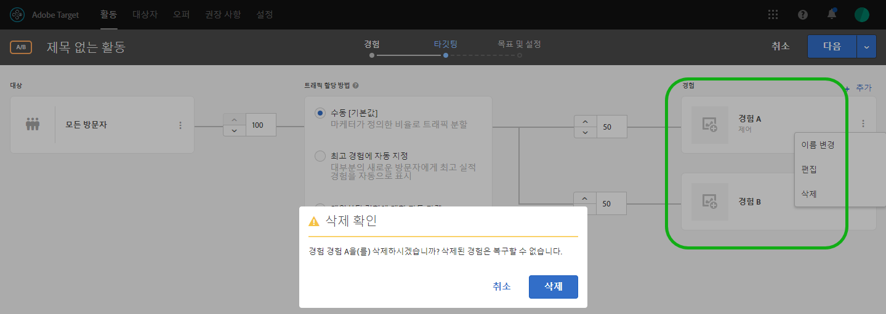 </p> <p>다음 참조: </p> <p> 
     <ul id="ul_CB0C1146716F4C09BF924CF3DFA7DC1A"> 
      <li id="li_3767DD36F597481FB312CC577CD668F0"> <p>A/B 활동: <a href="/help/c-activities/t-test-ab/t-test-create-ab/ab-add-experience.md#task_454646F2895242D3B92DC395A0CE1A00" format="dita" scope="local"> 경험 추가 </a> </p> </li> 
      <li id="li_E2990CA178C6446BA7206643A3164FEF"> <p>XT 활동: <a href="/help/c-activities/t-experience-target/t-xt-create/xt-add-experience.md#task_454646F2895242D3B92DC395A0CE1A00" format="dita" scope="local"> 경험 만들기 </a> </p> </li> 
     </ul> </p> <p>(TGT-30229) </p> </td> 
  </tr> 
  <tr> 
   <td colname="col1"> <p>대상자 </p> </td> 
   <td colname="col2"> <p>한 개의 프로필 속성을 정적 숫자가 아닌 다른 프로필 속성과 비교합니다. </p> <p>자세한 내용은 <a href="/help/c-target/c-audiences/creating-a-profile-attribute-comparison-audience.md#concept_4C2124B79A5B4556A6C1D10C0F5E40A0" format="dita" scope="local"> 프로필 속성 비교 대상 만들기 </a>. </p> <p> (TGT-28406) </p> </td> 
  </tr> 
  <tr> 
   <td colname="col1"> <p>사용자 지정 코드 </p> </td> 
   <td colname="col2"> <p>"사용자 지정 코드"는 이제 고유한 탭이 아닌 "수정 사항 추가" 패널에서 사용할 수 있습니다. 사용자 지정 코드를 두 개 이상 추가하고 선택적으로 각 사용자 지정 코드를 이름으로 지정할 수도 있습니다. (TGT-28504) </p> <p><a href="/help/c-experiences/c-visual-experience-composer/c-vec-code-editor/vec-code-editor.md#concept_B3A6E9EE3A60406DB640E205EA1745B5" format="dita" scope="local"> 수정 사항 </a>을 참조하십시오. </p> </td> 
  </tr> 
  <tr> 
   <td colname="col1" class="premium"> <p>권장 사항 </p> </td> 
   <td colname="col2"> <p> 
     <ul id="ul_371C18DFC6D24E94B3D4FFFD83FC8D3A"> 
      <li id="li_9D11939014E7479AB7FD8910852A5386"> <p>해당 기준 카드에서 선택한 기준을 참조하는 활동 목록을 표시합니다. 카드에 활성 및 비활성 활동이 나열됩니다. (TGT-27672) </p> </li> 
      <li id="li_B97BF9305EB04F6D8B1F6178B2E0CB34"> <p>활동 다이어그램에서는 이제 결과를 표시할 준비가 되면 기준 카드가 표시됩니다. (TGT-27673) </p> <p><a href="/help/c-recommendations/c-algorithms/algorithms.md" format="dita" scope="local"> 기준 </a>을 참조하십시오. </p> </li> 
     </ul> </p> </td> 
  </tr> 
  <tr> 
   <td colname="col1"> <p>경험 템플릿 </p> </td> 
   <td colname="col2"> <p>Adobe Target 경험 템플릿은 일부 공통 마케터 사용 사례를 실행하기 위해 Target에서 사용할 구성 가능한 입력을 사용하는 사전 코딩된 오퍼 샘플입니다. 이러한 경험 템플릿은 시각적 경험 작성기 또는 양식 기반 경험 작성기를 통해 Adobe Target에서 몇 가지 공통적인 외부 사용 사례를 실행할 시작점으로 개발자 및 마케터에게 무료로 제공됩니다. 웹 페이지 또는 플랫폼 아키텍처와 제대로 통합하는 데 사용자 지정이 필요할 수 있습니다. </p> <p>자세한 내용은 <a href="/help/c-experiences/c-visual-experience-composer/c-vec-code-editor/experience-templates.md#concept_109BBD7EABC04DD39E6B7B1687786652" format="dita" scope="local"> 경험 템플릿 </a>. </p> </td> 
  </tr> 
  <tr> 
   <td colname="col1"> <p>Target 기본 사항 웨비나 시리즈 </p> </td> 
   <td colname="col2"> <p>커뮤니티에 의해 제공되는 고객 성공 웨비나 시리즈인 새로운 <a href="/help/cmp-resources-and-contact-information.md#concept_11902FAC95C64479AABE020557A7EEE4" format="dita" scope="local"> Target 기본 사항 웨비나 시리즈 </a>에 참여하십시오. </p> </td> 
  </tr> 
 </tbody> 
</table>

**개선 사항, 수정 및 변경 사항**

이 [!DNL Target] 릴리스에는 다음과 같은 개선 사항, 수정 사항 및 변경 사항이 포함되어 있습니다.

* 향상된 가용성을 위해 서식 있는 텍스트 편집기 모달의 크기를 늘렸습니다. (TGT-24775)
* AP (Automated Personalization) 및 MVT (다변량 테스트) 활동에 대한 Target 단계(3단계 안내 워크플로의 2단계)의 다이어그램이 A/B, 경험 타기팅 (XT) 및 권장 사항 활동에 사용된 디자인과 일치하도록 다시 설계되었습니다. (TGT-30712)
* MVT (다변량 테스트) 위치 기여도 보고서의 지표 값은 이제 소수점 두 자리로 반올림되는 다른 지표의 값과 거의 일치합니다. (TGT-30921)

### at.js 버전 1.5.0(2018년 6월 22일) {#section_53C622F4978F4BC9ACD932D4B7194C12}

<table id="table_B332A93D4A6E4568BA3F7FA8EC0787F4"> 
 <thead> 
  <tr> 
   <th colname="col1" class="entry"> 기능/향상 </th> 
   <th colname="col2" class="entry"> 설명 </th> 
  </tr> 
 </thead>
 <tbody> 
  <tr> 
   <td colname="col1"> <p>at.js </p> </td> 
   <td colname="col2"> <p>이제 at.js 버전 1.5.0을 사용할 수 있습니다. </p> <p> <p>참고: 괄호로 묶인 문제 번호는 내부 Adobe용입니다. </p> </p> <p> 
     <ul id="ul_41FE0EED2D8B4ADE84FC4CA0FA0CE8A0"> 
      <li id="li_2DC17381CB7949AFA35B054B9CA723FA"> <p><span class="codeph"> at-request-succeeded </span> 이벤트 세부 사항에 리디렉션 플래그가 들어 있습니다. 이 플래그는 페이지가 다른 URL로 리디렉션되는지 여부를 확인하는 데 사용할 수 있습니다. URL을 알아보려면 <span class="codeph"> at-content-rendering-redirect </span>에 가입합니다. (TNT-29834) </p> </li> 
      <li id="li_2852878862724BB2BD475C8FC7BF20DA"> <p>false로 설정한 경우 런타임 예외로 인해 <span class="codeph"> window.targetGlobalSettings.enabled </span> 에 오류가 발생하는 문제가 해결되었습니다. (TNT-29829) </p> </li> 
      <li id="li_96E5E409B36444F1B0E3E2606DC03996"> <p>글로벌 mbox 요청 실행에 사용자 지정 코드를 사용하고 본문 숨기기를 사용하는 경우 VEC(시각적 경험 작성기)에서 로드하는 동안 페이지에 오류가 발생하는 문제가 해결되었습니다. (TNT-29795) </p> </li> 
      <li id="li_818AA4EDDAC04D8B9BB4BA708D6BEF99"> <p><span class="codeph"> screenOrientation </span>, <span class="codeph"> devicePixelRatio </span>, <span class="codeph"> webGLRenderer </span>에 대한 지원이 추가되었습니다. 이러한 새로운 Target 요청 매개 변수는 iPhone X 및 기타 최신 디바이스 검색에 사용됩니다. 자세한 내용은 <a href="/help/c-target/c-audiences/c-target-rules/mobile.md#concept_2A794199DC1A4D349FFFBC7DCF1FEB89" format="dita" scope="local"> 모바일 </a>을 참조하십시오. (TNT-29781) </p> </li> 
      <li id="li_87E3FB8B423C472AB1EE0DF2D7C64885"> <p>AAM (Adobe Audience Manager) 위치 힌트가 가끔씩 전송되지 않은 문제가 해결되었습니다. (TNT-29695) </p> </li> 
      <li id="li_E9E5A5035AC24F54ADEF5447E3F15D3B"> <p>이를 지원하는 브라우에서 at.js 1.5.0이 선택기 폴링을 위해 MutationObserver로 전환됩니다. at.js 1.0.0 이전의 버전은 MutationObserver polyfill을 사용했으며, 이는 문제가 있는 것으로 입증되었습니다. polyfill 문제를 방지하기 위해 버전 1.5.0에서 다음 의사 코드를 사용하여 사용할 예약 메커니즘을 결정합니다. </p> <p> 
        <code>
          if MutationObserver is supported scheduler = MutationObserver else if document is visible scheduler = requestAnimationFrame else scheduler = setTimeout 
        </code> </p> </li> 
     </ul> </p> </td> 
  </tr> 
 </tbody> 
</table>

### Target Standard/Premium 18.6.1(2018년 6월 20일) {#section_B63C660815B245DA9922BE33E03734A1}

이번 릴리스에는 다음과 같은 기능 및 개선 사항이 포함되었습니다.

>[!NOTE]
>
>괄호로 묶인 문제 번호는 내부 Adobe용입니다.

<table id="table_5A60FFE5E86148F4BDC6A7031D03D6BA"> 
 <thead> 
  <tr> 
   <th colname="col1" class="entry"> 기능/향상 </th> 
   <th colname="col2" class="entry"> 설명 </th> 
  </tr> 
 </thead>
 <tbody> 
  <tr> 
   <td colname="col1"> <p>시각적 경험 작성기(VEC) </p> </td> 
   <td colname="col2"> <p>수정 사항 패널에서 작업을 클릭하면 VEC가 웹 페이지를 자동으로 스크롤하고 해당 요소가 강조 표시됩니다. 더 이상 수정 사항의 영향을 받는 HTML 요소를 찾기 위해 직접 아래로 스크롤할 필요가 없습니다. </p> <p> 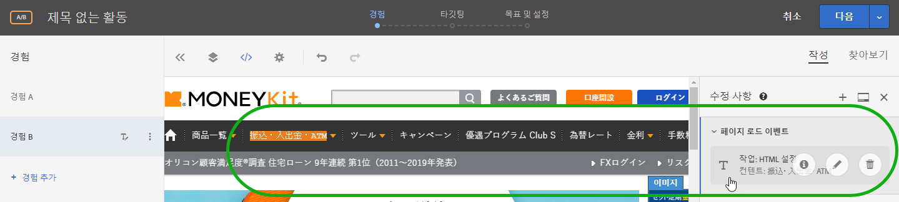 </p> <p>(TGT-30441) </p> </td> 
  </tr> 
  <tr> 
   <td colname="col1"> <p>지원되는 브라우저 </p> </td> 
   <td colname="col2"> <p>Target UI 및 콘텐츠 배송에 대한 Microsoft Edge 지원이 추가되었습니다. </p> <p>자세한 내용은 <a href="/help/c-implementing-target/c-considerations-before-you-implement-target/supported-browsers.md#reference_01B4BF99E7D545A7998773202A2F6100" format="dita" scope="local"> 지원되는 브라우저 </a>를 참조하십시오. (TGT-14102) </p> </td> 
  </tr> 
  <tr> 
   <td colname="col1" class="premium"> <p>권장 사항 </p> </td> 
   <td colname="col2"> <p>이제 최근에 본 항목 기준이 주어진 <a href="/help/administrating-target/hosts.md#concept_516BB01EBFBD4449AB03940D31AEB66E" format="dita" scope="local"> 환경 </a>에 따른 결과를 반환합니다. 방문자가 서로 다른 환경에 속한 두 사이트 간에 전환하는 경우 각 사이트에는 해당 사이트에서 최근에 본 항목만 표시됩니다. 방문자가 동일한 환경에 속한 두 사이트 간에 전환하는 경우 방문자에게 두 사이트에서 최근에 본 동일한 항목이 표시됩니다. </p></td> 
  </tr> 
 </tbody> 
</table>

**개선 사항, 수정 및 변경 사항**

이 [!DNL Target] 릴리스에는 다음과 같은 개선 사항, 수정 사항 및 변경 사항이 포함되어 있습니다.

* 이제 권장 사항 CSV 다운로드의 백업 행에는 *(단일 별표) 대신 선행 &quot;*&quot;(별표를 묶는 큰따옴표 묶음)가 있습니다.
* 권장 사항 CSV 다운로드에서 가장 많이 판매된 범주/가장 많이 본 범주 행에 더 이상 맨 앞에 쉼표가 없습니다.

### Target 플랫폼 변경 사항(2018년 6월 19일) {#section_0638BD69F3C640479A2A258AD78C0884}

이번 릴리스에는 다음과 같은 개선 사항이 포함됩니다.

>[!NOTE]
>
>괄호로 묶인 문제 번호는 내부 Adobe용입니다.

* 최신 휴대전화 모델을 포함하도록 디바이스 목록이 업데이트되었습니다. 디바이스 마케팅 이름 또는 디바이스 모델을 사용하여 특정 iPhone 모델에 타기팅된 콘텐츠를 전달하는 기능이 추가되었습니다.

   Mobile SDK를 사용하는 고객은 이 기능을 활용하기 위해 다른 작업을 수행하지 않아도 됩니다. at.js를 사용하는 고객은 at.js 버전 1.5.0으로 업그레이드해야 합니다.

   자세한 내용은 [모바일](/help/c-target/c-audiences/c-target-rules/mobile.md#concept_2A794199DC1A4D349FFFBC7DCF1FEB89)을 참조하십시오. (TNT-26714 및 TNT-28288)

### Target 다운로드 API(2018년 6월 5일) {#section_B8729DA10F18433C8D8E01B04F308ED2}

Recommendations Download API를 사용하여 스프레드시트나 텍스트 편집기에서 볼 수 있는 .CSV 파일로 권장 사항을 다운로드할 수 있습니다. 보안을 강화하기 위해 **2018년 6월 5일**&#x200B;부터 Target에서는 HTTP 요청을 차단하고 HTTPS 요청만 허용합니다.

### Target Standard/Premium 18.5.1(2018년 5월 22일) {#section_7C1427793C2A48DBAC39F8290717DC5B}

이번 릴리스에는 다음과 같은 기능 및 개선 사항이 포함되었습니다.

>[!NOTE]
>
>괄호로 묶인 문제 번호는 내부 Adobe용입니다.

<table id="table_1C51F61184684072BC69AD15BA68BEBB"> 
 <thead> 
  <tr> 
   <th colname="col1" class="entry"> 기능 </th> 
   <th colname="col2" class="entry"> 설명 </th> 
  </tr> 
 </thead>
 <tbody> 
  <tr> 
   <td colname="col1"> <p>보고서 </p> </td> 
   <td colname="col2"> <p> 
     <ul id="ul_8D08FE4AC7D748EFB2BBFF87DBDC5CE5"> 
      <li id="li_B8929C19276D42168A28A3775CDEDFB3"> <p>이제 개별 활동의 보고서를 원하는 대로 구성한 후(지표, 대상, 고급 설정 등) 그러한 보고서의 여러 사전 설정을 최대 10개까지 저장할 수 있습니다. 모든 Target 사용자는 사전 설정을 생성한 사람과 관계없이 다양한 사전 설정을 표시, 편집 및 삭제할 수 있습니다. (TGT-21268) </p> </li> 
      <li id="li_7ADA62F2ACA049C9B4A8986B09A9F4AA"> <p>개별 활동의 보고서를 원하는 대로 구성한 다음 해당 구성을 기본/즐겨 찾는 사전 설정으로 저장할 수 있습니다. 해당 활동 보고서를 볼 때마다 표시되는 보기입니다. (TGT-10082) </p> </li> 
      <li id="li_DC63C04F3A884BDDA55B5515E4643B7B"> <p>보고서 내의 경고 및 메시지를 통해 이전에 구성된 사전 설정 보고서에서 하나 이상의 대상, 지표, 호스트 그룹 또는 경험이 삭제되었는지 여부를 알 수 있습니다. 경고 또는 메시지에 사전 설정을 다시 작성하기 위한 다른 대상, 지표, 호스트 그룹 또는 경험을 선택하라고 표시됩니다. (TGT-29424) </p> </li> 
     </ul> </p> <p>자세한 내용은 <a href="/help/c-reports/c-report-settings/report-settings.md#concept_3A80D5A394EC4B639DC715E06085BDB0" format="dita" scope="local"> 보고서 설정 </a>의 Target Preset(Target 사전 설정) 섹션을 참조하십시오. </p> </td> 
  </tr> 
  <tr> 
   <td colname="col1"> <p>프로필 스크립트 </p> </td> 
   <td colname="col2"> <p> 
     <ul id="ul_F382C8E7708846A08676E1534BC92878"> 
      <li id="li_70E89504525C4119B588C230DCE772E8"> <p>오퍼 정보 카드와 유사한 프로필 스크립트 정보 팝업 카드를 볼 수 있습니다. 이러한 프로필 스크립트 정보 카드를 사용하면 선택한 프로필 스크립트를 참조하는 활동 목록과 함께 다른 유용한 메타데이터를 볼 수 있습니다. (TGT-28253) </p> <p>자세한 내용은 <a href="/help/c-target/c-visitor-profile/profile-parameters.md#concept_8C07AEAB0A144FECA8B4FEB091AED4D2" format="dita" scope="local"> 프로필 스크립트 속성 </a>. </p> </li> 
     </ul> </p> </td> 
  </tr> 
  <tr> 
   <td colname="col1"> <p>대상자 </p> </td> 
   <td colname="col2"> <p> 
     <ul id="ul_DFEB778393024E3EBBC482F31A5B39BC"> 
      <li id="li_4049E334A38F4F94842FF1E35F177FE9"> <p>이제 사용자 지정 대상 만들기를 사용하면 mbox 이름을 반드시 지정하지 않고도 mbox 매개 변수를 직접 사용할 수 있습니다. 이제 mbox 이름은 선택 사항입니다. 따라서 여러 mbox의 매개 변수를 사용하거나 가장자리에 아직 기록되지 않은 매개 변수를 참조할 수 있습니다. 또는 mbox 이름 필터를 사용하여 mbox 매개 변수를 필터링할 수도 있습니다. </p> <p>또한 이와 동일한 개선 사항이 권장 사항 기준, 권장 사항 프로모션 및 템플릿 테스트 규칙으로 확장되었습니다. </p> </li> 
     </ul> </p> <p>자세한 내용은 <a href="/help/c-target/c-audiences/c-target-rules/custom-parameters.md#concept_C4C6E00D7C5A4BE9B72D471DB2E3027B" format="dita" scope="local"> 사용자 지정 매개 변수 </a>. </p> </td> 
  </tr> 
  <tr> 
   <td colname="col1" class="premium"> <p>권장 사항 </p> </td> 
   <td colname="col2"> <p> 
     <ul id="ul_7765B69E679D4C94B1E863E340DFDE15"> 
      <li id="li_F2AF7E1AFBD6461990EF1D83D1989582"> <p>양식 기반 경험 작성기에서 권장 사항 기준을 선택하는 동안 선택한 기준 카드에 직접 연결되는 링크가 있으므로 기준을 빠르고 쉽게 편집할 수 있습니다. (TGT-28483) </p> <p>자세한 내용은 <a href="/help/c-experiences/form-experience-composer.md#task_FAC842A6535045B68B4C1AD3E657E56E" format="dita" scope="local"> 양식 기반 경험 작성기 </a>를 참조하십시오. </p> </li> 
      <li id="li_517F0A174587416B8621D6F710C1AC48"> <p>권장 사항 기준, 권장 사항 프로모션 및 템플릿 테스트 규칙 생성을 사용하여 이제 mbox 이름을 반드시 지정하지 않고도 mbox 매개 변수를 직접 사용할 수 있습니다. 이제 mbox 이름은 선택 사항입니다. 따라서 여러 mbox의 매개 변수를 사용하거나 가장자리에 아직 기록되지 않은 매개 변수를 참조할 수 있습니다. 또는 mbox 이름 필터를 사용하여 mbox 매개 변수를 필터링할 수도 있습니다. </p> <p>또한 이와 동일한 개선 사항이 사용자 지정 대상 만들기로 확장되었습니다. </p> <p>자세한 내용은 <a href="/help/c-recommendations/c-recommendations-faq/recommendations-faq.md#concept_EF272DE4AC6C47B19026BFBE816F5DB8" format="dita" scope="local"> 권장 사항 FAQ </a>. </p> </li> 
      <li id="li_AAB242830D1E47B78E58A980B717C736"> <p>권장 사항 디자인 카드에 대한 UI가 업데이트되었습니다. </p> </li> 
      <li id="li_1BE3178663E54F4CA8714FE3ACDBB97B"> <p>Target Recommendations API 문서는 <a href="https://www.adobe.io/apis/experiencecloud/target/docs/getting-started.html" format="html" scope="external"> Adobe I/0 Adobe Target 웹 사이트 </a> (https://www.adobe.io/apis/experiencecloud/target/docs/getting-started.html)에 제공됩니다. </p> </li> 
     </ul> </p> </td> 
  </tr> 
 </tbody> 
</table>

**개선 사항, 수정 및 변경 사항**

이 [!DNL Target] 릴리스에는 다음과 같은 개선 사항, 수정 사항 및 변경 사항이 포함되어 있습니다.

* A/B 테스트, 경험 타기팅 (XT) 또는 권장 사항 활동을 만들거나 편집하는 데 사용되는 Target 3단계 안내 워크플로의 2단계에 대한 UI가 업데이트되었습니다. (TGT-18911)

### Target Standard/Premium 18.4.1(2018년 4월 25일) {#section_445DBC5402BA456BAF2D24AEA33A91C9}

이번 릴리스에는 다음과 같은 기능 및 개선 사항이 포함되었습니다.

>[!NOTE]
>
>괄호로 묶인 문제 번호는 내부 Adobe용입니다.

<table id="table_6D99C48B72D24728BF623608053931D3"> 
 <thead> 
  <tr> 
   <th colname="col1" class="entry"> 기능 </th> 
   <th colname="col2" class="entry"> 설명 </th> 
  </tr> 
 </thead>
 <tbody> 
  <tr> 
   <td colname="col1"> <p>AEM(Adobe Experience Manager) 경험 구성 요소 </p> </td> 
   <td colname="col2"> <p>Target 활동에 AEM에서 만든 경험 조각을 사용하면 AEM의 편의성과 기능을 Target의 강력한 AI(Automated Intelligence) 및 머신 러닝(ML) 기능을 결합하여 경험을 다양한 규모로 테스트 및 개인화할 수 있습니다.&amp;nbsp;&amp;nbsp; </p> <p>AEM에서는 모든 콘텐츠 및 에셋을 중앙 위치에 가져와서 개인화 전략을 실행합니다. AEM을 사용하면 코드를 작성하지 않고도 한 위치에서 데스크탑, 태블릿 및 휴대 디바이스의 콘텐츠를 쉽게 만들 수 있습니다. 모든 디바이스를 위해 페이지를 만들 필요가 없이, 콘텐츠를 사용하여 각 경험이 자동으로 조정됩니다. </p> <p> Target을 사용하면 행동 변수, 컨텍스트 변수 및 오프라인 변수를 통합하는 규칙 기반 및 AI 중심 머신 러닝 접근 방식들의 결합을 기반으로 다양한 규모의 개인화된 경험을 제공할 수 있습니다.Target을 사용하면 A/B와 다변량 활동을 쉽게 설정 및 실행하여 최상의 오퍼, 콘텐츠 및 경험을 결정할 수 있습니다. </p> <p>경험 조각은 콘텐츠/경험 작성자 및 관리자를 Target을 사용하여 비즈니스 결과를 이끄는 최적화 및 개인화 전문가에게 연결하기 위한 매우 큰 단계를 나타냅니다. </p> <p>자세한 내용은 <a href="/help/c-experiences/c-manage-content/aem-experience-fragments.md#topic_1E1E4EA01F074349B2CF8785387B5FE8" format="dita" scope="local"> AEM 경험 구성 요소 </a>를 참조하십시오. </p> </td> 
  </tr> 
  <tr> 
   <td colname="col1"> <p>보고서 </p> </td> 
   <td colname="col2"> 
    <ul id="ul_EAB90C510EA04D6A8AEFF23A77DB2337"> 
     <li id="li_47DA6EB92CC84FFDBFDC9CC9386AF654"> <p>이제 전체 페이지, 구성 또는 날짜 범위를 새로 고치지 않고도 보고서를 새로 고쳐 보고서의 테이블 및 그래프 보기를 업데이트할 수 있습니다. (TGT-28125) </p> <p>자세한 내용은 <a href="/help/c-reports/c-report-settings/report-settings.md#concept_3A80D5A394EC4B639DC715E06085BDB0" format="dita" scope="local"> 보고서 설정 </a>을 참조하십시오. </p> </li> 
     <li id="li_AB2DE7A45D914FD7AEB0832187AF3844"> <p>이제 보고서의 달력에는 최근 7일, 지난 15일 등과 같은 사전 정의된 날짜 범위가 포함되어 있습니다. (TGT-29171) </p> <p>자세한 내용은 <a href="/help/c-reports/c-report-settings/report-settings.md#concept_3A80D5A394EC4B639DC715E06085BDB0" format="dita" scope="local"> 보고서 설정 </a>을 참조하십시오. </p> </li> 
     <li id="li_46DF9037E0ED4935B3BCDB35E8BED065"> <p>여러 지표를 적용할 때 표 보기 열 너비가 수평 스크롤을 줄일 수 있게 수정되었습니다. (TGT-26575) </p> </li> 
    </ul> </td> 
  </tr> 
  <tr> 
   <td colname="col1"> <p>UI 로컬라이제이션 </p> </td> 
   <td colname="col2"> <p>Target UI는 다음 언어로 사용할 수 있습니다. </p> <p> 
     <ul id="ul_DB6C771FCFDF43F498F8754920A70BCD"> 
      <li id="li_A65D07DF66844AC8BEEC1D413F214191"> <p>중국어 </p> </li> 
      <li id="li_5986DD06AF5B4F76B3A02CFBF2DC3644"> <p>대만어 </p> </li> 
      <li id="li_341FDC1CEC2B4C4BBD45CB2A0A54F2A3"> <p>한국어 </p> </li> 
      <li id="li_A4C31539B98E42348D5F1A18C63EAB6C"> <p>이탈리아어 </p> </li> 
      <li id="li_97E3E0A916B64601BBF601AAED581174"> <p>포르투갈어 </p> </li> 
     </ul> </p></td> 
  </tr> 
  <tr> 
   <td colname="col1"> <p>대상자 </p> </td> 
   <td colname="col2"> <p>mbox 매개 변수를 기반으로 하여 사용자 지정 대상을 작성할 때 <span class="codeph"> mboxName </span> 에 대해 묻는 메시지가 <span class="codeph"> mboxParameter </span>에 더 이상 표시되지 않습니다. 이제 mbox 이름은 선택 사항입니다. 따라서 여러 mbox의 매개 변수를 사용하거나 가장자리에 아직 기록되지 않은 매개 변수를 참조할 수 있습니다. (TGT-25807) </p> <p> <p>참고: 이 기능은 Target UI에 표시되지만, 현재는 비활성화되어 있습니다. 이 기능은 곧 사용할 수 있습니다(날짜가 제공됨). </p> </p> 
  </td> 
  </tr> 
 </tbody> 
</table>

**개선 사항, 수정 및 변경 사항**

이 [!DNL Target] 릴리스에는 다음과 같은 개선 사항, 수정 사항 및 변경 사항이 포함되어 있습니다.

* TLS(전송 계층 보안)는 네트워크를 통해 데이터를 안전하게 교환해야 하는 웹 브라우저 및 애플리케이션에서 현재 사용되는 가장 널리 배포된 보안 프로토콜입니다. Adobe는 이전 프로토콜의 서비스를 종료해야 하는 보안 준수 표준을 사용하며 최신 버전 및 보안 버전을 사용하기 위해 TLS 1.2의 사용을 권장합니다. Target 18.4.1 릴리스(2018년 4월 25일)부터 Adobe Target은 TLS 1.2 암호화의 진행을 위한 조치를 취하고, 2018년 9월 12일까지 TLS 1.0 암호화에 대한 지원을 단계적으로 완전히 중단합니다. 세부 사항을 살펴보고 원활한 전환을 위한 변경을 계획하는 것이 중요합니다. 자세한 내용은 [TLS(Transport Layer Security) 암호화 변경](/help/c-implementing-target/c-considerations-before-you-implement-target/tls-transport-layer-security-encryption.md#concept_CC1001E9D3AE4BABAF90B8311B0A6451)을 참조하십시오.
* 가용성 향상을 위해 권장 사항 기준 카드에 대한 UI가 개선되었습니다. (TGT-27829)

### at.js(2018년 4월 3일) {#section_932DF1004F4648668FE4984BFAF2EC49}

이번 릴리스에는 다음과 같은 기능 및 개선 사항이 포함되었습니다.

<table id="table_76576D9D931B4DA99900F2C03175938E"> 
 <thead> 
  <tr> 
   <th colname="col1" class="entry"> 기능 </th> 
   <th colname="col2" class="entry"> 설명 </th> 
  </tr> 
 </thead>
 <tbody> 
  <tr> 
   <td colname="col1"> <p>at.js </p> </td> 
   <td colname="col2"> <p>현재 at.js 버전 1.3.0을 사용할 수 있습니다. 자세한 내용은 <a href="/help/c-implementing-target/c-implementing-target-for-client-side-web/how-to-deployatjs/implementing-target-without-a-tag-manager.md#concept_1E1F958F9CCC4E35AD97581EFAF659E2" format="dita" scope="local"> at.js 다운로드 </a> 및 <a href="/help/c-implementing-target/c-implementing-target-for-client-side-web/target-atjs-versions.md#reference_DBB5EDB79EC44E558F9E08D4774A0F7A" format="dita" scope="local"> at.js 버전 세부 사항 </a>을 참조하십시오. </p> <p> 
     <ul id="ul_349BEB37B6C94FF0801F121042037803"> 
      <li id="li_4C2F82F4DD394ED5A0BFF978B15FEDDF"> <p>at.js와의 상호 작용을 추적, 디버깅 및 사용자 지정하는 데 도움이 되도록 다음과 같은 새 이벤트를 사용할 수 있습니다. </p> <p> 
        <ul id="ul_EFF7E2FCEA0D42298779DDE13B54503F"> 
         <li id="li_6A2B06A522004EDE96D9A552571A7C30"> <p>LIBRARY_LOADED </p> </li> 
         <li id="li_61AA203A21DF4B7EAE075374A09C8FF0"> <p>REQUEST_START </p> </li> 
         <li id="li_DAF9CC1E86834C62B93419429B43A2CB"> <p>CONTENT_RENDERING_START </p> </li> 
         <li id="li_A52DC337115248A1BE5AF5B358BE5A9A"> <p>CONTENT_RENDERING_NO_OFFERS </p> </li> 
         <li id="li_7D71E48016B1446995493EBBF7D32447"> <p>CONTENT_RENDERING_REDIRECT </p> </li> 
        </ul> </p> <p>자세한 내용은 <a href="/help/c-implementing-target/c-implementing-target-for-client-side-web/cmp-atjs-functions.md#reference_A828E4BA535F4E7692A075F3D70CF6CD" format="dita" scope="local"> at.js 사용자 지정 이벤트 </a>. </p> </li> 
      <li id="li_E2704294F8BA47FFAABE7572F67FB5C0"> <p>데이터 공급자에서 가져온 추가 매개 변수로 at.js 요청을 확장할 수 있습니다. 데이터 공급자는 <span class="codeph"> dataProviders 키 </span> 아래의 <span class="codeph"> window.targetGlobalSettings </span>에 추가되어야 합니다. </p> <p>자세한 내용은 <a href="/help/c-implementing-target/c-implementing-target-for-client-side-web/cmp-atjs-functions.md#concept_8DACBC47ABDE4279BB102B42609FE506" format="dita" scope="local"> targetGlobalSettings() </a>의 "데이터 제공업체"를 참조하십시오. </p> </li> 
      <li id="li_02EAFE6DA0D44CF88980184FD14226A5"> <p>이제 at.js 요청은 GET을 사용하지만 URL 크기가 2048자를 초과하면 POST로 전환됩니다. 필요한 경우 크기 제한을 늘릴 수 있는 <span class="codeph"> urlSizeLimit </span> 라는 새 특성이 있습니다. 이를 통해 Target에서 동일한 기술을 사용하여 AppMeasurement에 맞게 at.js를 조정할 수 있습니다. </p> </li> 
      <li id="li_43363A4F3A764394AA88D2595F93D8C0"> <p>이제 Target에서는 강제로 <span class="codeph"> adobe.target.applyOffer(옵션) </span> 함수의 <span class="codeph"> mbox </span> 키가 사용되도록 합니다. 이 키는 과거에는 필요했지만 현재 Target에서는 이 키를 적용하여 적절한 유효성 검사가 수행되는지와 고객이 함수를 올바르게 사용하고 있는지를 확인합니다. </p> <p>자세한 내용은 <a href="/help/c-implementing-target/c-implementing-target-for-client-side-web/cmp-atjs-functions.md#reference_BBE83F513B5B4E03BBC3F50D90864245" format="dita" scope="local"> adobe.target.applyOffer(옵션) </a>를 참조하십시오. </p> </li> 
      <li id="li_7336D8D48A894291A378E0BB212B7F9B"> <p>at.js의 이벤트 및 클릭 추적 기능이 개선되었습니다. at.js는 <span class="codeph"> navigator.sendBeacon() </span>을 사용하여 이벤트 추적 데이터를 전송하고, <span class="codeph"> navigator.sendBeacon() </span> 이 지원되지 않을 때 동기 XHR로 대체됩니다. 이 대체 항목은 주로 Internet Explorer 10 및 11과 일부 Safari 버전에 영향을 줍니다. Safari는 iOS 11.3 릴리스에서 <span class="codeph"> navigator.sendBeacon() </span>을 추가로 지원합니다. </p> </li> 
      <li id="li_28D7324137B14C75BF6F1EA0B2487C9B"> <p>이제 페이지가 백그라운드 탭에서 열릴 때도 at.js가 오퍼를 렌더링할 수 있습니다. 백그라운드 탭의 브라우저 조절 동작으로 인해 <span class="codeph"> requestAnimationFrame() </span> 이 비활성화될 때 일부 Target 고객에서 문제가 발생합니다. </p> </li> 
      <li id="li_3278979E1C6C41DEA7E8025AEB337985"> <p>이번 릴리스에서는 Chrome CPU 프로필 검사 시 호출 스택 단축을 비롯하여 여러 가지 성능이 개선되었습니다. </p> </li> 
      <li id="li_AAA9C0DCC3354DFA8907968C8E6427F6"> <p>at.js 1.3.0은 더 이상 Microsoft Internet Explorer 9에서 콘텐츠 전달을 지원하지 않습니다. 지원되는 브라우저 목록에 대해서는 <a href="/help/c-implementing-target/c-considerations-before-you-implement-target/supported-browsers.md#reference_01B4BF99E7D545A7998773202A2F6100" format="dita" scope="local"> 지원되는 브라우저 </a>를 참조하십시오. 앞으로, 모든 요청은 JSONP 요청 없이 CORS가 지원되는 <span class="codeph"> XMLHttpRequest </span>를 통해 실행됩니다. 이 변경 사항은 보안을 크게 향상시킵니다. </p> </li> 
     </ul> </p> </td> 
  </tr> 
 </tbody> 
</table>

### Target Standard/Premium 18.3.1(2018년 3월 20일) {#section_880706BE15544A03A2C951F267F4AEC5}

이번 릴리스에는 다음과 같은 기능 및 개선 사항이 포함되었습니다.

>[!NOTE]
>
>괄호로 묶인 문제 번호는 내부 Adobe용입니다.

<table id="table_AE38682151A948AEA21E35A353F18D76"> 
 <thead> 
  <tr> 
   <th colname="col1" class="entry"> 기능 </th> 
   <th colname="col2" class="entry"> 설명 </th> 
  </tr> 
 </thead>
 <tbody> 
  <tr> 
   <td colname="col1" class="premium"> <p>엔티티 속성별 인기도 </p> </td> 
   <td colname="col2"> <p><b>새로운 기능: 2018년 3월 22일(</b>) </p> <p>이제 사용자 지정 속성을 키로 선택한 경우 기존 흐름에서 엔티티 속성별 인기도를 선택할 수 있습니다. </p> <p>원하는 키(이 경우 사용자 지정 프로필 속성)를 선택한 후 "권장 사항 로직"에 대해 다음 두 가지 옵션을 선택할 수 있습니다. </p> <p> 
     <ul id="ul_7A6F2398ADE846EF8A7A3110C2736BF7"> 
      <li id="li_66BFF016564749B298B88F6B9638B64E"> <p>가장 많이 본 항목 </p> </li> 
      <li id="li_937FE5C40ED8471391B282D1ACE8C133"> <p>최상위 판매자 </p> </li> 
     </ul> </p></td> 
  </tr> 
  <tr> 
   <td colname="col1"> <p>대상자 </p> </td> 
   <td colname="col2"> <p>이제 대상의 정의 팝업 카드(예를 들어 대상 라이브러리에서)를 보면서, 해당 대상을 참조하는 다른 활동을 볼 수 있습니다(해당되는 경우). 이 방법을 사용하면 대상을 편집하는 동안 활동에 실수로 영향을 미치는 경우를 방지할 수 있습니다. </p> <p>이전에는 활동에서 참조한 대상을 삭제하려고 하면 대상을 참조하는 최대 10개의 활동이 있어서 대상을 삭제할 수 없다는 경고가 표시되었습니다. </p> <p>자세한 내용은 <a href="/help/c-target/c-audiences/audiences.md#concept_65BE870D290E412D8BBF557EEA67C271" format="dita" scope="local"> 대상자 정보 </a>. </p> </td> 
  </tr> 
  <tr> 
   <td colname="col1"> <p>보고서 </p> </td> 
   <td colname="col2"> <p>한계 계산 방법을 설명하는 도구 설명을 포함하여 보고서의 상승도 및 한계 정보를 보다 포괄적이고 유용하게 개선했습니다. (TGT-28729) </p> <p>자세한 내용은 <a href="/help/c-reports/c-report-settings/average-lift-bounds-and-confidence-interval.md#topic_AFFDC672A8A34D028B100EF6BE5D8129" format="dita" scope="local"> 평균 리프트, 리프트 경계 및 신뢰 구간 </a>을 참조하십시오. </p> </td> 
  </tr> 
  <tr> 
   <td colname="col1" class="premium"> <p>AP (Automated Personalization) 및 자동 타기팅 활동 </p> </td> 
   <td colname="col2"> <p>AP (Automated Personalization) 및 자동 타기팅 활동에서 트래픽 비율을 좀 더 효과적으로 할당하는 데 도움이 되는 추가 지침을 UI 및 도움말에서 사용할 수 있습니다. </p> <p>자세한 내용은 <a href="/help/c-activities/auto-target/auto-target-to-optimize.md" format="dita" scope="local"> 트래픽 할당 결정 </a> 및 <a href="/help/c-activities/t-automated-personalization/create-ap-activity.md#task_8AAF837796D74CF893CA2F88BA1491C9" format="dita" scope="local"> Automated Personalization 활동 작성 </a>을 참조하십시오. </p> </td> 
  </tr> 
  <tr> 
   <td colname="col1" class="premium"> <p>권장 사항: 사용자 지정 기준에 대한 포함 규칙, 컬렉션 및 제외 </p> </td> 
   <td colname="col2"> <p>이제 자체 사용자 지정 기준 출력에 대해 실시간 필터링을 수행할 수 있습니다. 예를 들어 권장 사항 항목을 방문자가 선호하는 범주 또는 브랜드의 항목으로만 제한할 수 있습니다. 이렇게 하면 오프라인 계산을 실시간 필터링과 결합할 수 있습니다. </p> <p>사용자 지정 기준에 포함 규칙을 추가하면 기존의 정적 권장 사항이 방문자의 관심 사항을 기반으로 하는 동적 권장 사항으로 변경됩니다. </p> <p> 
     <ul id="ul_BDD55AB34F4A43C691D2399C16AA3D6C"> 
      <li id="li_133C33E0D02E4861A4C855BD8A492E69"> <p>이제 권장 사항의 다른 기준과 마찬가지로 사용자 지정 기준도 구성 가능합니다. </p> </li> 
      <li id="li_AC201F0917BF465C985E8947635F762E"> <p>다른 기준과 동일한 방법으로 컬렉션, 제외 및 포함(가격 및 재고에 대한 특별한 규칙 포함)을 사용할 수 있습니다. 컬렉션 및 제외는 이미 지원되었습니다. 이번 릴리스에는 포함 기능이 추가되었습니다. </p> </li> 
     </ul> </p> <p>자세한 내용은 <a href="/help/c-recommendations/c-algorithms/algorithms.md" format="dita" scope="local">기준</a>을 참조하십시오. </p> <p>(TGT-28488) </p> </td> 
  </tr> 
  <tr> 
   <td colname="col1" class="premium"> <p>권장 사항: 최근 조회 기준에 대한 포함 규칙, 컬렉션 및 제외 </p> </td> 
   <td colname="col2"> <p>이제 특정 속성이 있는 항목만 표시되도록 최근에 본 항목을 필터링 할 수 있습니다. 예를 들어 여러 비즈니스를 운영하는 다국적 기업의 경우 여러 디지털 속성의 방문자 보기 항목이 있을 수 있습니다. 이 경우 항목을 본 각각의 속성에 대해서만 표시하도록 최근에 본 항목을 제한할 수 있습니다. 이렇게 하면 최근에 본 항목이 다른 디지털 속성의 사이트에 표시되지 않습니다. </p> <p> 
     <ul id="ul_A2D260F01CA047EEA72EF56BD0EE88FA"> 
      <li id="li_DB107DD357B741CCB2B7A4FDAD16F9D6"> <p>이제 권장 사항의 다른 기준과 마찬가지로 최근 조회 기준도 구성 가능합니다. </p> </li> 
      <li id="li_85452C03F0924D4C8D854509F1293021"> <p>다른 기준과 동일한 방법으로 컬렉션, 제외 및 포함(가격 및 재고에 대한 특별한 규칙 포함)을 사용할 수 있습니다. 컬렉션 및 제외는 이미 지원되었습니다. 이번 릴리스에는 포함 기능이 추가되었습니다. </p> </li> 
     </ul> </p> <p>자세한 내용은 <a href="/help/c-recommendations/c-algorithms/algorithms.md" format="dita" scope="local">기준</a>을 참조하십시오. </p> <p>(TGT-22843) </p> </td> 
  </tr> 
  <tr> 
   <td colname="col1"> <p>Adobe Lauch용 Target 확장 </p> </td> 
   <td colname="col2"> <p>Launch는 Adobe의 차세대 태그 관리 기능입니다. Launch는 관련 고객 환경을 향상하는 데 필요한 모든 분석, 마케팅 및 광고 태그를 배포하고 관리하는 간단한 방법을 고객에게 제공합니다. </p> <p>Target 확장을 사용하면 환경에서 Target을 빠르고 쉽게 구현할 수 있습니다. </p> <p>자세한 내용은 <a href="/help/c-implementing-target/c-implementing-target-for-client-side-web/how-to-deployatjs/cmp-implementing-target-using-adobe-launch.md#topic_5234DDAEB0834333BD6BA1B05892FC25" format="dita" scope="local"> Adobe Launch를 사용하여 Target 구현 </a>. </p> </td> 
  </tr> 
 </tbody> 
</table>

**개선 사항, 수정 및 변경 사항**

이 [!DNL Target] 릴리스에는 다음과 같은 개선 사항, 수정 사항 및 변경 사항이 포함되어 있습니다.

* A/B 및 경험 타기팅 (XT) 활동을 작성하거나 편집할 때 Target에서는 마지막으로 연 경험, 페이지 또는 경험 버전에 대한 정보가 유지(여러 대상 기능을 통해)되며 사용자가 다음번에 Target UI를 열면 해당 페이지가 열립니다. (TGT-28225)
* 규정 준수를 위한 보안 수정 사항이 작성되었습니다.

### Target Standard/Premium 18.2.1(2018년 2월 15일) {#section_837CBBB7A89D45D99855A8C5F5E7BFFB}

이번 릴리스에는 다음과 같은 기능 및 개선 사항이 포함되었습니다.

<table id="table_1C7A462AE8D4492FA5555F060031F665"> 
 <thead> 
  <tr> 
   <th colname="col1" class="entry"> 기능 </th> 
   <th colname="col2" class="entry"> 설명 </th> 
  </tr> 
 </thead>
 <tbody> 
  <tr> 
   <td colname="col1"> <p>Adobe Marketing Cloud의 브랜드가 변경되었으며 이제 Adobe Experience Cloud로 지칭됩니다. </p> </td> 
   <td colname="col2"> <p>Experience Cloud는 Adobe의 디지털 마케팅 솔루션 및 서비스 통합 제품입니다. 또한 클라우드 솔루션 및 핵심 서비스에 빠르게 액세스할 수 있는 직관적인 인터페이스입니다. </p> <p>브랜드 변경 및 UI 변경 사항: Adobe Marketing Cloud의 브랜드가 변경되었으며 이제 Adobe Experience Cloud로 지칭됩니다. 또한 Target 인터페이스 및 솔루션 전환기에 UI 변경 사항이 표시됩니다. </p></td> 
  </tr> 
 </tbody> 
</table>

**개선 사항, 수정 및 변경 사항**

이 [!DNL Target] 릴리스에는 몇 가지 백엔드 개선 사항, 수정 사항 및 변경 사항이 포함되어 있습니다.

### 대상 플랫폼(2018년 1월 18일) {#section_F6A0DC31636D403F92BDB9DCE7A3F6ED}

이번 릴리스에는 다음과 같은 기능 및 개선 사항이 포함되었습니다.

<table id="table_0F5BF9370E214302BDFE0AC2D66EC773"> 
 <thead> 
  <tr> 
   <th colname="col1" class="entry"> 기능 </th> 
   <th colname="col2" class="entry"> 설명 </th> 
  </tr> 
 </thead>
 <tbody> 
  <tr> 
   <td colname="col1"> <p>at.js </p> </td> 
   <td colname="col2"> <p>at.js 1.2.3은 JSON 오퍼에 대한 지원을 추가합니다. JSON은 양식 기반 경험 작성기를 사용하여 만든 활동에서만 지원됩니다. 현재 JSON을 사용하는 유일한 방법은 직접 API 호출을 통해서입니다. <a href="/help/c-experiences/c-manage-content/create-json-offer.md#concept_63C7BEE1F0DB4A7596D997219B7C136D" format="dita" scope="local"> JSON 오퍼 작성 </a>을 참조하십시오. </p> </td> 
  </tr> 
  <tr> 
   <td colname="col1"> <p>기타 변경 사항 </p> </td> 
   <td colname="col2"> <p>제외 규칙, 카탈로그, 알고리즘 포함 규칙 및 런타임 필터링은 이제 대/소문자를 구분하지 않습니다. </p> </td> 
  </tr> 
 </tbody> 
</table>

### Target Standard/Premium 18.1.1(2018년 1월 23일) {#section_3A2216543B064D6F82EC03E1F8AEC74D}

이번 릴리스에는 다음과 같은 기능 및 개선 사항이 포함되었습니다.

>[!NOTE]
>
>괄호로 묶인 문제 번호는 내부 Adobe용입니다.

<table id="table_872FE2BE61CC4A5CA369D9A6C730686E"> 
 <thead> 
  <tr> 
   <th colname="col1" class="entry"> 기능 </th> 
   <th colname="col2" class="entry"> 설명 </th> 
  </tr> 
 </thead>
 <tbody> 
  <tr> 
   <td colname="col1"> <p>대상자 </p> </td> 
   <td colname="col2"> <p> 
     <ul id="ul_42D7C86043C94A7BBA5ED405B2902E3A"> 
      <li id="li_50F2A7D05AB244E18D263A476BD906B3"> <p>이제 시작 및 종료 날짜 없이 시간대 대상을 만들 수 있습니다. 이렇게 하면 활동 수준에서 시작 및 종료 날짜를 제어하면서 여러 활동에서 동일한 대상(대상 복사본을 만들지 않고)을 사용할 수 있습니다. <a href="/help/c-target/c-audiences/c-target-rules/time-frame.md#concept_0FE1E8DACD104F8B870B0BADE3197F0A" format="dita" scope="local">시간대</a>를 참조하십시오. (TGT-25975) </p> </li> 
      <li id="li_6F08D63BC4F040859D51C47C3521C5E1"> <p>대상 선택 &gt; 활동 전용 대상 페이지에서 대상 위로 마우스를 가져가면 활동 전용 대상에 대해 복사 및 편집 기능을 사용할 수 있습니다. 이전에는 라이브러리 대상에서만 이 기능을 사용할 수 있었습니다. 자세한 내용은 <a href="/help/c-target/creating-activity-only-audience.md#concept_A6BADCF530ED4AE1852E677FEBE68483" format="dita" scope="local"> 활동 전용 대상 만들기 </a>를 참조하십시오. (TGT-27410) </p> </li> 
      <li id="li_A8CF45E6DC37401AA273F7D6CF617524"> <p>여러 활동의 활동 전용 대상에 동일한 이름을 사용할 수 있습니다. 이전에는 중복된 이름이 있으면 타임스탬프가 추가되었습니다. 즉, "Target on Weekday"라는 중복된 대상은 “Target on Weekday-1456732099201”로 저장됩니다. </p> <p>라이브러리 대상은 여전히 고유한 이름이 필요합니다. (TGT-17967) </p> </li> 
     </ul> </p> </td> 
  </tr> 
  <tr> 
   <td colname="col1"> <p>보고서 </p> </td> 
   <td colname="col2"> <p> 
     <ul id="ul_C595EEF916494342AD99FF0FDF999927"> 
      <li id="li_8C74478D3480406591DC876F69C19329"> <p>이제 연속 변수에 대한 신뢰 구간을 볼 수 있습니다. (TGT-22085) </p> </li> 
      <li id="li_21B31F91685C46CAA47688FDE5735312"> <p>이제 보고서에서 통계적으로 유의한 경우 Target에 상승도 한계가 표시됩니다.(TGT-27301, TGT-27794 및 TGT-26387) </p> </li> 
     </ul> </p> <p><a href="/help/c-reports/c-report-settings/report-settings.md#concept_4BB6A7FDAB6F4806A632F9CD989B8BFA" format="dita" scope="local"> 보고서 설정 </a>을 참조하십시오. </p> </td> 
  </tr> 
  <tr> 
   <td colname="col1"> <p>오퍼 </p> </td> 
   <td colname="col2"> <p> 
     <ul id="ul_BD0C5B260E7E4F139FBC1FBA286C0B81"> 
      <li id="li_FCDBABE6C5034A3596F5BBF024245FB9"> <p>이제 Target에서는 양식 기반 경험 작성기에서 사용할 JSON 오퍼를 오퍼 라이브러리에서 만들 수 있습니다. <a href="/help/c-experiences/c-manage-content/create-json-offer.md#concept_63C7BEE1F0DB4A7596D997219B7C136D" format="dita" scope="local"> JSON 오퍼 작성 </a>을 참조하십시오. (TGT-27064) </p> </li> 
      <li id="li_5500AE7DCF4146E88E4619382CE8E836"> <p>이제 각 오퍼의 정의 팝업 카드에서 코드 오퍼를 참조하는 활동을 볼 수 있습니다. 이 기능은 이미지 오퍼에는 적용되지 않습니다. <a href="/help/c-experiences/c-manage-content/manage-content.md#concept_17874A6FCBB743AA84C5988E8571CCF3" format="dita" scope="local"> 오퍼 </a>를 참조하십시오. (TGT-26277) </p> </li> 
     </ul> </p> </td> 
  </tr> 
  <tr> 
   <td colname="col1" class="premium"> <p>권장 사항 </p> </td> 
   <td colname="col2"> <p> 
     <ul id="ul_63613AD2D744442AA12CD23F4DAC75B4"> 
      <li id="li_4DD5CF06D93A4083BCB34A4FFA293C89"> <p>이제 UI에 권장 사항에 대한 사용자 지정 알고리즘 데이터의 업로드 상태가 표시됩니다. <a href="/help/c-recommendations/c-algorithms/recommendations-csv.md#task_1BBA49883E794670A09F0ABE1B3F4288" format="dita" scope="local">사용자 지정 기준 업로드</a>를 참조하십시오. (TGT-23891) </p> </li> 
      <li id="li_14FCFDD0A0E84B47AF1488DB4DDF197B">이제 알고리즘 포함 규칙을 만드는 동안 "값이 있음" 및 "값이 없음" 연산자를 사용할 수 있습니다. 자세한 내용은 <a href="/help/c-recommendations/c-algorithms/use-dynamic-and-static-inclusion-rules.md#concept_4CB5C0FA705D4E449BD0B37B3D987F9F" format="dita" scope="local"> 동적 및 정적 포함 규칙 사용 </a>을 참조하십시오. (TGT-24110) </li> 
     </ul> </p> </td> 
  </tr> 
  <tr> 
   <td colname="col1"> <p>Adobe Target Insider 뉴스레터 </p> </td> 
   <td colname="col2"> <p>Adobe Target Insider는 Adobe Target 커뮤니티 구성원을 위한 월별 뉴스레터입니다. 제품 업데이트 및 향후 계획, 개인화 및 최적화 팁과 요령, 고객 성공, 예정된 이벤트, 정보 백서, 인기 있는 블로그 게시물 등에 대해 알아볼 수 있습니다. 자세한 내용은 <a href="https://theblog.adobe.com/stay-optimized-adobe-target-insider-newsletter/" format="https" scope="external">공지 레터</a>를 읽어 보십시오. </p> <p> <a href="https://www.adobe.com/kr/subscription/adobe_target_newsletter.html" format="html" scope="external"> 뉴스레터에 가입 </a> 하여 비즈니스 성공을 이끄는 뛰어난 고객 경험을 제공하는 데 도움을 얻으십시오. </p> </td> 
  </tr> 
 </tbody> 
</table>

**개선 사항, 수정 및 변경 사항**

이 [!DNL Target] 릴리스에는 다음과 같은 고객을 위한 개선 사항, 수정 사항 및 변경 사항이 포함되어 있습니다.

* 이제 활동을 만드는 동안 안내가 있는 3단계 워크플로 중 2단계에서 페이지를 스크롤하면서 경험을 재정렬할 수 있습니다. (TGT-27652)
* 활동 목록에서 활동을 마우스 오른쪽 버튼으로 클릭하여 새 탭에서 활동을 열 수 있습니다. 예를 들어 Firefox에서 원하는 활동 > 새 탭에서 링크 열기를 마우스 오른쪽 버튼으로 클릭합니다. (TGT-27409)
* 디자인 페이지(권장 사항 > 디자인)의 성능이 개선되었습니다. 디자인을 표시하고 검색하는 속도가 개선되었습니다. (TGT-21792)
* 이제 at.js가 다운로드할 수 있는 기본 구현 옵션으로 제공됩니다. (TGT-24676)
* 이제 URL 유효성 검증에서 URL에 이중 하이픈을 사용하도록 허용합니다. 이전에는 이중 하이픈이 있는 URL을 VEC(시각적 경험 작성기)로 로드할 수 없었습니다. (TGT-28176)
* 지원되는 언어에 대한 여러 UI 현지화 수정 사항입니다.

## 릴리스 2017 {#reference_59C7622A111C4147804A8AAC6D27BB8D}

### 대상 플랫폼(2017년 11월 8일) {#section_536B3C0F32ED441C8D82704B94F6AF7E}

이번 릴리스에는 다음과 같은 기능 및 개선 사항이 포함되었습니다.

<table id="table_793CDDF1BD9E48BDBABBF6CD979BE186"> 
 <thead> 
  <tr> 
   <th colname="col1" class="entry"> 기능 </th> 
   <th colname="col2" class="entry"> 설명 </th> 
  </tr> 
 </thead>
 <tbody> 
  <tr> 
   <td colname="col1"> <p>at.js </p> </td> 
   <td colname="col2"> <p>현재 at.js 버전 1.2.2을 사용할 수 있습니다. 자세한 내용은 <a href="/help/c-implementing-target/c-implementing-target-for-client-side-web/how-to-deployatjs/implementing-target-without-a-tag-manager.md#concept_1E1F958F9CCC4E35AD97581EFAF659E2" format="dita" scope="local"> at.js 다운로드 </a>를 참조하십시오. </p> <p> 
     <ul id="ul_3C4C9385A0F3489AA2137A2C88AE93CF"> 
      <li id="li_E658799D930547E6901ACFBF7C541F1F"> <p>Target 라이브러리가 QUIRKS 모드를 사용하여 페이지에 로드될 때 JavaScript 오류를 반환한 문제가 수정되었습니다. (TNT-28312) </p> </li> 
      <li id="li_050620115ED84CBDA736D94E9AAC6550"> <p>Target 클릭 추적으로 인해 Analytics 데이터 컬렉션 호출이 중단되는 문제가 수정되었습니다. (TNT-28261) </p> </li> 
      <li id="li_97BC1B7295364ACDAD3FB07005ED592F"> <p>. <span class="codeph"> targetPageParams() </span> 가 빈 문자열을 반환하는 경우 <span class="codeph"> getOffer() params </span> 가 실패하도록 하는 문제가 수정되었습니다. (TNT-28359) </p> </li> 
      <li id="li_B542D4A4E37141BA8BE79D416E1B58DB"> <p>x-only를 사용할 때 발생하는 세션 ID 생성 관련 문제가 수정되었습니다. (TNT-28361) </p> </li> 
     </ul> </p> <p>at.js의 기본 시간 제한이 15초에서 5초로 변경되었습니다. </p> <p>현재 설정이 15초이면 새 기본값인 5초로 업데이트됩니다. 이전에 다른 값으로 변경해도 설정은 영향을 받지 않습니다. </p> </td> 
  </tr>  
 </tbody> 
</table>

### Target Standard/Premium 17.11.1(2017년 11월 8일) {#section_324A9B1DA0B14F5999FEE41F15B13A44}

이번 릴리스에는 다음 기능 및 개선 사항이 포함되어 있습니다(괄호 안에 있는 문제 번호는 내부 Adobe용임).

<table id="table_6ADDF3552AD04666B76F2D3F457BB042"> 
 <thead> 
  <tr> 
   <th colname="col1" class="entry"> 기능 </th> 
   <th colname="col2" class="entry"> 설명 </th> 
  </tr> 
 </thead>
 <tbody> 
  <tr> 
   <td colname="col1"> <p>오퍼 </p> </td> 
   <td colname="col2"> <p> 사용자에게 "편집자" 권한이 있어도 라이브 또는 스케줄링된 활동에 참조된 오퍼를 편집할 수 없습니다. </p> <p> <p>참고: <a href="https://experienceleague.adobe.com/docs/target/using/administer/manage-users/enterprise/property-channel.html?lang=ko-KR" format="html" scope="external"> Enterprise 사용자 권한 </a>을 사용하는 Target Premium 고객의 경우, 사용자가 모든 작업 영역을 선택하면 Target에서는 작업 영역에서 사용자의 가장 높은 권한을 사용합니다. 가장 높은 권한이 "편집자"인 경우 Target에서는 위에서 언급한 대로 편집을 제한합니다 </p>. </p> <p>이러한 제한 사항은 Target에서 만든 오퍼뿐 아니라 모든 오퍼에 적용됩니다. (TGT-27276) </p> </td> 
  </tr> 
  <tr> 
   <td colname="col1"> <p>응답 토큰 </p> </td> 
   <td colname="col2"> <p>다음과 같은 내장 매개 변수가 추가되었습니다. </p> <p> 
     <ul id="ul_17AD5B9788514E9DB14ED435A4224BFE"> 
      <li id="li_334F10A5B7934215B4D37278901BAF96"> <p>profile.tntId </p> </li> 
      <li id="li_AA9B4611035344549CC933FFC499289F"> <p>profile.marketingCloudVisitorId </p> </li> 
      <li id="li_DD751027371D4293BF9DB872278BD1B3"> <p>profile.thirdPartyId </p> </li> 
      <li id="li_B6D983A1B68D49AAA40CB401437676F1"> <p>profile.categoryAffinity </p> </li> 
      <li id="li_F5E86BFD14CA4C198F36F3F9987750F9"> <p>profile.categoryAffinities </p> </li> 
     </ul> </p> <p>자세한 내용은 <a href="/help/administrating-target/response-tokens.md#concept_2B21B222F6A344D68CA5929817E836C4" format="dita" scope="local"> 응답 토큰 </a>을 참조하십시오. </p> </td> 
  </tr> 
 </tbody> 
</table>

### Target Standard/Premium 17.10.1(2017년 10월 25일) {#section_EF74751744024C209A02F45322642D37}

이번 릴리스에는 다음 기능 및 개선 사항이 포함되어 있습니다(괄호 안에 있는 문제 번호는 내부 Adobe용임).

<table id="table_307DF0CD143048BC9E419444C556B8FB"> 
 <thead> 
  <tr> 
   <th colname="col1" class="entry"> 기능 </th> 
   <th colname="col2" class="entry"> 설명 </th> 
  </tr> 
 </thead>
 <tbody> 
  <tr> 
   <td colname="col1"> <p>대상자 </p> </td> 
   <td colname="col2"> <p> 
     <ul id="ul_6E91AEC68A6E45D8B2907C77E752FEC6"> 
      <li id="li_A5778B528358433DB31D700D8F9BCB79"> <p>활동을 만들 때 안내가 있는 3단계 워크플로에서 활동 전용 대상을 만들 수 있습니다. 이 대상은 동일한 활동 내의 다른 위치에서 사용될 수 있지만 다른 활동에서 사용할 수 있도록 대상 라이브러리에 저장되지는 않습니다. (TGT-25474) </p> <p>  </p> <p>자세한 내용은 <a href="/help/c-target/creating-activity-only-audience.md#concept_A6BADCF530ED4AE1852E677FEBE68483" format="dita" scope="local"> 활동 전용 대상자 작성 </a>을 참조하십시오. </p> </li> 
      <li id="li_691812682A5B42C0941324F2BC7D5740"> <p>모든 활동에 대해 해당 사용자에게 대상 자격을 부여하는 성공 지표를 선택할 수 있습니다. 이전에는 Target에서 사용자가 활동을 시작할 때 대상 자격이 부여되었지만, 이제 성공 지표를 선택하여 대상을 평가할 시기를 선택할 수 있습니다. (TGT-15805) </p> <p>  </p> </li> 
     </ul> </p> <p>자세한 내용은 <a href="/help/c-target/apply-reporting-audience-success-metric.md#concept_5F11149ACCA84FE79C7B9F766B6B0595" format="dita" scope="local"> 성공 지표에 보고 대상 적용 </a>을 참조하십시오. </p> </td> 
  </tr> 
  <tr> 
   <td colname="col1" class="premium"> <p>자동 타겟 </p> </td> 
   <td colname="col2"> <p> 
     <ul id="ul_6F89BD36373E47C4B3A6F8584D431D82"> 
      <li id="li_5F7B590AF8F24066ADD270E9F75CB12F"> <p>이제 자동 타기팅 활동이 세그먼트 수준 보고를 지원합니다. (TGT-22777) </p> <p>자세한 내용은 <a href="/help/c-activities/auto-target/auto-target-to-optimize.md" format="dita" scope="local"> 맞춤형 경험 자동 타겟 </a>을 참조하십시오. </p> </li> 
      <li id="li_35042E7D6BB04265B42F08A23A774E92"> <p>자동 타기팅 활동의 제어 백분율을 변경할 수 있습니다. (TGT-26467) </p> <p> 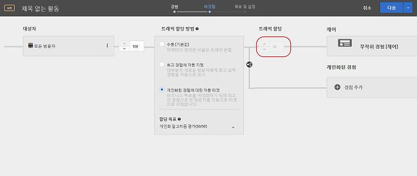 </p> <p>자세한 내용은 <a href="/help/c-activities/auto-target/auto-target-to-optimize.md" format="dita" scope="local"> 맞춤형 경험 자동 타겟 </a>을 참조하십시오. </p> </li> 
     </ul> </p> </td> 
  </tr> 
  <tr> 
   <td colname="col1"> <p>오퍼 </p> </td> 
   <td colname="col2"> <p> 
     <ul id="ul_667DDEDDC5284C8393F8BCA5CD9EF12A"> 
      <li id="li_E00DB93297EC4100B46E42D867757DAA"> <p>이제 오퍼를 열지 않고도 오퍼 라이브러리의 팝업 카드에서 오퍼 정의 세부 사항을 볼 수 있습니다. (TGT-26377) </p> <p> 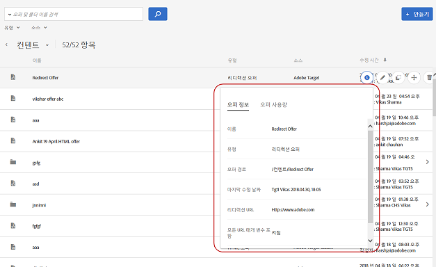 </p> <p>자세한 내용은 <a href="/help/c-experiences/c-manage-content/manage-content.md#concept_17874A6FCBB743AA84C5988E8571CCF3" format="dita" scope="local"> 오퍼 </a>를 참조하십시오. </p> </li> 
      <li id="li_F71AC4FDAC0E4BEE81D39490E82686C0"> <p>활동을 만드는 동안 오퍼 선택기에서 오퍼 및 폴더를 복사하고 편집할 수 있습니다. (TGT-26936) </p> <p> 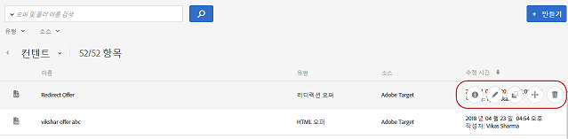 </p> <p>자세한 내용은 <a href="/help/c-experiences/c-manage-content/manage-content.md#concept_17874A6FCBB743AA84C5988E8571CCF3" format="dita" scope="local"> 오퍼 </a>를 참조하십시오. </p> </li> 
     </ul> </p> </td> 
  </tr> 
  <tr> 
   <td colname="col1"> <p>양식 기반 경험 작성기 </p> </td> 
   <td colname="col2"> <p>양식 기반 경험 작성기에서 세분화가 전체 대상 기능으로 대체되었습니다. 기존 활동에 대한 세분화 내용은 활동 전용 대상으로 마이그레이션되었습니다. (TGT-13646) </p> <p>자세한 내용은 <a href="/help/c-experiences/form-experience-composer.md#task_FAC842A6535045B68B4C1AD3E657E56E" format="dita" scope="local"> 양식 기반 경험 작성기 </a>를 참조하십시오. </p> </td> 
  </tr> 
  <tr> 
   <td colname="col1"> <p>응답 토큰 </p> </td> 
   <td colname="col2"> <p>이제 응답 토큰이 만들어지거나 Target으로 가져올 때까지 기다리지 않고 Target에서 응답 토큰을 만들 수 있습니다. 이전에는 응답 토큰 UI에 API를 통해 만든 토큰만 표시되었습니다. 이 기능이 변경되어 응답 토큰 중복을 방지하는 데 도움이 됩니다. (TGT-26534) </p> <p>자세한 내용은 <a href="/help/administrating-target/response-tokens.md#concept_2B21B222F6A344D68CA5929817E836C4" format="dita" scope="local"> 응답 토큰 </a>을 참조하십시오. </p> </td> 
  </tr> 
 </tbody> 
</table>

**개선 사항, 수정 및 변경 사항**

이 [!DNL Target] 릴리스에는 다음과 같은 고객을 위한 개선 사항, 수정 사항 및 변경 사항이 포함되어 있습니다.

* 가져온 대상(Target Classic, Experience Cloud 등) 대상 라이브러리에서 삭제할 수 있습니다. 활성 활동에 사용된 대상을 삭제하려고 하면 Target에서 경고가 표시됩니다. (TGT-25171)
* Target Classic에서 가져온 대상은 이제 대상 라이브러리에서 Adobe Target Classic으로 레이블이 지정됩니다. 이전에는 Target Standard/Premium과 Target Classic 간의 UI가 다르지 않았습니다. (TGT-27093)
* 컬렉션은 이제 모든 기준(최근에 본 항목 포함)에 적용됩니다. (TGT-26646)
* 대상 라이브러리 및 오퍼 라이브러리에서 작업 영역별로 필터링할 수 있습니다(Enterprise 사용자 권한이 있는 Target Premium 사용자에게 적용). (TGT-26813)
* 표에서의 스크롤 작업과 필터 드롭다운 목록의 배치 기능이 향상되도록 보고서 UI가 개선되었습니다. (TGT-23713 및 TGT-26819)

### 타겟 플랫폼 변경(2017년 10월 13일) {#section_6C298C5C3D01415CB4B658EB2166096C}

<table id="table_8457FAE3508F454F9DFDEF093FBD7E40"> 
 <thead> 
  <tr> 
   <th colname="col1" class="entry"> 변경 </th> 
   <th colname="col2" class="entry"> 세부 사항 </th> 
  </tr> 
 </thead>
 <tbody> 
  <tr> 
   <td colname="col1"> <p> <span class="filepath"> at.js </span> </p> </td> 
   <td colname="col2"> <p><b>2017년 10월 13일</b> </p> <p> 이제 <span class="filepath"> at.js </span> 버전 1.2.1을 사용할 수 있습니다. 자세한 내용은 <a href="/help/c-implementing-target/c-implementing-target-for-client-side-web/target-atjs-versions.md#reference_DBB5EDB79EC44E558F9E08D4774A0F7A" format="dita" scope="local"> at.js 버전 세부 사항 </a>을 참조하십시오. </p> <p> 
     <ul id="ul_14D6BB3B51974789BBFC036A45B7A56B"> 
      <li id="li_AE9826C8FC4A4DF4BE61BB72C2946C93"> <p>target="_blank"인 링크에 대한 클릭 추적을 수행할 경우 새 탭에서 링크가 열리지 않도록 하는 문제가 수정되었습니다. </p> </li> 
     </ul> </p> </td> 
  </tr> 
 </tbody> 
</table>

### Target Standard/Premium 17.9.1(2017년 9월 25일, 2017년 10월 12일) {#section_ECC5DD8B6ED443788B46F53E25FC896E}

이번 릴리스에는 다음 기능 및 개선 사항이 포함되어 있습니다(괄호 안에 있는 문제 번호는 내부 Adobe용임).

<table id="table_0A8817F64F434875A485FD671C6988AB"> 
 <thead> 
  <tr> 
   <th colname="col1" class="entry"> 기능 </th> 
   <th colname="col2" class="entry"> 설명 </th> 
  </tr> 
 </thead>
 <tbody> 
  <tr> 
   <td colname="col1"> <p> 모바일 경험 미리보기 </p> </td> 
   <td colname="col2"> <p><b>업데이트 날짜: 2017년 10월 12일</b> </p> <p> 이제 UI에서 여러 모바일 앱 활동을 선택한 후 디바이스에서 미리 볼 수 있습니다. 이 기능을 사용하면 특수한 테스트 빌드 및 시뮬레이터를 사용하지 않고도 미리보기 및 QA를 위해 여러 경험에 등록할 수 있습니다. </p> <p>이 기능을 사용하려면 해당 Adobe Mobile SDK 4.14 이상 버전을 다운로드한 후 설치해야 합니다. </p> <p>자세한 내용은 <a href="/help/c-target-mobile-app/target-mobile-preview.md#concept_5FBF12C2FDFC42429FE4F5CFBD78E19D" format="dita" scope="local"> Target 모바일 미리보기 </a>. </p> </td> 
  </tr> 
  <tr> 
   <td colname="col1"> <p>모바일 배치 및 프리페치 전달 </p> </td> 
   <td colname="col2"> <p><b>업데이트 날짜: 2017년 10월 12일</b> </p> <p> 여러 mbox용 콘텐츠를 단일 호출로 미리 가져온 후, 최종 사용자가 콘텐츠를 보는 방법, 시기 및 보는지 여부를 신경쓰지 않고 디바이스에 로컬로 캐시할 수 있습니다. </p> <p>이 기능을 사용하려면 해당 Adobe Mobile SDK 4.14 이상 버전을 다운로드한 후 설치해야 합니다. </p> <p>자세한 내용은 <a href="/help/c-target-mobile-app/prefetch-offer-content.md#concept_A355D9D55E1C429AA31FA4055A1DDFAF" format="dita" scope="local"> 프리패치 오퍼 콘텐츠 </a>. </p> </td> 
  </tr> 
  <tr> 
   <td colname="col1"> <p>활동 </p> </td> 
   <td colname="col2"> <p>활동 만들기 워크플로가 다음과 같이 개선되었습니다. </p> <p> 
     <ul id="ul_2D251AC11FC54E86AE84DEFFB6FDF43C"> 
      <li id="li_AB8F12B3CF654120BD16EAE570517741"> <p>활동을 편집하는 동안, 현재 표시된 단계에서 원하는 부분을 변경한 후 분할 버튼의 드롭다운을 클릭하고 <span class="wintitle"> 다음 </span>을 선택하여 다음 단계로 이동한 후 <span class="wintitle"> 저장하고 닫기 </span>를 클릭하여 변경 사항을 저장하고 활동의 <span class="wintitle"> 개요 </span> 페이지를 표시하거나 <span class="wintitle"> 저장 </span>을 클릭하여 변경 사항을 저장한 후 해당 단계에 남아 있습니다. </p> <p> 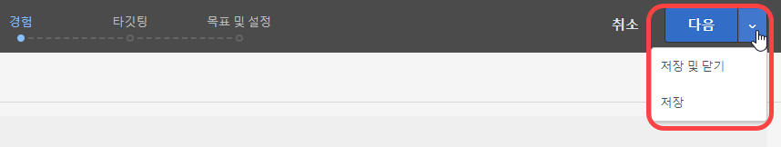 </p> <p>자세한 내용은 <a href="/help/c-activities/edit-activity.md#concept_BB064C0D4A194BD1A1AE7CCA1E6BB8F0" format="dita" scope="local"> 활동 편집 또는 초안으로 저장 </a>을 참조하십시오. </p> </li> 
      <li id="li_4C71E2570ECF4BBAB08443D89230CE82"> <p>활동을 편집하는 동안, 원하는 워크플로 단계를 열고 변경을 수행한 후(예를 들어 경험 백분율, 대상 등) 안내가 있는 3단계 워크플로를 진행할 필요 없이 활동을 저장하거나 닫을 수 있습니다. </p> <p> 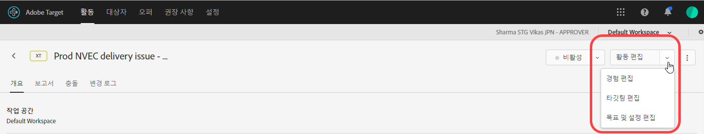 </p> <p>자세한 내용은 <a href="/help/c-activities/edit-activity.md#concept_BB064C0D4A194BD1A1AE7CCA1E6BB8F0" format="dita" scope="local"> 활동 편집 또는 초안으로 저장 </a>을 참조하십시오. </p> </li> 
      <li id="li_43C15B13E4F7475E9376A98222AA0253"> <p>아직 저장되지 않은 새 활동을 만들거나 이전에 초안 양식으로 저장된 활동을 편집하는 경우, 분할 버튼에 <span class="wintitle"> 초안 저장 </span> 옵션이 표시됩니다. </p> <p> 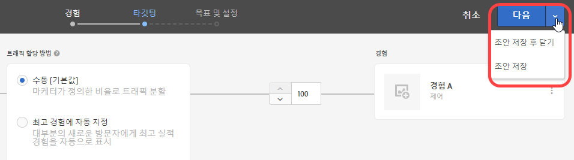 </p> <p>자세한 내용은 <a href="/help/c-activities/edit-activity.md#concept_BB064C0D4A194BD1A1AE7CCA1E6BB8F0" format="dita" scope="local"> 활동 편집 또는 초안으로 저장 </a>을 참조하십시오. </p> </li> 
      <li id="li_36EF9AD13B2D40ADB99343C9F758D5FD"> <p>이제 안내가 있는 3단계 워크플로 중 2단계에서 타기팅을 선택하면서, <span class="wintitle"> 대상 선택 </span> 대화 상자에서 원하는 대상 위로 마우스를 가져간 후 대상을 편집하거나 복사할 수 있습니다. </p> <p>  </p> </li> 
     </ul> </p> <p>자세한 내용은 <a href="/help/c-activities/t-test-ab/t-test-create-ab/ab-audience.md#concept_A268236C1224451DB7844BF67F41A087" format="dita" scope="local"> 대상 선택 </a>을 참조하십시오. </p> </td> 
  </tr> 
  <tr> 
   <td colname="col1"> <p>보고 </p> </td> 
   <td colname="col2"> <p>보고 기능을 위해 다음과 같은 새로운 기능 및 개선 사항을 사용할 수 있습니다. </p> <p> 
     <ul id="ul_2D1AF91D1B4E478FBFFA0B83EE30075E"> 
      <li id="li_98E67A4DA8BF4CFF90C279FAC12F4C54"> <p>보고서에서 그래프에 대한 계산 방법론을 선택할 수 있습니다. 이 기능은 자동 타기팅 및 AP (Automated Personalization) 활동에서는 지원되지 않습니다. </p> <p>자세한 내용은 <a href="/help/c-reports/c-report-settings/report-settings.md#concept_4BB6A7FDAB6F4806A632F9CD989B8BFA" format="dita" scope="local">보고서 설정</a>의 "계산 방법론" 행을 참조하십시오. </p> </li> 
      <li id="li_5803CE90DB764C9E983702CB6C1AFEE3"> <p>자동 타기팅 A/B 활동에 대한 단일 보고서에서 여러 지표를 볼 수 있습니다. (TGT-23464) </p> <p>자세한 내용은 <a href="/help/c-reports/c-report-settings/view-multiple-metrics.md#concept_9E3C3F6F3EC1412FAF252975AC0720B7" format="dita" scope="local"> 한 보고서의 여러 지표 보기 </a>를 참조하십시오. </p> </li> 
     </ul> </p> </td> 
  </tr> 
  <tr> 
   <td colname="col1"> <p>대상자 </p> </td> 
   <td colname="col2"> <p>이제 Target Classic에서 가져왔거나 API를 통해 만든 대상의 정의를 볼 수 있습니다. (TGT-22630) </p> <p>  </p> <p>자세한 내용은 <a href="/help/c-target/c-audiences/audiences.md#concept_65BE870D290E412D8BBF557EEA67C271" format="dita" scope="local"> 대상 정보 </a>의 "대상 정의 보기"를 참조하십시오. </p> </td> 
  </tr> 
  <tr> 
   <td colname="col1"> <p>코드 편집기 </p> </td> 
   <td colname="col2"> <p>양식 기반 경험 작성기 및 HTML 오퍼 편집기에서는 이제 VEC(시각적 경험 작성기)가 사용자 지정 코드에서 사용하는 것과 동일한 코드 편집기를 사용합니다. (TGT-25808) </p> <p>이 개선 사항은 양식 기반 시각적 경험 작성기에서 코드 편집기를 사용할 때와 HTML 오퍼를 만들 때 다음과 같은 이점을 제공합니다. </p> <p> 
     <ul id="ul_CBB17806FBF34774A8160A61204ED014"> 
      <li id="li_22665F583F1742E280D5BC7EC4203007"> <p>이제 보다 편리하도록 라인 번호가 표시됩니다. </p> </li> 
      <li id="li_B0D863CDAD2E46A4B133BB86886EB527"> <p>구문 강조 표시는 HTML 오퍼의 잘못된 구문을 방지하는 데 도움이 됩니다. </p> </li> 
     </ul> </p> <p>자세한 내용은 <a href="/help/c-experiences/c-visual-experience-composer/c-vec-code-editor/vec-code-editor.md#concept_B3A6E9EE3A60406DB640E205EA1745B5" format="dita" scope="local"> 코드 편집기 </a>. </p> </td> 
  </tr> 
  <tr> 
   <td colname="col1"> <p>지역 타기팅 </p> </td> 
   <td colname="col2"> <p>이제 지역 타기팅에서 위도 및 경도를 사용할 수 있습니다. (TGT-12129) </p> <p>자세한 내용은 <a href="/help/c-target/c-audiences/c-target-rules/geo.md#concept_5B4D99DE685348FB877929EE0F942670" format="dita" scope="local"> 지역 </a>을 참조하십시오. </p> </td> 
  </tr> 
  <tr> 
   <td colname="col1"> <p>Node.JS SDK </p> </td> 
   <td colname="col2"> <p><a href="https://www.npmjs.com/package/@adobe/target-node-client" format="https" scope="external"> npm @adobe/target-node-client </a> 에서 node.js SDK를 설치하여 node.js 애플리케이션에서 서버 쪽 테스트를 구현하고 실행할 수 있습니다. VisitorID 서비스는 모든 Adobe 데이터를 연결할 수 있게 노드 SDK에서 활성화되며, Adobe Analytics를 보고 소스 (A4T) 로 사용하도록 선택하는 데 사용할 수 있습니다. </p> </td> 
  </tr> 
 </tbody> 
</table>

**개선 사항, 수정 및 변경 사항**

이번 [!DNL Target] 릴리스에는 다음과 같은 고객용 개선 사항, 수정 사항 및 변경 사항이 포함되어 있습니다(괄호 안에 있는 문제 번호는 내부 Adobe용임).

* 승인자 권한이 있는 사용자는 이제 프로필 API 인증 토큰을 생성하고 활성화할 수 있습니다. (TGT-24074)

   자세한 내용은 [프로필 API 설정](/help/c-implementing-target/c-considerations-before-you-implement-target/c-methods-to-get-data-into-target/profile-api-settings.md#concept_5C4ABA5FA64E4D6CAE9C5902572F2794)을 참조하십시오.

* 시각적 경험 작성기에서 활동을 작성할 때 사용자가 페이지를 다시 로드하면 활동 URL 및 연관된 속성이 UI에 유지됩니다. 활동이 혼합 콘텐츠(보안 및 비보안 콘텐츠)를 사용하거나 권한 문제가 있는 경우, 다시 로드해야 할 수 있습니다. (TGT-28230)
* 활동이 혼합 콘텐츠(보안 및 비보안 콘텐츠)를 사용할 경우의 메시징이 개선되었습니다. 메시지는 사용자가 HTTP 사이트 또는 혼합 호출(HTTPS 및 HTTP)이 있는 사이트를 여는 데 필요한 단계를 수행하는 데 도움이 되는 정보를 제공합니다. (TGT-26271)

자세한 내용은 [브라우저에서 혼합 콘텐츠 활성화](/help/c-experiences/c-visual-experience-composer/r-troubleshoot-composer/mixed-content.md#concept_46D022D50280468C9EF6D5DF6EFC911C)를 참조하십시오.

* 관리, 대상 및 권장 사항 페이지에서 옵션을 구성하는 동안 사용자의 Target 세션 시간이 초과되면 워크플로가 개선되었습니다. 사용자가 저장을 클릭하면 세션 만료 메시지가 표시되지만, 다시 로그인하면 성공적인 로그인을 사용자에게 알리는 대화 상자가 표시되며, UI는 데이터 손실 없이 Target의 동일한 페이지에 그대로 유지됩니다. (TGT-25557)

### 타겟 플랫폼 변경 사항(2017년 9월 27일) {#section_AC32516DFBA64AD2AC9A74171D452778}

<table id="table_701D8D53D1DF4F28ADAC6EC221B0208A"> 
 <thead> 
  <tr> 
   <th colname="col1" class="entry"> 변경 </th> 
   <th colname="col2" class="entry"> 세부 사항 </th> 
  </tr> 
 </thead>
 <tbody> 
  <tr> 
   <td colname="col1"> <p> <span class="filepath"> at.js </span> </p> </td> 
   <td colname="col2"> <p><b>2017년 9월 27일</b> </p> <p> <span class="filepath"> at.j s </span> 버전 1.2.0은 이제 대부분의 버그 수정 사항을 포함하는 유지 관리 릴리스로 사용할 수 있습니다. 자세한 내용은 <a href="/help/c-implementing-target/c-implementing-target-for-client-side-web/target-atjs-versions.md#reference_DBB5EDB79EC44E558F9E08D4774A0F7A" format="dita" scope="local"> at.js 버전 세부 사항 </a>을 참조하십시오. </p> <p> 
     <ul id="ul_D11024549C3643C7A756988087498D24"> 
      <li id="li_E1B3994125B64F6AB20B29FE8BCD8459"> <p>클릭 추적 특수 사례에 대해 기본 동작이 수행되지 않도록 하는 문제가 수정되었습니다. (TNT-28089) </p> </li> 
      <li id="li_53806C902AA04B31B59AA87A1E707348"> <p><span class="codeph"> target="_blank" </span> 인 링크에 대한 클릭 추적을 수행할 경우 새 탭에서 링크가 열리지 않도록 하는 문제가 수정되었습니다. (TNT-28072) </p> </li> 
      <li id="li_94F5794330D14C71BA07B3F17D0705FD"> <p> IP 주소를 쿠키 도메인으로 사용할 수 있습니다. (TNT-28002) </p> </li> 
      <li id="li_7D2A11B17672419583F9632CDA00D28F"> <p>글로벌 mbox 또는 기타 지역 mbox가 있는 리디렉션 오퍼에서 깜박임을 유발하던 문제가 수정되었습니다. (TNT-27978) </p> </li> 
      <li id="li_BA27A749A7A242478080F3D8E04148FC"> <p> 찾아보기와 작성 간을 전환할 때 VEC 내에서 경험 타기팅 활동 설정이 실패하는 문제가 수정되었습니다. (TNT-27942) </p> </li> 
      <li id="li_FA11ABA5B9CD435080426805C5359A51"> <p> 클릭 추적 요소에 대한 깜박임 스타일 클래스의 잘못된 처리가 수정되었습니다. (TNT-27896) </p> </li> 
      <li id="li_E2DFBAE52FCA4996BA083868CBFCCD10"> <p>전역 mbox 매개 변수가 모든 mbox 매개 변수와 혼합되도록 하는 문제가 수정되었습니다. (TNT-27846) </p> </li> 
      <li id="li_B3153BBD66AA4D51AE81EF6C903CF78D"> <p>Handlebars, Mustache 및 기타 클라이언트측 템플릿 라이브러리가 <span class="filepath"> at.js </span> 에서 제대로 처리되도록 하는 데 필요한 변경이 수행되었습니다. (TNT-27831) </p> </li> 
      <li id="li_B859939C1B5A4DF78CF8ADF236B88306"> <p><span class="codeph"> sdidParamExpiry </span> 가 제대로 초기화되어 방문자 API로 전달되도록 하는 데 필요한 변경이 수행되었습니다. <span class="codeph"> at.js 1.1.0 </span>에 추가된 회귀입니다. 이전 <span class="filepath"> at.js </span> 버전은 영향을 받지 않습니다. 리디렉션 오퍼 및 A4T를 사용하는 클라이언트에만 영향을 줍니다. (TNT-27791) </p> </li> 
      <li id="li_24A748DFB7824AE6AC7331B7EA940BFF"> <p>사용 중인 형식 속성과 관계없이 <span class="codeph"> SCRIPT </span> 가 실행되도록 하는 데 필요한 변경이 수행되었습니다. (TNT-27865) </p> </li> 
     </ul> </p> </td> 
  </tr> 
  <tr> 
   <td colname="col1"> <p>경험 타기팅 (XT) </p> </td> 
   <td colname="col2"> <p><b>2017년 9월 21일</b> </p> <p>9월 21일 자 릴리스부터 Target에서 사용자가 XT (경험 타기팅) 활동에서 경험에 배치되는 방식이 변경됩니다(Target Classic의 랜딩 페이지 캠페인). Target Standard/Premium 및 Target Classic의 모든 새 활동 및 기존 활동에 대해, 사용자는 계속해서 경험 콘텐츠를 볼 수 있고 보고서에서 계산되려면 모든 노출에서 경험 타기팅 규칙을 충족해야 합니다. 이전에는 사용자가 더 이상 경험에 대한 자격이 없으면 자격이 있는 마지막 경험의 콘텐츠만 계속 볼 수 있고 보고서에서 계산될 수 있었습니다. </p> <p>이러한 변경은 모든 기존 활동 및 릴리스 후에 작성된 새 활동에 대해 자동으로 릴리스의 일부로 적용됩니다. 이전 방법(9월 21일 이전)이 필요한 경우, 사용자가 향후 해당 대상에 계속 속하기 위해 한 번만 조건을 충족하면 되도록 프로필 스크립트를 통해 대상을 작성할 수 있습니다. 그런 다음 활동의 각 경험에 해당 대상을 사용합니다. </p> </td> 
  </tr> 
 </tbody> 
</table>

### Target Standard/Premium 17.8.1(2017년 8월 22일) {#section_71A554D072F04B18B359C1626529E5D8}

<table id="table_AAC16F89060D4CC09762A370B86C0885"> 
 <thead> 
  <tr> 
   <th colname="col1" class="entry"> 기능 </th> 
   <th colname="col2" class="entry"> 설명 </th> 
  </tr> 
 </thead>
 <tbody> 
  <tr> 
   <td colname="col1" class="premium"> <p>Target Premium에 대한 엔터프라이즈 사용자 권한 </p> </td> 
   <td colname="col2"> <p>Target에서 별도의 작업 영역을 만들고 개별 디지털 속성에 대해 다른 역할 및 권한을 지정합니다. </p> <p>자세한 내용은 <a href="/help/administrating-target/c-user-management/property-channel/property-channel.md#concept_E396B16FA2024ADBA27BC056138F9838" format="dita" scope="local">Enterprise 사용자 권한</a>을 참조하십시오. </p> <p>롤아웃에 대한 자세한 내용은 <a href="/help/r-release-notes/known-issues-resolved-issues.md#concept_625C3A16B7F24D4B82EFF130F0945541" format="dita" scope="local"> 알려진 문제 및 해결된 문제 </a>를 참조하십시오. </p> </td> 
  </tr> 
  <tr> 
   <td colname="col1"> <p>QA 모드 </p> </td> 
   <td colname="col2"> <p>절대 변경되지 않는 미리보기 링크, 선택적 대상 타기팅 및 라이브 활동 데이터에서 세그먼트화된 QA 보고를 사용하여 간편한 활동 QA를 수행할 수 있습니다. </p> <p>자세한 내용은 <a href="/help/c-activities/c-activity-qa/activity-qa.md" format="dita" scope="local">활동 QA</a>를 참조하십시오. </p> </td> 
  </tr> 
 </tbody> 
</table>

**개선 사항, 수정 및 변경 사항**

이번 [!DNL Target] 릴리스에는 다음과 같은 고객용 개선 사항, 수정 사항 및 변경 사항이 포함되어 있습니다(괄호 안에 있는 문제 번호는 내부 Adobe용임).

* 대상을 열지 않고 Target UI의 팝업 카드에서 대상 정의 세부 사항을 볼 수 있는 위치가 더 추가되었습니다. 이 기능은 [!DNL Target Standard/Premium. (TGT-25772)]에서 작성한 대상에만 적용됩니다.
* 활동 만들기/개요 내에서 임시 대상의 정의를 볼 수 있습니다. (TGT-25570)
* `entiites` 및 `entityN.categoriesList` 변수는 [Velocity](/help/c-recommendations/c-design-overview/customizing-a-template.md#concept_94F1554C3F2E4CDB9A2C3D78F10EDA59) 배열로 사용할 수 있습니다.

### 타겟 플랫폼 변경 사항(2017년 8월 3일) {#section_FA5BF6808EA74F3A9E8E941530879208}

<table id="table_1B43199F1AE64E69AE65313B23741444"> 
 <thead> 
  <tr> 
   <th colname="col1" class="entry"> 변경 </th> 
   <th colname="col2" class="entry"> 세부 사항 </th> 
  </tr> 
 </thead>
 <tbody> 
  <tr> 
   <td colname="col1"> <p> <span class="filepath"> at.js </span> </p> </td> 
   <td colname="col2"> <p><b>2017년 8월 3일</b> </p> <p> 이제 <span class="filepath"> at.js </span> 버전 1.1을 사용할 수 있습니다. 자세한 내용은 <a href="/help/c-implementing-target/c-implementing-target-for-client-side-web/how-to-deployatjs/implementing-target-without-a-tag-manager.md#concept_1E1F958F9CCC4E35AD97581EFAF659E2" format="dita" scope="local"> at.js 다운로드 </a>를 참조하십시오. </p> <p>다음 개선 사항 및 수정 사항이 <span class="filepath"> at.js </span> 버전 1.1에 포함되어 있습니다. </p> <p> 
     <ul id="ul_B7408267413347888938E2E7D48ABDBD"> 
      <li id="li_4DDF6DCFE6014C6795B6A9C9DFB54C21"> <p>응답 토큰 처리가 추가되었습니다. 자세한 내용은 <a href="/help/administrating-target/response-tokens.md#concept_2B21B222F6A344D68CA5929817E836C4" format="dita" scope="local"> 응답 토큰 </a>을 참조하십시오. </p> </li> 
      <li id="li_741CD22B7D074FBA90180B2E36FACE0D"> <p><span class="codeph"> document.currentScript polyfill </span> 이 Angular 1.X를 방해하지 않도록 문제가 해결되었습니다. </p> </li> 
      <li id="li_EF1B3D3DCC7F4D2490D2BFE660EC661C"> <p>클릭 추적이 가시성 속성을 방해하지 않도록 하는 데 필요한 변경이 수행되었습니다. 클릭 추적 요소가 <span class="codeph"> at-element-marker </span> 대신 <span class="codeph"> at-element-click-tracking </span> CSS 클래스로 표시됩니다. </p> </li> 
     </ul> </p> </td> 
  </tr> 
 </tbody> 
</table>

### Target Standard/Premium 17.7.3(2017년 8월 3일) {#section_D90CB766679442C7A0642E5D79657674}

<table id="table_C81EA97B251547169BC9681E5DDB4B8F"> 
 <thead> 
  <tr> 
   <th colname="col1" class="entry"> 기능 </th> 
   <th colname="col2" class="entry"> 설명 </th> 
  </tr> 
 </thead>
 <tbody> 
  <tr> 
   <td colname="col1"> <p>응답 토큰 </p> </td> 
   <td colname="col2"> <p>응답 토큰을 사용하면 활동(예: mbox 표시)을 전달하는 Target 응답에 적합한 변수(예: 프로필 속성)를 자동으로 출력할 수 있습니다. 응답 토큰은 디버깅 목적이나 서드파티 제공자(예: Clicktale)와의 통합을 위해 사용할 수 있습니다. </p> <p>응답 토큰은 <span class="keyword"> Adobe Target Classic </span> 서버 플러그인과 유사하며 두 가지 솔루션 간에 기능 패리티를 제공합니다. </p> <p> <p>참고: 응답 토큰은 <span class="filepath"> at.js </span> 1.1 이상에서 사용할 수 있습니다.</span>. </p> </p> <p>자세한 내용은 <a href="/help/administrating-target/response-tokens.md#concept_2B21B222F6A344D68CA5929817E836C4" format="dita" scope="local"> 응답 토큰 </a>을 참조하십시오. </p> </td> 
  </tr> 
 </tbody> 
</table>

### Target Standard/Premium 17.7.2(2017년 7월 27일) {#section_6980EC04D3CF4A00919953B9B10BC472}

<table id="table_DB51BD66756F4EBD875ED008B2C7C5D0"> 
 <thead> 
  <tr> 
   <th colname="col1" class="entry"> 기능 </th> 
   <th colname="col2" class="entry"> 설명 </th> 
  </tr> 
 </thead>
 <tbody> 
  <tr> 
   <td colname="col1" class="premium"> <p>자동 타겟 </p> </td> 
   <td colname="col2"> <p>이제 모든 Target Premium 고객이 자동 타기팅을 사용할 수 있습니다. </p> <p>자동 타기팅은 고급 시스템 학습을 사용하여 여러 개의 고성능 마케터 정의 경험을 식별하고, 콘텐츠를 개별화하고 전환을 진행하기 위해 비슷한 프로필을 갖는 이전 방문자의 개별 고객 프로필 및 행동을 기준으로 각 방문자에게 맞춤형 경험을 제공합니다. </p> <p>안내가 있는 3단계 워크플로를 사용하여 A/B 활동을 만드는 동안 <span class="wintitle"> 개인화된 경험에 대한 자동 타기팅 </span> 옵션을 사용하여 트래픽을 할당하도록 선택할 수 있습니다. </p> <p> 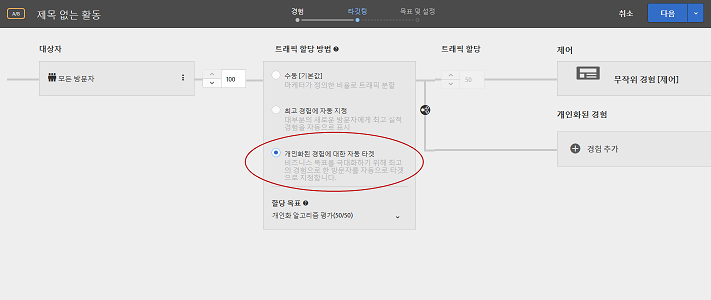 </p> <p>자세한 내용은 <a href="/help/c-activities/auto-target/auto-target-to-optimize.md" format="dita" scope="local"> 맞춤형 경험 자동 타겟 </a>을 참조하십시오. </p> </td> 
  </tr> 
 </tbody> 
</table>

### Target Standard/Premium 17.7.1(2017년 7월 20일) {#section_BB75DE30174F4ADD963451909FB81D74}

<table id="table_BCE36E0D56804E7B8861858DCF2F380E"> 
 <thead> 
  <tr> 
   <th colname="col1" class="entry"> 기능 </th> 
   <th colname="col2" class="entry"> 설명 </th> 
  </tr> 
 </thead>
 <tbody> 
  <tr> 
   <td colname="col1"> <p>대상자 </p> </td> 
   <td colname="col2"> <p>이제 대상을 열지 않고도 Target UI의 다양한 위치에서 팝업 카드의 대상 정의 세부 사항을 볼 수 있습니다. 이 기능은 <span class="keyword"> Target Standard/Premium </span>에서 만든 대상에만 적용됩니다. </p> <p>  </p> </td> 
  </tr> 
  <tr> 
   <td colname="col1"> <p>성공 지표 </p> </td> 
   <td colname="col2"> <p>이전에는 Target에서 단일 지표에 대한 종속성을 허용했으며 카운트가 증분되기 전에 해당 지표에 도달해야 했습니다. 이제 여러 지표에 대한 종속성과 유연성을 제공하여 카운트를 증분하기 위해 지표에 도달해야 할지 또는 도달하지 않아야 할지를 선택할 수 있습니다. </p> <p>다음에 대해 다중 지표 종속성 기능이 지원되지 않습니다. </p> <p> 
     <ul id="ul_EC856F910B704D648065EA7DA13EE5B0"> 
      <li id="li_1A82414FE50B414CAA1A0A88E80BCC1B"> <p>권장 사항 활동. 이 기능은 다른 모든 활동 유형에 대해 지원됩니다. </p> </li> 
      <li id="li_2D6CF42264D445FCB6C400ED321DE952"> <p>Analytics를 보고 소스 (A4T) 로 사용하는 경우 </p> </li> 
      <li id="li_E3A983A70BB04AE8B25A7CEC1F5FE1D9"> <p>"페이지 확인함" 지표 유형 </p> </li> 
      <li id="li_9AAF6BB275F7489BA691676E308172D5"> <p>VEC(시각적 경험 작성기) 활동에 대한 "요소를 클릭함" 지표 유형 </p> </li> 
     </ul> </p> <p>자세한 내용은 다음 주제를 참조하십시오. </p> <p> 
     <ul id="ul_4B0EFFDD257C42579E19569DCBE15BE3"> 
      <li id="li_2402575F27F547968BD536C460BF81B5"> <p>A/B: <a href="/help/c-activities/t-test-ab/t-test-create-ab/ab-goals-and-settings.md#reference_B25389FD6F3A4989801E740364B089CC" format="dita" scope="local"> 목표 및 설정 </a> </p> </li> 
      <li id="li_FB5E7CBC0154406C989F5A5C6CAA0C8F"> <p>AP (Automated Personalization): <a href="/help/c-activities/t-automated-personalization/create-ap-activity.md#task_8AAF837796D74CF893CA2F88BA1491C9" format="dita" scope="local"> Automated Personalization 활동 작성 </a> </p> </li> 
      <li id="li_57C36A7945A24A52BCBD62CA0F15B668"> <p>XT (경험 타기팅): <a href="/help/c-activities/t-experience-target/t-xt-create/xt-goals-and-settings.md#reference_B25389FD6F3A4989801E740364B089CC" format="dita" scope="local"> 목표 및 설정 </a> </p> </li> 
      <li id="li_06674A3152A547268A1AE5EE818EF1A5"> <p>MVT (다변량): <a href="/help/c-activities/c-multivariate-testing/t-create-multivariate-test/goals-and-settings.md#reference_B25389FD6F3A4989801E740364B089CC" format="dita" scope="local"> 목표 및 설정 </a> </p> </li> 
     </ul> </p> </td> 
  </tr> 
  <tr> 
   <td colname="col1"> <p>보고(자동 할당 A/B 테스트) </p> </td> 
   <td colname="col2"> <p>이제 다중 지표를 보는 기능을 자동 할당 A/B 활동에 사용할 수 있습니다. </p> <p>자세한 내용은 <a href="/help/c-reports/c-report-settings/view-multiple-metrics.md#concept_9E3C3F6F3EC1412FAF252975AC0720B7" format="dita" scope="local"> 한 보고서의 여러 지표 보기 </a>를 참조하십시오. </p> </td> 
  </tr> 
  <tr> 
   <td colname="col1"> <p>대상자 </p> </td> 
   <td colname="col2"> <p>이제 대상 사이트 페이지 유형 및 비교 연산자는 Target Classic의 유형 및 비교 연산자와 일치합니다. </p> <p>이제 자체 "사용자 정의 쿼리 매개 변수" 또는 "사용자 정의 헤더"를 사용하여 사이트 페이지 대상을 만들 수 있습니다. </p> <p>자세한 내용은 <a href="/help/c-target/c-audiences/c-target-rules/site-pages.md#concept_6425D5304568490899E8340CC94798A9" format="dita" scope="local"> 사이트 페이지 </a>. </p> </td> 
  </tr> 
  <tr> 
   <td colname="col1"> <p>활동 </p> </td> 
   <td colname="col2"> <p>이제 활동 목록을 통해 자동 할당 및 자동 타기팅 활동 유형을 필터링 할 수 있습니다. </p> <p>자세한 내용은 <a href="/help/c-activities/activities.md#concept_D317A95A1AB54674BA7AB65C7985BA03" format="dita" scope="local"> 활동 </a>을 참조하십시오. </p> </td> 
  </tr> 
  <tr> 
   <td colname="col1" class="premium"> <p>권장 사항 기준 및 프로모션 </p> </td> 
   <td colname="col2"> <p>이제 엔티티 속성 일치, 프로필 속성 일치 및 매개 변수 일치를 기준으로 필터링할 때 빈 값을 처리할 수 있습니다. </p> <p>자세한 내용은 <a href="/help/c-recommendations/c-algorithms/use-dynamic-and-static-inclusion-rules.md#concept_4CB5C0FA705D4E449BD0B37B3D987F9F" format="dita" scope="local"> 동적 및 정적 포함 규칙 사용 </a>을 참조하십시오. </p> </td> 
  </tr> 
 </tbody> 
</table>

이번 [!DNL Target] 릴리스에는 다음과 같은 고객용 개선 사항 및 수정 사항이 포함되어 있습니다(괄호 안에 있는 문제 번호는 내부 Adobe용임).

* 활동 또는 오퍼를 만들거나 편집하는 동안 사용자의 [!DNL Target] 세션 시간이 초과될 경우의 워크플로가 개선되었습니다. 사용자가 [!UICONTROL 저장]을 클릭하면 세션 만료 메시지가 표시되지만, 다시 로그인하면 성공적인 로그인을 사용자에게 알리는 대화 상자가 표시되며, UI는 데이터 손실 없이 [!DNL Target] 의 동일한 페이지에 그대로 유지됩니다.

   사용자가 [!DNL Target] 페이지에서 간헐적인 작업을 수행하고 세션 시간 제한이 발생하는 경우, 다시 로그온하도록 지시된 후 [!DNL Target] UI에서 마지막으로 작업한 페이지로 이동됩니다.

* 사용자가 다른 위치로 이동하고(경험 변경, 페이지 전환, 대상 전환, 다음 클릭 등) 변경 사항을 저장하는 것을 잊어버릴 경우 사용자 지정 코드 변경 사항이 유실되는 문제가 수정되었습니다. 이제 변경 사항을 저장하라는 메시지가 표시됩니다. (TGT-23766)
* 활동이 보관될 경우 &quot;활동 업데이트 중&quot; 대신 &quot;활동을 보관함&quot;이 표시됩니다. (KB-1517)
* Target UI 내의 다음 위치에 있는 드롭다운 선택기가 속도 및 성능 향상을 위해 자동 완성 기능으로 대체되었습니다(TGT-22939).

   * 활동 페이지 > *활동* > 3단계 > 보고서 세트 선택기
   * 대상자 > 대상자 만들기 > 방문자 프로필
   * 권장 사항 > 피드 만들기 > 시간 소스 유형 > 분석 > 보고서 세트 선택기

* 사이트의 &quot;X-Frame-options&quot;가 SAMEORIGIN으로 설정되어 있고 VEC(시각적 경험 작성기)에서 사이트를 로드할 수 없을 때 표시되는 오류 메시지가 개선되었습니다. 관리 > 시각적 경험 작성기에서 고급 경험 작성기로 전환하라는 메시지가 표시됩니다. (TGT-17356)
* 이제 Target Standard/Premium의 보고서가 Target 서버 시간대(미국 EST)가 아닌 계정의 시간대로 표시됩니다. (TGT-24868)
* [!DNL Target] 에서 만든 활동이 [!DNL Target]의 외부에서(예를 들어 Adobe I/O를 통해) 업데이트된 경우 다음 활동 속성을 다시 [!DNL Target]으로 가져오게 됩니다.

   `thirdpartyId`

   `startDate`

   `endDate`

   `status`

   `priority`

   `marketingCloudMetadata(remoteModifiedBy)`

   이 가져오기 작업은 활동 페이지가 열리면 실행되고, 최대 지연 시간은 10분입니다. (KB-1526)

### Target Standard/Premium 17.6.2(2017년 6월 22일) {#section_F0372B07B56E454CB048CE79FF56E9CD}

<table id="table_8C4DB1B83B874E4C85CE9FF352E7B857"> 
 <thead> 
  <tr> 
   <th colname="col1" class="entry"> 기능 </th> 
   <th colname="col2" class="entry"> 설명 </th> 
  </tr> 
 </thead>
 <tbody> 
  <tr> 
   <td colname="col1" class="premium"> <p>AP (Automated Personalization) 활동 </p> </td> 
   <td colname="col2"> <p> 
     <ul id="ul_F5BB1074DD4140C798CB55D68DEEF824"> 
      <li id="li_9596AABA14C64DEEB2E70E8ADED8AA74">Automated Personalization 활동은 Form-Based Composer를 사용하여 만들 수 있습니다. </li> 
      <li id="li_315F5FF590404670A677FEA6E4E0DF5D">Automated Personalization에 대한 새 신뢰도 </li> 
     </ul> </p> </td> 
  </tr> 
  <tr> 
   <td colname="col1" class="premium"> <p>권장 사항: 기준 및 프로모션 </p> </td> 
   <td colname="col2"> <p> 이제 프로필 속성 일치 및 매개 변수 일치를 기준으로 다이내믹 기준 및 프로모션을 만들 수 있습니다. </p> <p> 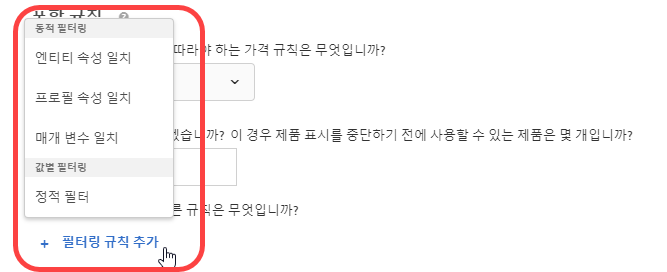 </p> <p> <p>참고: Target 17.6.1 릴리스(2017년 6월) 이전에 포함 규칙이 구성되는 방식을 잘 알고 있다면 일부 선택 사항과 연산자가 변경되었음을 알 수 있을 것입니다. 선택한 선택 사항에 적용 가능한 연산자만 표시되고, 일부 연산자의 이름은 더 일관되고 직관적이게 변경되었습니다("일치"(matches)는 이제 "다음과 같음"(equals)임). 이번 릴리스 이전에 만들어진 모든 기존 제외 규칙은 새 구조로 자동 마이그레이션됩니다. 여러분 쪽에서는 구조를 조정할 필요가 없습니다. </p> </p> </td> 
  </tr> 
  <tr> 
   <td colname="col1"> <p>VEC 코드 편집기 개선 사항 </p> </td> 
   <td colname="col2"> <p> 페이지 형식이 변경되고 작업을 적용할 수 없는 경우, 이제 실패한 각 작업 옆에 경고가 표시됩니다. 이전에는 페이지 구조가 변경되었음을 알리는 일반적인 오류가 표시되었습니다. 이제 코드 편집기에 실패한 각 작업이 강조 표시됩니다. </p> </td> 
  </tr> 
 </tbody> 
</table>

이 [!DNL Target] 릴리스에는 다음 고객용 개선 사항 및 수정 사항이 포함되어 있습니다.

* 호스트 그룹 및 권장 사항 엔티티 검색 페이지의 성능이 개선되었습니다.
* 특히, 동기화 오류와 관련된 경우 Target 전체에서 보다 수사적인 오류 메시지가 표시됩니다.
* 제외 그룹을 만든 후에 자동 중복 제거가 적용될 경우 UI에서 때때로 활동 다이어그램의 카운트가 잘못 표시되도록 하는 문제가 수정되었습니다.
* 제외 그룹이 있는 기존 활동이 편집될 때 UI에서 수동 포함 사항이 제대로 반영되지 못하는 문제가 수정되었습니다.

### Target Standard/Premium 17.6.1(2017년 6월 8일) {#section_1D05FE23CE3744DDB5D28E933341F575}

<table id="table_47117524922A472AA977C652B581B356"> 
 <thead> 
  <tr> 
   <th colname="col1" class="entry"> 기능 </th> 
   <th colname="col2" class="entry"> 설명 </th> 
  </tr> 
 </thead>
 <tbody> 
  <tr> 
   <td colname="col1"> <p>XT (경험 타기팅) 활동 </p> </td> 
   <td colname="col2"> <p>XT 활동을 생성 또는 편집하는 동안 드래그해 놓기 기능을 사용하여 원하는 순서로 대상 및 경험을 배열할 수 있습니다. 방문자는 하향식으로 경험에 대해 평가됩니다. </p> <p> 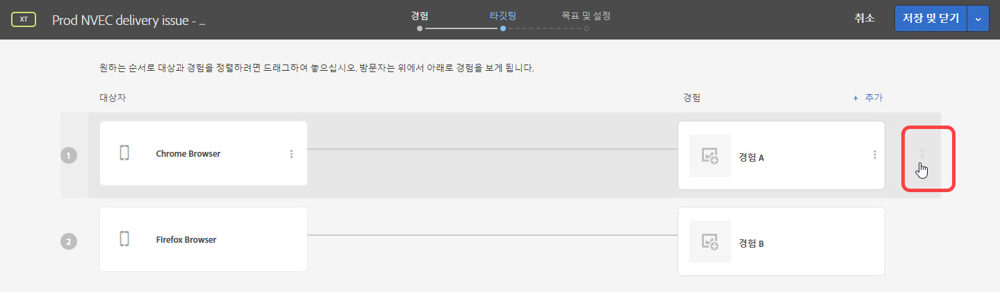 </p> <p>자세한 내용은 <a href="/help/c-activities/t-experience-target/t-xt-create/xt-add-experience.md#task_454646F2895242D3B92DC395A0CE1A00" format="dita" scope="local"> 경험 만들기 </a>를 참조하십시오. </p> </td> 
  </tr> 
  <tr> 
   <td colname="col1"> <p>보고: A/B, XT 및 권장 사항 </p> </td> 
   <td colname="col2"> <p>A/B, XT 및 권장 사항 활동에 대한 보고서에는 신뢰 구간 및 상승도를 시각적으로 확인하여 승자를 보다 정확히 결정할 수 있도록 하는 시각적 표현이 포함됩니다. 표현 위로 마우스로 가져가 실제 수치를 볼 수 있습니다. 이 기능은 Analytics를 보고 소스로 사용 (A4T) 하는 활동에는 사용할 수 없습니다. </p> <p>  </p> <p>자세한 내용은 <a href="/help/c-reports/c-report-settings/report-settings.md#concept_4BB6A7FDAB6F4806A632F9CD989B8BFA" format="dita" scope="local"> 보고서 설정 </a>을 참조하십시오. </p> </td> 
  </tr> 
  <tr> 
   <td colname="col1" class="premium"> <p>AP (Automated Personalization) 활동 </p> </td> 
   <td colname="col2"> <p>AP 활동에서 제외 그룹을 만들어 지정된 오퍼가 있는 경험이 자동으로 제외되도록 할 수 있습니다. </p> </td> 
  </tr> 
  <tr> 
   <td colname="col1" class="premium"> <p>권장 사항: 기준 및 프로모션 </p> </td> 
   <td colname="col2"> <p><b>(2017년 6월 22일에 출시 예정)</b> 이제 프로필 속성 일치 및 매개 변수 일치를 기준으로 다이내믹 기준 및 프로모션을 만들 수 있습니다. </p> <p>  </p> <p>자세한 내용은 <a href="/help/c-recommendations/c-algorithms/use-dynamic-and-static-inclusion-rules.md#concept_4CB5C0FA705D4E449BD0B37B3D987F9F" format="dita" scope="local"> 동적 및 정적 포함 규칙 사용 </a>을 참조하십시오. </p> <p> <p>참고: Target 17.6.1 릴리스(2017년 6월) 이전에 포함 규칙이 구성되는 방식을 잘 알고 있다면 일부 선택 사항과 연산자가 변경되었음을 알 수 있을 것입니다. 선택한 선택 사항에 적용 가능한 연산자만 표시되고, 일부 연산자의 이름은 더 일관되고 직관적이게 변경되었습니다("일치"(matches)는 이제 "다음과 같음"(equals)임). 이번 릴리스 이전에 만들어진 모든 기존 제외 규칙은 새 구조로 자동 마이그레이션됩니다. 여러분 쪽에서는 구조를 조정할 필요가 없습니다. </p> </p> </td> 
  </tr> 
  <tr> 
   <td colname="col1"> <p>활동 이름 지정 </p> </td> 
   <td colname="col2"> <p>활동을 저장하기 전에 이름을 지정하라는 메시지가 표시됩니다. 이름을 지정하지 않으면 활동을 저장할 수 없습니다. </p> </td> 
  </tr> 
  <tr> 
   <td colname="col1"> <p>Target 포럼의 새 위치 </p> </td> 
   <td colname="col2"> <p> Target 포럼이 새 <a href="https://forums.adobe.com/community/experience-cloud/marketing-cloud/target" format="https" scope="external"> Adobe 커뮤니티 플랫폼 </a>으로 이동되었습니다. </p> </td> 
  </tr> 
 </tbody> 
</table>

### Target Standard/Premium 17.4.1(2017년 4월 27일) {#section_24E6889AF1E0405497F6F77A407A9A46}

이번 릴리스에는 다음과 같은 기능 및 개선 사항이 포함되었습니다.

<table id="table_9554D0094421417C88548BDC97B710F5"> 
 <thead> 
  <tr> 
   <th colname="col1" class="entry"> 기능 </th> 
   <th colname="col2" class="entry"> 세부 사항 </th> 
  </tr> 
 </thead>
 <tbody> 
  <tr> 
   <td colname="col1"> 보고 </td> 
   <td colname="col2"> <p><b>다중 목표/지표 보기:</b> 이제 A/B 및 XT (경험 타기팅) 활동에서 여러 지표를 볼 수 있습니다. 단, A/B <a href="/help/c-activities/automated-traffic-allocation/automated-traffic-allocation.md#concept_A1407678796B4C569E94CBA8A9F7F5D4" format="dita" scope="local"> 자동 할당 </a> 및 A/B <a href="/help/c-activities/auto-target/auto-target-to-optimize.md" format="dita" scope="local"> 자동 타겟 </a> 활동은 제외합니다. </p> <p>자세한 내용은 <a href="/help/c-reports/c-report-settings/view-multiple-metrics.md#concept_9E3C3F6F3EC1412FAF252975AC0720B7" format="dita" scope="local"> 한 보고서의 여러 지표 보기 </a>를 참조하십시오. </p> </td> 
  </tr> 
 </tbody> 
</table>

이번 [!DNL Target] 릴리스는 백엔드 수정 사항에 주안점을 두며, 다음과 같은 고객용 개선 사항 및 수정 사항을 포함합니다(괄호 안에 있는 문제 번호는 내부 Adobe용임).

* 활동에 대한 고급 설정에 포함된 &quot;증분 카운트, 사용자 해제 및 재입력 허용&quot; 설정이 제대로 작동하지 않도록 하는 문제가 수정되었습니다. (TNT-26556)
* 고객 속성 데이터가 Experience Cloud 사용자 인터페이스에서 NULL로 업데이트된 후 Target에서 제거되지 않도록 하는 문제가 수정되었습니다. (TNT-26462)

### 타겟 플랫폼 변경(2017년 4월 13일) {#section_B59C26405EB7482AA80820D6D39B9C44}

<table id="table_6167ECB7B44F40DCADF299F46F1F795C"> 
 <thead> 
  <tr> 
   <th colname="col1" class="entry"> 변경 </th> 
   <th colname="col2" class="entry"> 세부 사항 </th> 
  </tr> 
 </thead>
 <tbody> 
  <tr> 
   <td colname="col1"> <p> <span class="filepath"> at.js </span> </p> </td> 
   <td colname="col2"> <p> 이제 <span class="filepath"> at.js </span> 버전 0.9.6을 사용할 수 있습니다. 자세한 내용은 <a href="/help/c-implementing-target/c-implementing-target-for-client-side-web/how-to-deployatjs/implementing-target-without-a-tag-manager.md#concept_1E1F958F9CCC4E35AD97581EFAF659E2" format="dita" scope="local"> at.js 다운로드 </a>를 참조하십시오. </p> <p>다음 개선 사항 및 수정 사항이 <span class="filepath"> at.js </span> 버전 0.9.6에 포함되어 있습니다. </p> <p> 
     <ul id="ul_108DF85393614C69988E299485D338FD"> 
      <li id="li_4117C900982240B5AFFCFE1B2716A443"> <p>A4T에 대해 리디렉션 오퍼가 지원됩니다. <span class="filepath"> at.js </span> 버전 0.9.6을 다운로드하여 설치한 후에는 <span class="keyword"> Adobe Analytics </span>를 <span class="keyword"> Target </span> 에 대한 보고 소스로 사용하는 (A4T) 활동에서 리디렉션 오퍼를 사용할 수 있습니다. <span class="filepath"> at.js </span> 버전 0.9.6 외에, 리디렉션 오퍼 및 A4T를 사용하기 위해 구현이 충족해야 하는 다른 최소 요구 사항도 있습니다. 자세한 내용 및 알고 있어야 하는 추가 중요한 정보는 <a href="/help/c-integrating-target-with-mac/a4t/r-a4t-faq/a4t-faq-redirect-offers.md#concept_21BF213F10E1414A9DCD4A98AF207905" format="dita" scope="local"> 리디렉션 오퍼 - A4T FAQ </a>를 참조하십시오. </p> </li> 
      <li id="li_DA5321D72E81496DB7C49D589E1A59C4"> <p>방문자 API가 페이지에 있고 <span class="codeph"> visitorApiTimeout </span> 설정이 너무 적극적이었던 <span class="filepath"> at.js </span> 0.9.6 이전에는 Target에서 <span class="keyword"> Target </span> 요청에 MCID 데이터를 전송하지 않는 상황이 발생할 수 있었습니다. 이로 인해 A4T를 사용할 때 <span class="keyword"> Analytics </span> 에서 연결되지 않은 히트 발생과 같은 문제가 나타날 수 있습니다. </p> <p>이 동작은 <span class="filepath"> visitorApiTimeout </span> 이 1ms로 설정되어 있더라도 Target은 SDID, 추적 서버 및 고객 ID를 수집한 후 Target 요청에 전송하려고 하므로 <span class="codeph"> at.js </span> 0.9.6에서 변경되었습니다. </p> </li> 
      <li id="li_B11CE11D9A594CB1ABB85BD0D93C4A15"> <p><span class="codeph"> selectorsPollingTimeout </span> 설정이 추가되었습니다. 자세한 내용은 <a href="/help/c-implementing-target/c-implementing-target-for-client-side-web/cmp-atjs-functions.md#concept_8DACBC47ABDE4279BB102B42609FE506" format="dita" scope="local"> targetGlobalSettings() </a>를 참조하십시오. </p> </li> 
      <li id="li_D6F862099A374FE394F4DA3520A1BBF0"> <p><span class="codeph"> getOffer() </span>의 응답 형식이 변경되었습니다. 자세한 내용은 <a href="/help/c-implementing-target/c-implementing-target-for-client-side-web/cmp-atjs-functions.md#reference_C81525D1598A4A1199740DCAB81A7FDF" format="dita" scope="local"> adobe.target.getOffer(options) </a>를 참조하십시오. </p> </li> 
      <li id="li_80166567ED8945ECB37FEEE2C5F06ACE"> <p>지원되지 않는 <span class="codeph"> &lt;!DOCTYPE&gt; </span> 선언에 대한 콘솔 로깅이 추가되었습니다. </p> </li> 
      <li id="li_02904EBAE8D3400092B762F0B28B0C86"> <p>여러 기본 오퍼가 단일 mbox에 전달된 경우 <span class="keyword"> Target Classic </span> 플러그인이 올바르게 적용되지 않던 문제가 수정되었습니다. (TGT-22664)</p> </li> 
      <li id="li_7016022D9DDE4529B77984F195825AB7"> <p>mbox 쿠키가 이러한 도메인에 대해 올바르게 설정되도록 하기 위해 두 문자로 이루어진 TLD(최상위 도메인)의 쿠키 설정이 개선되었습니다(예: <span class="filepath"> test.no </span>, <span class="filepath"> autodrives.ca </span>등). </p> </li> 
      <li id="li_3B1F618DEC744056B5BB172C4DBB359A"> <p>쿠키를 저장할 때 사용해야 하는 최상위 도메인을 추출하는 알고리즘이 <span class="codeph"> at.js </span> 버전 0.9.6에서 변경되었습니다. 이러한 변경으로 인해 쿠키를 IP를 사용하는 주소에 저장할 수 없습니다. 대부분의 경우 IP 주소는 테스트 용도로 사용되지만, 해결 방법으로 DNS 항목을 사용하거나, 로컬 상자에서 호스트 파일을 조정할 수 있습니다. </p> </li> 
      <li id="li_A52181499E63402DB4E16E33E36A9400"> <p>속성이 정수 대신 문자열 값일 때 이동 및 재정렬 작업 처리 방식이 수정되었습니다. </p> </li> 
     </ul> </p> <p>이 버전 및 이전 버전의 <span class="filepath"> at.js </span>에 대한 자세한 내용은 <a href="/help/c-implementing-target/c-implementing-target-for-client-side-web/target-atjs-versions.md#reference_DBB5EDB79EC44E558F9E08D4774A0F7A" format="dita" scope="local"> at.js 버전 세부 사항 </a>을 참조하십시오. </p> </td> 
  </tr> 
 </tbody> 
</table>

### Target Standard/Premium 17.3.1(2017년 3월 30일 - 업데이트 날짜: 2017년 4월 13일) {#section_5C13660A8AA34F35A9CBEFEEC88738D0}

이번 릴리스에는 다음과 같은 기능 및 개선 사항이 포함되었습니다.

<table id="table_4BA8DA701BC64427957355E144570EFE"> 
 <thead> 
  <tr> 
   <th colname="col1" class="entry"> 기능 </th> 
   <th colname="col2" class="entry"> 설명 </th> 
  </tr> 
 </thead>
 <tbody> 
  <tr> 
   <td colname="col1"> <p>Analytics for Target (A4T) </p> <p>리디렉션 오퍼 </p> </td> 
   <td colname="col2"> <p><b>업데이트 날짜: 2017년 4월 13일</b> </p> <p>이제 보고 소스로 <span class="keyword"> Analytics </span>를 사용하는 활동에서 리디렉션 오퍼를 사용할 수 있습니다. </p> <p>이러한 라이브러리는 리디렉션 오퍼가 있는 페이지 및 방문자가 리디렉션되는 페이지 둘 다에 포함되어야 합니다. 이렇게 변경하면 해당 활동에 대한 보고 소스로 Analytics를 사용하는지에 관계없이, 방문자 ID 서비스가 사이트에서 구현될 경우 새 URL 매개 변수가 리디렉션 URL에 자동으로 추가됩니다. </p> <p>자세한 내용은 <a href="/help/c-integrating-target-with-mac/a4t/r-a4t-faq/a4t-faq-redirect-offers.md#concept_21BF213F10E1414A9DCD4A98AF207905" format="dita" scope="local">리디렉션 오퍼 - A4T FAQ</a>를 참조하십시오. </p> </td> 
  </tr> 
  <tr> 
   <td colname="col1"> <p>대상자 </p> </td> 
   <td colname="col2"> <p>대상 타기팅에 대해 다음과 같은 기능이 개선되었습니다. </p> <p> 
     <ul id="ul_C920198404654C97A33190A29ACA6990"> 
      <li id="li_DB52EF909C9640649981940460CDF2B5"> <p><b>주 및 일 분할:</b> <span class="wintitle"> 주 및 일 분할 </span> 옵션을 설정하여 대상 타기팅에 대한 반복 패턴을 만들 수 있습니다. </p> <p>자세한 내용은 <a href="/help/c-target/c-audiences/c-target-rules/time-frame.md#concept_0FE1E8DACD104F8B870B0BADE3197F0A" format="dita" scope="local"> 시간대 </a>를 참조하십시오. </p> </li> 
      <li id="li_2541A6EF2D604CE098012A16909C237E"> <p><b> 조합된 대상에서 제외:</b> 이제 여러 대상을 조합할 때 제외 규칙을 추가하고 대상을 제외할 수 있습니다. </p> <p>자세한 내용은 <a href="/help/c-target/combining-multiple-audiences.md#concept_A7386F1EA4394BD2AB72399C225981E5" format="dita" scope="local"> 여러 대상 결합 </a>을 참조하십시오. </p> </li> 
     </ul> </p> </td> 
  </tr> 
  <tr> 
   <td colname="col1" class="premium"> <p>권장 사항 </p> </td> 
   <td colname="col2"> <p><b>다이내믹 프로모션:</b> 이제 Target 권장 사항은 프로모션에 대해 다이내믹 일치를 지원합니다. </p> <p>자세한 내용은 <a href="/help/c-recommendations/c-algorithms/use-dynamic-and-static-inclusion-rules.md#concept_4CB5C0FA705D4E449BD0B37B3D987F9F" format="dita" scope="local"> 동적 및 정적 포함 규칙 사용 </a>을 참조하십시오. </p> </td> 
  </tr> 
 </tbody> 
</table>

>[!NOTE]
>
>Target 17.3.1 릴리스(2017년 3월 30일)에 포함된 보고서에서 여러 지표를 보는 기능이 예기치 않은 동작으로 인해 제거되었습니다. 이 기능은 향후 릴리스에서 다시 사용할 수 있게 될 예정입니다.

이 [!DNL Target] 릴리스에는 다음 개선 사항 및 수정 사항이 포함되어 있습니다.

* [!DNL Target] 사용자 인터페이스가 A4T([!UICONTROL Analytics for Target])을 보고 소스로 사용하는 활동에서 리디렉션 오퍼를 지원하도록 업데이트되었습니다. 이 기능을 사용하려면 곧 출시될 예정인 [!DNL at.js] 0.9.6이 필요합니다.
* [!DNL Target] 사용자 인터페이스가 다음을 비롯한 일부 위치에서 업데이트되었습니다.

   * 보고서 및 활동의 일부 옵션([!UICONTROL 편집], [!UICONTROL 피드 공유], [!UICONTROL 경험 URL 보기] 등)은 이제 [!UICONTROL 추가 선택 사항] 아이콘()을 클릭하여 액세스할 수 있습니다

      .
   * 이제 [!UICONTROL 오퍼] 라이브러리에서 오퍼는 카드가 아닌 목록으로 표시됩니다. [!UICONTROL 오퍼] 라이브러리 UI 전체에서 UI가 약간 변경되었습니다.

* [!UICONTROL 활동] 및 [!UICONTROL 대상] 목록의 성능이 크게 개선되었습니다. 또한 검색 결과 로드 시간도 크게 단축되었습니다.
* 이제 [!UICONTROL Automated Personalization] 보고서의 [!UICONTROL 오퍼 수준 보고서] 에서 &quot;보기 수&quot;는 &quot;방문 수&quot;입니다.
* 이제 [!DNL Target] 에서는 [!UICONTROL Automated Personalization] 활동에 대한 환경(호스트 그룹) 전환을 지원합니다.
* [!UICONTROL Automated Personalization] 활동은 이제 호스트 그룹을 지원합니다.

### Target Standard/Premium 17.2.1(2017년 2월 21일) {#section_FC6412353DE64E848FFD5E8EFF72C7C7}

>[!NOTE]
>
>FP-11577을 사용하는 [!DNL Adobe Experience Manager] 6.2(또는 이상)에서는 이제 [!UICONTROL Adobe Target 클라우드 서비스] 통합을 통해 [!DNL at.js] 구현을 지원합니다. 자세한 [내용은](https://experienceleague.adobe.com/docs/) [Adobe Experience Manager 6.2](https://experienceleague.adobe.com/docs/) 설명서에서 *기능 팩 및 Adobe Target과 통합을* 참조하십시오.

이번 [!DNL Target] 릴리스는 사용 편의성과 성능 개선에 주안점을 두며, 다음과 같은 개선 사항 및 수정 사항이 포함되어 있습니다(괄호 안에 있는 문제 번호는 내부 Adobe용임).

* [!DNL Target] 사용자 인터페이스의 오른쪽 상단에서 액세스할 수 있는 도움말 메뉴에 추가 항목이 추가되었습니다. 새 옵션에는 &quot;블로그&quot; 및 &quot;비디오&quot;가 포함됩니다. &quot;Adobe Experience Cloud 상태&quot; 옵션은 이제 &quot;Adobe Target Standard/Premium 상태&quot;로 표시됩니다. (TGT-22629)
* 대상을 삭제하면 [!DNL Target] 에는 해당 대상을 참조하는 활동 목록이 표시됩니다. 목록의 각 활동을 클릭하여 해당 [!UICONTROL 개요] 페이지를 표시할 수 있습니다. (TGT-17997)
* 사용자가 현재 세션에서 캠페인/활동과 상호 작용하지 않더라도 사용자가 참여하는 모든 캠페인/활동에 대한 캠페인 ID를 반환하도록 `user.activeCampaigns` 이 개선되었습니다. (TNT-26237)
* 이제 모든 활동 이름이 목록에 로드되기 전에 [!UICONTROL 활동] 페이지에 있는 [!UICONTROL 활동 만들기] 버튼이 활성 상태입니다. 이러한 개선을 통해 특히, 계정에 구성된 활동이 많은 경우 새 활동을 더 빠르게 만들 수 있습니다. (TGT-21470)
* 프록시를 통해 액세스하는 HTTPS 실행 웹 사이트의 로드 시간을 단축하도록 EEC(고급 경험 작성기)가 개선되었습니다. Target은 더 이상 프록시를 통해 정적 리소스를 가져오지 않습니다. (TGT-21793)
* 특히, 활동에 대해 많은 지표가 정의될 경우 로드 시간이 단축되는 것처럼, [!UICONTROL 목표 및 설정] 페이지의 성능이 개선되었습니다. (TGT-21654)
* 활동 페이지에 at.js(버전 0.9.1 이상)가 로드된 경우 추적 서버가 필요하지 않음을 사용자에게 알리는 [!UICONTROL Analytics for Target (A4T)] 보고를 사용하여 모든 [!UICONTROL 활동의 목표 및 설정] 페이지에 도구 설명이 추가되었습니다. (TGT-22607)
* 이제 사용자가 전체 지표 이름을 보기 위해 각 지표를 확장하지 않아도 지표 이름이 [!UICONTROL 목표 및 설정] 페이지에 표시됩니다. 이를 통해 사용자는 지표를 보다 빠르고 효율적으로 편집할 수 있습니다. (TGT-21276)
* 이제 다른 기준과 마찬가지로 [!DNL Recommendations] 포함 규칙을 사용자 지정 기준(CSV를 통해 업로드됨)에 적용할 수 있습니다. (TGT-21896)
* 특히, 폴더를 생성 또는 관리하고 오퍼를 만들 때 [!UICONTROL 오퍼] 페이지의 사용자 인터페이스가 개선되고 보다 편리해졌습니다. (TGT-22509 및 TGT-22187)
* 숨기려는 항목을 선택할 때 VEC([!UICONTROL 시각적 경험 작성기])의 사용자 경험이 개선되었습니다.
(TGT-22224)
* [!UICONTROL 양식 기반 경험 작성기]를 사용하여 활동을 만들 때 사용자 경험이 개선되었습니다. mbox 위치를 선택할 때 [!UICONTROL 다음]를 클릭하면 유효성 검사 테두리가 강조 표시된 상태를 유지합니다. (TGT-22221)
* 활성 오퍼와 삭제된 오퍼 간을 구분하도록 다운로드된 보고서가 개선되었습니다. (TGT-22449)
* Experience Cloud Assets 핵심 서비스 사용자 인터페이스에서 제한 없이 스크롤되는 에셋 목록에 이전 에셋이 표시되지 않도록 하는 문제가 수정되었습니다. (TGT-19733)
* 다운로드한 CSV 보고서에서 예외적인 주문 설정이 적용되지 않는 문제가 수정되었습니다. (TGT-21871)
* 예외적인 주문이 다운로드된 [!UICONTROL 주문 세부 사항]CSV 보고서에 올바르게 표시되지 않은 문제가 수정되었습니다. (TGT-22500)
* 보고서가 올바른 주문 날짜를 표시하더라도 다운로드된 [!UICONTROL 캠페인 감사] CSV 보고서에 잘못된 주문 시간이 표시되도록 하는 문제가 수정되었습니다. (TNT-26469)
* 다중 페이지 활동에서 [!UICONTROL JavaScript 비활성화] 옵션이 제대로 작동되지 못하게 하는 문제가 수정되었습니다. (TGT-15130)
* 자동으로 만든 글로벌 mbox(`target-global-mbox`) 이외의 mbox와 함께 양식 기반 경험 작성기를 사용한 다음, 참여 지표를 성공 지표로 선택하는 경우, 지표는 활동에 해당 mbox가 사용된 페이지에서만 증분됩니다. 예를 들어 mbox가 `homepage_mbox`이면 [!UICONTROL 방문당 페이지 수] 지표는 해당 방문 동안 `homepage_mbox` 에 대한 히트 수입니다.

   이 항목을 원하는 것이 아니면 활동에 다른 위치를 추가하고 해당 위치에 글로벌 mbox를 지정한 후 기본 콘텐츠를 제공할 수 있습니다. 이 해결 방법을 수행하면 글로벌 mbox가 활동에 연결되며 Target에서 보고를 위해 해당 지표를 카운트할 수 있게 됩니다.

### 타겟 플랫폼 변경 사항(2017년 1월 18일) {#section_EA41802B2B24426FBA88D25E17DBE360}

<table id="table_3A2CD47252894F119B0E60BF6A9285B0"> 
 <thead> 
  <tr> 
   <th colname="col1" class="entry"> 변경 </th> 
   <th colname="col2" class="entry"> 세부 사항 </th> 
  </tr> 
 </thead>
 <tbody> 
  <tr> 
   <td colname="col1"> <p> <span class="codeph"> at.js </span> 버전 0.9.4 </p> </td> 
   <td colname="col2"> <p>2017년 1월 18일 </p> <p> <span class="codeph"> at.js </span> 버전 0.9.4에는 다음 변경 사항이 포함되어 있습니다. </p> <p> 
     <ul id="ul_8F149C28E2D946B9888B4D2F45167C3C"> 
      <li id="li_93E866BBFE374E93BCDB65BCFAC33B62"> <p> 이제 mbox 이름에는 앰퍼샌드(&amp;)를 비롯한 특수 문자가 포함될 수 있습니다. (TNT-26144) </p> <p>자세한 내용은 <a href="/help/c-implementing-target/c-implementing-target-for-client-side-web/how-to-deployatjs/implementing-target-without-a-tag-manager.md#concept_2FA0456607D04F82B0539C5BF5309812" format="dita" scope="local"> at.js 구성 </a>을 참조하십시오. </p> </li> 
      <li id="li_99309046030B4D93B59113C01A8789DA"> <p>. <span class="codeph"> at.js에서 </span> HTTPS만 사용되는지 또는 페이지 프로토콜을 기준으로 HTTP와 HTTPS 간을 전환할 수 있는지를 나타내는 <span class="codeph"> secureOnly </span> 설정이 추가되었습니다. 이 설정은 기본값이 False이고 <span class="codeph"> targetGlobalSettings </span>를 통해 대체할 수 있는 고급 설정입니다. (TNT-26183) </p> <p>자세한 내용은 <a href="/help/c-implementing-target/c-implementing-target-for-client-side-web/cmp-atjs-functions.md#concept_8DACBC47ABDE4279BB102B42609FE506" format="dita" scope="local"> targetGlobalSettings() </a>를 참조하십시오. </p> </li> 
      <li id="li_D84D578C43A24D4896795999F841CEB8"> <p>. <span class="wintitle"> at.js </span> 버전 0.9.3 및 이전 버전에서 <span class="codeph"> 레거시 브라우저 지원 </span> 옵션을 사용할 수 있습니다. 이 옵션은 <span class="codeph"> at.js </span> 버전 0.9.4에서 제거되었습니다. </p> <p>자세한 내용은 <a href="/help/c-implementing-target/c-implementing-target-for-client-side-web/how-to-deployatjs/implementing-target-without-a-tag-manager.md#concept_2FA0456607D04F82B0539C5BF5309812" format="dita" scope="local"> at.js 구성 </a>을 참조하십시오. </p> </li> 
     </ul> </p> <p>각 버전의 <span class="codeph"> at.js </span>변경 사항에 대한 자세한 내용은 <a href="https://experienceleague.adobe.com/docs/target/using/implement-target/client-side/target-atjs-versions.html" format="html" scope="external"> at.js 버전 세부 사항 </a>을 참조하십시오. </p> </td> 
  </tr> 
 </tbody> 
</table>

### Target Standard/Premium 17.1.1(2017년 1월 19일) {#section_88AFA2F54CF24DF7822CFEBB07DFABE2}

이번 릴리스에는 다음과 같은 기능 및 개선 사항이 포함되었습니다.

<table id="table_4F7D4A71F5DF4E8782C7DBEEEF24AD04"> 
 <thead> 
  <tr> 
   <th colname="col1" class="entry"> 기능 </th> 
   <th colname="col2" class="entry"> 설명 </th> 
  </tr> 
 </thead>
 <tbody> 
  <tr> 
   <td colname="col1"> <p>콘텐츠/오퍼 </p> </td> 
   <td colname="col2"> <p>이제 오퍼에 대해 다음 개선 사항을 사용할 수 있습니다. </p> <p> 
     <ul id="ul_7D8E81443E0F48B6A0C1D1DF6F27D292"> 
      <li id="li_EA529EF4EBC2416E9D3B9E7251E7AAAB"> <p>콘텐츠 페이지의 이름이 오퍼로 변경되었습니다. 또한 이미지 오퍼를 코드 오퍼와 분리하기 위해 오른쪽에 두 개의 탭이 제공됩니다. </p> <p>이번 릴리스 이전에는 코드 및 이미지가 동일한 폴더에 들어 있으면 자동으로 2개의 중복된 폴더로 분할됩니다. </p> </li> 
      <li id="li_9574FA6BDCFB4BAB938273BF7F4B21C8"> <p>Target Classic, AEM(Adobe Experience Manager), AMS(Adobe Mobile Services) 및 API를 통해 만든 오퍼는 이제 Target Standard/Premium 사용자 인터페이스에 표시됩니다. Target Classic에서 만든 오퍼를 Target Standard/Premium에서 편집할 수 있습니다. (TGT-15738) </p> <p> 이러한 방법을 사용하여 지난 2년 동안 업데이트된 오퍼가 Target Standard/Premium(즉, 2015년 1월 이후)에 표시됩니다. </p> </li> 
      <li id="li_CAD67C9EBB564525ABD2269D918275F8"> <p>이제 소스 및 유형별로 오퍼를 필터링할 수 있습니다. </p> </li> 
     </ul> </p> <p>자세한 내용은 <a href="/help/c-experiences/c-manage-content/manage-content.md#concept_17874A6FCBB743AA84C5988E8571CCF3" format="dita" scope="local"> 오퍼 </a>를 참조하십시오. </p> <p>지리적 위치 타기팅이 다음과 같이 개선되었습니다. </p> <p> 
     <ul id="ul_DD8B50F980B8447A8C37EA96530D8949"> 
      <li id="li_348E04AB29B14E6F83E3A7E7BF7D75B8"> <p>이제 오퍼, 플러그인 등에서 <span class="codeph"> profile.geolocation </span> 값을 토큰으로 바로 사용할 수 있습니다. (TNT-25967) </p> </li> 
     </ul> </p> <p>자세한 내용은 <a href="/help/c-target/c-audiences/c-target-rules/geo.md#concept_5B4D99DE685348FB877929EE0F942670" format="dita" scope="local"> 지역 </a>을 참조하십시오. </p> </td> 
  </tr> 
  <tr> 
   <td colname="col1"> <p>보고 </p> <p> <p>참고: 이러한 개선 사항은 A4T (Analytics for Target) 보고서에 적용되지 않습니다. </p> </p> </td> 
   <td colname="col2"> <p>이제 Target CSV 보고서에 대해 다음과 같은 개선된 보고 기능을 사용할 수 있습니다. </p> <p> 
     <ul id="ul_ACFCA821B120419EA252EF5031309D52"> 
      <li id="li_0B634602BB044AEDB26DAF78189AB833"> <p>보고서에 대한 사용자 인터페이스가 재디자인되었습니다. </p> </li> 
      <li id="li_309435D10AE84E8795C4CCC1F36747F7"> <p>이제 Target 보고서에는 이전 데이터를 제거하도록 보고 데이터를 재설정하는 옵션이 제공됩니다. (TGT-5933) </p> </li> 
      <li id="li_9D30BFCC4CD6461B9DDCD5797A5E2B3A"> <p>보고에 대한 계산 방법론에 방문자 수(기본값), 방문 수 및 활동 노출 수가 포함됩니다. (TGT-10002) </p> </li> 
     </ul> </p> <p>자세한 내용은 <a href="/help/c-reports/c-report-settings/report-settings.md#concept_4BB6A7FDAB6F4806A632F9CD989B8BFA" format="dita" scope="local"> 보고서 설정 </a> 및 <a href="/help/c-reports/conversion-rate.md#concept_EC19BC897D66411BABAF2FA27BCE89AA" format="dita" scope="local"> 계산 방법론 </a>을 참조하십시오. </p> <p>이제 다운로드할 수 있는 CSV 보고서에 대해 다음과 같은 개선된 보고 기능을 사용할 수 있습니다. </p> <p> 
     <ul id="ul_18B0636A41B94F9F903ABFE3E13285DA"> 
      <li id="li_2422075AA0A34F868809C5D580FC5D4B"> <p>이제 오퍼 수준 CSV 보고서는 각 오퍼에 대한 추가 세부 사항을 제공합니다. (TGT-18995) </p> </li> 
      <li id="li_659D126E846348D4BE4544962F41539F"> <p>이제 다운로드된 오퍼 수준 CSV 파일은 항상 <span class="wintitle"> Automated Personalization </span> 보고서에 대한 제어 및 타기팅된 세그먼트의 데이터를 포함합니다. (TGT-22000) </p> </li> 
     </ul> </p> <p>이제 AP (Automated Personalization) 보고서에 대해 다음과 같은 개선된 보고 기능을 사용할 수 있습니다. </p> <p> 
     <ul id="ul_5743684487CD4905BA998C298FD423D7"> 
      <li id="li_EB48BA21E00C4878B4408D24DD23BA9C"> <p>Automated Personalization 활동에 대한 보고 로드 시간이 단축되었습니다. </p> </li> 
      <li id="li_B8ECCE250A674B83A66705AD5C45B9C3"> <p>이제 지속적 변수(수익 및 참여 지표 유형)의 신뢰 구간이 AP (Automated Personalization) 요약 보고서에 표시됩니다. </p> </li> 
     </ul> </p> </td> 
  </tr> 
  <tr> 
   <td colname="col1"> <p>활동 </p> </td> 
   <td colname="col2"> <p>이제 Target 활동에 대해 다음 개선 사항을 사용할 수 있습니다. </p> <p> 
     <ul id="ul_436556860E6C4AEEB35411A02E78A199"> 
      <li id="li_5CC3B995D0AF4B658B3D6C3F6895AA41"> <p>이제 <span class="keyword"> Adobe Mobile Services </span> 에서 만든 활동이 <span class="keyword"> Target Standard/Premium </span> 사용자 인터페이스 내에 표시됩니다. (TGT-10806) </p> <p>자세한 내용은 <a href="/help/c-activities/activities.md#concept_D317A95A1AB54674BA7AB65C7985BA03" format="dita" scope="local"> 활동 </a>을 참조하십시오. </p> </li> 
      <li id="li_684F9FC5CF414F4A892E6495352B5939"> <p>이제 다변량 테스트를 작성할 때, 경고 수신을 확인한 후 분석에 오프라인 보고를 사용해야 한다면 10% 이상의 경험을 테스트에서 제외할 수 있습니다. (TGT-21719) </p> <p>자세한 내용은 <a href="/help/c-activities/c-multivariate-testing/t-create-multivariate-test/preview-experiences.md#task_21A700587E88453A9FC2210C0DE53A28" format="dita" scope="local"> 다변량 테스트에 대한 경험 미리보기 </a>를 참조하십시오. </p> </li> 
      <li id="li_B2FC7414C76848B39AD6EA20EE483F06"> <p>이제 캠페인 ID가 각 활동의 개요 페이지에 표시됩니다. 따라서 API 및 문제 해결 작업이 편리해졌습니다. (TGT-20928) </p> </li> 
      <li id="li_5A9880AFE5FB46168D92255AA088B854"> <p>충돌 및 변경 로그 페이지의 디자인이 개선되었습니다. </p> </li> 
      <li id="li_1489EA6C30C94B2AB394189E5FAFF6F6"> <p>AP (Automated Personalization) 활동의 허용되는 최대 익명 오퍼 이름 길이가 30자에서 250자로 늘어났습니다. </p> </li> 
     </ul> </p> </td> 
  </tr> 
  <tr> 
   <td colname="col1"> <p>대상자 </p> </td> 
   <td colname="col2"> <p>이제 대상에 대해 다음 개선 사항을 사용할 수 있습니다. </p> <p> 
     <ul id="ul_F1D1F97266134D4ABE627CF2DCE2C6D4"> 
      <li id="li_99A611FCC1254D229D79B8FD075B952A"> <p> 이제 대상 타기팅 모바일 디바이스를 만들 때 드롭다운 목록에서 <span class="wintitle"> 디바이스 마케팅 이름 </span>을 내장 옵션으로 사용할 수 있습니다. </p> <p>이 변경을 통해 해당 디바이스 모델 번호를 검색하지 않고도 디바이스 모델 이름을 쉽게 선택할 수 있습니다. 예를 들어 Galaxy S7의 마케팅 디바이스 이름은 "Samsung Galaxy S7 Edge"이지만 디바이스 모델은 "SM-G9350"입니다. (TGT-18393) </p> <p>자세한 내용은 <a href="/help/c-target/c-audiences/c-target-rules/mobile.md#concept_2A794199DC1A4D349FFFBC7DCF1FEB89" format="dita" scope="local"> 모바일 </a>을 참조하십시오. </p> </li> 
     </ul> </p> </td> 
  </tr> 
  <tr> 
   <td colname="col1" class="premium"> <p>권장 사항 </p> </td> 
   <td colname="col2"> <p>권장 사항에 대해 다음과 같은 기능이 개선되었습니다. </p> <p> 
     <ul id="ul_9D3644890C0C472D8B485DE9A52898B3"> 
      <li id="li_1E5662348F6E4ABDB2B74FE3326F2FD3"> <p>이제 백업 알고리즘 결과 줄이 가장 많이 본 범주 및 가장 많이 구매한 CSV 다운로드에 포함됩니다. 백업 권장 사항은 "*"로 시작됩니다. </p> </li> 
      <li id="li_91DFD809378D4C20918F8F875747CE07"> <p>추가 상태를 통해 권장 사항 피드의 진행 상태를 알 수 있습니다. </p> <p>자세한 내용은 <a href="/help/c-recommendations/c-products/feeds.md#concept_1228B31E3D0B483B9DD42C5E2AE436E3" format="dita" scope="local">피드</a>를 참조하십시오. </p> </li> 
     </ul> </p> </td> 
  </tr> 
  <tr> 
   <td colname="col1"> <p>고급 VEC(시각적 경험 작성기) </p> </td> 
   <td colname="col2"> <p>고급 VEC(시각적 경험 작성기)에 대한 IP 주소가 업데이트되었습니다. </p> <p>VEC에 사용되는 IP 주소를 허용 목록에 포함할 경우 새 IP 주소를 추가하십시오. </p> <p>자세한 내용은 <a href="/help/c-experiences/c-visual-experience-composer/r-troubleshoot-composer/troubleshoot-composer.md#reference_77743144F10143A3A89D56E116D296E4" format="dita" scope="local"> 시각적 경험 작성기 문제 해결 </a>을 참조하십시오. </p> </td> 
  </tr> 
 </tbody> 
</table>

## 릴리스 2016 {#reference_607661929B504CCFAB3791B13C0DCDBE}

### Target Standard/Premium 16.10.2(2016년 11월 8일) {#section_2FDEFB3D56CC4BD7BC04DBEECFF6E942}

**수정 사항**

이번 릴리스에는 다음과 같은 수정 사항이 포함됩니다.

* [!DNL Recommendations] 에서 기본이 아닌 환경(호스트 그룹)에 대해 피드를 작성할 수 없는 문제가 해결되었습니다.
* 활동 동기화 오류를 줄이기 위해 몇 가지 사항이 개선되었습니다.
* A4T([!DNL Analytics for Target])를 사용하는 활동에 대해 더 이상 리디렉션 오퍼를 만들 수 없습니다.

### Target Standard/Premium 16.10.1(2016년 10월 25일) {#section_F76F7329FCAC452FB88F8BE0BA727044}

이번 릴리스에는 다음과 같은 기능 및 개선 사항이 포함되었습니다.

<table id="table_F8C01B2A9F07443490DB3025AC3AAC2A"> 
 <thead> 
  <tr> 
   <th colname="col1" class="entry"> 기능 </th> 
   <th colname="col2" class="entry"> 설명 </th> 
  </tr> 
 </thead>
 <tbody> 
  <tr> 
   <td colname="col1"> 자동 할당: 승자 배지 </td> 
   <td colname="col2"> <p>이제 A/B 자동 할당 활동에서 승자를 더 쉽게 판단할 수 있습니다. </p> <p>많은 마케터가 결과가 명확한 승자를 표시하기 전에 가장 성과가 좋은 경험을 조급하게 선언합니다. </p> <p><span class="wintitle"> 자동 트래픽 할당 </span> 기능을 사용하는 경우 <span class="keyword"> Target </span> 은 활동이 충분한 신뢰도로 최소 전환 횟수에 도달할 때까지 "아직 우승자 없음"을 나타내는 배지를 활동 페이지 맨 위에 표시합니다. 명백한 승자를 선언할 때에는 <span class="keyword"> Target </span> 에 "우승자: 경험 X"라고 표시됩니다. </p> <p>자세한 내용은 <a href="/help/c-activities/automated-traffic-allocation/automated-traffic-allocation.md#concept_A1407678796B4C569E94CBA8A9F7F5D4" format="dita" scope="local"> 자동화된 트래픽 할당 </a> 및 <a href="/help/c-activities/automated-traffic-allocation/determine-winner.md#concept_5741A89ED7224E1285A3BC34B2CCD0F9" format="dita" scope="local"> 우승자 결정 </a>을 참조하십시오. </p> <p> <p>참고: A/B 자동 할당 활동은 앞으로 A4T (Analytics for Target)에서 더 이상 지원되지 않을 예정입니다. 이번 릴리스에서는 A4T가 활성화된 A/B 자동 할당 활동이 <span class="wintitle"> 수동 </span> 모드로 전환됩니다(동일한 트래픽 할당). </p> </p> </td> 
  </tr> 
  <tr> 
   <td colname="col1"> 통신사별 Target 모바일 디바이스 </td> 
   <td colname="col2"> <p>모바일 통신사(Verizon, Sprint, AT&amp;T, T-Mobile 등)를 기준으로 타겟 모바일 디바이스에 대한 대상을 만듭니다. <span class="wintitle"> 모바일 통신사 </span> 옵션은 <span class="wintitle"> 지역 </span> 설정 아래에 있습니다. </p> <p>자세한 내용은 <a href="/help/c-target/c-audiences/c-target-rules/geo.md#concept_5B4D99DE685348FB877929EE0F942670" format="dita" scope="local"> 지역 </a>을 참조하십시오. </p> </td> 
  </tr> 
  <tr> 
   <td colname="col1"> Target UI에서 mboxTrace 인증 토큰 생성 </td> 
   <td colname="col2"> <p>임시 인증 토큰을 만들어 고급 <span class="keyword"> Target </span> 디버깅 도구를 활성화합니다. </p> <p>구현 <span class="uicontrol"> 세부 사항 </span> <span class="wintitle"> 페이지 </span> (<span class="uicontrol"> 관리 </span> &gt; <span class="uicontrol"> 구현 </span>)에서 인증 토큰 생성을 클릭합니다. 그런 다음, 문제 해결을 위해 결과 매개 변수를 웹 페이지 URL에 추가할 수 있습니다. </p> <p>자세한 내용은 <a href="/help/c-activities/c-troubleshooting-activities/content-trouble.md#concept_D2548B486C984B1E97ED7A72075B8EEA" format="dita" scope="local"> 콘텐츠 전달 문제 해결 </a>. </p> </td> 
  </tr> 
  <tr> 
   <td colname="col1" class="premium"> 권장 사항: 기준 집합 시퀀싱 </td> 
   <td colname="col2"> <p>방문자에게 제공되는 권장 사항을 보다 강력하게 제어하기 위해 최대 5개의 미리 만든 기준 집합을 단일 경험에서 사용합니다. </p> <p>자세한 내용은 <a href="/help/c-recommendations/c-algorithms/create-criteria-sequence.md"> 기준 시퀀스 만들기 </a>. </p> </td> 
  </tr> 
  <tr> 
   <td colname="col1" class="premium"> 권장 사항: 외부 프로모션 삽입 </td> 
   <td colname="col2"> <p>프로모션된 항목을 추가하고 권장 사항 디자인에서 해당 배치를 제어합니다. </p> <p>자세한 내용은 <a href="/help/c-recommendations/t-create-recs-activity/adding-promotions.md#task_CC5BD28C364742218C1ACAF0D45E0E14" format="dita" scope="local"> 프로모션 추가 </a>를 참조하십시오. </p> </td> 
  </tr> 
  <tr> 
   <td colname="col1" class="firstlook"> <p><b>우선 검토</b> </p> A/B 활동의 자동 타기팅 </td> 
   <td colname="col2"> <p> <p>참고: 이 "우선 검토" 제공은 테스트 및 피드백을 위해 이번 릴리스의 일부 고객에 대해 활성화됩니다. </p> </p> <p>올바른 방문자에게 올바른 경험을 제공하기 위해 A/B 테스트에서 경험을 자동으로 타기팅합니다. </p> <p>자세한 내용은 <a href="/help/c-activities/auto-target/auto-target-to-optimize.md" format="dita" scope="local"> 맞춤형 경험 자동 타겟 </a>을 참조하십시오. </p> </td> 
  </tr> 
 </tbody> 
</table>

### 타겟 플랫폼 변경(2016년 10월 10일) {#section_0761AED70C3E44EA9D8546107B162CC1}

<table id="table_E3E52A4362724D05A8472DB5F51A2429"> 
 <thead> 
  <tr> 
   <th colname="col1" class="entry"> 변경 </th> 
   <th colname="col2" class="entry"> 세부 사항 </th> 
  </tr> 
 </thead>
 <tbody> 
  <tr> 
   <td colname="col1"> <p> <span class="codeph"> at.js </span> 버전 0.9.3 </p> </td> 
   <td colname="col2"> <p>2016년 10월 10일 </p> <p> <span class="codeph"> at.js </span> 버전 0.9.3을 사용할 수 있습니다. </p> <p> 
     <ul id="ul_E4D300700390433E9EF8D5C9D3AA7669"> 
      <li id="li_E916EB3A77ED4CFF90CF6B4D30F188B1"> <p><span class="codeph"> at.js </span> 설정에서 레거시 브라우저가 비활성화될 경우 Microsoft Internet Explorer 11에서 mbox가 실행되도록 합니다. </p> </li> 
      <li id="li_1130509832CE429DB6DE636404CC54E1"> <p>다이내믹 원격 오퍼가 실패하는 경우(예를 들어 URL이 올바르지 않고 404 오류를 반환하는 경우) 기본 콘텐츠가 렌더링되도록 합니다. </p> </li> 
      <li id="li_21B5225D894B43CB863A775C937F66F4"> <p>DOM에서 VEC 클릭 추적 선택기를 찾을 수 없는 경우 요소가 빠르게 표시되도록 합니다. </p> </li> 
     </ul> </p> <p>자세한 내용은 <a href="/help/c-implementing-target/c-implementing-target-for-client-side-web/target-atjs-versions.md#reference_DBB5EDB79EC44E558F9E08D4774A0F7A" format="dita" scope="local"> at.js 버전 세부 사항 </a>을 참조하십시오. </p> </td> 
  </tr> 
 </tbody> 
</table>

### Target Standard/Premium 16.9.1(2016년 9월 22일) {#section_3CD20678B6254DE1A9BD41FDD2255DDD}

이번 릴리스에는 다음과 같은 기능 및 개선 사항이 포함되었습니다.

<table id="table_FED049F97C054CA895E0AEA3F2B180BF"> 
 <thead> 
  <tr> 
   <th colname="col1" class="entry"> 기능 </th> 
   <th colname="col2" class="entry"> 설명 </th> 
  </tr> 
 </thead>
 <tbody> 
  <tr> 
   <td colname="col1"> 대상 조합 </td> 
   <td colname="col2"> <p>활동 만들기 워크플로 동안 신속하게 여러 대상(<span class="keyword"> Adobe Experience Cloud </span> 대상 및 <span class="keyword"> Target </span> 대상)을 조합합니다. </p> <p>예를 들어 세 번째 영구 대상을 만드는 대신, 충성도 상태에 대한 특정 <span class="keyword"> Audience Manager </span> 세그먼트를 포함하여 모든 충성도 고객을 타기팅하고, 현재 세션 동안 충성도 프로그램에 등록한 사람들로 구성된 <span class="keyword"> Target </span> 세그먼트와 조합할 수 있습니다. </p> <p>자세한 내용은 <a href="/help/c-target/combining-multiple-audiences.md#concept_A7386F1EA4394BD2AB72399C225981E5" format="dita" scope="local"> 여러 대상 결합 </a>을 참조하십시오. </p> </td> 
  </tr> 
  <tr> 
   <td colname="col1"> 특정 기간의 Target 방문자 </td> 
   <td colname="col2"> <p>대상을 타기팅할 시작 및 종료 날짜를 추가합니다. </p> <p>예를 들어 위에서 언급한 새로운 결합된 임시 대상을 사용하는 경우 블랙 프라이데이 이전 3일 동안에 특정 콘텐츠에 돈을 덜 쓰는 대상과 블랙 프라이데이 이후에 다른 콘텐츠에 돈을 덜 쓰는 대상을 타기팅할 수 있습니다. </p> <p>자세한 내용은 <a href="/help/c-target/c-audiences/c-target-rules/time-frame.md#concept_0FE1E8DACD104F8B870B0BADE3197F0A" format="dita" scope="local"> 시간대 </a>를 참조하십시오. </p> </td> 
  </tr> 
  <tr> 
   <td colname="col1"> 스마트 컬렉션 저장 </td> 
   <td colname="col2"> <p>이제 <span class="wintitle"> 콘텐츠 </span> 페이지의 검색 기능에는 유사한 검색을 수행할 때 시간을 절약하기 위해 스마트 컬렉션이라는 저장된 폴더가 제공됩니다. </p> <p>자세한 내용은 <a href="/help/c-experiences/c-manage-content/filter-and-search-content.md#concept_3B59B8F025BF4CEA82ECC5199D365276" format="dita" scope="local"> 콘텐츠 검색 및 스마트 컬렉션 만들기 </a>를 참조하십시오. </p> </td> 
  </tr> 
  <tr> 
   <td colname="col1"> 양식 기반 경험 작성기 </td> 
   <td colname="col2"> <p>이미지에 대한 링크를 추가합니다. 링크는 클릭스루 링크, 대상 링크 또는 랜딩 링크일 수 있습니다. </p> <p>자세한 내용은 <a href="/help/c-experiences/form-experience-composer.md#task_FAC842A6535045B68B4C1AD3E657E56E" format="dita" scope="local"> 양식 기반 경험 작성기 </a>를 참조하십시오. </p> </td> 
  </tr> 
 </tbody> 
</table>

**향상된 기능**

이번 릴리스에는 다음과 같은 개선 사항이 포함됩니다.

| 개선 사항 | 설명 |
|---|---|
| 시각적 경험 작성기(VEC) | 개선된 오류 메시지입니다. |

**알려진 문제**

* 시각적 경험 작성기에서 사용자 지정 코드와 함께 사용할 경우 [!UICONTROL JavaScript를 사용하여 렌더링] 옵션은 현재 지원되지 않습니다.

### 타겟 플랫폼 변경 사항(2016년 9월) {#section_1955146045A247D393DB824669A2A916}

<table id="table_8FDAEED5D84C4C718AB863BD6C383F20"> 
 <thead> 
  <tr> 
   <th colname="col1" class="entry"> 변경 </th> 
   <th colname="col2" class="entry"> 세부 사항 </th> 
  </tr> 
 </thead>
 <tbody> 
  <tr> 
   <td colname="col1"> <p> <span class="codeph"> at.js </span> 버전 0.9.2 </p> </td> 
   <td colname="col2"> <p>2016년 9월 21일 </p> <p> <span class="codeph"> at.js </span> 버전 0.9.2를 사용할 수 있습니다. </p> <p> 
     <ul id="ul_0778A9049C9D48A7B6CB4B79A95F0F4C"> 
      <li id="li_689FF306179F4EC3B391DEE3C53F4B1D"> <p>Device Graph 옵트아웃을 활성화하거나 비활성화하는 <span class="codeph"> optoutEnabled </span> 설정이 추가되었습니다. 이 설정이 <span class="codeph"> true </span> 로 설정되고 방문자가 추적을 옵트아웃한 경우 방문자의 브라우저는 mbox 호출을 수행하지 않습니다. Device Graph는 현재 Beta 버전입니다. 이 설정은 기본적으로 <span class="codeph"> false </span> 로 설정되지만 Device Graph를 사용하는 경우에는 <span class="codeph"> true </span> 로 설정되어야 합니다.</p> </li> 
      <li id="li_663462C0680049F89CA8FE1853F31807"> <p>알림 메커니즘에 대한 <span class="codeph"> CustomEvent </span> 지원이 추가되었습니다. 이전에는 <span class="codeph"> at.js </span> 이벤트 알림 메커니즘을 <span class="codeph"> document.addEventListener() </span>와 같은 표준 DOM API를 통해 사용할 수 없었습니다. 이제 <span class="codeph"> document.addEventListener() </span>를 사용하여 요청 이벤트 및 콘텐츠 렌더링 이벤트와 같은 <span class="codeph"> at.js </span> 이벤트에 가입할 수 있습니다. </p> </li> 
      <li id="li_3FB2914F8D2F4AFFAA9B4622E8CA1EFF"> <p>VEC(시각적 경험 작성기)에서 만든 오퍼와 관련된 문제가 수정되었습니다. 이번 릴리스 이전에 Target은 선택기를 숨기고, 모든 선택기가 선택될 때만 숨김을 해제했습니다. <span class="codeph"> at.js </span> 0.9.2 Target은 일치하는 선택기가 확인되면 바로 숨김을 해제합니다. </p> </li> 
     </ul> </p> <p>자세한 내용은 <a href="/help/c-implementing-target/c-implementing-target-for-client-side-web/target-atjs-versions.md#reference_DBB5EDB79EC44E558F9E08D4774A0F7A" format="dita" scope="local"> at.js 버전 세부 사항 </a>을 참조하십시오. </p> </td> 
  </tr> 
 </tbody> 
</table>

### Target Standard/Premium 16.9.1(2016년 9월 22일) {#section_60ADF842E4A0424E8D2A81FB8B813A7A}

이번 릴리스에는 다음과 같은 기능 및 개선 사항이 포함되었습니다.

<table id="table_896218AECE4C4EC691B76E79CC7DC356"> 
 <thead> 
  <tr> 
   <th colname="col1" class="entry"> 기능 </th> 
   <th colname="col2" class="entry"> 설명 </th> 
  </tr> 
 </thead>
 <tbody> 
  <tr> 
   <td colname="col1"> 대상 조합 </td> 
   <td colname="col2"> <p>활동 만들기 워크플로 동안 신속하게 여러 대상(<span class="keyword"> Adobe Experience Cloud </span> 대상 및 <span class="keyword"> Target </span> 대상)을 조합합니다. </p> <p>예를 들어 세 번째 영구 대상을 만드는 대신, 충성도 상태에 대한 특정 <span class="keyword"> Audience Manager </span> 세그먼트를 포함하여 모든 충성도 고객을 타기팅하고, 현재 세션 동안 충성도 프로그램에 등록한 사람들로 구성된 <span class="keyword"> Target </span> 세그먼트와 조합할 수 있습니다. </p> <p>자세한 내용은 <a href="/help/c-target/combining-multiple-audiences.md#concept_A7386F1EA4394BD2AB72399C225981E5" format="dita" scope="local"> 여러 대상 결합 </a>을 참조하십시오. </p> </td> 
  </tr> 
  <tr> 
   <td colname="col1"> 특정 기간의 Target 방문자 </td> 
   <td colname="col2"> <p>대상을 타기팅할 시작 및 종료 날짜를 추가합니다. </p> <p>예를 들어 위에서 언급한 새로운 결합된 임시 대상을 사용하는 경우 블랙 프라이데이 이전 3일 동안에 특정 콘텐츠에 돈을 덜 쓰는 대상과 블랙 프라이데이 이후에 다른 콘텐츠에 돈을 덜 쓰는 대상을 타기팅할 수 있습니다. </p> <p>자세한 내용은 <a href="/help/c-target/c-audiences/c-target-rules/time-frame.md#concept_0FE1E8DACD104F8B870B0BADE3197F0A" format="dita" scope="local"> 시간대 </a>를 참조하십시오. </p> </td> 
  </tr> 
  <tr> 
   <td colname="col1"> 스마트 컬렉션 저장 </td> 
   <td colname="col2"> <p>이제 <span class="wintitle"> 콘텐츠 </span> 페이지의 검색 기능에는 유사한 검색을 수행할 때 시간을 절약하기 위해 스마트 컬렉션이라는 저장된 폴더가 제공됩니다. </p> <p>자세한 내용은 <a href="/help/c-experiences/c-manage-content/filter-and-search-content.md#concept_3B59B8F025BF4CEA82ECC5199D365276" format="dita" scope="local"> 콘텐츠 검색 및 스마트 컬렉션 만들기 </a>를 참조하십시오. </p> </td> 
  </tr> 
  <tr> 
   <td colname="col1"> 양식 기반 경험 작성기 </td> 
   <td colname="col2"> <p>이미지에 대한 링크를 추가합니다. 링크는 클릭스루 링크, 대상 링크 또는 랜딩 링크일 수 있습니다. </p> <p>자세한 내용은 <a href="/help/c-experiences/form-experience-composer.md#task_FAC842A6535045B68B4C1AD3E657E56E" format="dita" scope="local"> 양식 기반 경험 작성기 </a>를 참조하십시오. </p> </td> 
  </tr> 
 </tbody> 
</table>

**향상된 기능**

이번 릴리스에는 다음과 같은 개선 사항이 포함됩니다.

| 개선 사항 | 설명 |
|---|---|
| 시각적 경험 작성기(VEC) | 개선된 오류 메시지입니다. |

**알려진 문제**

* 시각적 경험 작성기에서 사용자 지정 코드와 함께 사용할 경우 [!UICONTROL JavaScript를 사용하여 렌더링] 옵션은 현재 지원되지 않습니다.

### Adobe [!DNL Target] Standard/Premium 16.8.1(2016년 8월 23일) {#section_A8854D4EDF014AEBB81F49EB104D4A20}

Adobe Target Standard/Premium 16.8.1(2016년 8월 23일) 릴리스에는 다음과 같은 기능 및 개선 사항이 포함되어 있습니다.

<table id="table_AE048CB9EA1C4C7BBC2E9D90D26F7395"> 
 <thead> 
  <tr> 
   <th colname="col1" class="entry"> 기능 </th> 
   <th colname="col2" class="entry"> 설명 </th> 
  </tr> 
 </thead>
 <tbody> 
  <tr> 
   <td colname="col1"> <p>호스트 및 환경(호스트 그룹) 관리 </p> </td> 
   <td colname="col2"> <p>쉽게 관리하고 개별적으로 보고하려면 사이트와 사전 프로덕션 환경을 구성하십시오. </p> <p>관리하기 쉽도록 호스트는 환경으로 번들됩니다. 사전 설정된 환경에는 프로덕션, 스테이징 및 개발이 포함됩니다. 새 환경을 추가할 수도 있습니다. </p> <p>이 기능은 <span class="keyword"> Target Classic </span>으로 기능 패리티를 달성합니다. </p> <p>자세한 내용은 <a href="/help/administrating-target/hosts.md#concept_516BB01EBFBD4449AB03940D31AEB66E" format="dita" scope="local"> 호스트 </a>를 참조하십시오. </p> </td> 
  </tr> 
  <tr> 
   <td colname="col1"> <p>범주 친화성 </p> </td> 
   <td colname="col2"> <p>범주 관련성 기능을 사용하여 자동으로 사용자가 방문하는 범주를 캡처하고 범주에 대한 사용자의 관련성을 계산하여 범주를 타기팅하고 세그먼트화할 수 있습니다. 이 기능은 해당 정보에 대해 행동할 가능성이 가장 큰 방문자를 타겟으로 콘텐츠를 지정합니다. </p> <p>이 기능은 <span class="keyword"> Target Classic </span>으로 기능 패리티를 달성합니다. </p> <p>자세한 내용은 <a href="/help/c-target/c-visitor-profile/category-affinity.md#concept_75EC1E1123014448B8B92AD16B2D72CC" format="dita" scope="local"> 범주 친화성 </a>을 참조하십시오. </p> </td> 
  </tr> 
  <tr> 
   <td colname="col1"> <p>활동 수준에서 고급 경험 작성기 활성화/비활성화 </p> </td> 
   <td colname="col2"> <p>계정 수준(계정에서 만든 모든 활동에 적용) 또는 개별 활동 수준에서 <span class="wintitle"> 고급 경험 작성기 </span>를 활성화/비활성화합니다. </p> <p>이전에는 계정 수준에서만 고급 경험 작성기를 활성화/비활성화할 수 있었습니다. </p> <p>자세한 내용은 <a href="/help/c-experiences/experiences.md#concept_A2E10F6AFB3D4AEAB6951EE14688848D" format="dita" scope="local"> 경험 </a>. </p> </td> 
  </tr> 
  <tr> 
   <td colname="col1"> <p class="premium">Automated Personalization: 오퍼 성과 보고서 </p> </td> 
   <td colname="col2"> <p>모든 Automated Personalization 활동 성공 지표를 포함하는 오퍼 성과 보고서를 다운로드합니다. </p> </td> 
  </tr> 
 </tbody> 
</table>

**향상된 기능**

이번 릴리스에는 다음과 같은 개선 사항이 포함됩니다.

<table id="table_E2E4BE72BD79413A821C6A6D1A3AB0F8"> 
 <thead> 
  <tr> 
   <th colname="col1" class="entry"> 개선 사항 </th> 
   <th colname="col2" class="entry"> 설명 </th> 
  </tr> 
 </thead>
 <tbody> 
  <tr> 
   <td colname="col1"> <p>코드 편집기 UI 재디자인 </p> </td> 
   <td colname="col2"> <p>코드 편집기 UI가 좀 더 간편하고 사용하기 쉽게 업데이트되었습니다. </p> <p>자세한 내용은 <a href="/help/c-experiences/c-visual-experience-composer/c-vec-code-editor/vec-code-editor.md#concept_B3A6E9EE3A60406DB640E205EA1745B5" format="dita" scope="local"> 코드 편집기 </a>. </p> </td> 
  </tr> 
 </tbody> 
</table>

다음과 같은 알려진 문제가 보고되었습니다.

* [!UICONTROL 범주 친화성] 기능에 대한 일부 UI 텍스트가 영어로만 표시됩니다. 다른 언어 텍스트는 9월 [!DNL Target] 릴리스에서 지원될 예정입니다.

### 타겟 플랫폼 변경 사항(2016년 7월) {#section_09C18773707B4059852A41C764F817E4}

<table id="table_33B60910EAE24BAFA778F280F72FB683"> 
 <thead> 
  <tr> 
   <th colname="col1" class="entry"> 변경 </th> 
   <th colname="col2" class="entry"> 세부 사항 </th> 
  </tr> 
 </thead>
 <tbody> 
  <tr> 
   <td colname="col1"> <p> <span class="filepath"> at.js </span> 버전 0.9.1 </p> </td> 
   <td colname="col2"> <p>2016년 7월 14일 </p> <p> 현재 <span class="filepath"> at.js </span> 버전 0.9.1을 사용할 수 있습니다. </p> <p>자세한 내용은 <a href="/help/c-implementing-target/c-implementing-target-for-client-side-web/target-atjs-versions.md#reference_DBB5EDB79EC44E558F9E08D4774A0F7A" format="dita" scope="local"> at.js 버전 세부 사항 </a>을 참조하십시오. </p> </td> 
  </tr> 
 </tbody> 
</table>

### Adobe [!DNL Target] Standard/Premium 16.7.1(2016년 7월 21일) {#section_DB583EF9A30247A488EE319583911F22}

Adobe Target Standard/Premium 16.7.1(2016년 7월 21일) 릴리스에는 다음과 같은 기능 및 개선 사항이 포함되어 있습니다.

<table id="table_EBA34BD2F5C745DD9EC5231AD79F6C00"> 
 <thead> 
  <tr> 
   <th colname="col1" class="entry"> 기능 </th> 
   <th colname="col2" class="entry"> 설명 </th> 
  </tr> 
 </thead>
 <tbody> 
  <tr> 
   <td colname="col1"> 활동에 대한 우선순위 설정 </td> 
   <td colname="col2"> <p>이제 여러 활동이 동일한 대상을 가진 동일한 위치에 지정되는 경우, 활동 우선순위 수준을 0 -999 범위에서 설정하여 표시되는 활동을 보다 상세하게 제어할 수 있습니다. </p> <p>이 옵션은 <span class="wintitle"> 관리 </span> &gt; <span class="wintitle"> 보고 </span> 에서 활성화해야 합니다. </p> <p>세분화된 우선순위 옵션은 A/B 테스트, Automated Personalization, 경험 타기팅 다변량 테스트 활동에 적용됩니다. </p> <p>자세한 내용은 다음 주제를 참조하십시오. </p> <p> 
     <ul id="ul_FD92CD06CF25480887AC171274262E18"> 
      <li id="li_D321FAED82944D2685DA69EB310D80BE"><b>A/B 테스트: </b> <a href="/help/c-activities/t-test-ab/t-test-create-ab/ab-goals-and-settings.md#reference_B25389FD6F3A4989801E740364B089CC" format="dita" scope="local"> 목표 및 설정 </a> </li> 
      <li id="li_12ECDFD71DB94E22A85AB13B487E8503"><b>Automated Personalization: </b> <a href="/help/c-activities/t-automated-personalization/automated-personalization.md#task_8AAF837796D74CF893CA2F88BA1491C9" format="dita" scope="local"> Automated Personalization </a> </li> 
      <li id="li_84B893C214994246AB36E28E84C51460"><b>경험 타기팅: </b> <a href="/help/c-activities/t-experience-target/t-xt-create/xt-goals-and-settings.md#reference_B25389FD6F3A4989801E740364B089CC" format="dita" scope="local"> 목표 및 설정 </a> </li> 
      <li id="li_26533B659C0E49D6A6D3B3FEBE9CA930"><b>다변량 테스트: </b> <a href="/help/c-activities/c-multivariate-testing/t-create-multivariate-test/goals-and-settings.md#reference_B25389FD6F3A4989801E740364B089CC" format="dita" scope="local"> 목표 및 설정 </a> </li> 
      <li id="li_FBACF2B73B2E491BBB85618153AC4568"><b>활동: </b> <a href="/help/c-activities/activity-settings.md#task_C6B2FF8374724933BE79A83549B9CD02" format="dita" scope="local"> 활동 설정 </a> </li> 
     </ul> </p> </td> 
  </tr> 
  <tr> 
   <td colname="col1" class="premium"> 다중 값 권장 사항 속성 </td> 
   <td colname="col2"> <p>이제 모든 사용자 지정 <span class="keyword"> 권장 사항 </span> 속성에 여러 엔티티 값을 지정할 수 있습니다. </p> <p>자세한 내용은 <a href="/help/c-recommendations/c-products/custom-entity-attributes.md#concept_E5CF39BCAC8140309A73828706288322" format="dita" scope="local"> 사용자 지정 엔티티 속성 </a>을 참조하십시오. </p> </td> 
  </tr> 
  <tr> 
   <td colname="col1"> 다이내믹/원격 오퍼 지원 </td> 
   <td colname="col2"> <p>다이내믹 콘텐츠는 <span class="keyword"> Target Standard/Premium </span>에서 양식 기반 활동의 일부일 수 있습니다. 다이내믹 콘텐츠는 <span class="keyword"> Target </span> 외부에 저장됩니다. </p> <p>자세한 내용은 <a href="/help/c-experiences/c-manage-content/about-remote-offers.md#concept_657016A0E6174C22B89036E9C8A0170F" format="dita" scope="local"> 원격 오퍼 만들기 </a>를 참조하십시오. </p> </td> 
  </tr> 
  <tr> 
   <td colname="col1"> 대상 및 프로필 스크립트 복사 </td> 
   <td colname="col2"> <p>이제 기존 대상을 복사한 후 편집하여 유사한 대상을 만들 수 있습니다. </p> <p>자세한 내용은 <a href="/help/c-target/c-audiences/create-audience.md#task_E18BD77A9A8F4ED0AC50569F94556558" format="dita" scope="local"> 대상자 만들기 </a>. </p> <p>기존 프로필 스크립트를 복사할 수도 있습니다. </p> <p>자세한 내용은 <a href="/help/c-target/c-visitor-profile/profile-parameters.md#concept_8C07AEAB0A144FECA8B4FEB091AED4D2" format="dita" scope="local"> 프로필 스크립트 속성 </a>. </p> </td> 
  </tr> 
  <tr> 
   <td colname="col1"> 클래스를 사용하여 요소 선택기 결정 </td> 
   <td colname="col2"> <p>이제 Automated Personalization 및 다변량 테스트 활동에서 클래스 또는 ID를 기준으로 요소 선택기를 선택할 수 있습니다. 이전 버전에서는 A/B 테스트 활동에만 이 옵션을 사용할 수 있었습니다. </p> <p>자세한 내용은 <a href="/help/c-experiences/c-visual-experience-composer/vec-selectors.md#concept_4EB7663E255F439B8D24079D23479337" format="dita" scope="local"> 시각적 경험 작성기에 사용된 요소 선택기 </a>. </p> </td> 
  </tr> 
  <tr> 
   <td colname="col1" class="premium"> 권장 사항: 콘텐츠 유사성 </td> 
   <td colname="col2"> <p> 콘텐츠 유사성 규칙을 사용하여 항목이나 미디어 속성을 기반으로 한 권장 사항을 만드십시오. </p> </td> 
  </tr> 
 </tbody> 
</table>

<table id="table_699755B33F8F48ECABB6FC7E78289A79"> 
 <thead> 
  <tr> 
   <th colname="col1" class="entry"> 개선 사항 </th> 
   <th colname="col2" class="entry"> 설명 </th> 
  </tr> 
 </thead>
 <tbody> 
  <tr> 
   <td colname="col1"> <p>개선된 보고 기능 </p> </td> 
   <td colname="col2"> <p>이제 성공 지표 보고서 다운로드에 ID 대신 지표 및 세그먼트 이름이 표시됩니다. </p> </td> 
  </tr> 
  <tr> 
   <td colname="col1" class="premium"> Automated Personalization 활동의 각 요청에 대해 mbox 항목 조건 평가 </td> 
   <td colname="col2"> <p>Automated Personalization 활동에서 보다 정확한 오퍼 전달을 위해 각 요청에 대해 항목 기준(URL 타기팅, 템플릿 규칙, 대상 타겟)이 평가됩니다. </p> <p>자세한 내용은 <a href="/help/c-activities/t-automated-personalization/automated-personalization.md#task_8AAF837796D74CF893CA2F88BA1491C9" format="dita" scope="local"> Automated Personalization </a>를 참조하십시오. </p> </td> 
  </tr> 
 </tbody> 
</table>

### Adobe [!DNL Target] Standard/Premium 16.6.1(2016년 6월 16일) {#section_C1E9F43111BF4160AF31482CD53E00BD}

6월에 계획된 고객용 릴리스는 없습니다.

**수정 사항**

이번 릴리스에는 다음과 같은 수정 사항이 포함됩니다.

* 일부 고객이 시각적 경험 작성기 내에서 페이지를 편집하려고 할 때 흰색 화면이 표시되던 문제가 수정되었습니다.

**알려진 문제**

다음과 같은 알려진 문제가 보고되었습니다.

* 다중 페이지 활동에서 페이지 A에 대해 &quot;JavaScript 사용 안 함&quot;을 선택하면 다른 페이지에 대해 &quot;JavaScript 사용 안 함&quot;을 선택하지 않았더라도 모든 위치에서 JavaScript가 사용되지 않도록 설정됩니다.
* 리디렉션이 적용된 경험에 대한 경험 미리보기 URL에 문제가 있습니다. 이 문제를 해결하려면 경험 작성기에서 **[!UICONTROL 구성]**&#x200B;을 클릭하고 **[!UICONTROL 다중 대상]**&#x200B;을 선택한 후 유일한 대상으로 **[!UICONTROL 모든 방문자]**&#x200B;를 추가합니다. 계속해서 활동을 저장합니다. 활동의 전달은 변경되지 않지만 미리보기가 제대로 작동합니다. 이 문제는 Adobe Target의 7월 릴리스에서 수정될 예정입니다.

* 설명서에는 리디렉션 URL 확인란의 예상되는 동작이 나와 있습니다. 그러나 버그로 인해 확인란이 기본적으로 선택된 상태로 표시되지 않습니다. 이 결함은 곧 수정될 예정입니다.

   리디렉션 오퍼가 있는 기존 활동에서 이 옵션을 선택하려면 다음 해결 방법을 사용하십시오.

   1. URL로 리디렉션 팝업을 엽니다.
   1. URL을 더미 URL로 변경한 후 저장합니다.
   1. 더미 URL을 캠페인의 예상 리디렉션 URL로 다시 변경합니다.
   1. &quot;현재 쿼리 매개 변수 포함&quot; 옵션을 선택하고 저장합니다.

   새 리디렉션 오퍼를 만드는 동안 이 옵션을 선택하는 경우, 리디렉션에 쿼리 매개 변수가 포함될 것으로 예상할 수 있습니다.

   이전 활동의 경우 활동의 경험 작성기에서 이 옵션을 선택하면 리디렉션에 쿼리 매개 변수가 포함되게 됩니다. 이 옵션을 선택하지 않으면 현재 쿼리 매개 변수가 리디렉션에 포함되지 않습니다.

### Adobe [!DNL Target] Standard/Premium 16.5.1(2016년 5월 19일) {#section_406CE09317994F55A26C2FDB77C77FEA}

Adobe Target Standard/Premium 16.5.1(2016년 5월 19일) 릴리스에는 다음과 같은 기능 및 개선 사항이 포함되어 있습니다.

<table id="table_DDC5356FD6B8443EAA6EB81C03ADF73A"> 
 <thead> 
  <tr> 
   <th colname="col1" class="entry"> 기능 </th> 
   <th colname="col2" class="entry"> 설명 </th> 
  </tr> 
 </thead>
 <tbody> 
  <tr> 
   <td colname="col1"> 경험 버전 </td> 
   <td colname="col2"> <p>이제 다른 대상으로 타기팅된 버전을 A/B 활동의 경험 내에서 설정할 수 있습니다. </p> <p><a href="/help/c-activities/t-test-ab/t-test-create-ab/target-experience-to-multiple-audiences.md#task_0138112E283A4A5B9F8AB9AAF2FBC2FF" format="dita" scope="local">다중 대상자에게 경험을 타겟하기</a>를 참조하십시오. </p> </td> 
  </tr> 
  <tr> 
   <td colname="col1"> QA/미리보기 URL </td> 
   <td colname="col2"> <p>이제 양식 기반 경험 작성기에 대해 미리보기 URL을 사용할 수 있습니다. </p> <p><a href="/help/c-activities/t-automated-personalization/experience-preview.md#task_586C6655A6FD4AF08F5678FC3F481EFC" format="dita" scope="local">경험 URL 보기</a>를 참조하십시오. </p> </td> 
  </tr> 
  <tr> 
   <td colname="col1" class="premium"> 권장 사항 사용자 지정 알고리즘 </td> 
   <td colname="col2"> <p>사용자 지정 알고리즘 매핑은 CSV 파일로 업로드할 수 있습니다. XML 기반 API를 더 이상 사용할 필요가 없습니다. </p> <p><a href="/help/c-recommendations/c-algorithms/recommendations-csv.md#task_1BBA49883E794670A09F0ABE1B3F4288" format="dita" scope="local">사용자 지정 기준 업로드</a>를 참조하십시오. </p> </td> 
  </tr> 
  <tr> 
   <td colname="col1"> Analytics for Target: Analytics 추적 서버 </td> 
   <td colname="col2"> <p>올바른 보고 추적을 위해 A4T (Analytics for Target)를 사용하는 활동을 만들거나 편집할 때 추적 서버를 지정해야 합니다. 기존 활동은 계속 현재 설정을 사용하여 실행됩니다. </p> <p><a href="/help/c-integrating-target-with-mac/a4t/analytics-tracking-server.md#task_72077BA7E93C4A65A715A18F32228823" format="dita" scope="local"> Analytics 추적 서버 사용 </a>을 참조하십시오. </p> </td> 
  </tr> 
  <tr> 
   <td colname="col1"> 새로운 지침 비디오 </td> 
   <td colname="col2"> <p>다음 지침 비디오가 도움말에 추가되었습니다. </p> <p> 
     <ul id="ul_47BAE946E764404497B7D81EE4C5D076"> 
      <li id="li_E16E50F94D3748E2985FB78F75140626">DTM을 사용하여 글로벌 mbox에 매개 변수 전달 </li> 
      <li id="li_A8CCDE3EFF25430580E6C372000CF964">DTM을 사용하여 Target 배포 </li> 
      <li id="li_8897F7B5930B448D87274CEDFCC75AE4">다변량 테스트 설정 </li> 
      <li id="li_2573DF52CE974ED0AF9EA433C97BC4C0">A/B 활동 만들기 </li> 
      <li id="li_52F28040D54D43E787B763E6AA998614">활동 유형 이해 </li> 
      <li id="li_577C8DDEB4CE429CA3C14BE5655F6E11">활동 설정 구성 </li> 
      <li id="li_2F7FCA657FD04E02ADD6E6964A8EA1F0">활동 타기팅 </li> 
      <li id="li_A08B8AFF48764D1B9EA706977F72AA66">대상자 만들기 </li> 
      <li id="li_493CDC3BEA5F4EA0821B971579177E03">대상 사용 </li> 
      <li id="li_19045C86E1524649B56F82416934EF13">콘텐츠 라이브러리 사용 </li> 
      <li id="li_8E89F3691A6F4400A2DFDFE5186DFA83">프로필 스크립트 사용 </li> 
      <li id="li_2EBB2B61BFA24F5FB858C0551AB20F70">계정 환경 설정 지정 </li> 
      <li id="li_E1886818C7BF4F36B07EC293F1A45911">시각적 경험 작성기 모드 이해 </li>  
      <li id="li_A87B876298344B2987BDC5FFD5580EC0">Target 사용자 만들기 및 관리 </li> 
      <li id="li_F90E1083444E4DBAA8C406AC293C0FD6">성공 지표 설정 </li> 
     </ul> </p> </td> 
  </tr> 
  <tr> 
   <td colname="col1"> 사용자 인터페이스 개선 </td> 
   <td colname="col2"> <p>시각적 경험 작성기 및 권장 사항 검색의 사용자 인터페이스가 개선되었습니다. </p> </td> 
  </tr> 
  <tr> 
   <td colname="col1" class="premium"> 권장 사항 CSV 다운로드 </td> 
   <td colname="col2"> <p>이제 CSV 다운로드에는 개체 권장 사항이 없는 환경을 포함하여 모든 환경에 대한 라인이 있습니다(예: 
     <code>
       # environment: 1724 
     </code>). </p> </td> 
  </tr> 
 </tbody> 
</table>

**향상된 기능**

A4T 프로비저닝 프로세스가 개선되었습니다.

**알려진 문제**

다음과 같은 알려진 문제가 보고되었습니다.

* 다중 페이지 활동에서 페이지 A에 대해 &quot;JavaScript 사용 안 함&quot;을 선택하면 다른 페이지에 대해 &quot;JavaScript 사용 안 함&quot;을 선택하지 않았더라도 모든 위치에서 JavaScript가 사용되지 않도록 설정됩니다.
* 리디렉션이 적용된 경험에 대한 경험 미리보기 URL에 문제가 있습니다. 이 문제를 해결하려면 경험 작성기에서 **[!UICONTROL 구성]**&#x200B;을 클릭하고 **[!UICONTROL 다중 대상]**&#x200B;을 선택한 후 유일한 대상으로 **[!UICONTROL 모든 방문자]**&#x200B;를 추가합니다. 계속해서 활동을 저장합니다. 활동의 전달은 변경되지 않지만 미리보기가 제대로 작동합니다. 이 문제는 Adobe Target의 7월 릴리스에서 수정될 예정입니다.

### 새 [!DNL Target] 구현 라이브러리, at.js 0.8.0(2016년 5월 5일) {#section_6A44C277E82D409AB6DCD0901F43794A}

at.js는 일반적인 웹 구현과 단일 페이지 애플리케이션 둘 다에 맞게 디자인된 새로운 Target용 구현 라이브러리입니다.

여러 가지 이점 중에서 at.js는 웹 구현에 대한 페이지 로드 시간을 향상시키고, 보안을 강화하고, 단일 페이지 애플리케이션에 대해 더 나은 구현 옵션을 제공합니다.

at.js에는 target.js에 포함된 구성 요소도 포함되어 있으므로 더 이상 target.js를 호출할 필요가 없습니다.

at.js를 구현할 때는 다음에 유의하십시오.

* Visual Experience Composer 리디렉션은 작동하지 않습니다.
* 버전 8 이전의 Internet Explorer 버전은 지원되지 않습니다.
* 비동기식 구현은 Test&amp;Target 및 SiteCatalyst 플러그인과 같은 이전 통합이 작동되지 않을 수 있음을 의미합니다.
* 모든 Target 호출은 XMLHTTPRequest를 통해 수행되고 콘텐츠는 JSON을 통해 반환됩니다.

### Adobe [!DNL Target] Standard/Premium 16.4.1 수정 사항(2016년 5월 5일) {#section_70552F61E83140C7B4D2A245198B630E}

* 이제 at.js v 0.8.0은 Target 인터페이스에서 다운로드할 수 있습니다.
* Target API가 변경되었습니다. 이제 `applyOffer` 에 `mbox param [0]`이 필요합니다.

   ```
   adobe.target.applyOffer({ 
       "mbox": "target-global-mbox", 
    "params": {"test": "true"}, 
       "selector": ".banner-text", 
       "offer": offer 
   });
   ```

### Adobe [!DNL Target] Standard/Premium 16.4.1(2016년 4월 21일) {#section_C968860FAB81485BA12BD588F4ECA401}

이번 릴리스에는 다음과 같은 기능 및 개선 사항이 포함되었습니다.

<table id="table_162CC5A0DB324B38A8A4252A18976686"> 
 <thead> 
  <tr> 
   <th colname="col1" class="entry"> 기능 </th> 
   <th colname="col2" class="entry"> 설명 </th> 
  </tr> 
 </thead>
 <tbody> 
  <tr> 
   <td colname="col1"> 사용자 인터페이스 개선 </td> 
   <td colname="col2"> <p>이번 릴리스에서는 사용자 인터페이스가 대폭 변경되었습니다. 주요 변경 사항은 다음과 같습니다. </p> <p> 
     <ul id="ul_28F382C60ADE43F5A3A4BD0CD5A5CE52"> 
      <li id="li_C47240826E5844D6843314F453F042FC">탐색 패널 위치가 왼쪽에서 위쪽으로 이동됨 </li> 
      <li id="li_3BB03504E98C40CC85583DCD9A4CEA06">대화 상자가 개선됨 </li> 
      <li id="li_AE71506DF1E748A788C40E1F09951732">활동 생성 흐름이 개선됨 </li> 
     </ul> </p> <p>Target을 비롯한 Experience Cloud 솔루션이 선택되는 방식도 변경되었습니다. Experience Cloud 솔루션 및 서비스에 액세스하려면 메뉴 아이콘 을 클릭합니다. </p> <p>  </p> <p>Experience Cloud에 로그인한 후에 Target에 액세스하고 Target을 기본 페이지로 만드는 방법에 대한 자세한 내용은 <a href="/help/c-intro/target-access-from-mac.md#task_5467C72DAFCB4BB583762CAAFC00A5CF" format="dita" scope="local"> Adobe Experience Cloud에서 Target에 액세스 </a>. </p></td> 
  </tr> 
  <tr> 
   <td colname="col1" class="premium"> 포함 규칙은 백업 권장 사항에 대해 사용되지 않도록 설정할 수 있습니다. </td> 
   <td colname="col2"> <p>백업 권장 사항이 사용되도록 설정되면 백업 권장 사항에 포함 규칙을 적용하지 않도록 선택할 수 있습니다. . </p>  </td> 
  </tr> 
  <tr> 
   <td colname="col1" class="premium"> Recommendations: <span class="codeph"> mboxTrace </span>를 통한 텍스트 영역의 새 디버깅 기능 </td> 
   <td colname="col2"> <p>URL에 <span class="codeph"> &amp;mboxTrace </span>를 추가하면 해당 페이지에 대한 권장 사항이 디버깅 세부 정보(제공된 권장 사항, 기준, 디자인, 제외, 포함, 제공되는 백업 권장 사항 등 포함)로 바뀝니다. </p> </td> 
  </tr> 
  <tr> 
   <td colname="col1" class="premium"> Recommendations API: 사용자 지정 기준에 대한 CSV 업로드 </td> 
   <td colname="col2"> <p>API를 통해 사용자 지정 기준에 대한 CSV를 업로드할 수 있습니다. </p> <p>향후 릴리스에서는 이 기능이 Target Premium 사용자 인터페이스에 추가될 예정입니다. </p>  </td> 
  </tr> 
  <tr> 
   <td colname="col1" class="premium"> Recommendations API: 새 디자인 API </td> 
   <td colname="col2"> <p>새 디자인 API를 사용하여 API를 통해 권장 사항 디자인을 관리할 수 있습니다. </p>  </td> 
  </tr> 
  <tr> 
   <td colname="col1" class="premium"> AP: 종속적 성공 지표 </td> 
   <td colname="col2"> 이제 자동화된 맞춤설정은 이전 성공 지표가 이미 충족된 경우에만 성공 지표가 계산되도록 제한하는 기능을 지원합니다. <p>자세한 내용은 <a href="/help/c-activities/r-success-metrics/success-metrics.md#reference_D011575C85DA48E989A244593D9B9924" format="dita" scope="local"> 성공 지표 </a>를 참조하십시오. </p> </td> 
  </tr> 
  <tr> 
   <td colname="col1" class="premium"> AP: 보고서 요약 보기 다운로드 </td> 
   <td colname="col2"> 이제 다운로드 옵션을 사용하여 사용 가능한 모든 성공 지표를 기준으로 분류된 요약 보기(예: 대조군 및 자동 트래픽 비교)를 다운로드할 수 있습니다. </td> 
  </tr> 
  <tr> 
   <td colname="col1"> 고객 속성은 오퍼에서 토큰으로 사용될 수 있습니다. </td> 
   <td colname="col2"> <p>이전에는 고객 속성을 <span class="codeph"> crs.get('&lt; <span class="varname"> 데이터 소스 이름 </span>&gt;.&lt; <span class="varname"> 속성 이름 </span>&gt;') </span> 형식으로 프로필 스크립트에서 참조할 수 있었습니다. </p> <p>이제 이러한 속성은 프로필 스크립트에서 토큰으로 사용되거나 프로필 스크립트가 없어도 오퍼에서 직접 토큰으로 사용될 수 있습니다. 토큰은 <span class="codeph"> $crs. <span class="varname"> datasourceName </span>. <span class="varname"> attributeName </span> </span>형식이어야 합니다. </p> <p><a href="/help/c-target/c-visitor-profile/variables-profiles-parameters-methods.md#section_62B4821EB6564FF4A14159A837AD4EDB" format="dita" scope="local"> CRS 토큰 </a>을 참조하십시오. </p> </td> 
  </tr> 
  <tr> 
   <td colname="col1"> 개선된 사용자 지정 코드 </td> 
   <td colname="col2"> 이제 사용자 지정 코드는 <span class="codeph"> &lt;head&gt; </span> 태그의 JavaScript 코드를 실행할 수 있습니다. 더 이상 코드 실행이 <span class="codeph"> &lt;body&gt; </span> 태그가 DOM에 존재할 때까지 지연되지 않습니다. 이전에는 선택기가 <span class="codeph"> &lt;body&gt; </span> 태그의 유일한 첫 번째 요소였습니다. </td> 
  </tr> 
  <tr> 
   <td colname="col1"> 새로운 지침 비디오 </td> 
   <td colname="col2"> 도움말에 지침 동영상이 추가되었습니다. 현재, <a href="/help/c-experiences/experiences.md#concept_A2E10F6AFB3D4AEAB6951EE14688848D" format="dita" scope="local"> 시각적 경험 작성기 및 양식 기반 경험 작성기 </a>에 대한 비디오를 시청할 수 있습니다. 향후 몇 주 이내에 더 많은 비디오가 추가될 예정입니다. </td> 
  </tr> 
 </tbody> 
</table>

**수정 사항**

이번 릴리스에는 다음과 같은 수정 사항이 포함됩니다.

* Visual Experience Composer가 Chrome에서 제대로 작동되지 않게 하는 Chrome 버전 48의 문제가 해결되었습니다. 이 수정 사항을 적용하려면 Chrome 버전 50으로 업데이트하십시오.

**알려진 문제**

다음과 같은 알려진 문제가 보고되었습니다.

* 다중 페이지 활동에서 페이지 A에 대해 &quot;JavaScript 사용 안 함&quot;을 선택하면 다른 페이지에 대해 &quot;JavaScript 사용 안 함&quot;을 선택하지 않았더라도 모든 위치에서 JavaScript가 사용되지 않도록 설정됩니다.

### Adobe [!DNL Target] Standard/Premium 16.3.1(2016년 3월 15일) {#section_A5A9B03A5CCD4213AD656BE722B5FF67}

이번 릴리스에는 다음과 같은 기능 및 개선 사항이 포함되었습니다.

<table id="table_F2A89DF1EAB443B4B4C7E0BC6118384B"> 
 <thead> 
  <tr> 
   <th colname="col1" class="entry"> 기능 </th> 
   <th colname="col2" class="entry"> 설명 </th> 
  </tr> 
 </thead>
 <tbody> 
  <tr> 
   <td colname="col1"> <p>우선 검토: </p> <p>새 Target 구현 라이브러리, at.js </p> </td> 
   <td colname="col2"> <p> <p>참고: 이 "우선 검토" 제공 서비스는 API 다운로드를 통해 사용할 수 있습니다. 이 서비스는 향후 릴리스에서 Target 인터페이스를 통해 사용할 수 있게 됩니다. 당분간은 at.js 라이브러리를 다운로드하고, 사용 환경에서 테스트하고, 프로덕션 Target 구현에 배포할 수 있습니다. </p> </p> <p> at.js는 일반적인 웹 구현과 단일 페이지 애플리케이션 둘 다에 맞게 디자인된 새로운 Target용 구현 라이브러리입니다. </p></p> <p>여러 가지 이점 중에서 at.js는 웹 구현에 대한 페이지 로드 시간을 향상시키고, 보안을 강화하고, 단일 페이지 애플리케이션에 대해 더 나은 구현 옵션을 제공합니다. </p> <p>at.js에는 target.js에 포함된 구성 요소도 포함되어 있으므로 더 이상 target.js를 호출할 필요가 없습니다. </p> <p>at.js를 구현할 때는 다음에 유의하십시오. </p> <p> 
     <ul id="ul_8C50C669AA7B4464A5FDECFCFD8662ED"> 
      <li id="li_6065B208480D46178055B40A2654E0C6">Visual Experience Composer 리디렉션은 작동하지 않습니다. </li> 
      <li id="li_A2FABD3C21994511A45DED84283E526E">버전 8 이전의 Internet Explorer 버전은 지원되지 않습니다. </li> 
      <li id="li_04499B391F784B89B09A1D6329B1C790">비동기식 구현은 Test&amp;Target 및 SiteCatalyst 플러그인과 같은 이전 통합이 작동되지 않을 수 있음을 의미합니다. </li>  
     </ul> </p> </td> 
  </tr> 
  <tr> 
   <td colname="col1"> 종속적 성공 지표 </td> 
   <td colname="col2"> <p>이 기능은 이전에 다른 성공 지표에 도달한 적이 있는 사용자만 성공 지표에 도달한 것으로 계산하는 성공 지표 기준 옵션을 제공합니다. </p> <p> 예를 들어 홈 페이지에서 영웅 이미지를 변경하는 테스트가 있을 수 있습니다. 마케터는 영웅 이미지를 클릭한 사람의 경우만 전환으로 계산하기를 원할 수 있습니다. 따라서 마케터는 "홈 페이지 영웅 클릭"에 대해 성공 지표를 설정하고 구매에 대해 다른 지표를 설정할 수 있습니다. 그런 후 마케터는 "구매" 지표에 대해 방문자가 "홈 페이지 영웅 클릭" 성공 지표에 먼저 도달하도록 하는 규칙을 추가할 수 있습니다. </p> <p> <p>참고: 성공 지표의 한 위치에 대해 대상 타기팅을 설정하면 해당 지표에 대해서는 이 기능이 지원되지 않습니다. </p> </p> <p> 종속적 성공 지표는 AB, XT 및 MVT 활동에서만 지원됩니다. 자동화된 맞춤설정 및 권장 사항 지원은 이후에 사용할 수 있게 될 예정입니다. </p> <p>자세한 내용은 <a href="/help/c-activities/r-success-metrics/success-metrics.md#reference_D011575C85DA48E989A244593D9B9924" format="dita" scope="local"> 성공 지표 </a>를 참조하십시오. </p> </td> 
  </tr> 
  <tr> 
   <td colname="col1"> 향상된 자동 할당 유용성 </td> 
   <td colname="col2"> <p>자동 할당 활동에 대한 모델이 준비된 후에는 UI에서 다음 작업을 수행할 수 없습니다. </p> <p> 
     <ul id="ul_52B790B2B0D746769A3471E09CE1A122"> 
      <li id="li_B9F0FFF019CE4CB697F5D0B60061DC27">"트래픽 할당" 모드를 "수동"으로 전환 </li> 
      <li id="li_C271B0BE4C5C4B06BB21703239E7B061">보고 소스를 "Adobe Target"에서 "Analytics"로 또는 그 반대로 변경 </li> 
      <li id="li_E023DDA7ED9142B58D54F42904ADC994">목표 지표 유형 변경 </li> 
      <li id="li_619F4765CEEC48E0A45E1821C282A082">"고급 설정" 패널에서 옵션 변경 </li> 
     </ul> </p> <p>자동 할당에 대해서는 <a href="/help/c-activities/automated-traffic-allocation/automated-traffic-allocation.md#concept_A1407678796B4C569E94CBA8A9F7F5D4" format="dita" scope="local"> 자동화된 트래픽 할당 </a> 설명서를 참조하십시오. </p> </td> 
  </tr> 
 </tbody> 
</table>

**알려진 문제**

다음과 같은 알려진 문제가 보고되었습니다.

* 다중 페이지 활동에서 페이지 A에 대해 &quot;JavaScript 사용 안 함&quot;을 선택하면 다른 페이지에 대해 &quot;JavaScript 사용 안 함&quot;을 선택하지 않았더라도 모든 위치에서 JavaScript가 사용되지 않도록 설정됩니다.
* Internet Explorer 10에서 화면 깜빡임과 속도 저하 등 인터페이스 관련 문제가 발생할 수 있습니다.
* Chrome 버전 48 업데이트는 Visual Experience Composer가 Chrome에서 제대로 작동할 수 없게 하는 문제를 야기합니다. Google을 사용하면 문제가 해결됩니다. 자세한 내용은 [https://code.google.com/p/chromium/issues/detail?id=582603](https://code.google.com/p/chromium/issues/detail?id=582603)을 참조하십시오. 이 문제를 해결하려면 다음을 수행하십시오.

   * Firefox 또는 Internet Explorer를 사용합니다.
   * **[!UICONTROL 관리]** > **[!UICONTROL 시각적 경험 작성기]** 탭 내에서 구성할 수 있는 고급 경험 작성기를 활성화합니다.

### Adobe [!DNL Target] Standard/Premium 16.2.1(2016년 2월 18일) {#section_47E5CEE2EED24CB3B71D7457673F3200}

이번 릴리스에는 다음과 같은 기능 및 개선 사항이 포함되었습니다.

| 기능 | 설명 |
|---|---|
| 비율별 활동 항목 타깃팅. | 이제 [A/B](/help/c-activities/t-test-ab/t-test-create-ab/test-create-ab.md) 및 [다변량](/help/c-activities/c-multivariate-testing/t-create-multivariate-test/create-multivariate-test.md#task_BF870FA60A8245AB8F0B775BE32EA710) 활동에 대한 항목 수를 방문자 또는 대상 구성원의 백분율로 제한할 수 있습니다. 예를 들어 항목 수를 모든 방문자의 50% 또는 &quot;캘리포니아&quot; 대상의 45%로 제한할 수 있습니다. |
| 자동 할당에서 매출, 주문 및 참여 지원 | 이제 자동 할당을 선택하고 A/B 활동의 목표로 매출(RPV), 주문 및 참여 지표를 선택할 수 있습니다. 이전에는 전환 지표만 지원되었습니다. [자동화된 트래픽 할당](/help/c-activities/automated-traffic-allocation/automated-traffic-allocation.md#concept_A1407678796B4C569E94CBA8A9F7F5D4)을 참조하십시오. |
| 소스별 필터링 | 이제 활동이 생성된 소스별로 활동 목록을 필터링할 수 있습니다. 선택 항목은 Adobe Target 및 Adobe Experience Manager입니다. [활동](/help/c-activities/activities.md#concept_D317A95A1AB54674BA7AB65C7985BA03)을 참조하십시오. |
| 향상된 자동화된 맞춤설정 성능 | 자동화된 맞춤설정이 많은 수의 오퍼/위치 조합에 대해 더 나은 성능을 제공하도록 재디자인되었습니다. |

**알려진 문제**

다음과 같은 알려진 문제가 보고되었습니다.

* 다중 페이지 활동에서 페이지 A에 대해 &quot;JavaScript 사용 안 함&quot;을 선택하면 다른 페이지에 대해 &quot;JavaScript 사용 안 함&quot;을 선택하지 않았더라도 모든 위치에서 JavaScript가 사용되지 않도록 설정됩니다.
* Internet Explorer 10에서 화면 깜빡임과 속도 저하 등 인터페이스 관련 문제가 발생할 수 있습니다.
* Chrome 버전 48 업데이트는 Visual Experience Composer가 Chrome에서 제대로 작동할 수 없게 하는 문제를 야기합니다. Google을 사용하면 문제가 해결됩니다. 자세한 내용은 [https://code.google.com/p/chromium/issues/detail?id=582603](https://code.google.com/p/chromium/issues/detail?id=582603)을 참조하십시오. 이 문제를 해결하려면 다음을 수행하십시오.

   * Firefox 또는 Internet Explorer를 사용합니다.
   * **[!UICONTROL 관리]** > **[!UICONTROL 시각적 경험 작성기]** 탭 내에서 구성할 수 있는 고급 경험 작성기를 활성화합니다.

### Adobe [!DNL Target] Standard/Premium 16.1.1(2016년 1월 28일) {#section_8BF7705B452C449F961AEFC568A0778C}

이번 릴리스에는 다음과 같은 기능 및 개선 사항이 포함되었습니다.

<table id="table_8525ECC9B6D0435ABEF8C27F747B7A0C"> 
 <thead> 
  <tr> 
   <th colname="col1" class="entry"> 기능 </th> 
   <th colname="col2" class="entry"> 설명 </th> 
  </tr> 
 </thead>
 <tbody> 
  <tr> 
   <td colname="col1"> 사용자 인터페이스 개선 </td> 
   <td colname="col2"> <p>작업목록과 대상 목록 디자인을 포함, 검색/정렬 기능도 개선되었습니다. 추가적인 사용자 인터페이스 변경이 향후 릴리스에 포함될 것입니다. </p> <p><a href="/help/c-activities/activities.md#concept_D317A95A1AB54674BA7AB65C7985BA03" format="dita" scope="local"> 활동 </a>을 참조하십시오. </p> </td> 
  </tr> 
  <tr> 
   <td colname="col1"> "슈퍼" 대상 </td> 
   <td colname="col2"> <p>대상을 구성할 때 중첩된 AND/OR 논리를 사용합니다. </p> <p>자세한 내용은 <a href="/help/c-target/c-audiences/create-audience.md#task_E18BD77A9A8F4ED0AC50569F94556558" format="dita" scope="local"> 대상자 만들기 </a>. </p> </td> 
  </tr> 
  <tr> 
   <td colname="col1"> 보고서에서 호스트 그룹 선택 </td> 
   <td colname="col2"> <p>호스트 그룹은 보고서에서 사용할 수 있습니다. </p> <p> <p>참고: 이 옵션은 Automated Personalization에 사용할 수 없습니다. </p> </p> </td> 
  </tr> 
  <tr> 
   <td colname="col1"> Internet Explorer 11 지원 </td> 
   <td colname="col2"> <p>Internet Explorer 11은 이제 타겟 인터페이스에서 지원됩니다. </p> <p><a href="/help/c-implementing-target/c-considerations-before-you-implement-target/supported-browsers.md#reference_01B4BF99E7D545A7998773202A2F6100" format="dita" scope="local"> 지원되는 브라우저 </a>를 참조하십시오. </p> </td> 
  </tr> 
  <tr> 
   <td colname="col1"> 연속 변수에 대한 타겟 보고서에서 신뢰 구간 보기 </td> 
   <td colname="col2"> <p>수익 통계 유형(RPV, AOV, 영업, 주문) 및 참여 지표에 대한 신뢰 구간 범위를 표시합니다. </p> <p>예를 들어 RPV = 200.00이고 CI 범위 = 50.00이면 RPV: 200.00 +/- 50.00에 대해 표시됩니다. </p> <p>이 변경 사항은 A/B, 경험 타기팅 및 다변량 테스트에 적용됩니다. </p> <p><a href="/help/c-reports/conversion-rate.md#concept_0D0002A1EBDF420E9C50E2A46F36629B" format="dita" scope="local"> 신뢰 수준 및 신뢰 구간 </a>을 참조하십시오. </p> </td> 
  </tr> 
  <tr> 
   <td colname="col1"> 시각적 경험 작성기 URL 규칙 개선 사항 </td> 
   <td colname="col2"> <p>이전에는 Visual Experience Composer의 URL 템플릿 규칙은 페이지 URL과 함께 OR 조건을 지정했습니다. 이제 여러 URL을 지정할 때 AND 또는 OR 중에서 선택할 수 있습니다. 기본값은 OR입니다. </p> </td> 
  </tr> 
  <tr> 
   <td colname="col1"> <p class="premium">권장 사항: </p> <p>글로벌 Mbox 배달 코딩의 변경 </p> </td> 
   <td colname="col2"> <p>디자인을 생성할 때 기본적으로 HTML 디자인이 <span class="codeph"> &lt;div&gt; </span> 요소에 래핑됩니다. </p> <p>디자인 만들기에 대한 내용은 <a href="/help/c-recommendations/c-design-overview/create-design.md#task_CC5BD28C364742218C1ACAF0D45E0E14" format="dita" scope="local"> 디자인 만들기 </a>를 참조하십시오. </p> </td> 
  </tr> 
  <tr> 
   <td colname="col1"> <p>LTV(Life Time Value) 시스템 학습 강화 기술 </p> </td> 
   <td colname="col2"> <p>이 새로운 알고리즘은 이 세션에서만 전환을 향상시키는 데 주안점을 두지 않고 많은 세션에 걸친 장기적 전환에 중점을 둡니다. 이 기술은 방문자와의 전체 상호 작용에서 전체 매출을 최적화하므로 재방문자가 많은 사이트에 적합합니다. </p> <p><a href="/help/c-activities/t-automated-personalization/automated-personalization.md#task_8AAF837796D74CF893CA2F88BA1491C9" format="dita" scope="local"> Automated Personalization </a>를 참조하십시오. </p> </td> 
  </tr> 
  <tr> 
   <td colname="col1"> <p>개선 사항: 해시(#) 단편에서 타기팅을 허용합니다 </p> </td> 
   <td colname="col2"> <p>이제 해시(#) 뒤에 나오는 URL 부분에서 타기팅할 수 있습니다. </p> <p><a href="/help/c-experiences/c-visual-experience-composer/temtest.md#task_2539D51A18044F82B0D9895636546781" format="dita" scope="local">비슷한 페이지에 동일한 경험 포함하기</a>와 기타 관련 항목을 참조하십시오. </p> </td> 
  </tr> 
  <tr> 
   <td colname="col1"> <p> 성공 지표 보고서 다운로드 </p> </td> 
   <td colname="col2"> <p> 최종 활동 목표만 포함하는 보고서가 아니라 모든 성공 지표가 표시된 단일 csv 파일을 다운로드합니다. </p> <p><a href="/help/c-reports/reports.md" format="dita" scope="local"> 보고서 </a>를 참조하십시오. </p> </td> 
  </tr> 
 </tbody> 
</table>

**수정 사항**

이번 릴리스에는 다음과 같은 수정 사항이 포함됩니다.

* 모든 AEM 기반 활동을 XT (경험 타기팅) 활동으로 발생시킨 문제를 수정했습니다. 이제 AEM은 A/B 및 XT 활동에 대해 올바른 활동 유형을 사용합니다.
* 전환 지표가 아닌 지표를 자동으로 지정된 새 활동의 목표로 사용하는 옵션을 제거했습니다. 이러한 제한이 예정된 릴리스에서 해제됩니다.
* Target Classic에서 만든 프로필 스크립트를 Target Standard에서 삭제할 수 없는 문제를 수정했습니다.
* 비 HTML Recommendations 템플릿을 양식 기반 워크플로에서 사용할 경우 `<div>` 요소에 래핑하는 문제를 수정했습니다.
* 많은 작업으로 인해 충돌 계산 시간이 초과되는 문제를 수정했습니다.
* CSV 다운로드에 성공 지표 보고서가 아닌 요약 보고서가 표시되는 문제를 수정했습니다.
* 요소를 편집할 때 가끔 나타나는 &quot;고유 ID&quot; 팝업 메시지가 제거되었습니다.

**알려진 문제**

다음과 같은 알려진 문제가 보고되었습니다.

* &quot;JavaScript 비활성화&quot;가 여러 페이지 작업의 pageA에 대해 활성화된 경우 JavaScript는 모든 페이지에 대해 활성화된 상태로 유지되지만 기능은 비활성화된 상태로 유지됩니다.
* Internet Explorer 10에서 화면 깜빡임과 속도 저하 등 인터페이스 관련 문제가 발생할 수 있습니다.
* Chrome 버전 48 업데이트는 Visual Experience Composer가 Chrome에서 제대로 작동할 수 없게 하는 문제를 야기합니다. Google을 사용하면 문제가 해결됩니다. 자세한 내용은 [https://code.google.com/p/chromium/issues/detail?id=582603](https://code.google.com/p/chromium/issues/detail?id=582603)을 참조하십시오. 이 문제를 해결하려면 다음을 수행하십시오.

   * Firefox 또는 Internet Explorer를 사용합니다.
   * **[!UICONTROL 관리]** > **[!UICONTROL 시각적 경험 작성기]** 탭 내에서 구성할 수 있는 고급 경험 작성기를 활성화합니다.

## 릴리스 2015 {#reference_8E940F500A374F9FBCD68CDE9E7E1A00}

### Adobe [!DNL Target] Standard/Premium 15.10.1(2015년 11월 2일) {#section_B5135D75FA0D42A1A3C2711CA3A1B812}

<!-- 

target/r_release-notes-2015.xml

 -->

이번 릴리스에는 다음과 같은 기능 및 개선 사항이 포함되었습니다.

<table id="table_EE13D9B959DA4FB0AD6BC03FBF78AEF6"> 
 <thead> 
  <tr> 
   <th colname="col1" class="entry"> 기능 </th> 
   <th colname="col2" class="entry"> 설명 </th> 
  </tr> 
 </thead>
 <tbody> 
  <tr> 
   <td colname="col1"> <p>A/B 테스트의 자동 할당 </p> </td> 
   <td colname="col2"> <p> 이제 트래픽을 자동으로 할당하여 전반적인 캠페인 상승도를 높이고 성공적인 경험을 더 빠르게 검색하는 옵션이 제공됩니다. 이 알고리즘은 A/B 테스트의 무결성을 유지하면서 전반적인 캠페인 성과를 높여 줍니다. </p> <p>이 알고리즘은 측정된 성과(예: 전환율) 및 신뢰 구간에 의존하여 시간당 최대 2회 변경되는 트래픽 분포를 생성합니다. </p> <p>핵심적인 이점 </p> <p> 
     <ul id="ul_A41C74C0C7C844F3A923CD6EA5D5D952"> 
      <li id="li_86D3C6A4993F4DC0907BF42986E6CCD1">수동 A/B 테스트의 경우와 마찬가지로 방문자가 동일한 경험에 남아 있는지 확인하여 A/B 테스트의 무결성 유지 </li> 
      <li id="li_B849EB2709F84831A1B7A4F312EAFA7E">수동 A/B 테스트보다 더 빠르게 통계적으로 유의한 우승자 찾기 </li> 
      <li id="li_3F258C6DEB7245E2924115C5628BC3C6">수동 A/B 테스트보다 더 높은 평균 캠페인 상승도 제공 </li> 
      <li id="li_C9E82388B93E4A298000984B69CBAEDE">언제든지 수동 테스트로 전환 가능 </li> 
     </ul> </p> <p><a href="/help/c-activities/automated-traffic-allocation/automated-traffic-allocation.md#concept_A1407678796B4C569E94CBA8A9F7F5D4" format="dita" scope="local"> 자동화된 트래픽 할당 </a>을 참조하십시오. </p> </td> 
  </tr> 
  <tr> 
   <td colname="col1"> <p>고객 속성 </p> </td> 
   <td colname="col2"> <p> Experience Cloud 핵심 서비스를 사용하여 고객 속성이라고 하는 퍼스트 파티 데이터를 업로드하고 Target과 공유할 속성을 선택합니다. 이 기능은 분석용으로 3월에 출시되었으며 현재 Target에 직접 통합됩니다. </p> <p> 예를 들어 CRM 또는 eCommerce/POS 시스템에서 멤버십 상태(gold, silver 등), 구매 내역, 즐겨찾는 대상, 로컬 저장소와 같은 고객 데이터를 사용할 수 있습니다. 이제 해당 데이터를 Experience Cloud에 업로드할 수 있습니다. 사용자가 사이트에서 인증을 받으면 Target은 해당 데이터가 웹 동작과 일치하는지 확인할 수 있습니다. </p> <p><a href="https://experienceleague.adobe.com/docs/core-services/interface/customer-attributes/attributes.html?lang=ko-KR" format="https" scope="external"> 고객 속성 </a>을 참조하십시오. </p> </td> 
  </tr> 
  <tr> 
   <td colname="col1"> <p>Target의 보고 소스로 Analytics를 선택할 때 여러 회사를 사용할 수 있습니다. </p> </td> 
   <td colname="col2"> <p>Target의 보고 소스로 Analytics를 선택하는 경우 Target 활동 데이터를 수신할 Analytics 보고서 세트를 선택합니다. 이렇게 하려면 먼저 사용자 계정이 연결된 Analytics 회사 중에서 선택한 다음 활동에 대한 보고서 세트를 선택합니다. Adobe Target에 연결하기 위해 제공된 보고서 세트만 선택할 수 있습니다. 예상하는 보고서 세트가 표시되지 않으면 먼저 Adobe Experience Cloud에서 로그아웃했다가 다시 로그인한 후 다시 시도하십시오. 보고서 세트가 목록에 여전히 표시되지 않으면 고객 지원 센터에 문의하십시오. </p> </td> 
  </tr> 
  <tr> 
   <td colname="col1"> <p>대상 생성을 위한 새 내장 옵션 </p> </td> 
   <td colname="col2"> <p>다음과 같은 내장 대상 옵션이 새로 추가되었습니다. </p> <p> 
     <ul id="ul_16E7B53E324B4FB79E1B1E97A1CE65AC"> 
      <li id="li_60B55A81119E48FE83639B9740A2FD21">브라우저에서 사용하는 언어를 기준으로 하는 Target 방문자. 지리 기반의 언어 타기팅보다 더 정확합니다. </li> 
      <li id="li_84CAAE7E02CA48FA9C7C00C0415046B6">사용 중인 브라우저만이 아닌 브라우저 버전을 기준으로 하는 Target 방문자. </li> 
      <li id="li_AAF8170CAF4C45BB965D1A9A4E9204D5">이제 하나만이 아닌 여러 브라우저를 대상으로 지정할 수 있습니다. </li> 
     </ul> </p> <p>자세한 내용은 <a href="/help/c-target/c-audiences/c-target-rules/browser.md#concept_221D8EEF53CC45AEACEB17CF336A3658" format="dita" scope="local"> 브라우저 선택 사항 </a>. </p> </td> 
  </tr> 
  <tr> 
   <td colname="col1" class="premium"> <p class="Premium">권장 사항 </p> <p class="Premium">이전 구매 제외 </p> </td> 
   <td colname="col2"> <p>이제 Target에서는 방문자 권장 사항에서 이전에 구입한 항목을 자동으로 제외합니다. 이 옵션은 기준에 따라 비활성화될 수 있습니다. </p> <p>이번 릴리스 이전에 실행되던 활동에 사용된 기준을 포함하여 현재 모든 기본 기준에서 이 옵션이 활성화됩니다. 이전 구매를 제외하지 않으려면 해당 활동을 편집해야 합니다. </p> </td> 
  </tr> 
  <tr> 
   <td colname="col1" class="premium"> <p class="Premium">권장 사항 </p> <p> 속성 가중치 </p> </td> 
   <td colname="col2"> <p> 기준에 대한 권장 사항 등급 규칙이 변경되었습니다. 이러한 변경은 기존 권장 사항에 영향을 미칩니다. </p> <p> 알고리즘을 "미세 조정"하려면 속성 가중치를 사용합니다. 마케터들은 속성 가중치를 사용하여 콘텐츠 카탈로그에 대한 중요 설명 또는 메타데이터를 기반으로 하는 알고리즘에 영향을 미칠 수 있습니다. 권장 사항에 더 자주 표시될 수 있도록 세일 중인 이러한 항목에 더 큰 가중치를 부여합니다. 판매하지 않는 항목이 완전히 제외되는 것은 아니지만 표시되는 빈도가 줄어듭니다. 여러 가중치를 동일한 알고리즘에 적용할 수 있으며 권장 사항에서 분할 트래픽에 대한 가중치를 테스트할 수 있습니다. </p> <p>이러한 새 가중치는 모든 활동에 자동으로 적용되었습니다. </p></td> 
  </tr> 
  <tr> 
   <td colname="col1" class="premium"> <p class="Premium">권장 사항 </p> <p>피드 처리 시간 설정 </p> </td> 
   <td colname="col2"> <p>피드를 업데이트하려는 시간을 지정합니다. </p> <p><a href="/help/c-recommendations/c-products/feeds.md#task_C6CD9EA905744C2CA0BB8259BB74C867" format="dita" scope="local"> 피드 만들기 </a>를 참조하십시오. </p> </td> 
  </tr> 
  <tr> 
   <td colname="col1" class="premium"> <p class="Premium">권장 사항 </p> <p>피드 목록을 사용하여 피드가 절대 실행되지 않도록 설정 </p> </td> 
   <td colname="col2"> <p>해당 피드를 업데이트하지 않으려는 경우 피드 목록에서 피드가 절대 실행되지 않도록 설정합니다. </p> <p><a href="/help/c-recommendations/c-products/feeds.md#task_C6CD9EA905744C2CA0BB8259BB74C867" format="dita" scope="local"> 피드 만들기 </a>를 참조하십시오. </p> </td> 
  </tr> 
  <tr> 
   <td colname="col1" class="premium"> <p class="Premium">권장 사항 </p> <p>콘텐츠 유사성을 기준으로 새로운 기준 유형 설정 </p> </td> 
   <td colname="col2"> <p>다음에 사용할 수 있는 항목 기반 기준: </p> <p> 
     <ul id="ul_86BDF2DE0FCE4665A2985D0C56E50A53"> 
      <li id="li_D83669F9019B431891E072C973B317D7">비슷한 속성을 갖는 현재 항목 </li> 
      <li id="li_4E45848423F2450999C699C64E0EE9E2">비슷한 속성을 갖는 마지막으로 구매한 항목 </li> 
      <li id="li_901D4AAF7BE244FCB9277DC7EDD91E32">지정된 entity.id와 일치하고 비슷한 속성을 갖는 항목을 사용하는 사용자 지정 속성 </li> 
      <li id="li_49D52B0182F346E982C11A0C2DA50B4F">비슷한 속성을 갖는 마지막으로 본 항목 </li> 
      <li id="li_2DBAF32476AC435EB57D08D96CB55683">비슷한 속성을 갖는 가장 많이 본 항목 </li> 
     </ul> </p> </td> 
  </tr> 
  <tr> 
   <td colname="col1"> 새로운 활동 목록 필터 </td> 
   <td colname="col2"> <p>활동 목록에서 가장 많이 보고 싶은 활동을 표시하는 데 도움이 되는 일부 필터가 추가되었습니다. </p> <p><a href="/help/c-activities/activities.md#concept_D317A95A1AB54674BA7AB65C7985BA03" format="dita" scope="local"> 활동 </a>을 참조하십시오. </p> </td> 
  </tr> 
  <tr> 
   <td colname="col1" class="premium"> <p class="Premium">권장 사항 </p> <p>향상된 기능: 업계 관련 기준 구성 </p> </td> 
   <td colname="col2"> <p>설정 중에 부적절한 옵션이 제거되었습니다. 과거, 일부 업계 수직 부문(예: 미디어)에 대한 몇 가지 설정 옵션은 관련성이 없는 경우도 있었습니다. </p> </td> 
  </tr> 
  <tr> 
   <td colname="col1" class="premium"> <p class="Premium">권장 사항 </p> <p>새로운 기본 기준 </p> </td> 
   <td colname="col2"> <p> 
     <ul id="ul_47E67312A04E414EB797F9AE2A1F7599"> 
      <li id="li_5EDF9006145B4498B2EAD95D642057C5">이와 유사한 비디오 더 보기 </li> 
      <li id="li_6A8DAACE7CD741D0BB766EBCB52BCD88">이와 유사한 기사 더 보기 </li> 
      <li id="li_1B44AB35B045416B8D8B72C428750822">이와 유사한 콘텐츠 더 보기 </li> 
      <li id="li_FEC84CCF3DF3444DAB39F4764DE897B0">이와 유사한 슬라이드쇼 더 보기 </li> 
      <li id="li_5E874ACB5B004CACBDB4F8FF217BC593">이와 유사한 제품 더 보기 </li> 
     </ul> </p> <p><a href="/help/c-recommendations/c-algorithms/algorithms.md" format="dita" scope="local"> 기준 </a>을 참조하십시오. </p> </td> 
  </tr> 
  <tr> 
   <td colname="col1"> 개선 사항: Analytics를 보고 소스로 사용할 때 표시되는 보고 세부사항이 개선되었습니다. </td> 
   <td colname="col2"> <p>이제 A4T를 사용할 때 Analytics 보고서에 기본적으로 표시되는 세부 사항이 Target 보고서에 표시된 세부 사항과 일치합니다. </p> </td> 
  </tr> 
 </tbody> 
</table>

**수정 사항**

이번 릴리스에는 다음과 같은 수정 사항이 포함됩니다.

* 글로벌 경험 작성기에서 모서리를 드래그해 사용자 지정 뷰포트 크기를 조정하지 못하도록 하는 문제가 해결되었습니다.

**알려진 문제**

다음과 같은 알려진 문제가 보고되었습니다.

* &quot;JavaScript 비활성화&quot;가 여러 페이지 작업의 pageA에 대해 활성화된 경우 JavaScript는 모든 페이지에 대해 활성화된 상태로 유지되지만 기능은 비활성화된 상태로 유지됩니다.

### Adobe [!DNL Target] Standard/Premium 15.9.1(2015년 9월 30일) {#section_A54204291A99476688E8C0BD8255F93C}

이번 릴리스에는 다음과 같은 기능 및 개선 사항이 포함되었습니다.

<table id="table_907A952F54084C2A9C61F10E2B7A7BFF"> 
 <thead> 
  <tr> 
   <th colname="col1" class="entry"> 기능 </th> 
   <th colname="col2" class="entry"> 설명 </th> 
  </tr> 
 </thead>
 <tbody> 
  <tr> 
   <td colname="col1"> Mobile Web Experience Composer </td> 
   <td colname="col2"> <p> 다양한 모바일 디바이스 및 화면 크기에서 사이트가 어떻게 보이는지 확인할 수 있습니다. 응답 사이트 중단점을 한 번 설정한 후 활동에서 사용하여 최적화 활동이 방문자가 사용하는 모든 디바이스에서 적절히 나타나는지 확인합니다. </p> <p><a href="/help/c-experiences/c-visual-experience-composer/mobile-viewports.md#concept_8E45527C4ABC41D59AA3553BEDC76FA5" format="dita" scope="local"> 응답형 경험을 위한 모바일 뷰포트 </a>를 참조하십시오. </p> </td> 
  </tr> 
  <tr> 
   <td colname="col1"> 양식 기반 활동 생성 시 위치 타기팅 </td> 
   <td colname="col2"> <p> mbox 위치에 타기팅을 적용하여 활동이 표시되는 위치를 제한할 수 있습니다. </p> <p><a href="/help/c-experiences/form-experience-composer.md#task_FAC842A6535045B68B4C1AD3E657E56E" format="dita" scope="local"> 양식 기반 경험 작성기 </a>를 참조하십시오. </p> </td> 
  </tr> 
  <tr> 
   <td colname="col1"> MVT 및 자동화된 맞춤설정 활동에 대한 Visual Experience Composer의 배경색 선택 항목 </td> 
   <td colname="col2"> <p>색상 피커를 사용하면 자동화된 맞춤설정 및 다변량 테스트 활동을 편집할 때 배경색을 설정할 수 있습니다. </p> <p>이 기능을 이전에는 A/B 및 경험 타기팅 활동에서만 사용할 수 있었습니다. </p> <p><a href="/help/c-experiences/c-visual-experience-composer/viztarget-options.md#reference_3BD1BEEAFA584A749ED2D08F14732E81" format="dita" scope="local"> 시각적 경험 작성기 선택 사항 </a>을 참조하십시오. </p> </td> 
  </tr> 
  <tr> 
   <td colname="col1"> MVT 및 자동화된 맞춤설정 활동에 대한 Visual Experience Composer의 서식 있는 텍스트 및 HTML 편집 </td> 
   <td colname="col2"> <p> 자동화된 맞춤설정 및 다변량 테스트 활동을 편집할 때 워드 프로세서와 같은 창의 텍스트 및 HTML 서식. </p> <p> 이 기능을 이전에는 A/B 및 경험 타기팅 활동에서만 사용할 수 있었습니다. </p> <p>이러한 작업은 HTML 태그를 추가하거나 스타일을 적용하여 서식 있는 텍스트 편집 기능을 제공합니다. 작업에 대해 서식 있는 텍스트 편집기를 통해 이러한 수정 사항은 소스 보기에서 볼 수 있습니다. 사용자는 서식 있는 텍스트 편집기에서 HTML 버튼을 눌러 소스 보기를 볼 수 있습니다. 서식 있는 텍스트 편집기를 통해 추가된 스타일은 고객 웹 사이트의 스타일에 방해가 될 수 있습니다. 이 경우 사용자는 소스 보기로 이동한 후 해당 웹 사이트 스타일에 맞게 수정 사항을 편집할 수 있습니다. </p> <p><a href="/help/c-experiences/c-visual-experience-composer/viztarget-options.md#reference_3BD1BEEAFA584A749ED2D08F14732E81" format="dita" scope="local"> 시각적 경험 작성기 선택 사항 </a>을 참조하십시오. </p> </td> 
  </tr> 
  <tr> 
   <td colname="col1" class="premium"> <p class="Premium">권장 사항 </p> <p class="Premium">양식 기반 권장 사항 </p> </td> 
   <td colname="col2"> <p> 이메일, 콘솔, 키오스크 등을 비롯한 비사이트 위치에 대한 권장 사항 활동을 생성합니다. </p> <p><a href="/help/c-experiences/form-experience-composer.md#task_FAC842A6535045B68B4C1AD3E657E56E" format="dita" scope="local"> 양식 기반 경험 작성기 </a>를 참조하십시오. </p> </td> 
  </tr> 
  <tr> 
   <td colname="col1" class="premium"> <p class="Premium">권장 사항 </p> <p> 디자인에 키에 대한 정보 표시 </p> </td> 
   <td colname="col2"> <p>Recommendations 디자인에 키 항목을 표시합니다. </p></td> 
  </tr> 
  <tr> 
   <td colname="col1" class="premium"> <p class="Premium">Automated Personalization </p> <p>전환 기반 보고서 </p> </td> 
   <td colname="col2"> <p> 조직의 목표가 전환 지표인 경우 이제 오퍼 세부 사항 보고서에 상승도 및 증분 전환에서 주요 예측 변수가 미치는 영향이 표시됩니다. 이 보고서는 이전에는 매출만을 기준으로 했으므로 이 기능을 통해 매출 데이터가 없는 활동도 여전히 관련있고 실용적인 통찰력을 생성할 수 있습니다. </p> <p>자세한 내용은 <a href="/help/c-reports/reports-ap.md#concept_C02BAFC922114A44846998FD956E345A" format="dita" scope="local"> Automated Personalization 보고서 </a>. </p> </td> 
  </tr> 
  <tr> 
   <td colname="col1"> Adobe Campaign 이메일과 Target Standard의 통합 </td> 
   <td colname="col2"> <p> 이전에는 Adobe Campaign을 사용하여 타기팅된 이메일 캠페인을 설정할 때 Target Classic을 사용해야 했습니다. Target Standard의 두 가지 새 기능(양식 기반 활동 생성 및 리디렉션 오퍼)이 출시되면서 이제 Target Standard를 사용하여 Adobe Campaign에서 타기팅된 이메일 캠페인을 설정할 수 있습니다.</p></td> 
  </tr> 
  <tr> 
   <td colname="col1"> 양식 기반 활동 생성 시 리디렉션 오퍼 </td> 
   <td colname="col2"> <p> Target Classic의 리디렉션 오퍼 기능에 대한 지원이 Target Standard 양식 기반 활동 생성 흐름에 추가되었습니다. </p> <p><a href="/help/c-experiences/form-experience-composer.md#task_FAC842A6535045B68B4C1AD3E657E56E" format="dita" scope="local"> 양식 기반 경험 작성기 </a>를 참조하십시오. </p> </td> 
  </tr> 
  <tr> 
   <td colname="col1"> 향상된 기능: 활동의 경험 URL이 더 이상 온사이트 쿠키를 사용하지 않음 </td> 
   <td colname="col2"> <p> 활동당 사용할 수 있는 미리보기 경험 URL이 이제 안정성이 더 높아졌습니다. Adobe Target을 사용하지 않더라도 URL을 쉽게 복사하고 다른 팀 구성원과 공유할 수 있습니다. </p> <p> <p>참고: 업데이트된 경험 URL은 2015년 7월 30일 이후에 생성된 활동에만 작동합니다. 이전 활동은 쿠키 기반의 미리보기 기능을 계속 사용합니다. </p> </p> </td> 
  </tr> 
  <tr> 
   <td colname="col1"> <p> Target용 보고 소스로서 Analytics에 대한 보고 기능 개선 </p> </td> 
   <td colname="col2"> <p> 활동 보고서 페이지에서 직접 전체 Analytics 보고서를 보려면 클릭하십시오. </p></td> 
  </tr> 
  <tr> 
   <td colname="col1"> 향상된 활동 목록 성능 </td> 
   <td colname="col2"> <p>목록의 활동에 대한 로드 시간이 크게 개선되었습니다. 검색 및 필터링이 훨씬 더 빨라졌으며 특히, 목록에 활동이 많이 포함되어 있을 때 이러한 효과가 두드러집니다. </p> </td> 
  </tr> 
 </tbody> 
</table>

**수정 사항**

이번 릴리스에는 다음과 같은 수정 사항이 포함됩니다.

* Target 보고서 세트가 Analytics for Target에 대해 활성화된 이후에 Target 보고서 세트 선택기에 표시되지 않는 문제가 해결되었습니다.
* URL로 활동을 검색하지 못하는 문제가 해결되었습니다.

**알려진 문제**

다음과 같은 알려진 문제가 보고되었습니다.

* &quot;JavaScript 비활성화&quot;가 여러 페이지 작업의 pageA에 대해 활성화된 경우 JavaScript는 모든 페이지에 대해 활성화된 상태로 유지되지만 기능은 비활성화된 상태로 유지됩니다.

### Adobe [!DNL Target] Standard/Premium 15.8.1(2015년 8월 20일) {#section_1C26CB72316A404DB655EBE655F5B8C1}

이번 릴리스의 목표는 Target Classic과 동등한 기능을 제공하는 것입니다. 가장 일반적으로 사용되는 Target Classic의 기능을 이제 Target Standard에서도 사용할 수 있습니다.

이번 릴리스에는 다음과 같은 기능 및 개선 사항이 포함되었습니다.

<table id="table_DF5B434D639345B4ACE2467B8966A908"> 
 <thead> 
  <tr> 
   <th colname="col1" class="entry"> 기능 </th> 
   <th colname="col2" class="entry"> 설명 </th> 
  </tr> 
 </thead>
 <tbody> 
  <tr> 
   <td colname="col1"> 프로필 스크립트 생성 및 편집 </td> 
   <td colname="col2"> <p>프로필 스크립트는 각 mbox 요청에서 프로필 속성 "catchers"를 실행합니다. mbox 요청이 수신되면 Target은 관련 프로필 스크립트를 실행하고, 실행해야 하는 활동을 확인하고, 해당 활동 및 경험에 적합한 콘텐츠를 표시한 후 활동 성공 여부를 추적합니다. 이렇게 하면 방문자의 위치, 시각, 방문자가 사이트에 있었던 횟수, 전에 구입한 적이 있었는지 여부 등과 같은 방문에 대한 정보를 추적할 수 있습니다. 그런 다음 이러한 정보가 방문자의 프로필에 추가되므로 방문자의 사이트 활동을 더 잘 추적할 수 있습니다. </p> <p><a href="/help/c-target/c-visitor-profile/profile-parameters.md#concept_01A30B4762D64CD5946B3AA38DC8A201" format="dita" scope="local"> 프로필 속성 </a>을 참조하십시오. 
     <!--(Copy help from Classic)--> </p> </td> 
  </tr> 
  <tr> 
   <td colname="col1"> 이진 지표에 대한 신뢰 구간 </td> 
   <td colname="col2"> <p>Target 기반 데이터를 사용하는 업데이트된 보고서에는 대조군과 비교한 상승도의 신뢰 구간이 표시됩니다. </p> <p><a href="/help/c-reports/conversion-rate.md#concept_0D0002A1EBDF420E9C50E2A46F36629B" format="dita" scope="local"> 신뢰 수준 및 신뢰 구간 </a>을 참조하십시오. </p> </td> 
  </tr> 
  <tr> 
   <td colname="col1"> 내보내기 활동 보고서 데이터 다운로드 </td> 
   <td colname="col2"> <p>데이터를 .csv 형식으로 다운로드하면 Excel 또는 기타 데이터 분석 프로그램으로 빠르게 가져올 수 있습니다. 이 기능은 A/B, 경험 타기팅 및 다변량 활동에 대해 작동합니다. </p> <p><a href="/help/c-reports/reports.md#section_3099BC87DCAE46A2B075E1FF5B6552A6" format="dita" scope="local"> 보고서 다운로드 </a>를 참조하십시오. </p> </td> 
  </tr> 
  <tr> 
   <td colname="col1"> Visual Experience Composer에서의 서식 있는 텍스트 및 HTML 편집 </td> 
   <td colname="col2"> <p>텍스트 서식 옵션은 Visual Experience Composer에서 A/B 및 경험 타기팅에 대해 텍스트 및 HTML을 편집할 때 사용할 수 있습니다. 글꼴을 선택하고, 글꼴 스타일을 선택하고, 텍스트 정렬을 변경하고, 기타 표준 텍스트 서식 옵션을 사용할 수 있습니다. HTML을 수정할 때 HTML의 코드 보기와 서식 편집 보기 간을 전환할 수 있습니다. </p> <p><a href="/help/c-experiences/c-visual-experience-composer/viztarget-options.md#reference_3BD1BEEAFA584A749ED2D08F14732E81" format="dita" scope="local"> 시각적 경험 작성기 선택 사항 </a>을 참조하십시오. </p> </td> 
  </tr> 
  <tr> 
   <td colname="col1"> Visual Experience Composer의 배경색 선택 </td> 
   <td colname="col2"> <p>Visual Experience Composer에서 A/B 및 경험 타기팅을 편집할 때 색상 피커를 사용하여 배경색을 설정할 수 있습니다. 백그라운드 이미지가 설정된 경우에는 이 옵션을 사용할 수 없습니다. </p> <p><a href="/help/c-experiences/c-visual-experience-composer/viztarget-options.md#reference_3BD1BEEAFA584A749ED2D08F14732E81" format="dita" scope="local"> 시각적 경험 작성기 선택 사항 </a>을 참조하십시오. </p> </td> 
  </tr> 
  <tr> 
   <td colname="col1"> 활동 보관 </td> 
   <td colname="col2"> <p>활동을 보관으로 보냅니다. 보관된 활동을 승인하여 다시 활성화할 수 있습니다. 보관의 활동은 기본적으로 활동 목록에 표시되지 않습니다. </p> <p><a href="/help/c-activities/activities.md#concept_D317A95A1AB54674BA7AB65C7985BA03" format="dita" scope="local"> 활동 </a>을 참조하십시오. </p> </td> 
  </tr> 
  <tr> 
   <td colname="col1" class="premium"> <p>Automated Personalization </p> <p>오퍼 수준 타기팅 </p> </td> 
   <td colname="col2"> <p>마케터는 자동화된 맞춤설정에서 오퍼에 타기팅 규칙을 적용할 수 있습니다. 이를 통해 특정 오퍼가 지정된 사용자 그룹에 표시되지 않도록 제한할 수 있습니다. </p> <p><a href="/help/c-activities/t-automated-personalization/ap-target-offers.md#task_F207ED7A41B84FD39BB6FCBFABF4B23E" format="dita" scope="local"> AP 오퍼 타기팅 </a>을 참조하십시오. </p> </td> 
  </tr> 
  <tr> 
   <td colname="col1" class="premium"> <p>Recommendations Premium </p> <p>디자인을 사용하여 활동 수 표시 </p> </td> 
   <td colname="col2"> <p>디자인 라이브러리에는 각 디자인을 사용하는 라이브 및 비활성 활동 수가 표시됩니다. </p></td> 
  </tr> 
  <tr> 
   <td colname="col1" class="premium"> <p>Recommendations Premium </p> <p>사용자 지정된 동적 제목이 디자인에 표시됩니다. </p> </td> 
   <td colname="col2"> <p>특정 디자인을 사용할 때 표시할 제목을 선택합니다. 이 제목이 페이지 방문자에게 표시되는 제목과 같을 필요는 없습니다. </p></td> 
  </tr> 
  <tr> 
   <td colname="col1" class="premium"> <p>Recommendations Premium </p> <p>API 토큰 </p> </td> 
   <td colname="col2"> <p>Recommendations Premium에서 클라이언트 API 토큰을 설정할 수 있습니다. </p></td> 
  </tr> 
  <tr> 
   <td colname="col1"> 향상된 기능: 자주 사용되는 URL </td> 
   <td colname="col2"> 활동 또는 활동 내의 새 페이지에 대한 URL을 입력하면 메뉴에 가장 최근 및 가장 자주 사용되는 URL이 표시됩니다. </td> 
  </tr> 
  <tr> 
   <td colname="col1"> 새로운 모바일 디바이스 타기팅 옵션 </td> 
   <td colname="col2"> <p>이제 프로필 스크립트 없이도 여러 모바일 디바이스를 타기팅할 수 있습니다. </p> <p><a href="/help/c-target/c-audiences/c-target-rules/mobile.md#concept_2A794199DC1A4D349FFFBC7DCF1FEB89" format="dita" scope="local"> 모바일 </a>을 참조하십시오. </p> </td> 
  </tr> 
 </tbody> 
</table>

### Adobe [!DNL Target] Standard/Premium 15.7.1(2015년 7월 30일) {#section_9C888BFD04A94DD58616D3F67D209CCC}

이번 릴리스에는 다음과 같은 기능 및 개선 사항이 포함되었습니다.

<table id="table_46FF5AF77D824ADC941B1E472234F05C"> 
 <thead> 
  <tr> 
   <th colname="col1" class="entry"> 기능 </th> 
   <th colname="col2" class="entry"> 설명 </th> 
  </tr> 
 </thead>
 <tbody> 
  <tr> 
   <td colname="col1"> 활동 변경 로그 </td> 
   <td colname="col2"> <p>변경 로그는 활동의 변경 사항을 나열합니다. 작업 및 사용자는 각 변경에 대한 타임스탬프와 함께 나열됩니다. </p> <p>자세한 내용은 <a href="/help/c-activities/change-log.md#task_D6F224E8CE8346699187D21CD9A2B4AB" format="dita" scope="local"> 활동 변경 로그 </a>. </p> </td> 
  </tr> 
  <tr> 
   <td colname="col1"> 다중 페이지 활동 </td> 
   <td colname="col2"> <p>다중 페이지 활동을 사용하면 각 페이지별로 다른 디자인을 사용하여 여러 페이지에 걸쳐 스토리를 작성할 수 있습니다. </p> <p>예를 들어 특정 금액을 초과하는 구매 항목을 무료로 배송하는 오퍼를 테스트할 수 있습니다. 해당 페이지가 랜딩 페이지, 범주 페이지 및 특정 제품 페이지에 나타나되, 각 페이지 유형에서 다른 위치에 다른 크기로 표시되도록 할 수 있습니다. 홈페이지에 눈에 띄는 오퍼를 표시한 다음, 다른 관련 페이지에서 더 작은 오퍼로 해당 오퍼를 보강할 수도 있습니다. </p> <p>다중 페이지 활동을 사용하여 데스크탑 사이트와 비응답형 모바일 사이트용으로 서로 다른 레이아웃을 정의할 수도 있습니다. </p> <p><a href="/help/c-experiences/c-visual-experience-composer/multipage-activity.md#concept_277E096063E14813AC5D8EDFA1D2ED48" format="dita" scope="local">다중 페이지 활동</a>을 참조하십시오. </p> </td> 
  </tr> 
  <tr> 
   <td colname="col1"> 양식 기반 활동 만들기 </td> 
   <td colname="col2"> <p>시각적 경험 작성기를 사용하지 않고 활동을 만듭니다. 대신, 양식을 통해 위치 및 오퍼를 선택합니다. 이 옵션을 사용하면 Target Standard 활동이 시각적 경험 작성기에서 작동하지 않는 이메일, 모바일 앱, 키오스크 및 기타 위치로 전달될 수 있습니다. </p> <p><a href="/help/c-experiences/form-experience-composer.md#task_FAC842A6535045B68B4C1AD3E657E56E" format="dita" scope="local"> 양식 기반 경험 작성기 </a>를 참조하십시오. </p> </td> 
  </tr> 
  <tr> 
   <td colname="col1"> 구성 가능한 성공 지표 </td> 
   <td colname="col2"> <p> 세분화된 옵션을 사용하여 성공 지표를 카운트하는 방법을 결정할 수 있습니다. 옵션에는 노출당 지표 카운트 또는 방문자당 한 번 카운트, 활동에 사용자를 유지할지 또는 제거할지를 선택하는 옵션이 포함됩니다. 이러한 옵션은 Target Classic에서 사용할 수 있는 성공 지표에 대한 "고급 옵션"과 같습니다. </p> <p>자세한 내용은 <a href="/help/c-activities/r-success-metrics/success-metrics.md#reference_D011575C85DA48E989A244593D9B9924" format="dita" scope="local"> 성공 지표 </a>를 참조하십시오. </p> </td> 
  </tr> 
  <tr> 
   <td colname="col1"> 개선 사항: 경험 타기팅 경험 제한이 제거되었습니다. </td> 
   <td colname="col2"> 경험 타기팅에서 이전에 적용되던 10개의 경험 제한이 제거되었습니다. </td> 
  </tr>  
  <tr> 
   <td colname="col1"> 3rdPartyId 데이터에 대한 실시간 프로필 동기화 </td> 
   <td colname="col2"> 이제 사이트 방문자가 세션 중간에 로그인하고 3rdpartyId를 얻으면 3rdPartyId에 연결되어 있는 이전에 로드된 모든 프로필 속성을 즉시 사용할 수 있게 됩니다. 자세한 내용은 <a href="/help/c-target/c-audiences/c-target-rules/visitor-profile.md#concept_E972690B9A4C4372A34229FA37EDA38E" format="dita" scope="local"> 방문자 프로필 </a>. </td> 
  </tr> 
  <tr> 
   <td colname="col1" class="premium"> 권장 사항 Premium: 단면화 이름 검색 </td> 
   <td colname="col2"> 이제 단면화 이름을 검색할 수 있습니다. </td> 
  </tr> 
  <tr> 
   <td colname="col1" class="premium"> Automated Personalization: 사후 목표 지표 추적 </td> 
   <td colname="col2"> <p> 이전에는 방문자가 모델링 목표를 달성했을 때 Target이 다시 시작되었습니다. 이제 모델링 목표에 도달한 후 추적 목적으로 활동에 사용자를 보관할 수 있습니다. </p> <p> 예를 들어 Automated Personalization 활동은 종종 클릭률을 향상시키는 데 사용되며 모델링 목표로 설정됩니다. 그러나 증가된 클릭률이 최종 전환으로 이어지는 방식을 확인하는 것이 중요하므로 최종 전환까지 추적하는 것이 반드시 필요합니다. </p> <a href="/help/c-activities/t-automated-personalization/automated-personalization.md#task_8AAF837796D74CF893CA2F88BA1491C9" format="dita" scope="local"> Automated Personalization </a>를 참조하십시오. </td> 
  </tr> 
 </tbody> 
</table>

**수정 사항**

이번 릴리스에는 다음과 같은 수정 사항이 포함됩니다.

* Target의 보고 소스로 Analytics를 사용하는 방식이 이제 XT 활동에 대해 지원됩니다.
* 활동이 활성화되었을 때 Analytics에 표시된 제어 경험이 변경되도록 하는 문제가 수정되었습니다.
* 잠재고객/세그먼트 생성 동안 URL의 # 다음에 나온 값이 경로의 일부로 간주되던 문제가 해결되었습니다.

**알려진 문제**

다음과 같은 알려진 문제가 보고되었습니다.

* &quot;JavaScript 비활성화&quot;가 여러 페이지 작업의 pageA에 대해 활성화된 경우 JavaScript는 모든 페이지에 대해 활성화된 상태로 유지되지만 기능은 비활성화된 상태로 유지됩니다.

### Adobe [!DNL Target] Standard/Premium 15.6.1(2015년 6월 25일) {#section_43FEA310830E4E8E853FAB56B12B1301}

이번 릴리스에는 다음과 같은 기능 및 개선 사항이 포함되었습니다.

<table id="table_C0B37E1730014ADA8C36310093F5C43A"> 
 <thead> 
  <tr> 
   <th colname="col1" class="entry"> 기능 </th> 
   <th colname="col2" class="entry"> 설명 </th> 
  </tr> 
 </thead>
 <tbody> 
  <tr> 
   <td colname="col1"> <p>고급 시각적 경험 작성기 호환성 </p> </td> 
   <td colname="col2"> <p> Target이 보다 쉽게 올바른 CSS 선택기를 생성하도록 하는 새로운 계정 차원의 설정입니다. 예를 들어 Target이 클래스를 사용해야 할지 또는 ID를 사용해야 할지를 지정할 수 있습니다. 이를 통해 AEM과의 호환성이 개선됩니다. 이 설정은 활동별로 재정의될 수 있습니다. </p> </td> 
  </tr> 
  <tr> 
   <td colname="col1"> <p>경험 타기팅에서 보고 소스로 Analytics 지원 </p> </td> 
   <td colname="col2"> <p>이제 Analytics를 경험 타기팅 활동의 보고 소스로 사용할 수 있습니다. </p></td> 
  </tr> 
  <tr> 
   <td colname="col1" class="premium"> <p>Automated Personalization: 모델 상태의 시각적 표시 </p> </td> 
   <td colname="col2"> <p> 예측 모델이 필수 품질 기준을 통과하고 유효한 것으로 간주되면 준비된 상태로 인식되며, 오퍼 결정을 위한 개인화된 점수를 계산하는 데 사용됩니다. 모델이 준비되고 Target이 개인화된 콘텐츠를 전달할 수 있는 경우 시계 아이콘이 확인 표시로 변경됩니다. 상승도는 모델이 준비된 후에만 예측되므로 시각적 표시를 통해 적절한 기대 수준을 설정할 수 있습니다. 시각적 경험 작성기의 트래픽 견적 도구를 사용하여 모델이 준비 상태가 될 때를 나타내는 지침을 얻으십시오. </p></td> 
  </tr> 
  <tr> 
   <td colname="col1" class="premium"> <p>Premium 권장 사항: 시각적 경험 작성기에서 찾아보기 및 탐색 </p> </td> 
   <td colname="col2"> <p> 한 페이지에서 시각적 경험 작성기를 연 후 링크 및 양식 제출을 따라 사이트의 다른 페이지(예: 장바구니)에 도달할 수 있습니다. 테스트하려는 페이지에 도달하면 시각적 경험 작성기를 다시 "작성" 모드로 전환하고 경험을 만듭니다. 예를 들어 배송 페이지에서 메시지를 변경한 다음, 기본값을 기준으로 테스트할 수 있습니다. </p> </td> 
  </tr> 
  <tr> 
   <td colname="col1" class="premium"> <p>Premium 권장 사항: 세분화된 카탈로그 검색 </p> </td> 
   <td colname="col2"> <p> 카탈로그를 검색하는 보다 강력한 방법을 제공합니다. 또한 보다 쉽게 특정 제품 세트로 검색 결과의 범위를 좁힐 수 있습니다. </p> </td> 
  </tr> 
  <tr> 
   <td colname="col1"> <p> Target Standard 활동 목록에 외부 캠페인 표시 </p> </td> 
   <td colname="col2"> <p> 이제 Target Standard 활동 목록 내에서 Target Classic 캠페인을 볼 수 있습니다. Target Classic 캠페인을 필터링하고 Target Standard만 보려면 "소스" 검색 필터 옵션을 사용할 수 있습니다. 예를 들어 Adobe Target Standard 활동만 보려면 소스 필터를 선택하고 소스로 "Adobe Target"을 입력하십시오. 권장 사항 Classic 또는 Adobe Mobile Services에서 만든 활동을 볼 수 있는 기능은 향후 릴리스에 추가될 예정입니다. </p> <p>Target 사용자 인터페이스를 사용하여 다른 솔루션에서 만든 활동을 활성화 및 비활성화할 수 있습니다. 다른 모든 변경 사항의 경우 소스 솔루션에서 활동을 편집해야 합니다. </p> <p> 다른 솔루션에서 만든 활동의 경우, 대상자 정보가 개요 페이지에 표시되지 않습니다. 활동이 만들어진 솔루션에서 대상자 정보를 봅니다. </p> <p><a href="/help/c-activities/activities.md#concept_D317A95A1AB54674BA7AB65C7985BA03" format="dita" scope="local"> 활동 </a>을 참조하십시오. </p> </td> 
  </tr> 
 </tbody> 
</table>

**수정 사항**

이번 릴리스에는 다음과 같은 수정 사항이 포함됩니다.

* 볼 수 없는 활동을 Target Classic에서 볼 수 있음을 나타내는 메시지가 추가되었습니다.
* URL이 느리게 리디렉션되도록 하는 문제가 수정되었습니다.
* 활동의 다른 성공 지표가 삭제된 경우 클릭 추적 성공 지표를 중단하는 문제가 수정되었습니다.
* 권장 사항 디자인으로 업로드된 이미지가 시각적 경험 작성기에서 올바르게 표시되지 않는 문제가 수정되었습니다.
* 여러 위치의 오퍼 합계 대신, 조합 수가 사용되는 Automated Personalization 활동의 트래픽 견적 도구 문제가 수정되었습니다.
* mbox 매개 변수가 대상 만들기 화면에 항상 표시되지는 않는 문제가 수정되었습니다.
* 권장 사항 디자인에 대한 썸네일의 업데이트를 차단하는 문제가 수정되었습니다.

### Adobe [!DNL Target] Standard/Premium 15.5.1_Hotfix(2015년 5월 28일) {#section_D751F55A3812417FAA72BD6872AE3C2A}

이 핫픽스 릴리스에는 다음과 같은 수정 사항이 포함됩니다.

* 매출액에서 예상되는 상승도 확인란이 표시되지 않는 문제가 수정되었습니다.
* 일부 사용자에 대해 활동 만들기 버튼을 제대로 표시하지 못하게 하는 문제가 수정되었습니다.
* A/B 및 경험 타기팅 활동을 편집하는 동안 시각적 경험 작성기에서 활동 이름 텍스트 상자가 사라지게 하는 문제가 수정되었습니다.

### Adobe [!DNL Target] Standard/Premium 15.5.1(2015년 5월 21일) {#section_FF0F959908784AF0906EFB9E8324F207}

이번 릴리스에는 다음과 같은 기능 및 개선 사항이 포함되었습니다.

<table id="table_3985F758176F4884A94AFDFB78B24209"> 
 <thead> 
  <tr> 
   <th colname="col1" class="entry"> 기능 </th> 
   <th colname="col2" class="entry"> 설명 </th> 
  </tr> 
 </thead>
 <tbody> 
  <tr> 
   <td colname="col1"> <p>시각적 경험 작성기의 사용자 지정 코드 항목 및 편집 </p> </td> 
   <td colname="col2"> <p>시각적 경험 작성기 내의 코드 편집기를 사용하여 새 작업을 보고, 편집하고, 추가할 수 있습니다. </p> <p>자세한 내용은 <a href="/help/c-experiences/c-visual-experience-composer/c-vec-code-editor/vec-code-editor.md#concept_B3A6E9EE3A60406DB640E205EA1745B5" format="dita" scope="local"> 코드 편집기 </a>를 참조하십시오. </p> </td> 
  </tr> 
  <tr> 
   <td colname="col1"> <p>페이지 맨 위에 JavaScript 및 CSS 추가 </p> </td> 
   <td colname="col2"> <p> 페이지에서 요소를 선택하지 않고, 페이지에서 <span class="codeph"> &lt;body&gt; </span> 태그 바로 아래에 JavaScript 코드를 추가하십시오. </p> <p>자세한 내용은 <a href="/help/c-experiences/c-visual-experience-composer/c-vec-code-editor/vec-code-editor.md#concept_B3A6E9EE3A60406DB640E205EA1745B5" format="dita" scope="local"> 코드 편집기 </a>를 참조하십시오. </p> </td> 
  </tr> 
  <tr> 
   <td colname="col1"> <p>새 대상 만들기 옵션 </p> </td> 
   <td colname="col2"> <p>이제 다음을 통해 대상을 지정할 수 있습니다(대상을 만들 때 지역 섹션에 있음). </p> <p> 
     <ul id="ul_FE1E3605FB8042E9B5E80C0DB0C6C2AD"> 
      <li id="li_6D112A4DB2344B4E9F1B84E943A43DD8">ISP </li> 
      <li id="li_5C95F3F55D194D81905F8138FB546288">네트워크 도메인 </li> 
      <li id="li_63E3606516BC4FFC8C91E49297542464">연결 속도(옵션: 광대역, 전화 접속, 모바일, t1, t3, 위성) </li> 
     </ul> </p> <p><a href="/help/c-target/c-audiences/audiences.md#concept_65BE870D290E412D8BBF557EEA67C271" format="dita" scope="local"> 대상 </a>을 참조하십시오. </p> </td> 
  </tr> 
  <tr> 
   <td colname="col1" class="premium"> <p>권장 사항 Premium의 새로운 기능 </p> </td> 
   <td colname="col2"> <p> 
     <ul id="ul_6DC206CB52E34498BC762FCCF77807AA"> 
      <li id="li_B26568D642974F17B4B2D6E42CFDC5B9"> <p>JavaScript를 사용한 디자인을 보기 위한 새 미리보기 모드 </p></li> 
      <li id="li_B8D1ADE874D244F198CBD3387ED3E310"> <p>카탈로그 검색은 이제 영어에 대한 자유 검색을 지원합니다. </p> </li> 
      <li id="li_EB8D595EA8A84B37A3262F76543E1B05"> <p>모든 상대 <span class="codeph"> entity.thumbnailUrl </span> 값 앞에 추가할 정적, 기본 URL을 입력하기 위한 계정 수준 지원 </p></td> 
  </tr> 
  <tr> 
   <td colname="col1" class="premium"> <p class="Premium"> 권장 사항 Premium의 향상된 기능 </p> </td> 
   <td colname="col2"> <p> 
     <ul id="ul_1CF5F2D0CDE84DDC9C445B5CD878EEAA"> 
      <li id="li_EB225752776449C6B21C2B2514B508C5"> <p>VEC에서 디자인 미리보기 기능 개선 </p> </li> 
      <li id="li_2CD8267EF166421DBB6EFBF704625848"> <p>기본 디자인의 레이아웃 개선 </p> </li> 
      <li id="li_D737754C200844638B536A3BE02E9C5F"> 타기팅 다이어그램에 표시되는 컬렉션</li> 
     </ul> </p> </td> 
  </tr> 
  <tr> 
   <td colname="col1" class="premium"> <p class="Premium"> 권장 사항 Classic 기능이 이제 권장 사항 Premium에서 지원됩니다. </p> </td> 
   <td colname="col2"> <p> 
     <ul id="ul_E0D6A9C12B514DE3B3EA753BB4D56662"> 
      <li id="li_2A728C8938834162A0C0C1C926AC5DD9"> 부분 템플릿 렌더링 <p>자세한 내용은 <a href="/help/c-recommendations/c-algorithms/create-new-algorithm.md#content" format="dita" scope="local"> 콘텐츠 설정 </a>. </p> </li> 
      <li id="li_B1DFC829D19B4570AB5A7F937C7EF2CC"> 기준별 백업 규칙 지정 </li> 
      <li id="li_F8C9690CEC974E37B72A85C2FACFAA6D"> 제품 피드에 대한 FTPS 지원</li> 
      <li id="li_3C0FA493C87345E4BE994936DF0D0162"> 이제 사용자 지정 알고리즘이 자동으로 기준으로 표시됩니다.</li> 
      <li id="li_5B074C9FB3CB46EBA6EB4D8B1098480E"> 피드 없이 고객에 대한 제품 카탈로그의 시간별 자동 재인덱싱 </li> 
     </ul> </p> </td> 
  </tr> 
  <tr> 
   <td colname="col1" class="premium"> <p>Automated Personalization: QA 링크가 추가됨 </p> </td> 
   <td colname="col2"> <p> 이제 전달 시 경험의 표시 결과를 미리 볼 수 있습니다. 사이트의 AP 경험에 대한 링크를 보고 공유하여 Target의 시각적 경험 작성기 외부 경험을 "실제로 미리 볼 수 있습니다." </p> <p><a href="/help/c-activities/t-automated-personalization/automated-personalization.md#task_8AAF837796D74CF893CA2F88BA1491C9" format="dita" scope="local"> Automated Personalization </a>를 참조하십시오. </p> </td> 
  </tr> 
  <tr> 
   <td colname="col1"> <p>Analytics에서 제공하는 MVT: 성과 보고서에서 경험 미리보기 </p> </td> 
   <td colname="col2"> <p>Analytics를 다변량 테스트를 위한 보고 소스로 사용하는 경우 성과 보고서에서 MVT 활동을 미리 볼 수 있습니다. </p> </td> 
  </tr> 
  <tr> 
   <td colname="col1"> <p> A/B 테스트 및 경험 타기팅: 세 단계의 활동 만들기 흐름 </p> </td> 
   <td colname="col2"> <p> <a href="/help/c-activities/t-test-ab/t-test-create-ab/test-create-ab.md" format="dita" scope="local"> A/B </a>및 <a href="/help/c-activities/t-experience-target/t-xt-create/xt-create.md#task_D6B3429AC31549E1A70EDF04B3DDC765" format="dita" scope="local"> 경험 타기팅 </a> 활동을 4개가 아닌 3개의 단계로 만듭니다. 이러한 변경을 통해 이러한 활동을 만드는 프로세스가 Automated Personalization 및 다변량 테스트를 비롯한 다른 활동 유형의 워크플로와 좀 더 비슷해졌습니다. </p> </td> 
  </tr> 
  <tr> 
   <td colname="col1"> <p>보고 소스로 Analytics를 사용하는 방식은 대부분의 활동 유형에서 사용 가능합니다. </p> </td> 
   <td colname="col2"> <p> Analytics 활동 유형을 갖는 A/B는 더 이상 존재하지 않습니다. 이제 Analytics를 보고 소스로 사용하는 옵션은 Automated Personalization 및 경험 타기팅을 제외한 모든 활동 유형의 목표 및 설정 페이지에서 사용할 수 있습니다. 따라서 Analytics 데이터를 사용하는 A/B 테스트라고 지칭되는 별도의 활동 유형이 더 이상 없습니다. </p> </td> 
  </tr> 
  <tr> 
   <td colname="col1"> <p> Target Standard 활동 목록에 외부 캠페인 표시 </p> </td> 
   <td colname="col2"> <p> 이제 Target Standard 활동 목록 내에서 Target Classic 캠페인을 볼 수 있습니다. Target Classic 캠페인을 필터링하고 Target Standard만 보려면 "소스" 검색 필터 옵션을 사용할 수 있습니다. 예를 들어 Adobe Target Standard 활동만 보려면 소스 필터를 선택하고 소스로 "Adobe Target"을 입력하십시오. 권장 사항 Classic 또는 Adobe Mobile Services에서 만든 활동을 볼 수 있는 기능은 향후 릴리스에 추가될 예정입니다. </p> <p><a href="/help/c-activities/activities.md#concept_D317A95A1AB54674BA7AB65C7985BA03" format="dita" scope="local"> 활동 </a>을 참조하십시오. </p> </td> 
  </tr> 
  <tr> 
   <td colname="col1"> <p> 오퍼 감사 보고서 내보내기 </p> </td> 
   <td colname="col2"> <p> Target 보고서에 추가된 오퍼 감사 보고서를 내보내고 다운로드할 수 있습니다. </p> </td> 
  </tr> 
  <tr> 
   <td colname="col1"> <p>Beta: A4T 상승도 및 신뢰도 </p> </td> 
   <td colname="col2"> <p> 이제 Analytics의 표준 지표 및 사용자 지정 이벤트에 대해 상승도 및 신뢰도를 사용할 수 있습니다. </p> </td> 
  </tr> 
 </tbody> 
</table>

**수정 사항**

이번 릴리스에는 다음과 같은 수정 사항이 포함됩니다.

* 대상 만들기에서 연산자를 변경하면 속성값이 변경되던 문제가 수정되었습니다.
* 시각적 경험 작성기에서 사용자 지정 코딩된 지역 mbox를 선택할 수 있도록 개선되었습니다.
* 권장 사항에서 더블바이트 문자(다국어 사례의 경우)가 있는 속성이 포함 필터링 규칙을 무시하는 문제가 수정되었습니다.
* 이제 모든 활동 유형은 최대 200자의 활동 이름을 지원합니다.

### Adobe [!DNL Target] Standard/Premium 15.3.1(2015년 3월 26일) {#section_591371851693496C820175753F588E73}

이번 릴리스에는 다음과 같은 기능 및 개선 사항이 포함되었습니다.

<table id="table_5A2F2058ACFB455E9F69484CA0C8D3DE"> 
 <thead> 
  <tr> 
   <th colname="col1" class="entry"> 기능 </th> 
   <th colname="col2" class="entry"> 설명 </th> 
  </tr> 
 </thead>
 <tbody> 
  <tr> 
   <td colname="col1"> <p>시각적 경험 작성기 개선 사항 </p> </td> 
   <td colname="col2"> <p>이제 가리킬 때만 나타나던 콘텐츠(예: 플라이아웃 메뉴 및 미니 장바구니)를 시각적 경험 작성기에서 편집하도록 선택할 수 있습니다. </p> <p><a href="/help/c-experiences/experiences.md#concept_A2E10F6AFB3D4AEAB6951EE14688848D" format="dita" scope="local"> 경험 </a>을 참조하십시오. </p> </td> 
  </tr> 
  <tr> 
   <td colname="col1"> <p class="premium">Automated Personalization: 트래픽 견적 도구 </p> </td> 
   <td colname="col2"> <p>이전에는 다변량 테스트 활동 유형에서만 사용 가능했던 트래픽 견적 도구를 이제 Automated Personalization 활동에 사용할 수 있습니다. </p> <p><a href="/help/c-activities/t-automated-personalization/ap-traffic-estimator.md#task_71AA6922AFD447EA8C5E610A78ABA714" format="dita" scope="local"> 성공에 필요한 트래픽 예측 </a>을 참조하십시오. </p> </td> 
  </tr> 
  <tr> 
   <td colname="col1"> <p class="premium">Automated Personalization: 시각적 미리보기 </p> </td> 
   <td colname="col2"> <p>시각적 경험 작성기 내에서 모든 콘텐츠 조합을 시각적으로 미리 볼 수 있습니다. </p> <p><a href="/help/c-activities/t-automated-personalization/ap-preview-experiences.md#task_21A700587E88453A9FC2210C0DE53A28" format="dita" scope="local"> Automated Personalization 테스트를 위한 경험 미리보기 </a>를 참조하십시오. </p> </td> 
  </tr> 
  <tr> 
   <td colname="col1"> <p class="premium">권장 사항: 개선된 콘텐츠 보기 </p> </td> 
   <td colname="col2"> <p>컬렉션을 보거나 편집할 때 컬렉션 또는 제외에 해당되는 모든 항목을 볼 수 있습니다. </p></td> 
  </tr> 
  <tr> 
   <td colname="col1"> <p class="premium">권장 사항: 개선된 검색 결과 </p> </td> 
   <td colname="col2"> <p>각 검색 문자열을 충족하는 총 항목 수가 표시됩니다. </p>  </td> 
  </tr> 
  <tr> 
   <td colname="col1"> <p>Adobe Analytics에서 고객 속성 업로드 </p> </td> 
   <td colname="col2"> <p>CRM(고객 관계 관리) 데이터베이스에서 기업 고객 데이터를 캡처하는 Analytics 사용자는 이 데이터를 Experience Cloud에 업로드할 수 있습니다. </p> <p>데이터가 Experience Cloud에 업로드되면 세그먼트 정의에 사용자 특성을 포함하는 대상 세그먼트를 Analytics에서 생성하여 Target으로 해당 대상을 공유하는 등의 작업을 할 수 있습니다. </p> <p> <p>참고: Target에서는 아직 원시 고객 속성을 직접 사용할 수 없습니다. </p> </p></td> 
  </tr> 
 </tbody> 
</table>

**수정 사항**

이번 릴리스에는 다음과 같은 수정 사항이 포함됩니다.

* Analytics for Target 기반 활동의 경우, 계산을 수행할 수 없는 Analytics 지표에 대해 상승도 및 신뢰도 열이 숨겨집니다.
* 고급 경험 작성기에서 `charset` 메타태그의 짧은 형식이 인식되지 않던 문제를 수정했습니다.

**알려진 문제**

* Target에 대한 분석 소스로 Analytics가 사용되는 경우 Target Standard/Premium의 다변량 테스트에 대한 대상 기반 전환 이벤트가 보고되지 않습니다. 이 문제는 곧 수정될 예정입니다.

### Adobe [!DNL Target] 15.2.1(2015년 2월 19일) {#section_9AA19B060D814E08A673FB752E21D0C3}

이번 릴리스에는 다음과 같은 기능 및 개선 사항이 포함되었습니다.

<table id="table_1558E5A5BAB64CC281C193F5A49E2ECE"> 
 <thead> 
  <tr> 
   <th colname="col1" class="entry"> 기능 </th> 
   <th colname="col2" class="entry"> 설명 </th> 
  </tr> 
 </thead>
 <tbody> 
  <tr> 
   <td colname="col1"> <p class="premium">새 활동 유형: 권장 사항 </p> </td> 
   <td colname="col2"> <p>권장 사항 활동은 이전 사용자 활동을 기반으로 고객의 흥미를 끌 수 있는 제품이나 콘텐츠를 자동으로 표시합니다. 권장 사항은 고객이 모를 수 있는 관련 항목을 고객에게 표시하는 데 도움이 됩니다. </p> <p>권장 사항은 Target Premium 솔루션의 일부로 사용할 수 있습니다. Target Premium 라이선스가 없는 Target Standard에는 포함되어 있지 않습니다. </p> </td> 
  </tr> 
 </tbody> 
</table>

**수정 사항**

이번 릴리스에는 다음과 같은 수정 사항이 포함됩니다.

* 페이지를 재방문할 때 리디렉션 오퍼가 작동되지 않도록 하는 오류가 수정되었습니다.

### Adobe [!DNL Target] 15.1.1(2015년 1월 22일) {#section_059F9B41804B4FA58D05C4485EDF926D}

이번 릴리스에는 다음과 같은 기능 및 개선 사항이 포함되었습니다.

<table id="table_5D4C3C5695BA4A88BC65E2721CFB073A"> 
 <thead> 
  <tr> 
   <th colname="col1" class="entry"> 기능 </th> 
   <th colname="col2" class="entry"> 설명 </th> 
  </tr> 
 </thead>
 <tbody> 
  <tr> 
   <td colname="col1"> 새 활동 유형: 다변량 테스트 </td> 
   <td colname="col2"> <p> 완전 요인 다변량 테스트에서는 콘텐츠 영역에 있는 모든 가능한 오퍼 조합을 비교하므로 최상의 콘텐츠 조합을 결정하는 데 도움이 됩니다. 다변량 테스트는 어떤 영역의 어떤 콘텐츠가 활동 성공에 가장 많이 기여하는지도 보여 줍니다. 다변량 테스트는 일반적으로 A/B 테스트를 사용하여 최적 레이아웃을 결정한 후 전체 페이지를 최적화하는 데 사용됩니다. 다변량 테스트를 통해 주 이미지, 헤드라인, 홍보 콘텐츠 등 페이지의 개별 에셋을 최적화할 수 있습니다. </p> <p>소개 비디오는 <a href="https://my.adobeconnect.com/p2k6u8iiu6l/" format="https" scope="external"> https://my.adobeconnect.com/p2k6u8iiu6l/ </a>을 참조하십시오. </p> </td> 
  </tr> 
  <tr> 
   <td colname="col1"> 시각적 경험 작성기에서 페이지 및 인페이지 요소를 찾아봅니다. </td> 
   <td colname="col2"> <p> 한 페이지에서 시각적 경험 작성기를 연 후 링크 및 양식 제출을 따라 사이트의 다른 페이지(예: 장바구니)에 도달할 수 있습니다. 테스트하려는 페이지에 도달하면 시각적 경험 작성기를 다시 "작성" 모드로 전환하고 경험을 만듭니다. 예를 들어 배송 페이지에서 메시지를 변경한 다음, 기본값을 기준으로 테스트할 수 있습니다. </p> <p> 또한 찾아보기 모드를 사용하여 이미지 캐러셀을 닫거나, 미니 장바구니를 열거나, 팝업을 닫는 등, 페이지와 적절히 상호 작용할 수 있습니다. 페이지가 원하는 상태가 되면 "작성" 모드로 전환하여 테스트를 만듭니다. </p> <p> 현재, Analytics에서 A/B 테스트, 경험 타기팅 및 A/B 테스트가 사용됩니다. </p> <p>자세한 내용은 <a href="/help/c-experiences/experiences.md#concept_A2E10F6AFB3D4AEAB6951EE14688848D" format="dita" scope="local">경험</a>을 참조하십시오. </p> </td> 
  </tr> 
  <tr> 
   <td colname="col1"> 모바일 디바이스 타기팅 </td> 
   <td colname="col2"> 대상을 만들 때 모바일 디바이스 옵션을 선택할 수 있습니다. <p>자세한 내용은 <a href="/help/c-target/c-audiences/audiences.md#concept_65BE870D290E412D8BBF557EEA67C271" format="dita" scope="local">대상</a>을 참조하십시오. </p> </td> 
  </tr> 
  <tr> 
   <td colname="col1"> 클릭 추적(Automated Personalization) </td> 
   <td colname="col2"> <p>이제 Automated Personalization에서 클릭을 추적할 수 있습니다. </p> </td> 
  </tr> 
  <tr> 
   <td colname="col1"> mboxTrace 디버깅 유틸리티 </td> 
   <td colname="col2"> <p> 향상된 문제 해결에 대해서는 Target 페이지 구현 및 활동/경험 전달 상태에 대한 세부 정보를 검토하십시오. </p> <p>자세한 내용은 <a href="/help/c-activities/c-troubleshooting-activities/content-trouble.md#concept_D2548B486C984B1E97ED7A72075B8EEA" format="dita" scope="local"> 콘텐츠 배달 문제 해결 </a>을 참조하십시오. </p> </td> 
  </tr> 
 </tbody> 
</table>

**수정 사항**

이번 릴리스에는 다음과 같은 수정 사항이 포함됩니다.

* IE10에서 스크롤이 제대로 작동하지 않는 문제가 수정되었습니다.

## 릴리스 2014 {#reference_A841709C803C4ECEB236F62E6513EB0F}

### Adobe [!DNL Target] 14.10.2(2014년 11월 6일) {#section_E7036B45DF974FB7B81E67261357A01B}

<!-- 

target/r_release-notes-2014.xml

 -->

이 작은 릴리스는 주로 서버 안정성에 초점을 두고 있습니다. 이 패치에 새로운 기능은 없습니다.

### Adobe [!DNL Target] 14.10.1(2014년 10월 30일) {#section_D557CB331A004155B91CFE5B197076F3}

이번 릴리스에는 다음과 같은 기능 및 개선 사항이 포함되었습니다.

| 기능 | 설명 |
|---|---|
| 리디렉션 오퍼 | 한 페이지를 다른 페이지를 기준으로 테스트할 수 있도록 경험을 다른 URL로 리디렉션합니다. [리디렉션 오퍼 만들기](/help/c-experiences/c-visual-experience-composer/redirect-offer.md#task_9578678D42784F5EB9638F8AC8C911FA)를 참조하십시오. |
| 성공 지표에 타기팅 적용 | 성공 지표에 적용할 저장된 대상을 선택합니다. 이 기능을 사용하면 특정 성공 이벤트에 대해 카운트하는 작업을 제한할 수 있습니다. 예를 들어 전환을 주문이 $0보다 많을 때로 제한하거나, 사용자가 활동을 시작한 것과 동일한 세션에서 특정 페이지를 볼 때만 성공으로 카운트할 수 있습니다. |
| Automated Personalization: RPV/AOV 지표에 대해 선택 및 보고 | 이제 Automated Personalization 경험 생성 흐름에서 RPV 및 AOV 지표를 선택할 수 있습니다. Automated Personalization 활동 생성에 대한 자세한 내용은 [Automated Personalization](/help/c-activities/t-automated-personalization/automated-personalization.md#task_8AAF837796D74CF893CA2F88BA1491C9). |
| 향상된 권한 제어 | 충분한 권한이 있는 사용자만 대상을 편집할 수 있습니다. |

이번 릴리스에는 다음과 같은 개선 사항이 포함됩니다.

* 개요 페이지에는 활동 목표가 표시됩니다.
* HTML 편집 상자에 JavaScript를 입력할 때 경고가 표시됩니다.

### Adobe [!DNL Target] 14.9.1(2014년 9월 19일) {#section_681F27FBFDFF46FE8A1A8E24A50A26F4}

이번 릴리스에는 다음과 같은 기능 및 개선 사항이 포함되었습니다.

| 기능/향상 | 설명 |
|---|---|
| JavaScript 삽입 및 편집 허용 | 작업 메뉴에서 **[!UICONTROL HTML 편집]**&#x200B;을 선택하면 경험 편집기에서 사용자 지정 JavaScript를 편집하고 주입할 수 있는 기능을 추가했습니다. |
| 자동 대상 가져오기 | 사용자가 대상 목록을 열고 가져온 대상이 10분 이상 오래되면 배경에서 자동으로 대상을 가져옵니다. |
| HTML 오퍼의 증가된 크기는 [!DNL Target Classic]에 동기화할 수 있습니다. | 이전의 64KB 제한을 256KB로 늘렸습니다. |

이번 릴리스에는 다음과 같은 수정 사항이 포함됩니다.

* Firefox에서 비디오 오퍼를 올바로 전달할 수 없었던 문제를 수정했습니다.
* 링크 편집에 대한 실행 취소가 Visual Experience Composer에서 실행 취소된 것으로 표시되지 않던 문제를 수정했습니다.
* Automated Personalization 경험 편집기에서 변경된 비디오 오퍼가 변경된 것으로 표시되지 않던 문제를 수정했습니다.
* 활동의 충돌 페이지가 Google Chrome에서 빈 페이지로 표시되지 않던 문제를 수정했습니다.

### Adobe [!DNL Target] 14.8.1(2014년 8월 21일) {#section_02D0DFA7A8D145B2B3FEFF83591243E1}

이번 릴리스에는 다음과 같은 새로운 기능 및 개선 사항이 포함되었습니다.

| 기능/향상 | 설명 |
|---|---|
| 문자 제한을 늘려 [!DNL Target Classic] 관련 HTML 오퍼 동기화를 개선했습니다 | [!DNL Target Classic]에 동기화된 HTML 오퍼의 256KB 제한에 맞춰 콘텐츠 아래에서 만들어진 HTML 오퍼의 문자 제한을 높였습니다. |
| 경험 편집기에서 오류가 생성될 때의 사용자 경험을 개선했습니다. | 페이지의 DOM 구조 변경 사항이 선택기 작동을 중단시키면 경험 편집기에 메시지가 표시됩니다. |

**수정 사항**

* 활동 간을 탐색할 때 보고 그래프가 생성되지 않던 문제를 수정했습니다.
* 선택된 링크가 사용자가 **[!UICONTROL 목표 및 설정]** 페이지에서 [!UICONTROL 링크 선택]을 클릭했을 때 선택된 것으로 표시되지 않던 문제를 수정했습니다.

* 개요 [!UICONTROL 페이지에서] 새 활동이 활성화된 후 [!UICONTROL 활동 목록에] 표시되지 않던 문제를 수정했습니다.

* 사용자가 클릭 추적을 위한 링크를 선택할 수 없었던 문제를 수정했습니다.
* 중복 오퍼가 오퍼 수준 보고서에 나타나던 문제를 수정했습니다.
* mbox 요소가 삽입되지 않던 문제를 수정했습니다.
* 링크의 클릭 전환이 이루어지지 않던 문제를 수정했습니다.
* `target="_blank" functions.`를 무효화했던 클릭 추적 전환 오류를 수정했습니다.
* 클릭 추적이 페이지 밖에서 탐색했던 문제를 수정했습니다.

### Adobe [!DNL Target] 14.6.1(2014년 6월 25일) {#section_A520F01EEE0A4C2CBB3F2A37E6DD6F83}

이번 릴리스에는 다음과 같은 새 기능이 포함되어 있습니다.

>[!NOTE]
>
>이번 릴리스 중 일부 기능은 [!DNL Target Premium] 솔루션의 일부로서만 사용할 수 있습니다.

<table id="table_A2A978B157D54E17BD7366ADC04C8FC9"> 
 <thead> 
  <tr> 
   <th colname="col1" class="entry"> 기능 </th> 
   <th colname="col2" class="entry"> 설명 </th> 
  </tr> 
 </thead>
 <tbody> 
  <tr> 
   <td colname="col1"> <span class="keyword"> Automated Personalization (Target Premium) </span> </td> 
   <td colname="col2"> <p> <span class="keyword"> Automated Personalization는 </span> 고급 머신 러닝 알고리즘을 제공하여 개인별 경험 및 디지털 경험에 대한 향상된 전환 속도를 가능하게 합니다. </p> <p> <p>참고: <span class="keyword"> Automated Personalization </span> 는 <span class="keyword"> Target Premium </span> 솔루션의 일부로 사용할 수 있습니다. . <span class="keyword"> Target Premium </span> 라이선스가 없는 <span class="keyword"> Target Standard </span> 에는 포함되어 있지 않습니다. <span class="keyword"> Target Standard </span> 또는 <span class="keyword"> Target Premium </span> 라이선스가 있을 경우 Adobe Experience Cloud에서 <span class="keyword"> Target </span> 카드를 사용하십시오. </p> </p> <p>사이트에서 한 파일을 구현하여 콘텐츠를 가리킨 후 클릭한 다음 해당 영역에 대한 추가 콘텐츠 선택 사항을 시각적으로 만들고 선택합니다. 그러면 모델링 시스템이 방문자에 대해 시스템의 모든 동작 데이터를 기반으로 각 개인에게 전달될 콘텐츠 부분을 자동으로 결정합니다. 이 기능은 각 방문자에게 개인별 환경을 제공합니다. 마케터는 테스트를 실행하고 결과를 분석할 필요가 없으며 최적화를 통해 확인된 리프트를 실현하기 전에 우승자를 전달합니다. </p> <p> <span class="keyword"> Automated Personalization </span> 는 다음을 제공합니다. </p> 
    <ul id="ul_9EF654B10FFA46169EE2E033683BA82E"> 
     <li id="li_8D201BF8F37B4B2489D039A0340E065E">2가지 머신 러닝 알고리즘: 
      <ul id="ul_E1DF69071C9047EEA692B5EF01176E4B"> 
       <li id="li_1F4ED87AB6D044C1BE04D0360F42D56F"> <span class="keyword"> Random Forest </span> </li> 
       <li id="li_BE6388BA88684501B741713CECF5AE91"> <span class="keyword"> 잉여 분산 모델 </span> </li> 
      </ul> </li> 
     <li id="li_36E18493A95B4C96BFA3133CDFD8826A">WYSIWYG 콘텐츠 편집을 사용하여 단일 코드 줄 구현 </li> 
     <li id="li_79B1878FA64A40E88A973C57C39FC5FF">활동에 대한 기본 목표에서는 현재 전환 지표를 사용합니다. 매출 및 참여는 추가 지표로 사용할 수 있습니다. </li> 
     <li id="li_FE94A79767EF4534BD02B2AFD7E27E1B">사전 방문자 동작 데이터의 원활한 수집을 위해 <span class="keyword"> 마스터 마케팅 프로필 </span> 에 연결 </li> 
    </ul> <p><a href="/help/c-activities/t-automated-personalization/automated-personalization.md#task_8AAF837796D74CF893CA2F88BA1491C9" format="dita" scope="local"> Automated Personalization </a>를 참조하십시오. </p> </td> 
  </tr> 
  <tr> 
   <td colname="col1"> 단일 페이지의 여러 활동 </td> 
   <td colname="col2"> <p>여러 Target Standard 활동의 콘텐츠는 하나의 <span class="keyword"> Target </span> 서버 호출에서 한 페이지에 전달될 수 있습니다. </p> <p> <p>참고: 이는 Target Classic의 우선 순위 평가에 영향을 주지 않습니다. </p> </p><p>Target이 여러 활동이 페이지의 동일한 위치를 타기팅할 때 표시할 경험을 결정하는 방법에 대한 자세한 내용은 <a href="/help/c-activities/priority.md#concept_1780C11FEA57440499F0047DD6900E0F" format="dita" scope="local"> 우선순위 </a>를 참조하십시오. </p> </td> 
  </tr> 
 </tbody> 
</table>

**수정 사항**

* 삭제된 일부 공유 대상이 [!UICONTROL 대상자] 목록에 계속 표시되는 문제를 해결했습니다.
* 예기치 않은 [!UICONTROL 저장] 대화 상자가 Internet Explorer 10에 나타나는 오류가 수정되었습니다.
* 캠페인을 저장할 때 발생하는 동기화 오류가 수정되었습니다.
* 경험의 대상이 보고서에 표시되지 않던 문제를 해결했습니다.
* [!DNL Target] 및 [!DNL Analytics]의 지표 목록이 일치하지 않는 문제를 해결했습니다.

* 사용자가 전역 mbox를 [!DNL Target Standard]에 따라 HTML 콘텐츠를 전달하는 데 사용되는 mbox로 지정할 수 있도록 하는 문제를 해결했습니다. 콘텐츠 전달 및 여러 캠페인을 단일 보고서의 단일 페이지로 전달할 수 있는 [!DNL Target Classic]의 기능에 부정적인 영향을 미치는 방식으로 전역 mbox가 사용되었습니다.

* 제거한 항목이 계속 표시되도록 하는 오류가 수정되었습니다.

### Adobe [!DNL Target] Standard/Premium 14.5(2014년 5월 28일) {#section_530EAB9376414D4989CA0740361DDCC2}

이번 릴리스에는 다음과 같은 버그 수정 사항이 포함됩니다.

* 경험 미리보기가 예상대로 작동되지 않았던 문제를 수정했습니다.

### Adobe [!DNL Target] Standard/Premium 1.7(2014년 4월 28일) {#section_2C2B9B6299ED4F48A3B983AB015F381A}

[Target Standard 1.7 릴리스 웨비나](https://my.adobeconnect.com/p1oabaz3cxi/)

이번 릴리스에는 다음과 같은 새 기능이 포함되어 있습니다.

<table id="table_11CD9EE0C9534FF19C9154784C4BFCF0"> 
 <thead> 
  <tr> 
   <th colname="col1" class="entry"> 기능 </th> 
   <th colname="col2" class="entry"> 설명 </th> 
  </tr> 
 </thead>
 <tbody> 
  <tr> 
   <td colname="col1"> Adobe Target에 대한 Adobe Analytics의 향상된 보고 기능 </td> 
   <td colname="col2"> Adobe Analytics 고객은 <a href="/help/c-activities/t-test-ab/t-test-create-ab/create-a4t.md#task_FE48F7B077C44A5BA015B087428412EF" format="dita" scope="local"> 테스트 설정 프로세스 </a> 동안 Analytics를 기본 보고 소스로 선택할 수 있습니다. 더 이상 결과를 필터링하는 데 사용할 성공 지표 또는 대상을 모두 선택할 필요가 없습니다. 보고 내에서, Analytics에 정의된 아무 성공 지표나 대상 세그먼트를 선택하고 이를 최적화 결과에 대한 광범위한 필터링 및 드릴다운 분석을 위해 보고에 소급하여 적용할 수 있습니다. <p> <p>참고: 이 기능에 대한 액세스 권한을 요청하려면 <a href="https://www.adobe.com/go/audiences_kr" format="http" scope="external"> https://www.adobe.com/go/audiences_kr </a>을 방문해 보십시오. </p> </p> </td> 
  </tr> 
  <tr> 
   <td colname="col1"> 마스터 마케팅 프로필 실시간 대상 </td> 
   <td colname="col2"> 방문자 ID 및 데이터를 솔루션 간에 사용할 수 있도록 하나의 실행 가능한 프로필로 통합하는 마스터 마케팅 프로필을 활용하십시오. Adobe Analytics의 세그먼트 작성 프로세스 동안 확인란을 선택하면 Adobe Target의 사용자 지정 대상 라이브러리 내에서 세그먼트를 사용할 수 있습니다. Analytics나 Audience Manager에서 만들어진 세그먼트는 Target에서 방문자를 타기팅하는 데 사용할 수 있습니다. <p> <p>참고: 이 기능에 대한 액세스 권한을 요청하려면 <a href="https://www.adobe.com/go/audiences" format="http" scope="external"> https://www.adobe.com/go/audiences_kr </a>을 방문해 보십시오. </p> </p> </td> 
  </tr> 
  <tr> 
   <td colname="col1"> 경험 타기팅 활동 유형 </td> 
   <td colname="col2"> <a href="/help/c-activities/t-experience-target/experience-target.md#task_A53DF336CB9F4D7BB87EF2106099EFC4" format="dita" scope="local"> 다른 대상에 대한 다른 경험들을 하나의 활동에서 타기팅합니다 </a>. <p> <p>참고: 이는 Target Advanced의 랜딩 페이지 캠페인과 유사한 기능을 제공합니다. </p> </p> </td> 
  </tr> 
  <tr> 
   <td colname="col1"> 다중 페이지 테스트 </td> 
   <td colname="col2"> <p> <a href="/help/c-experiences/c-visual-experience-composer/temtest.md#task_2539D51A18044F82B0D9895636546781" format="dita" scope="local"> 한 세트의 웹 페이지 간에 테스트 또는 타기팅 활동을 실행하도록 선택합니다 </a>. 이제 모든 제품 페이지에 테스트를 제공하거나, 사이트의 모든 페이지에서 글로벌 탐색을 수정할 수 있습니다. 간단한 규칙 빌더를 사용하여 페이지 그룹이 되어야 하는 것을 지정하십시오. </p> </td> 
  </tr> 
 </tbody> 
</table>

**버그 수정**

이번 릴리스에는 다음과 같은 버그 수정 사항이 포함됩니다.

* `target.js` 가 에지(Edge)로 압축되지 않던 문제를 수정했습니다.
* 보고서에서 활동 행의 전환 카운트가 A/B 활동에 대해 표시되지 않던 문제를 수정했습니다.
* 데이터 관련 경험이 삭제된 후 보고서가 더 이상 표시되지 않던 문제를 수정했습니다.
* 혼합 콘텐츠가 있는 페이지가 표시되지 않던 Chrome 버전 34 결함을 자동으로 무시하는 해결 방법을 만들었습니다. 이제 모든 Chrome 버전을 사용할 수 있습니다.

**알려진 문제**

여기에는 다음의 알려진 문제가 포함됩니다. 이 문제는 향후 업데이트를 통해 수정될 것입니다.

* Visual Experience Composer를 사용하여 다시 정렬한 요소에는 클릭 추적이 작동하지 않습니다. 이 버그가 수정될 때까지 다시 정렬된 요소에 대해서는 클릭 추적을 설정하지 마십시오.
* Target Advanced에서 지리적 위치가 비활성화되어 있을 때 Target Standard에서 지역 대상이 생성되면 동기화 오류가 발생합니다.
* 이미지가 CSS에서 참조된 경우 교환할 수 없습니다.
* 이미지를 교체한 다음, 크기를 변경하는 경우, 경험 편집기의 경험이 올바로 표시되지 않습니다.

### Adobe [!DNL Target] Standard/Premium 1.6(2014년 3월 17일) {#section_DB1319CDD8944F6FB749E525EB551017}

이번 릴리스에는 다음과 같은 새 기능이 포함되어 있습니다.

| 기능 | 설명 |
|---|---|
| 현지화 버전 이용 가능 | Target Standard를 프랑스어, 독일어, 일본어 및 스페인어로 현지화했습니다. |
| 단순화된 구현 | 기존 Target Advanced 사용자를 위해 보다 쉽게 구현할 수 있도록 Target Standard가 개선되었습니다. 새 구현에서는 기존 글로벌 mbox를 사용하여 Adobe Standard 활동을 실행합니다. |

**버그 수정**

이번 릴리스에는 다음과 같은 버그 수정 사항이 포함됩니다.

* 특정한 경우에 항목 제거와 HTML 편집 기능이 작동하지 않던 문제를 수정했습니다.

**알려진 문제**

여기에는 다음의 알려진 문제가 포함됩니다. 이 문제는 향후 업데이트를 통해 수정될 것입니다.

* 우승자가 목표만을 기반으로 작동하고, 선택된 지표를 기반으로는 변경되지 않습니다.
* Visual Experience Composer를 사용하여 다시 정렬한 요소에는 클릭 추적이 작동하지 않습니다. 이 버그가 수정될 때까지 다시 정렬된 요소에 대해서는 클릭 추적을 설정하지 마십시오.
* Target Advanced에서 지리적 위치가 비활성화되어 있을 때 Target Standard에서 지역 대상이 생성되면 동기화 오류가 발생합니다.
* 이미지가 CSS에서 참조된 경우 교환할 수 없습니다.
* 새 viztarget mbox 유형은 Target Advanced/Adobe Analytics 통합 v4, 현재 버전에서 작동하지 않습니다.
* 보고서에서 로케일이 달러가 아닌 다른 값으로 설정된 경우 그래프에 표시된 숫자 형식과 통화가 표와 일치하지 않습니다.
* 대상 검색 상자는 비 ASCII 문자를 지원하지 않습니다.
* 스페인어 및 일본어 버전의 사용자의 경우, 시작 및 종료 날짜를 설정한 후에 활동을 저장하면 오류가 발생합니다. 시작 및 종료 날짜를 설정하지 않고 저장한 후, 활동 개요 또는 활동 목록 페이지에서 활동을 활성화하고 중지하는 것이 좋습니다.

### Adobe [!DNL Target] Standard/Premium 1.5(2014년 2월 25일) {#section_5E9E3DDBCB82494AA62A21AC9282063F}

이번 릴리스에는 다음과 같은 새 기능이 포함되어 있습니다.

<table id="table_67115780726F48859DC8E46E34567DC3"> 
 <thead> 
  <tr> 
   <th colname="col1" class="entry"> 기능 </th> 
   <th colname="col2" class="entry"> 설명 </th> 
  </tr> 
 </thead>
 <tbody> 
  <tr> 
   <td colname="col1"> 활동 충돌 </td> 
   <td colname="col2"> <p> Target Standard가 충돌하는 활동 목록을 제공합니다. 여러 활동이 동일한 페이지로 콘텐츠를 전송하도록 설정되면 활동 충돌이 발생합니다. 활동 충돌이 발생하면 다른 활동이 입력되었기 때문에 예상되는 콘텐츠가 페이지에 표시되지 않을 수 있습니다. </p> <p> 각 활동의 대상 타기팅에 상관없이 동일한 URL의 모든 활동이 나열됩니다. </p> <p> 활동에 충돌이 있으면 활동 개요 페이지에서 <span class="wintitle"> 충돌 </span> 탭을 사용할 수 있습니다. 충돌하는 활동 목록은 이 탭을 열어서 확인할 수 있습니다. 목록에서 활동을 클릭하면 해당 활동에 대한 개요 페이지를 확인할 수 있습니다. </p> <p><a href="/help/c-experiences/c-visual-experience-composer/activity-collisions.md#concept_0BC6B929592744DFA7DA01FF4F91052E" format="dita" scope="local"> 활동 충돌 </a>을 참조하십시오. </p> </td> 
  </tr> 
  <tr> 
   <td colname="col1"> 새로운 타기팅 옵션: 프로필, 사용자 </td> 
   <td colname="col2"> 프로필 및 사용자 매개 변수를 타기팅할 수 있습니다. <a href="/help/c-target/c-audiences/audiences.md#concept_65BE870D290E412D8BBF557EEA67C271" format="dita" scope="local"> 대상 </a>을 참조하십시오. </td> 
  </tr> 
  <tr> 
   <td colname="col1"> 요소 삽입 </td> 
   <td colname="col2"> <p>이제 기존 콘텐츠를 수정하는 것 외에도 페이지에 모든 종류의 요소를 추가할 수 있습니다. 텍스트, 코드, 목록 등을 추가하여 테스트할 완전히 다른 경험을 만들 수 있습니다. </p> <p><a href="/help/c-experiences/c-visual-experience-composer/viztarget-options.md#reference_3BD1BEEAFA584A749ED2D08F14732E81" format="dita" scope="local"> 시각적 경험 작성기 선택 사항 </a>을 참조하십시오. </p> </td> 
  </tr> 
 </tbody> 
</table>

여기에는 다음의 알려진 문제가 포함됩니다. 이 문제는 향후 업데이트를 통해 수정될 것입니다.

* 우승자가 목표만을 기반으로 작동하고, 선택된 지표를 기반으로는 변경되지 않습니다.
* Visual Experience Composer를 사용하여 다시 정렬한 요소에는 클릭 추적이 작동하지 않습니다. 이 버그가 수정될 때까지 다시 정렬된 요소에 대해서는 클릭 추적을 설정하지 마십시오.
* Target Advanced에서 지리적 위치가 비활성화되어 있을 때 Target Standard에서 지역 대상이 생성되면 동기화 오류가 발생합니다.
* 이미지가 CSS에서 참조된 경우 교환할 수 없습니다.

### Adobe [!DNL Target] Standard/Premium 1.4(2016년 1월 20일) {#section_CD27AEE32B4F40BDAB422711B96739A5}

이번 릴리스에는 다음과 같은 새로운 기능 및 개선 사항이 포함되었습니다.

<table id="table_9E303FF0CD954795A29369A6D4166DB5"> 
 <thead> 
  <tr> 
   <th colname="col1" class="entry"> 기능 </th> 
   <th colname="col2" class="entry"> 설명 </th> 
  </tr> 
 </thead>
 <tbody> 
  <tr> 
   <td colname="col1"> 매출 리프트 예측 </td> 
   <td colname="col2"> <p>Target은 모든 사용자가 우승을 경험하는 경우 이루게 되는 매출 상승도를 예측할 수 있습니다. </p> <p>이러한 예측은 우승 경험에 의해 얻는 증가 리프트와 테스트 수명 동안 총 방문자 수를 계산하고, 테스트 중에 나타나는 트렌드가 계속된다고 가정할 경우 모든 방문자가 우승하는 경험을 보게 될 때 달성할 수 있는 리프트를 표시합니다. </p> <p> 예측 정확도는 현재 트렌드가 계속될 경우에 예측되는 수치를 비롯한 여러 요인에 따라 좌우됩니다. 이러한 값은 이전 성능을 기반으로 하는 예측값이며 재무 지침으로는 사용하지 않아야 합니다. 수치 결과는 다를 수 있습니다. </p></td> 
  </tr> 
  <tr> 
   <td colname="col1"> 실행 취소/다시 실행 </td> 
   <td colname="col2"> <p>편집 세션 동안 활동에 대해 변경한 내용을 실행 취소할 수 있습니다. 실행 취소한 변경 내용을 다시 실행할 수도 있습니다. </p> <p><a href="/help/c-experiences/c-visual-experience-composer/viztarget-options.md#reference_3BD1BEEAFA584A749ED2D08F14732E81" format="dita" scope="local"> 시각적 경험 작성기 선택 사항 </a>을 참조하십시오. </p> </td> 
  </tr> 
  <tr> 
   <td colname="col1"> 요소 이동 </td> 
   <td colname="col2"> <p>페이지에서 요소를 이동할 수 있습니다. 요소 다시 정렬과 달리 이동 기능은 다른 요소를 이동하여 해당 요소가 이동될 공간을 만들지 않습니다. 화살표 키를 사용하여 이동을 미세 조정하십시오. </p> <p><a href="/help/c-experiences/c-visual-experience-composer/viztarget-options.md#reference_3BD1BEEAFA584A749ED2D08F14732E81" format="dita" scope="local"> 시각적 경험 작성기 선택 사항 </a>을 참조하십시오. </p> </td> 
  </tr> 
  <tr> 
   <td colname="col1"> 요소 크기 조정 </td> 
   <td colname="col2"> <p>페이지의 요소 크기를 조정할 수 있습니다. 크기 조정을 선택하면 드래그하여 크기를 조정할 수 있는 핸들이 해당 모서리에 나타납니다. </p> <p><a href="/help/c-experiences/c-visual-experience-composer/viztarget-options.md#reference_3BD1BEEAFA584A749ED2D08F14732E81" format="dita" scope="local"> 시각적 경험 작성기 선택 사항 </a>을 참조하십시오. </p> </td> 
  </tr> 
  <tr> 
   <td colname="col1"> 고객을 설정할 때 위치 타기팅 </td> 
   <td colname="col2"> <p>고객을 만들 때 위치(mbox)를 선택하고 해당 위치에 대한 매개 변수를 지정할 수 있습니다. </p> <p><a href="/help/c-target/c-audiences/create-audience.md#task_1D507519D3AD4390B507F188BD294DC1" format="dita" scope="local"> 새 대상 만들기 </a>를 참조하십시오. </p> </td> 
  </tr> 
  <tr> 
   <td colname="col1"> 링크 미리보기(개선 사항) </td> 
   <td colname="col2"> <p>링크 미리보기가 예상대로 작동합니다. </p> </td> 
  </tr> 
 </tbody> 
</table>

이번 릴리스에는 다음과 같은 수정 사항이 포함됩니다.

* 링크 미리보기가 예상대로 표시되지 않도록 하던 문제가 해결되었습니다.

여기에는 다음의 알려진 문제가 포함됩니다. 이 문제는 향후 업데이트를 통해 수정될 것입니다.

* 예상 상승도가 Target Standard에서 활성화되고, Target Advanded가 사용자의 브라우저와 다른 시간대로 설정된 경우 예측된 수익 값이 최대 하루 동안 활동 목록 또는 보고서 상태 표시줄에 나타나지 않을 수 있습니다. 보고서 보기는 시간이 아닌 날짜를 사용하므로 보고서 보기에는 데이터는 표시되지만 예상 상승도 데이터는 표시되지 않습니다.
* Visual Experience Composer를 사용하여 다시 정렬한 요소에는 클릭 추적이 작동하지 않습니다. 이 버그가 수정될 때까지 다시 정렬된 요소에 대해서는 클릭 추적을 설정하지 마십시오.
* Target Advanced에서 지리적 위치가 비활성화되어 있을 때 Target Standard에서 지역 대상이 생성되면 동기화 오류가 발생합니다.
* 이미지가 CSS에서 참조된 경우 교환할 수 없습니다.

## 릴리스 2013

### Adobe [!DNL Target] Standard/Premium 1.3(2015년 11월 19일) {#section_D633ACA56FA941648219EB3748D814EC}

이번 릴리스에는 다음과 같은 새로운 기능 및 개선 사항이 포함되었습니다.

| 기능 | 설명 |
|---|---|
| 지역 타기팅 | 국가, 주, 도시, 우편번호 또는 DMA를 타기팅합니다. |
| Visual Experience Composer를 사용하여 요소를 다시 정렬합니다. | 시각적 경험 작성기를 사용하여 상위 요소 내에서 하위 요소를 재배열할 수 있습니다. |
| 사이트에서 경험을 직접 미리 봅니다. | 활동을 저장하면 라이브 상태가 아니어도 사이트에서 직접 활동을 미리 볼 수 있습니다. 이를 통해 iFrame을 통해 제공하지 않고도 예상되는 표시 결과를 확인할 수 있습니다. 각 테스트 경험에 링크를 복사하여 브라우저에서 해당 경험을 보거나, 팀 구성원이 볼 수 있게 전송할 수 있습니다. 이러한 페이지를 보는 사용자는 보고서에서 카운트되지 않습니다. |

이번 릴리스에는 다음과 같은 수정 사항이 포함됩니다.

* 경험 URL이 재설정된 경우 활동에서 클릭 추적 지표가 삭제되지 않는 문제가 수정되었습니다.
* 경험을 탐색할 때 새로운 콘텐츠 표시 전에 기본 경험이 빠르게 깜빡이는 Experience Composer의 문제가 수정되었습니다.

여기에는 다음의 알려진 문제가 포함됩니다. 이 문제는 향후 업데이트를 통해 수정될 것입니다.

* Target Advanced에서 지리적 위치가 비활성화되어 있을 때 Target Standard에서 지역 대상이 생성되면 동기화 오류가 발생합니다.
* 이미지가 CSS에서 참조된 경우 교환할 수 없습니다.
* Visual Experience Composer를 사용하여 다시 정렬한 요소에는 클릭 추적이 작동하지 않습니다. 이 버그가 수정될 때까지 다시 정렬된 요소에 대해서는 클릭 추적을 설정하지 마십시오.
* 사용자는 mbox에 래핑된 콘텐츠에 대해 **[!UICONTROL 제거]** 작업을 선택할 수 없습니다.

### Adobe [!DNL Target] Standard/Premium 1.2(2013년 10월 31일) {#section_420B5E910D7341AA8DB059C8E1071D53}

이번 릴리스에는 네 가지 알려진 문제가 있습니다. 이 문제는 향후 업데이트를 통해 수정될 것입니다.

* 일부 클러스터에서는 재사용 가능 오퍼를 편집할 경우 편집 사항이 mbox 외부에서 해당 오퍼를 사용하는 활동에 대한 고객 사이트에 반영되지 않을 수 있습니다.
* mbox가 제어하지 않는 페이지 영역에서 이미지를 교환하면 404 오류가 발생할 수 있습니다.
* 새 대상을 생성하거나 기존 대상을 편집 및 저장할 때 화면을 새로 고치거나 대상을 검색할 때까지 해당 대상이 대상 목록에 표시되지 않습니다.
* Target Standard에서 HTML 오퍼를 삭제하면 Target Advanced에서 삭제되지 않습니다.

이번 릴리스에는 다음과 같은 수정 사항 및 개선 사항이 포함됩니다.

* 일부 활동 및 경험이 Target Advanced와 제대로 동기화되지 못하게 하는 여러 문제가 수정되었습니다.
* [!DNL target.js] 이 다른 스크립트를 페이지의 `<head>` 섹션 외부로 이동하는 문제가 수정되었습니다.

* 활동이 복사될 때 참조된 일부 에셋이 복사되는 문제가 수정되었습니다.
* 업데이트된 이미지 오퍼 콘텐츠가 Scene7 및 Target Advanded 둘 다에서 업데이트되지 못하게 하는 문제가 수정되었습니다.
* 검색 필터를 적용하면 &quot;보고 대상&quot;에서 선택된 대상이 지워지는 문제가 수정되었습니다.
* 테스트의 활성 기간이 2일 미만일 때 그래프가 기본적으로 시간별 결과를 표시하도록 개선되었습니다.
* 동기화되지 않은 활동을 복사하지 못하게 하는 문제가 수정되었습니다.
* 위치에 대한 드롭다운 메뉴에 키보드 입력 기능이 추가되었습니다.
* 활동에 사용된 오퍼를 삭제할 때 표시되는 오류 메시지가 개선되었습니다.

### Adobe [!DNL Target] Standard/Premium 1.1(2013년 10월 18일) {#section_79FA6A61D2284D41A34F00014A342F07}

이번 릴리스에는 다음과 같은 수정 사항 및 개선 사항이 포함됩니다.

* 유효한 경험을 부분 활동에 추가한 후 첫 번째 동기화 시도에서 활동 동기화가 되지 않았던 문제를 수정했습니다.
* 경험을 삭제하고 추가한 후 요약 보고서에서 500 오류가 발생했던 문제를 수정했습니다.
* 방문자가 여러 경험을 볼 때 부정확한 방문자 데이터가 표시되었던 문제를 수정했습니다.
* 이제 Standard와 Advanced 간에 활동 시작 및 종료 시간이 올바로 동기화됩니다.
* 혼합 콘텐츠 표시를 개선했습니다.
* HTML 코드에서 JavaScript가 JSON 개체의 브라우저 정의를 무시하는 경우 시각적 경험 작성기가 오작동하는 문제를 수정했습니다.
* 상태에 따라 정렬할 때 표시된 활동의 수가 올바르지 않았던 문제를 수정했습니다.
* 목표 필드의 공백이 올바르게 확인되지 않았던 문제를 수정했습니다.
* 단일 이미지를 바꿀 때 Advanced에서 해당 이미지에 대해 여러 오퍼가 생성되었던 문제를 수정했습니다.
* 콘텐츠 선택기의 이미지에서 검색이 되지 않던 문제를 수정했습니다.
* 이름이나 상태로 정렬하면 활동 목록 정렬이 반전되던 결함이 수정되었습니다.
* 익명의 오퍼가 활동에서 더 이상 사용되지 않을 때 삭제되지 않았던 문제를 수정했습니다.
* 활동을 편집할 때 잘못된 경험 이름이 공유 카드에 표시되었던 결함이 수정되었습니다.
* 업데이트된 이미지 오퍼가 Scene7과 Target Advanced 둘 다에서 올바르게 업데이트되지 않았던 문제가 수정되었습니다.
* 이미지 에셋을 복사하면 복사되지 않았어야 하는 Scene7 관련 속성도 복사되었던 문제를 수정했습니다.
