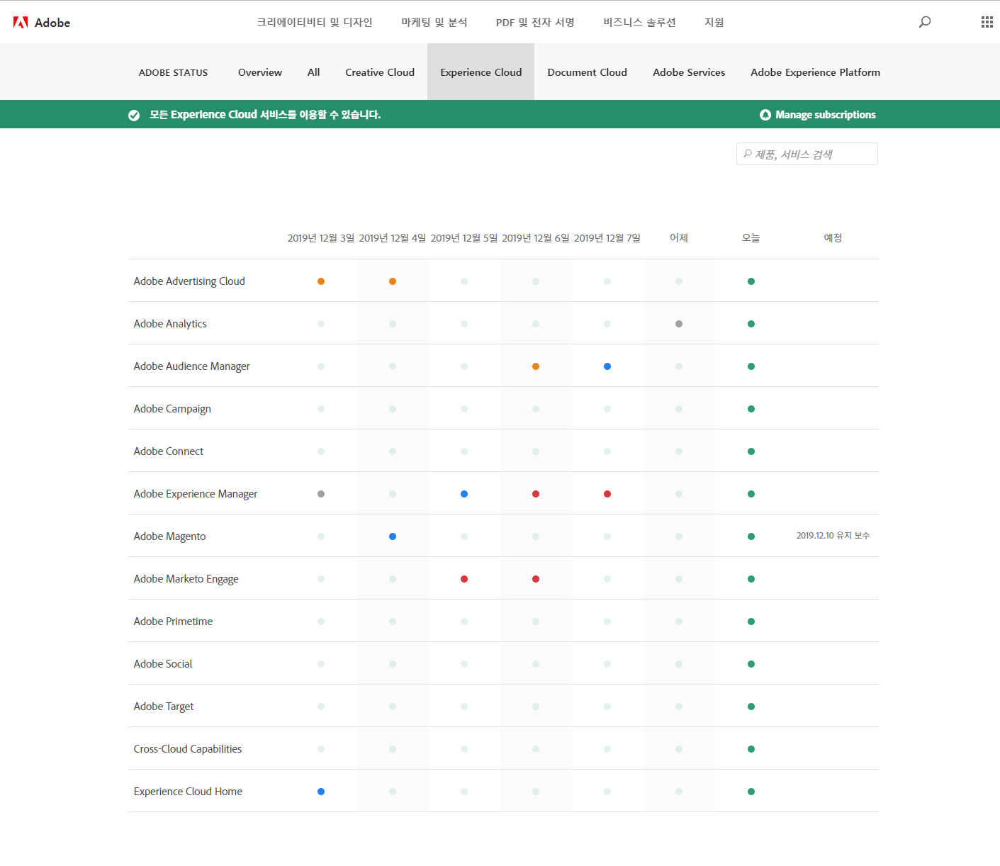

# 시스템 상태 업데이트 및 사전 알림

[!UICONTROL Adobe 시스템 상태] 페이지와 사전 알림을 사용하여 [!DNL Adobe] 제품과 [!DNL Adobe Experience Cloud] 솔루션을 최신으로 유지할 수 있습니다. 사전 알림은 중단 이벤트 및 유지 관리 이벤트를 알려줍니다.

## 시스템 상태 업데이트

[!DNL Target] 및 기타 [!DNL Adobe] 제품과 [!DNL Adobe Experience Cloud] 솔루션의 현재 상태를 보려면 [!UICONTROL Adobe 시스템 상태] 페이지를 사용하십시오. 이 페이지는 발생할 수 있는 문제가 시스템 업데이트 또는 일상적인 유지 관리로 인한 문제인지를 확인하는 데 도움이 됩니다.

다음 URL로 이동하여 [!UICONTROL 시스템 상태] 페이지에 액세스합니다.

[https://status.adobe.com](https://status.adobe.com)

[!DNL Target]을 포함한 [!DNL Experience Cloud] 솔루션의 상태를 보려면 [!UICONTROL Experience Cloud] 탭을 클릭하십시오.

페이지 맨 위에는 진행 중인 유지보수 이벤트에 대한 정보가 포함되며 개별 솔루션 업데이트를 구독하는 링크가 제공됩니다.

위의 그림에서 [!DNL Adobe Analytics], [!DNL Adobe Target] 및 [!DNL Adobe Campaign]은 유지 관리 업데이트를 수행하고 있었습니다. 다른 모든 제품 및 솔루션은 정상적으로 작동하고 있었습니다. [!DNL Target]을 사용할 때 문제가 발생하는 경우 항상 이 페이지를 확인하는 것이 좋습니다.

월별 [!DNL Target] 릴리스 동안 항상 제품 내 알림이 표시되지만 때때로 작은 업데이트가 진행되며 이 페이지에 표시됩니다.

페이지 하단에는 최근 7일의 캘린더가 포함되며 매일 각 솔루션의 상태를 나타냅니다. 자세한 정보를 확인하려면 상태 표시기 위에 마우스를 두십시오.

## 사전 알림

사전 알림은 [!DNL Target]을 포함하여 고객의 고객 프로필에 포함된 서비스에 대해 열린 다음 이벤트에 대해 등록된 고객에게 전송되는 이메일 경고입니다.

* 솔루션 수준 경고(솔루션에서 특정 서비스를 분리하지 않음)
* 심각도 1 및 심각도 2의 CSO(중단 이벤트)
* CMR(유지 관리 이벤트)

>[!NOTE]
>
>이 경고를 수신하려면 등록해야 합니다. 등록 프로세스를 시작하려면 [!DNL Adobe] 고객 성공 관리자(CSM) 또는 [!DNL Adobe] 계정 관리자(AE)에게 문의하십시오.

다음 그림은 사전 알림 이메일 경고의 예입니다.

